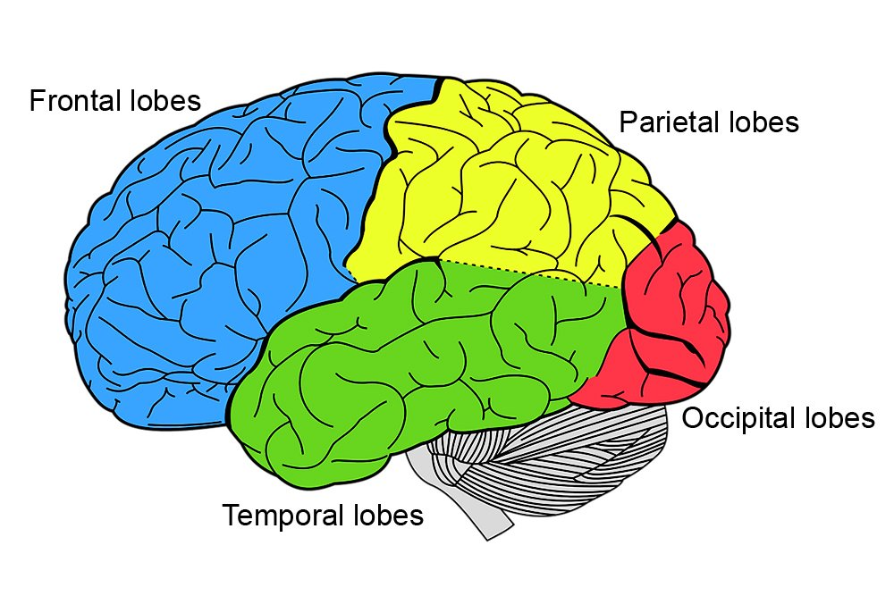

# The neural code
*lesson from 2021/03/01*

Before allowing anything else to be said, a small **recap**: the level of interdisciplinarity in Cognitive Neuroscience is a crucial element. We're intersecting several aspects that need to be integrated to build up this discipline. It puts together neuroscience and cognitive science, to show us how the brain structure is set up to serve our cognitive function. Integrating these two has been the main challenge between the 50s and 60s. It is important to consider the advances that permitted this. The development of technology has been crucial: for example, *Transcranial Magnetics Stimulation (1985)*, or *Functional Magnetic Resonance Imaging (fMRI, 1991)*, *Human Electroencephalography (EEG, 1920)* and lots of other diagnostical instruments.
These technologies allow us to study the brain at different layers of complexity.

## Brain anatomy
The Central Nervous System (CNS) is organized in 4 parts:
- spinal cord 
- brain stem
- cerebellum
- cerebrum, the main part of the CNS, where sensory stimulus are processed. Cerebrum can further be divided in different localized parts, that process different type of processes.

The main role of neuroscience is to identify how different parts relate and collaborate in performing different kind of functions and processes.
Sensory informations, for example from a finger, follows a complex path to the brain (in particular to the somatosensory system) and are then broadcasted to different areas to produce the sensations that a human can feel.

Brain is usually analyzed from different anatomical orientation in order to better visualize some particular features, such as horizontal plane (from the top of the head), gradually aplying cuts and looking at deeper parts.

Why do we have two brains? Different parts get specialized in different tasks. Interestingly, we don't have answers: the reason of this duality is unclear

## Complexity

Brain size and evolution. How are they linked? What is the brain made of?

The body size vs brain size is an index of complexity, relatable to the level of computations that the brain can make. We have higher functions that we can use to adapt flexibly to the environment. The understanding of this machinery is trying to understand how the brain is made of. How could we reproduce something similar?

An artificial neural network tries to reproduce some patterns that emerged from real brains: nodes -> neurons. These are artificial systems that mimic what is happening in the brain in a certain way, deploying some functions that can be used in other contexts. 

## Neurons

### Biological brain properties
Neurons have been defined in 1890 (by Cajal using a system devloped by Golgi) as a discrete nerve cell, and it represents the primary computational unit of the nervous system. What we'd like to do is treating it accordingly to the neuron hypothesis/dogma, to understand communication and cognition through communication between neurons. A crucial step is going into the basics of **what a neuron is**.

Our body is composed of trillions of cells, each of them is enclosed by a **membrane**. Neurons are cells, responsible for rapid communication between sensor cells (like the *retina*), muscle cells, and the brain (the central organizer of these interactions). We're talking about complex systems: approximately a 100 billion neurons in the brain. Cells are much alike other cells, though there are some differences: they are specialized in sending and receiving messages. This is clearly the case in which the input/outputs are electrochemical. Think about this as a starting piont, in which we have electrochemical interaction between neurons, exchanging informations between the perifery and the brain. We have 3 different types: *sensory neurons* (generally, from the perifery, PNS, to the central nervous system, CNS), *motor neurons* (the inverse) and *interneurons* (which are located into the central nervous system). An artificial NN would be this last one type. 

Interneurons can be local (they can serve to further elaborate the sensory input) or they can serve as relay (connecting local neurons). They are essential to tasks such as perceving, learning, remembering, deciding, controlling complex behaviours. They process informations in a really complex way. This organization can serve several functions, like the *local organization*, in which we have clusters of neurons that process the input, having different interconnected clusters. This is reflected into the way they are anatomically organized. We have 3 anatomical types: *bipolars* (usually sensory, like the one we see in the slides, having 1 axon and 1 dendritic tree), *unipolar* and *multipolar*. 

Dendrites receive informations, and they are covered in synapses (all the things we see are covered in synapses, actually). They are all the potential connections that each neuron has with other neurons. These are the places in which the neuron can receive informations. Their function is crucial, they can grow and enhance the more they are used. This is connected with the plasticity of the brain. The membrane under the synapse is what is called the synaptic cleft. Most dendrites have a spine, where the two neurons actually connect. When we talk about neuron dendrites, that's where synaptic plasticity happens: learning new things changes the **actual anatomy** of the dendritic spines! They try to connect and communicate more efficiently with other nuerons: the connections continually change, with deletion of old ones and creation of new ones. The spine density underlies many behaviours, like memory and learning. For example it's well known that if you're learning piano at a very young age it may help to keep the behaviour of the two hands relatively independent, up to a point in which you can play with the two hands without them interferring with each other. 12 years olds are already too old to play the piano. Fuck them. 

Things like these are a building block that change from the very beginning, while one wouldn't think the brain to change after a single session of learning. 

The learned things are then getting integrated in the soma, which *integrates information*: if you do the same thing over and over again, there's a learning curve after which the soma will have integrated the information. Why is the soma doing this integration? We have several parts playing their role in it, the cytosol (composed of a kind of membrane containing a fluid, which contains several organuli, like nucleus, mitochondria, golgi apparatus to deal with waste, the rough&smooth endoplasmatic reticulum) . The *cytoplasm*, labels everything in the cell except the nucleus, while the nucleus contains DNA, which has a specific pattern known as gene expression, that perform **protein synthesis**.

If the cell is a neuron, then the function is to send/receive information, and this is all written in the DNA. 

It does it through the transformation of DNA into mRNA, carrying information to the sites of protein synthesis in cytoplasm. 

The whole activity of production and processing of information is done in the soma. If some information are produce an electrical signal is sent to the axon and finally goes to the terminal buttons to **pass on the information** to the next neuron. It's really important to see how this actual neuron is hypersimplified into an artificial neuron. 

These terminal buttons terminate in small bubbles, and they also contain numerous mitochondria. So, bried summary: we go from input, to integration, to action potential (whether the signal is sent out, reaching a critical threshold), then output to another neuron.

### Electrochemical brain properties
We've now seen the structure, but we still have to get how neurons communicate, i.e. what is the mechanism through which informations are transmitted. How does this happen? 

Intra & extracellular fluids are like seawater, and are composed of atoms/molecules with net electrical charge. Ions (cations/anions) allow us to generate these signals. 

A neuron is made of internal and external fluids, divided by a phospholypidic bilayer membrane. This creates separate internal environment, relatively impermeable, except for some channels that allow some chemicals to pass through (*ion channels* and *gated channels*) that implements a systematic communication. 
*Ion pumps* exchanges chemical in order to keep enough energy to send electrical signals inside the cell. The exchanging phase allow for energy creation.
Two factors influence the movement of ions (and therefore presence of a force):
- **diffusion**, the natural tendency for ions to disperse (think about elements inside a liquid, they will go from the high concentration to the low concentration, obtaining a equally  distributed solution)
-  **electrostatic pressure**, which is the electrostatic force that causes oppositely charged ions to attract each other. 
These two forces, produced by:
- Sodium Na+, Chloride Cl- (outside the cell) 
- Potassium K+, Organic anions A- (inside it)
give rise to the membrane potential. 
The axon membrane separates different concentrations of these ions, diffusion will tend to push them out, while electrostatic pressure will tend to push in. These two forces act contrarily. The difference of potential between the inside and outside of the cell is approx. -70mV and is called **Membrane resting Potential**. 

The *basic currency* of the electrochemical brain is the **action potential**. If a stimulus is over the threshold, the action potential is triggered: the inside becomes positively charged, going from -70mV to somewhat around +30/40 on the whole axon and then decays in time, taking circa 1ms to get to resting potential again.
We call *unmyelinated conduction* those type of cells, e.g. squid's one, where the action potential is mantained at its initial level all over the axon. On human cells however the magnitude of the **AP** decreases along the axon and is regenerated periocly at Ranvier nodes.
This is called *myelinated conduction* or **saltatory conduction**.

Saltatory conduction allows a faster connection time by minimizing the energy required. The advantage is that every stop takes time, but *the car doesn't have to carry much fuel, so it travels faster* (pit-stop analogy). It's more economic and faster, though it obviously has some problems. If it gets into trouble, you could get multiple sclerosis (malignization of these parts, difficult communication), myelin sheath... 

### Neural coding
We can distinguish strong stimuli from weak ones thanks to the **firing rate**, i.e. the faster rate (high firing frequency) the more intense stimuli. The rate cannot exceed 1000 per second, meaning that we have a limit to our computational capacity! The refractory period is 1ms. 

The good news is that, so far, we've been focusing on a single neuron, and luckily we have more than one! Imagine how many neurons are receiving and sending informations at any time! This can become noisy or organized. The range of organization can be dramatic, e.g. playing a piano.
