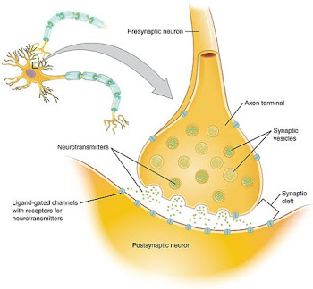

# Synaptic transmission
*lesson from 2021/03/08*

What happens once the action potential goes from the dendrite, to the axon? The information has to be transmitted from the pre synaptic to the post synaptic. We talk about synaptic transmission when comunication takes place between neurons.

## Synapse
A synapse is made of 3 main parts: pre-synaptic, the synaptic gap and the post synaptic. Interestingly enough, the parts are not phisically touching! There's a gap in which lots of things happen. 

We have already seen that in the terminal button we have the mytochondria, and the synaptic cleft contains fluids, through which the neurotransmitters diffuse. 
It's important to get what the mechanism behind this diffusion is: the post-synaptic neuron will be in a situation that will either fire or not fire. There's lots of things happening from the soma, where the vescicles are transmitted.
The actual NT happens through a particular mechanism where, when the action potential is received, the membrane chenges in a way that allows the vescicles to *dock* and release the NT. This is due to calcium that binds with the proteins.

What is really important is that we go from the pre-synaptic to the post synaptic, providing excitatory information. 
We have 2 main types of post-synaptic receptors:
- *ionotropic*, more directly influenced because of their binding side, which features a membrande and ion channels that either open or close. When a neurotrasmitter connects to a gate it opens and allows information flow.
- *metabotropic*, go through several steps before in a longer process which allow longer lasting effects (there's more room for *elaborated responses*)

Many post-synaptic potential can be created starting from the pre-synaptic potential signals. There's some signals that tells the connecting neuron to start firing and some other that stops the neuron firing phase.

Once we have seen this, we should look at what happens when we *measure* informations! When the impulse arrives in the pre-synaptic terminal, the NT release and bind to transmitter gated ion-channels, sodium enters and a **voltage change** occur, resulting in a *voltage ripple* that induces an AP and makes the neuron fire. On the other end we could end up with a negative voltage change, which would result in a *voltage ripple* that inhibits the neuron, stopping its firing process.
From this simple process, we end up with a binary method that makes a neuron firing or not. 

We said that *the currency of the neuron sending information is electric potential*. On a single neuron we have thousands of synaptic inputs. 
Getting exciting or inhibiroty informations happens very often producing an intense activity on neurons.
Post-synaptic integration is the interaction of these two activities: inhibitory synapses and excitatory post synaptic neuron activity. The balance/difference between these two inputs results in the action potential! 

This thing happens at different levels: different signals from different dendrites (neurons) add up to a much stronger post-synaptic potential!

Summarizing, we have an action potential, reaching the terminal button, releasing NT, which diffuses and bonds to receptor sites (causing ion gates to open), and excites post-synaptic neurons depending on the precise combination of inputs (excitatory/inhibitory NT and their spatial/temporal summation). The combinations are therefore endless! 

## Oscillations
We don't have just yes/no situations, rather modulations in the potential. In the dendrites, if we have a very strong signal that is then stopped by an inhibitory signal, what could be a potentially triggering potential can be stopped! Of course, it's quite possible that one single terminal button won't be able to influence a strong potential. 

What is very important to understand is that once we have understood the single steps, these integrate continuously and seamlessly in our brain. What we call *resting state* doesn't really exist: there's change in the potential, but it's an oscillation around -17 mV.
The timing is really important in this! If we have many excitatory signals coming at the same time we end up with a huge firing signal which will be much stronger then the same signals arriving at different times, as we could have inhibitory signals interleaving the excitatory ones.
This moltitude of signals results in a continous fluctuation of the membrane.

Rather than recording from a single neuron, what is recorded (despite the fact that there are thousands of channels) from several neurons is observed to be a fluctuation of orderly oscillations. 
These **oscillations**, despite being currently debated, are often associated with brain functions. They are namely:
- gamma (30-100hz)
- beta (12-30hz)
- alpha (8-12hz)
- theta (4-7hz)
- delta (0.1-4hz)

We can actually see this oscillations from measurements, and this activity is actually well structured! We'd like to associate a certain pattern to a given behaviour, for instance if delta waves refer to deep sleep or high concentration.

Neurons are connected so that they facilitate oscillatory behaviours. This behaviour actually facilitates effective communication. For example if we hear some dangerous sound in a direction neurons are going to fire in way such that the earing system will be more effective toward the danger zone.

In may current models of neural function, **synchrony plays a critical role**. When we talk bout wynchronization between different areas of the brain, we're talking about **phase synchronization**.

## Electroencephalography
Electroencephalography (EEG) allows us to study the electrical potential in our brain, in a non invasive way, trying to understand the relation between a certain behaviour and the signals in our brain.

In 1890, in the same years the neuron was discovered, brain electrical activity started to be recorder from dogs and rabbits
In 1912 the first EEG study evoked action potential in a dog.
In 1924 brain waves are firstly recorded in human beings.

EEG works by measuring the difference in voltage from several electrodes to one electrode.
There exist alternatives to EEG that goes deeper in the brain wrt non-invasive EEG.
We can record intracellularly and extracellularly. The latter looks similar, though the *single spikes* become oscillations.

Understading what the EEG is recording ain't straightforward: we don't see a clear measure of the action potential, rather something that *might pick up some signal in the brain*.
The EEG is not measuring the action potential per se, rather the summation of post synaptic potential: not what happens in the pre-synaptic, just what does in the post. 
What we see are the results on these pre-synaptic neurons that influence the post synaptic potentials. The EEG combines the activity of lots of similarly oriented pyramidal neurons, and requires synchronous groups of activity across groups of cells. The EEG reflects summed post synaptic activity of large cell ensembles. It provides us a bit of an understating of what happens under the hood.

By measuring brain activity we can start to understand what's going on in our brain and what part of the brain is producing it. This is kind of an *inverse problem*: how do we go back from the recorded signal to what is inside the brain, i.e. which area of the brain produced this activity.

There's plenty of algorithms that try to reconstruct this by basing on some assumptions. Some of these mathematical models are quite strong, trying to use biologically inspired constraints. For example, epilectic patients show that seizures are happening just in one part of the brain! In some cases these is relevant and works pretty well.

So, how does the brain organize its activity when information happens? If we measure this only once, you have nothing in general. What you'll have is actually a lot of ongoing activity in the brain. If you average this alltogether, you get a flat line. But if you present a signal and average it, the activity becomes oscillatory. In real life, we get the signal AND the noise, so if we get one single signal we won't see anything. But if we take repeated measures over and over, the average noise effect will be diminished and you'll get to the real signal. 

# Neurostimulation
In the late '800-initial '900 magnetic fields began to experimented to induce some current inside the brain producing some human noticeable fenomena.

There exists several methods to produce some neurostimulation, some are invasive and some not. Most invasive methods have now been deprecated beacuse of ethical reasons.
In some cases invasive neurostimulation helps reducing complex diseases syntoms like Parkinson disease.
