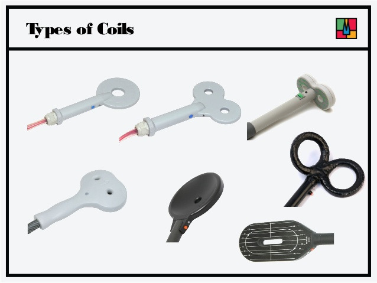
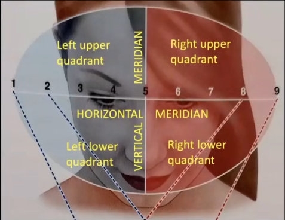

# TMS
*from lesson 2021/03/08 and 2021/03/15*

Transcranial Magnetic Stimulation (TMS) is one of the main non-invasive brain stimulation techniques.
Brain stimulation is performed by creating a varying magnetic field inside the brain, which induces current.

Becuase of this TMS is mainly made of 2 coils so that maximal current can be delivered in a precise brain area.
By using different systems we can deliver strong fields, rapid frequency fields etc. Also exploiting different coils shapes allow to reach different parts of the brain.

TMS is a fundamental tool for various applications, like neurological assessment by measuring the response of muscles to the stimulation of the cortex (for exemple how well some areas works after having a stroke),the delay on responses, see how the amplitude of EEG measures changes, to assess the integrity of the corticospinal tract, for example.

Using TMS on a brain area is't a strictly localized approach: inducing current on a brain area actually activates it, but every brain area is somewhat connected to other areas and therefore it results in a cascade effect on other areas.

It is also be used in a clinical for treatment of migrains (which works by reducing over stimulations in some brain areas, without side effect such as headache treatments), schizophrenia, tinnitus, depression and more.
These type of TMSs are called rTMS (repetitive TMS).

There are some safety issues involved, for example risk of seizure (caused by excessive stimulation), problematic interaction with implants (peacemakers, metal plates in the head, etc), etc.
All these issue brought to the creation of TMS safety guidelines which basically violates the use of TMS in those cases that could led to problematic results. 

# tES

Transcranial Electric Stimulation (tES) involves the application of weak electrical currents to the head. tES induce a weak polarization that is too weak to create action potential in the cortical neurons but it presumably modifies the neuronal membrane elctrical charge, changing the equilibrium spot and possibly making noticeable difference in brain functions.
Electrical charge is sent in different ways, by changing the polarity, the frequency of signals etc.

tES is less precise than TMS in localization, much safer (at worst can cause nausea, itchiness, etc.. still better than seizure), it's cheaper, more portable (TMS is super heavy and needs more people to carry it around), much easier to sham (its harder to tell if the tES is working from the patients point of view, whereas TMS produces sounds loud enough to know its working). 
In terms of applications, given these premises, we may use it for the same things as TMS (cognitive NS, translational research, depression, migraine...) with less precision. Finally, it requires a less trained operator.

Modern tES and TMS development is in implementing stimulation based on realtime EEG signal reading so that we can maximize some peculiar brain functions.

# Sensation and perception of visual signals
We'll want to understand how we can go from detection to action, i.e. we adapt to the environment. 

This important from our perspective: we can find a parallelism between what happens in the brain and what we'll want to happen in the computer, and understand how the brain is made to *artificially recreate that*.

Sensation is the term given to the neural processes that correspond to **detection**, i.e. the process in which we try to feel modifications in the *outside world*, for example loudness of sound.
We're therefore translating information from the environment into a neural signal. 

We call **perception** the process of identifying the features that are being sensed and to the recognizion of this features.
We refer to **attention** as the mechanism that allows the brain to prioritize informations in the environment, for example a *boom* would draw our attention. Finally, we talk about **action**, referring to the acts of a system that needs to be integrated into the environment by interacting with it, adapting to it, adapting it to its needs.
These are a set of tools that we would like to implement if we want to *simulate* how the brain perceive and elaborate information.

Sensation translates information into signals that the nervous system (the brain) represents an object through a neural code. 
A neural code is a representation format that is differernt from the physical properties of the object itself.
The brain senses information in a format which is different from the original. This is somewhat similar to natural language through which we represents things. 
The brain tries to encode information, using the neural code, in the most expressive and efficient possible way through the use of action potentials and neurotransmitters. 
We still don't know lots about this code but its where most of the current neuroscience research is directed.

World sensations are perceived through different body parts that are specialized in they're objective and translates sensations to electrochemical processes that represents the neural code representation of the sensation.

Sensation, perception, attention and action in this order is an oversimplification on how the brain works. Furthermore is is over-simplistic to model the translation to neural code as a feedforward system.
There aren't areas in the brain that acts as receiver of particular information and activates at their arrival.
A better brain model is to think of it as a constant representation of the world.

Most of information comes from vision, and vision is infact the most heavily studied field in modern cognitive neuroscience.
The organization of the visual system is mainly ruled by the **visual field** which is the spatial extent of everything that can be see in an exact moment. 
The **FOVEA** corresponds to the part of the retina in which our acuity is sharpest and that's where the visual field is mainly present. 
Retina works by means of **phototransduction**, light is converted into neural signals thanks to *photoreceptors*, which lead to action potentials from the change in membrane potential. 
We have a blind spot in our retina: the point in which the optic nerves comes out of the eye, but we don't realize this because our brain makes things up.
The visual field can be split into 4 quadrant. Quadrants on the right side visual field are processed by the left side of the brain and viceversa.

Some brain lesions ends up in being unable to recognize things in portions of a quadrant.
The spatial organization of V1, the first visual cortex, reflects the spatial organization of the retina and also the functional topography of V1 mirrors the functional topography of the retina.
We refer to this as **retinotopy**.
Basically elements in the periphery have a smaller representation in the brain while elements on the center of the visual field have a bigger representation. This is called **cortical magnification**: giving more weight to element being in the most focused area (the fovea).
We talk about **receptive field** of a neuron referring to the amount of visual field that a neuron is being fed of.

