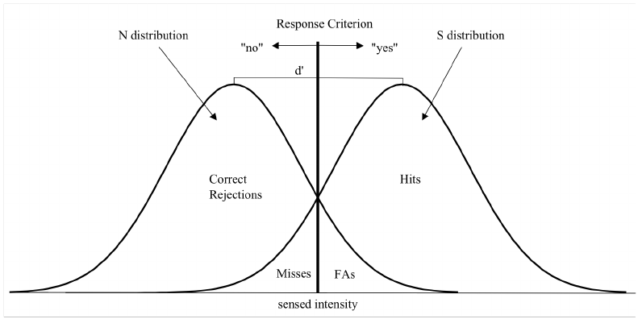

# Vision perception
*lesson from 2021-03-22 and 2021-03-29*

In 1958 Hubel and Wiesel found out that each time a particular intesity of light was oriented in a particular angle a neuron, in a cat's brain, responded with bursts of action potential.
From there research moved from tiny spots of lights to defining **orientation selectivity** of neurons in V1. Objects in a particular orientation corresponds to different neuron activating.
There are other elemental transforms such as direction selectivity, higher acuity ecc.

How does the vision system percept immediate input? There's lots of information, and we'd like to extract a generalization. 
The fact that eyes have different positions influences the visual field: if you close your left eye you lose some of the sight. The representation overlaps, but not fully!

There's lag between the perception of a *moving object* by the two eyes. The representation of the object in the two eyes is changing. The model will lose specificity to achieve the perception of the movement: moving objects are more difficult to observe for us. This characteristic can allow us to start thinking at lower levels. If we move forward than this, we may say that movement is a feature we want to observe, among edges, motion, binocular disparity, color, these can be considered as low-level properties, the combination of which allow us to perform feature detection. 

The information that in front of us is a young lady is achieved further on. One of the reason this is is that we are able to spot little details. This is an important element to take into consideration. What is the role of early sensory areas like V1 in this?

There are areas which are coding for more abstract information. There's no simple explanation for these results. It's just one important aspect that needs further information. 

An influential way of understanding information processing in V1 is viewing these neurons as feature detectors: we already have sensations in response of the retina, and at the level V1 we have no perception of faces, for example, but all the elements that determine it: color, shape, motion, edges...

For each feedforward axon to V1 (LGN -> V1) there are from 3 to 9 axons in the other direction (V1 -> LGN).
The visual system is heavily organized, not in an anatomical sense but also in a communication sense between different areas. This is not a characteristic of the visual system alone though: other areas are built like this.
Adam Sillito discovered in 2006 that higher visual areas can shape the signal that is going to be sent to them.
For example once we recognize a particular shape in a random patterns, say a face, the higher visual area are going to inform the lower one of that face and we will be constantly see that face even if we look at the random pattern later.

For sensory input to be assessed they need to be continually placed in some kind of context formulated by higher brain areas.
Sensory perception is not a bottom-up approach: we don't build a representation from scratch in the lower area and reconstruct it in the higher areas but rather we fit lower area representation to higher areas representations and guide the lower areas towards feature selection.

When we record EG activity in the brain, what we see is alpha activity, which might serve this thalamo-cortico-thalamic inhibitory connections.

## Alpha waves
Initially alpha rhythm (8-12hz) was know to be that condition where the human brain stays in an idle mode and waiting for something to happen.
Closing eyes would show the estabilization of alpha waves; when opening eyes again the brain have something to focus on and start oscillating in another way.

This is actually being disprofed and now the current belief is that the brain configures itself in a state that optimize performances on the currently priorited task by **selectively inhibiting** irrelevant items.

In an experiment carried by Romei partecipants where equiped with an EEG recording device and blindfolded. Through the use of TMS applied along the visual cortex (in the back of the head) some partecipant where able to perceive light in the expected quadrant (wrt the place where TMS ha been applied). The experiment focuses on studying if the visual cortex of the partecipants starts focusing on places where the light has been seen and is expected to be before the TMS being applied.
The formal question is thus:
*Do spontaneous fluctuations in posterior alpha-band EEG activity reflect variability in excitabiliy of human visual areas?*
The recorded amplitude of alpha waves is very important: if there's a reduction, we'll have a clear predisposition to excitability in the visual cortex, i.e. more likely to perceive information. If there's less, there's a sort of inhibition, we're less likely to perceive incoming information. The result is that the subject might well use alpha activity information as a gate towards perceived informations, i.e. opening/closing a gate for incoming informations to regulate the quantity of perceived infos.
Interestingly enough people who could not perceive any light was those partecipants whose alpha waves power was higher than the power of the TMS, kind of like the induced current wasn't enough to induce a perception in the partecipant. Basically those partecipants having high alpha power were inhibiting incoming information.

On another experiment carried by Ergenoglu et al. some years before showed basically the same thing. Patients were in a similar setting but were not blindfolded. A laser light were presented in front of them in the same position everytime and turned on at random times.
Partecipants with higher alpha levels didn't perceive the light while people with low alpha levels were able to perceive the lights.
Yet a similar experiment by Hanslmayr et al. in a similar setting, showing a letter on a screen that at some point could be masked and asking if the letter was perceived.
Still partecipants with lower alpha values were able to correctly perceive the objective while the one with higher alpha values were not.

Brief summary: high alpha values means that the visual cortex is inhibiting incoming informations (probably because it is focused on something else) while lower alpha values allows the brain to perceive a different (possibly very short and fast) stimulus.

### MEG
Neurons produce current when inducing action potential. This creates a magnetic field around axons that can be measured.
This magnetic field is really weak and in order to successfully record it it's necessary to isolate the partecipant from the environment, so that the instrument doesn't pick up the earth magnetic field for example.
Even though being more expensive, MEG guarantees an higher localization precision (1mm against 1cm of EEG), but requires a more complex scenario to be used: partecipant needs to remain still.
In 2019 portable MEG have been proposed.

Van Dijk et al carried a similar experiment while relying on MEG data. The partecipants where instructed to perceive a stimulus which could be masked by a similar one, with a similar contrast on screen. The result again confirms the one of previous studies.

## Signal Detection Theory
An additional interpretation to the higher perception when alpha values are low is that the probability of detection increases in those cases. Partecipants will tend to more likely report a perceipt, independently of wether it is present or not.

We can explain this issue by means of Signal Decision Theory (SDT). 

We have a different probability of perceiving a stimulus and not perceiving it. They are two gaussians functions and as we can see from the picture above they overlap in some regions.
Those regions where the gaussians overlap represents when the partecipant is not sure about having perceived the stimulus.
The brain builds an internal representation of the perceived stimulus.
The **discriminative index $d'$**, defined as $d' = \frac{separation}{spread}$ is an estimate of the strength of the signal. The higher the value the more the curve are separated. 
The **response criterion** rule how conservative the subject is going to be in perceiving a stimulus. It basically set, on the graph, the point from which impulses will be perceived.
Shifting the internal criterion towards the left means perceiving lots of stimulus, even non existing ones, on the other hand shifting on the right means perceiving very little stimulus, only when the subject is completely sure the stimulus is there.
Initial studies on stimulus perception have never taken into account the existance of false positives, which occurs when the discriminative index is low.

But does alpha power play a role in this distribution settings? Does it shift our propension to perceive a stimulus instead of not perceiving it?
In 2016 Samaha et al. found that the response criterion, and not $d'$, were affected by alpha waves, while the discriminative index was exactly the same.
The subject adopted a more conservative criterion when alpha power was high.
This study completely changed how alpha waves should be interpreted.
Indipendently of the content of the stimulus neurons are going to fire or not fire only in function of the internal rappresentation of the signal and the response criterion. It's not matter of being suited or not to perceive a stimulus.

Alpha power then affect the internal rappresentation of the external world and how we perceive it, changing wether some stimulus should be perceived and some not.

In a study by Samaha in 2017 subjects were presented a stimulus and were asked how confident they were about perceiving the stimulus.
Results showed that accuracy (how hard is to catch the stimulus) correlates with confidence rating (hard signal -> low confidence), basically agreeing with SDT.
Results also showed that higher alpha values correlates with low confidence, but not with lower accuracy.
Alpha power doesn't interfere with the ability to discriminate the perceived world, it rather changes the internal rappresentation of the external world, changing the confidence the subject has on perceiving a particular stimulus.

Modulation of alpha power reflect the subject confidence on the rapresentation of the external world, which is continually updated.
Basically alpha power levels are a consequence of the confidence we have of perceiving a stimulus, given the actual internal rappresentation.
Higher alpha power levels inhibit input informations in a way that filters them away to not contradict the internal rapresentatio, while lower alpha power levels does not need to filter out information as they are agreeing with the internal rappresentation. The fact is that when receiving receiving stimulus that are ok with the internal rappresentation we get more confident but we also take into account noise, which could lead us to perceive false positives.

If alpha power only affects confidence during perception of a discrimination taks, what is the cause of perceptual accuracy?
**Alpha frequency sampling rate hypothesis**, novel research from Di Gregorio et al., propose that alpha waves frequency actually maps to brain sampling rate of incoming information and thus to how fast the internal representation is updated. Having alpha waves with higher frequency means gathering information faster.
The proposal was done by recording EEG while showing to the subject a checkerboard and discriminate (by saying how confident) wether it had circles inside, with varying difficulty in discriminating those.
The results confirm alpha power affect confidency but not accuracy. More importantly they show that higher frequency alpha waves correlates with correct discrimination.

