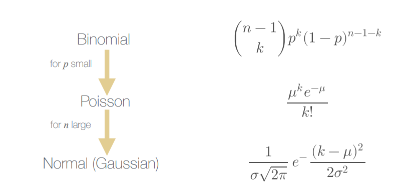

# 10. Network Science: Erdős-Rényi Model for Network Formation

Models can be _random_ or _strategic_. In the former case choices are independent from the current network structures, while in the latter, choices are dependent from it.

Also _limited knowledge_ models exist, where choices are based only on local information.

The **Erdős-Rényi (ER) Model is a random model**, where the network is undirected. It start with all isolated nodes without edges and add edges between pairs of nodes one at a time randomly.

It's a very simple model and it is very unlikely that real networks form in this way, but surprisingly it predicts many interesting properties.

There are two possible choice to add edges randomly:
 - randomize edge presence or absence;
 - randomize node pairs.

### Randomize edge presence/absence

Given the number of nodes _n_ and the probability that an edge is present _p_, for each of the _n(n-1)/2_ possible edges, we add the edge with probability _p_.

This is also known as the _G(n,p) model_ (graph on _n_ nodes with probability _p_).

The expected mean node degree is of course _p(n-1)_. If we instead want to quantify the probability that a single node has degree exactly equal to _k_ &in; [0, _n_ &minus;1] is sufficient to observe that it is equal that the outcome "edge" occurs _k_ times and the outcome "no edge" occurs _n_ &minus;1&minus;_k_ times. Since the order dies not matters the probability that a node has degree _k_ is given by the binomial distribution_:

The mean of this binomial distribution is _&mu; = p_(_n_ &minus;1), which is equal to the average node degree cited above.

When _p_ is small the binomial distribution can be approximated with the Poisson distribution. Also, if _n_ is large, it can be approximated with the normal distribution.

### Randomize node pairs

Given the number of nodes _n_ and the number of edges _m_, we pick a pair of nodes at random among the _n_ nodes and add an edge between them if it is not already present and we repeat it until we have added _m_ edges.  
It is also known as the _G(n, m) model_ (graph on _n_ nodes with _m_ edges)

For large _n_, the **two versions of ER are equivalent**. They are related through the equation for the number of models _m = pn_ (_n_ &minus;1)/2. In the first case we pick _p_ and _m_ is the established by the model, vice versa for the second case.

---

The **ER model is a poor estimator for the degree distribution** compared to real networks, since Poisson degree distributions have exponential decay, while most of the real networks exhibit power-law degree distributions that decay much slower than exponential.

### Diameter

The diameter of a network is the longest shortest path between pairs of nodes. In a connected network with _n_ nodes the diameter is in the range [1, _n_ &minus;1].

For a given _n_ as we increase _p_ at a certain point the diameter from infinite becomes finite and continues to decrease until we have diameter 1 for _p_ =1.

If _z=n_(_p_ &minus;1) is the average node degree, we can demonstrate that the diameter will be roughly 2log(_n_ )/log(_z_ ) and it confirms the empirical data that we observe in real networks. So the **ER model is a good predictor of the diameter** and the average length path.

### Clustering Coefficient

The clustering coefficient of a node is the probability that two randomly selected _friends_ of that node are friends themselves.

In the ER model an edge between two nodes is present with probability _p_, so the **clustering coefficient of an ER model is _p_**. We can show that also the edge density of an ER model is _p_.  But most real networks are often highly clustered with clustering coefficients must greater than the edge density. So the **ER model is a poor predictor of _clustering_**
