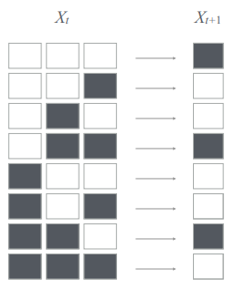
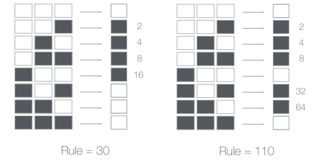
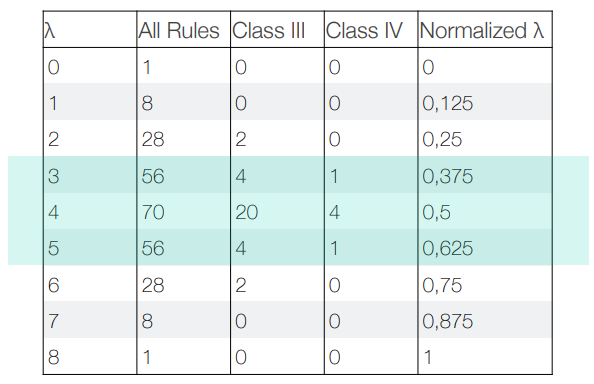
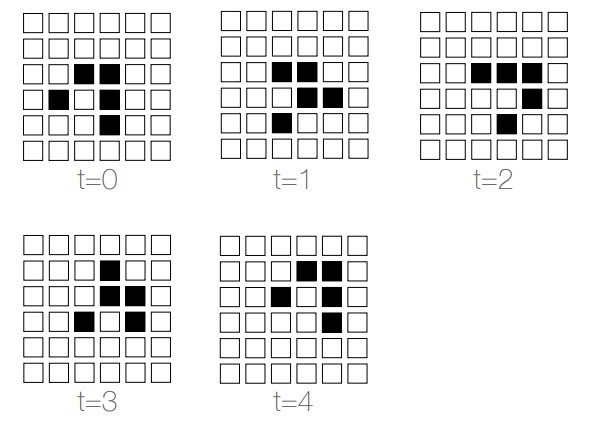
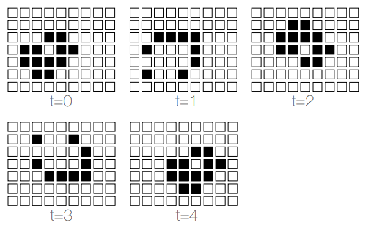
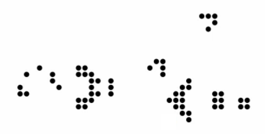
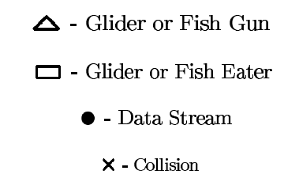
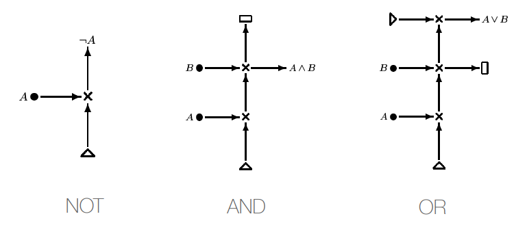

# 3\. Models
A model, to be useful, must be _compact_ and _simple_, while maintaining _fidelity_ to what is being modeled. This can be done only abstracting away the unnecessary details yet maintaining the essence.

> Everything should be made as simple as possible, but no simpler.
> \- Albert Einstein (1933)

Examples of well-known models are:
 - geographic maps,
 - plate tectonics,
 - solar system,
 - Bohr's atom,
 - pandemics.

**Cellular automata** is an abstract model developed by John von Neumann for simple individual behavior and simple interactions between individuals leading to complex aggregate behaviors.

## 1-Dimensional CA
The model, constrained to only one dimension, consists of an infinite array of _cells_. Each cell has a value from a _k_-ary state, a position _i_ in the array and _r_ left and _r_ right neighbors. The state of a cell at time _t+1_ is a function of cell's state and its neighbors state at time _t_.

Assume _k=2_ (binary state) and _r=1_ (neighborhood of size 2). Then the function that tells how a cell change state could be the one expressed in this look-up table

The possible look up tables are _2 k 2 r + 1_ and since a CA is defined by its state transitions, that corresponds to the number of possible CAs. So, for _k=2_ and _r=1_ there are 256 possible 1-Dimensional CAs.
If we read off the final state column of the LUT as a binary number we obtain the **Wolfram canonical enumeration** which identifies each possible CA with a number in the range _{0,...,255}_.

Wolfram classified all the possible CAs into different classes:
 -  **Class I**: Nearly all initial patterns evolve quickly into a stable, homogeneous state (fixed point);
 - **CLass II**: Nearly all initial patterns evolve quickly into stable or oscillating structures (periodic);
 - **Class III**: Nearly all initial patterns evolve quickly in a pseudo-random or chaotic manner (chaotic);
 - **Class IV**: Nearly all initial patterns evolve into structures that interact in complex and interesting ways (complex - capable of universal computation).

### CAs and dynamical systems

CAs are discrete-time, deterministic dynamical systems that exhibit fixed-point, periodic and chaotic behavior. So they are very similar to the Logistic Map except that the state variable for CAs is discrete, while for LM is continuous. For the Logistic Map there is the control parameter _R_, which is its equivalent for cellular automata? It's the Langdon's λ.

#### Langdon's λ metric
The Langdon's λ seek a compact characterization of the CA behavior class. It consists in counting the number of _ones_ in the LUT final state column, that is the value of λ.

## Conway's "Game of Life"
2-Dimensional cellular automata's theory was developed by John Conway who called it the _Game of Life_. Each cell has now eight neighbors and two states (_alive_ or _dead_).
Cell's state transitions follow these simple rules:
 - a live cell with 2 or 3 live neighbors survives (_survival_);
 -  a live cell with fewer than 2 live neighbors dies (_death from loneliness_);
 - a live cell with mor than 3 live neighbors dies (_death from over crowding_);
 - a dead cell with exactly 3 live neighbors comes alive (_birth_).

### Fixed Point
⬜⬜⬜⬜⬜⬜  
⬜⬜⬜⬜⬜⬜  
⬜⬜⬛⬛⬜⬜  
⬜⬜⬛⬛⬜⬜  
⬜⬜⬜⬜⬜⬜  
⬜⬜⬜⬜⬜⬜

### Periodic behavior
⬜⬜⬜⬜⬜  
⬜⬜⬜⬜⬜  
⬜⬛⬛⬛⬜  
⬜⬜⬜⬜⬜  
⬜⬜⬜⬜⬜

swap with

⬜⬜⬜⬜⬜  
⬜⬜⬛⬜⬜  
⬜⬜⬛⬜⬜  
⬜⬜⬛⬜⬜  
⬜⬜⬜⬜⬜

### Glider

### Fish

## CAs as computers
Both game of life and 1D CA rule 110 are capable of universal computation, this can be proved showing either that they are equivalent to a Turing Machine or that they can be used to construct basic logical operators.

### Logical operators from game of life

The glider gun is a structure that generates gliders, and has the following shape:

While a fish gun generates fishes. fish and gun eaters "consumes"respectively  gliders and fishes. In an higher-level representation we represent them as "building blocks":

With this building blocks we can create base logical operators

