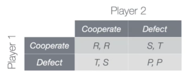

# Cooperation and Competition

Agents need to choose among several options and there decisions are not random, but depend on what agents are trying to achieve.

In then **Game Thory** agents are called _players_ and each one of them has a set of options for behavior, called _strategies_. For each strategy, each player receives a _payoff_ that may depend on the strategies selected by other players. All of these ingredients can be summarized in the so called _payoff matrix_.

For now we will consider onlu _one-shot two-player_ games, i.e. games with only 2 players and with a single _encounter_. We will assume also that players are _rational_ (they try to maximize thei payoff) and that they know who the other player are, which is the set of strategies and which is the payoff matrix.

A _strictly dominant strategy_ is a strategy that maximize the payoff regardless the strategies chosen by other players.

_Dilemma games_ are those where no matter what choice a player makes, there is always the possibility the he feels "regret".

R stands for _reward_, S for _sucker, T for _temptation_ and P for _punishment_. With these four different payoffs, there are 4! = 24 possible orderings, but most orderings corresponds to games w/o dilemma (e.g. when R>S>T>P players always cooperate and never regret). The necessary conditions for the dilemma are:
 - R>S and T>P
 - T>R or P>S
 - R>P
So only 3 of 24 possible games are left as dilemma games:
 - _Chicken_ (T>R>S>P): two cars heading towards each other. Both (cooperate, cooperate) and (defect, defect) lead to regret.
 - _Stag Hunt_ (R>T>P>S): 2-player soccer tournament game night. Both (cooperate, defect) and (defect, cooperate) lead to regret.
 - _Prisoner's Dilemma_ (T>R>P>S): two robbery suspects being interrogated in separate rooms

In these situations each player wants to cooperate, but there is the tentation to regret.
