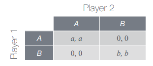
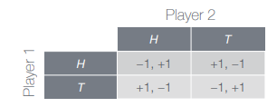
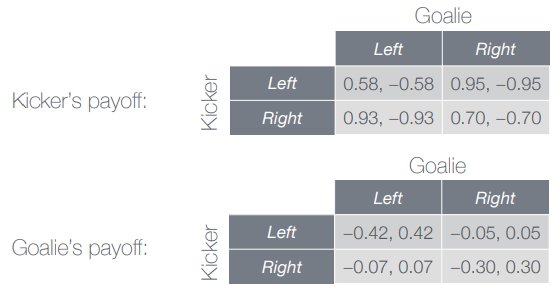

# Cooperation and Competition

Agents need to choose among several options and there decisions are not random, but depend on what agents are trying to achieve.

In then **Game Theory** agents are called _players_ and each one of them has a set of options for behavior, called _strategies_. For each strategy, each player receives a _payoff_ that may depend on the strategies selected by other players. All of these ingredients can be summarized in the so called _payoff matrix_.

For now we will consider only _one-shot two-player_ games, i.e. games with only 2 players and with a single _encounter_. We will assume also that players are _rational_ (they try to maximize their payoff) and that they know who the other player are, which is the set of strategies and which is the payoff matrix.

A _strictly dominant strategy_ is a strategy that maximize the payoff regardless the strategies chosen by other players.

_Dilemma games_ are those where no matter what choice a player makes, there is always the possibility the he feels "regret".

R stands for _reward_, S for _sucker, T for _temptation_ and P for _punishment_. With these four different payoffs, there are 4! = 24 possible orderings, but most orderings corresponds to games w/o dilemma (e.g. when R>S>T>P players always cooperate and never regret). The necessary conditions for the dilemma are:
 - R>S and T>P
 - T>R or P>S
 - R>P
So only 3 of 24 possible games are left as dilemma games:
 - _Chicken_ (T>R>S>P): two cars heading towards each other. Both (cooperate, cooperate) and (defect, defect) lead to regret.
 - _Stag Hunt_ (R>T>P>S): 2-player soccer tournament game night. Both (cooperate, defect) and (defect, cooperate) lead to regret.
 - _Prisoner's Dilemma_ (T>R>P>S): two robbery suspects being interrogated in separate rooms

In these situations each player wants to cooperate, but there is the temptation to regret.

## Nash Equilibrium

Let _S_ be the strategy chosen by Player 1 and _T_ the strategy chosen by player 2. Let P1(_S,T_) denote the payoff to Player 1. A strategy _S_ for player 1 is a _**best response**_ to a strategy _T_ for Player 2 if _S_ produces at least as good a payoff as any other strategy paired with _T_: P1(_S,T_) &ge; P1(_S',T_) for all strategies _S'_ of Player 1.

A _**dominant strategy**_ for Player 1 is a strategy that is a best response to every strategy of Player 2.

Even in games where there are no dominant strategies, we should expect players to use strategies that are best responses to each other. If players chose strategies that ate best responses to each other, then no player will have an incentive to an alternative strategy and the system will remain in an "equilibrium".

Player of strategies _(S,T)_, _S_ for Player 1 and _T_ for player 2, is a _**Nash equilibrium**_ if _S_ is a best response to _T_ and _T_ is a best response to _S_.

### Coordination games

Coordination games are games where players have an incentive to adopt the same behavior.

In **Balanced Coordination Games** (_a=b_) there are two Nash equilibria while in **Unbalanced Coordination Games** (_a &ne; b_) there is only a single Nash equilibrium.

**_TODO: complete this part_**

### Mixed Strategy Games

There exists games that have no Nash equilibria when restricted to _**pure strategies**_ (always play the _same_ strategy). We need to enlarge the set of strategies to include the possibility of randomization.

#### Matching Pennies

In the example we have two possible moves (play _H_ or play _T_), then strategy becomes choosing a _probability_ with which to play _H_:
 - Strategy _p_ for Player 1: play _H_ with probability _p_, play _T_ with probability (1 - _p_).
 - Strategy _q_ for Player q: play _H_ with probability _q_, play _T_ with probability (1 - _q_).

Let's suppose that Player _1_ chooses pure strategy _H_, while Player 2 chooses probability _q_ for playing _H_. Then the expected payoff to Player 1 to Player 1 is (-1)_q_+(1)(1-_q_) = 1-2q.

A Nash equilibrium for a mixed strategy games is a pair of strategies (now probabilities) such that each is a best response to the other. No pure strategy can be part of a Nash equilibrium, so at Nash equilibrium, both players must be using probabilities _strictly_ between 0 and 1.

What is Player 1's best response to strategy _q_ used by Player 2?
Expected payoffs to Player 1 from pure strategies _H_ and _T_ are 1-2q and 2q-1. If 1-2q &ne; 2q-1, then one of pure strategies _H_ or _T_ must be a unique best response by Player 1 to strategy _q_ by Player 2, but this contradicts our conclusion that pure strategies cannot be part of any Nash equilibrium. So probabilities that make these expectations unequal be part of any Nash equilibrium.

Thus we must have 1-2q = 2q-1, which means _q_ = 1/2.
The choice _q_ = 1/2 by Player 2 makes Player 1 _indifferent_ between playing _H_ or _T_ and we say that "strategy _q_ = 1/2 is _non-exploitable_ by Player 1".

#### Penalty kick
We have two players facing each other: the _goalie_ and the _kicker_. The kicker must pick the direction of _kick_ and the goalie has to pick the direction of _dive_.
The game is very similar to the Matching Pennies games, but the payoffs are not symmetric. Indeed the payoff matrix obtained by analyzing 1417 penalty kicks in 5 years of professional soccer matches in European leagues is like the following one:

To make the kicker _indifferent_, the goalie must pick _p_ such that the payoff from kicking to the left is the same to the one from kicking to the right.

(0.58)p + (0.95)(1-p) = (0.93)p + (0.7)(1-p).

That results in p = 0.417

We can do the same reasoning also for the kicker and we obtain that to make the goalie indifferent, the kicker must choose q = 0.383.
