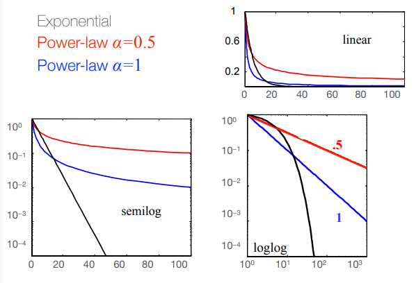

# 9. Network Science: Real Networks and Universal Properties

Networks are typically very different at the microscopic level, however there are **macroscopic structural properties** that are **common** to a large variety of real networks:

 - heavy-tailed degree distribution;
 - small diameter and average path length;
 - highly clustered;
 - very few (usually just one) connected components. 

## Heavy-tailed distributions

In **heavy-tailed distributions**, nodes with small degree are most frequent. It's a situation typical of networks that have a few _hub_ or _connector_ nodes with very high degree and many nodes with small degree.

Let's examine closely two different forms for the distribution function:
 - exponential _f(x) = c-x_
 - power-law _f(x) = cx-&alpha;_

A straight line on a log-log scale becomes the _signature_ of power-law distributions

Power-laws arise in many settings other than degree distributions. _Popularity_ of actors, books, movies, songs. web pages are some examples. The cause is that popularity is a phenomenon characterized by extreme imbalances due to network effects: more popular you are, more popular you become. This create a positive feedback loop.

Networks with degree distributions that are described by power-laws are also called **_scale-free_**.
A function _f(x)_ is called scale-free if _f(bx) = C(b)⋅f(x)_
where _C(b)_ is some constant that depends only on _b_.  
In other words, the overall form of the function does not change when
considering values for x that are a factor b larger.

**Power-law distributions are scale-free**.

## Diameters, path lengths

Let's consider a _connected_ network. The _diameter_ is defined as the longest shortest path and so it's a number in the range [1, _n_-1], where _n_ is the number of nodes.

We say that a network has a **_small_ diameter** if it grows _sublinearly_ with network size.

An equivalent but alternative definition for diameter is the expected shortest path distance between a random pair of nodes. Thus, diameters and path lengths behave similarly.

Let _z_ denote the average node degree. Under some weak assumptions, it can be shown that, for large _n_, the average shortest path length and the diameter are roughly proportional to log(_n_)/log(_z_).

Indeed, if we take the current world adult population as 7 bilion people and assume that each person knows on the average 50 other people among friends, relatives, colleagues, etc. Then log(_n_)/log(_z_) = log(7&times;109)/log(50) = 5.79, that confirms the _six degrees of separation_.

## Clustering coefficient

The _clustering coefficient_ of a node is the probability that two randomly selected _friends_ of it are friends themselves, which can be taught as the probability that a _triangle_ is closed.

The _edge density_ of a network is the actual number of edges ibn proportion to the maximum possible number of edges.

A network exhibits _high clustering_ if the clustering coefficient is significantly greater than the edge density.
