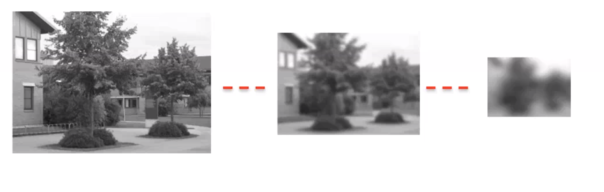

# Local invariant features

The term *feature* actually hides lots of meanings in CV. They might be properties, special pixels in the image, and so on. There's another kind of features we can find, properties we can use to perform inavariant object detection, i.e. translation, rotation and scale changes (i.e. the most difficult ones).

So, nonetheless, we'll start with an often heard statement in CV: *correspondences are everything*. 

What we mean by ***correspondences***? Given two or more images of the same scene, then corresponding points are image points that correspond to the same scene points. This process is also known as *wide baseline stereo*, meaning that there's a wide difference.

For example, this may become useful for *mosaicing*, aiming to merge two images to form a **panoramic image** by finding correspondences between the different individual images. To do so, we may align by estimating a homography, which requires at least 4 correspondences. We try to find the *salient points*, computing a local *description*. Each pixel has basically 3 numbers (comparing the RGB color). In most practical cases this algorithm would work even on grayscale images. We can't really use a single pixel! What we do will therefore be not considering a single pixel, rather a patch of them, a neighbourhood. After finding these salient points, we compute a *local description*, a fraction of a patch around the point, which in literature is called a **descriptor** of the key point, being a function of the neighbourhood around the point. 

So, if we call  a point, then  the patch around a point, when trying to establish correspondences, we compute its descriptor, i.e. a function  and we'll compare the descriptor at  with the descriptor at  using the same function.

So, we do not directly compare patches, rather we compare descriptors, i.e. functions of patches. What are these descriptors? We want to find a function that factors out changes and keeps the essence of the patch. Is this magic? Kind of. 

We divide the task into what the **detector** has to do (i.e. finding the keypoints) and what the **descriptor** has to do.

The detector should be able to find the **same keypoints** in **different views** of the scene, and should find keypoints which are surrounded by informative patterns of intensities.

The descriptor should be repeatable, i.e. the descriptions provided at homologous points should be similar, distinctive, i.e. it should capture the salient information around a key point (so, what is really important should be kept, and what it isn't is not, the more we compress the more informations we lose), and compact, i.e. it should be as concise as possible to minimize memory occupancy.

Speed is desirable for both, particularly for detectors, which need to be run on the whole image. 

As always, we have a tradeoff between false positives and true positives.

 So, what kind of points should we look for to build a lcoal invariant feature pipeline? What kind of local feature are we able to find now? Just edges. Are edges useful? They are! The cool thing is that if you have an edge, you have a direction along it stays. What should we do to avoid this? As an edge, we have a strong variation perpendicularly to it, no variation parallelly. So, if we have a high variation along as many directions as possible, we are in the most interesting points!

Moravec proposed the follwonig: I pick a patch around the interesting point, maybe a 7x7 one (should be a small size). Then, I want to compute the *interestingness of a point*, i.e. how much that point *is a corner*. How do I compute such *cornerness* function? I consider another patch , which is tha latter shifted by some pixels, and compare those. If the point is interesting, these two patches should be pretty different. So, we can compute a pixelwise difference between these two patches. 

- For a point in a **uniform** area, all patches around it are the same, so  is small;
- For a point in an **edge**, the change along the edge direction is small, so  is small;
- In a **corner**, we have significant change in every direction:  is big!

This function which compares patches is called *error function*, i.e. the error between two adjacent patches.

Now, let's reformulate the same idea, but building a continuous formulation of this function. We take the whole image, and assume that we shift the whole image by an infinitesimal quantity. This is the *Harris&Stephens solution*. We then formulate the error function as a function of this infinitesimal shift. Then, we compute the error, i.e. the difference between correspondent pixels in the shift and in the original image. This will be really small.Now, rather than considering the whole patch, we'll only concentrate on a pixel. We compute all of the differences, but those in the window that stays the same are multiplied by 0. So, the difference will only be concerned about the space that is excluded by the intersection of the patches. Now, why does this shift have to be infinitesimal? We can deploy Taylor's expansion of the intensity function at ! 

After substituting some things, we get:

Now, we can hypothise that the strcuture matrix is always diagonal/can always be diagonalized (property of simmetric matrices).

Because the structuret matrix is real and symmetric, you can always rotate the axis such that the matrix becomes diagonal. Particularly, the directions along which we should align the axis, are the eigenvectors. 

with the elements of the diagonal being the eigenvalues. 

So, we can always just forget about doing this, we shall directly study the eigenvalues!

If both eigenvalues are large, we are at a corner, if just one is we are on an edge:

Harris finally proposed this function to be used:

where  is a parameter, the trace is the sum of the elements along the main diagonal and the determinant is their product. So, the determinant and the trace are a function of the eigenvalues, so we can establish the cornerness and skipping the eigenvalues, just using the determinant and trace. 

Therefore, we get **invariance to rotation**, since the eigenvalues are invariant (and thus is Harris cornerness function) and intensity changes invariance which is limited: yes to an additive bias (thanks to derivatives), no to multiplication by a gain factor.

Tipically, an image contains features at different scales: dtecting all of them needs a tool that analyses all of the scales. If we take pictures from different distances, at the same object, it will look smaller. The biggest issue is that some features **may disappear**! Small details tend to disappear. Hence, featuers exist within a certain range od cales. The previously cited tool should consider this. Whenn we look for features at larger scales, we blur the image more and more, in a way such that the scaling doesn't affect the features. It's a tradeoff. Scale invariance is the main issue addressed by second generation local invariant featuers. The key idea is rather than keeping the same size, we could keep the same image and scale it, ad as we shrink it (using a fixed size detection window), we are probing for different size features. The more we scale, the more we blur.

The more we move further away, the same neighbourhood will catch bigger features!

Researchers found that the way to realize a scale space enjoying those properties is by **smoothing the image through a Gaussian filter**. The space is defined by a 1 parameter family of functions, with the parameter being . 

So scale space  is an image  smoothed by a Gaussian filter .

That's the key idea. Another important mathematical implication is that a scale space could equivalently (through Gaussian smoothing) be obtained by rather than smoothing the image, seeing the image as the initial state of a physical quantity which undergoes propagation through a 2D diffusion equation. This is equivalent to Gaussian smoothing, with the time at which you stop being equivalent to .

The Gaussian scale space should produce a continuous scalification of the image. However, it doesn't include any criterion to detect features or choose heir scale. So, which scale we choose for a point? We should consider a metric telling us as which scale a feature is the most interesting.

The most prominent work in this research (feature detection+scale detection) is by Lindberg, who proposed to compute suitable combinations of scales-normalized derivatives of the Gaussian Scale-Space. Here the researcher mixes intuitions and proofs. Lindberg normalized the derivatives by , boosting the response of the filters when applied at a larger scale. So, how do we actually apply features? We should find peaks of the scale-normalized derivatives of the Gaussian scale-space.

Between the proposed functions is the scale-normalized *Laplacian of Gaussian* (LOG):

Remember that using the gaussian is the basic idea, but then you don't know **how to actually carry out detection**, so Lindberg proposed the **scale-normalized log**: there's some theory behind and nice intuitions. 

Basing on the previous theory, Lowe proposed to detect **keypoints** by finding the extrema ofthe *DoG filter* (Difference of Gaussian) acrss the  domain.

It is defined by two gaussians, with the ratio between their sigmas being .

Now why is it important not to compute a LOG but a DoG? Because, assume that we've found the key points (at a certain position, at a certain scale, we have an extrema of LOG). Then, we'd have to compute a descriptor; where should it be computed? At the scale at it was found. Now, if we compute just Gaussian filtered images we already have those, while if we compute the LOG we'd need to smooth the image to a given sigma in order to compute the descriptor, because it has to be as simple as possible. Here, we already have the gaussian filtered images!

To localize keypoints more accurately, the DoG can be approximatyed around each extrema by its 2nd degree Taylor expansion. Moreover, instead of just using the criterion to detect keypoints, we'll prune by estimating the DoG at a found extremum. 

Nowadays, most keypoint dtection algorithms follow an approach akin to Lowe's, i.e. finding extrema across a stack of images computed while increasing a scale parameter.

To attain rotation invariance, a canonical patch orientation is computed: we achieve it by canonization by a reference system linked to the patch. How do we find this? We take the prominent gradient direction. So, let's say the direction along which most of the gradient is found. We comute the canonical orientation of the FoG points as follows:given the keypoint, the magnitude and orientation of the gradient are computed at each pixel of th associated Gaussian-smoothed image, L.

Then, an orientation histogram is created by accumulating the contributions, where the highest peak is the orientation of the keypoints.By the way, if we have another peak (and tey look quite similar), if we stick to one we'll find one or the other. Finally, a parabola is fit in the neighbourhood ofeach peak to achieve a more accurate estimation of the canonical observation. 

Now, this canonicalization allows to compute the descriptor in a canonically oriented patch.  

The SIFT descriptor is the computed as follows: a 16x16 oriented grid around each keypoint is considered. This is further divided into 4x4 regions and a gradient oirentation histogram is created for each region. Gradients are then rotated according to the canonical orientation of the keypoint. Each pixel in the region contributes to its designated bin according to the gradient magnitude as well as to a Gaussian weighting function centered at the keypoint.

