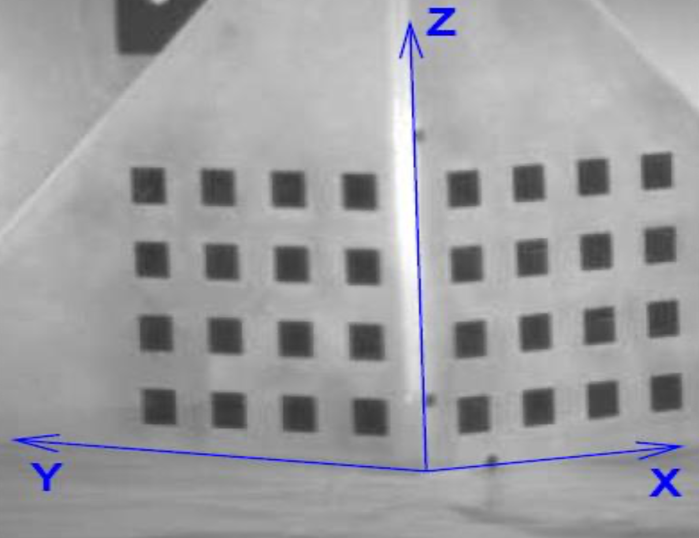
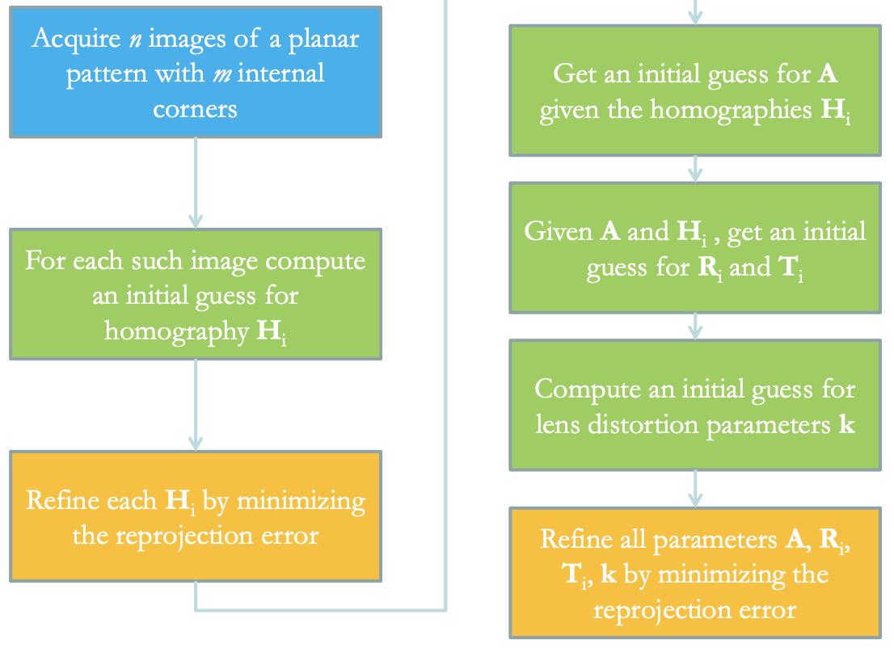
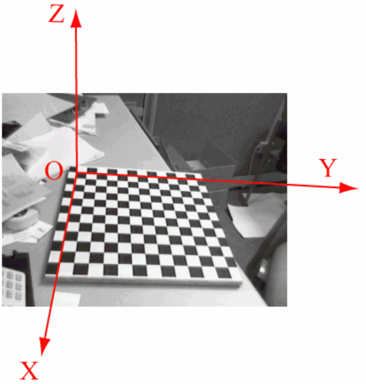
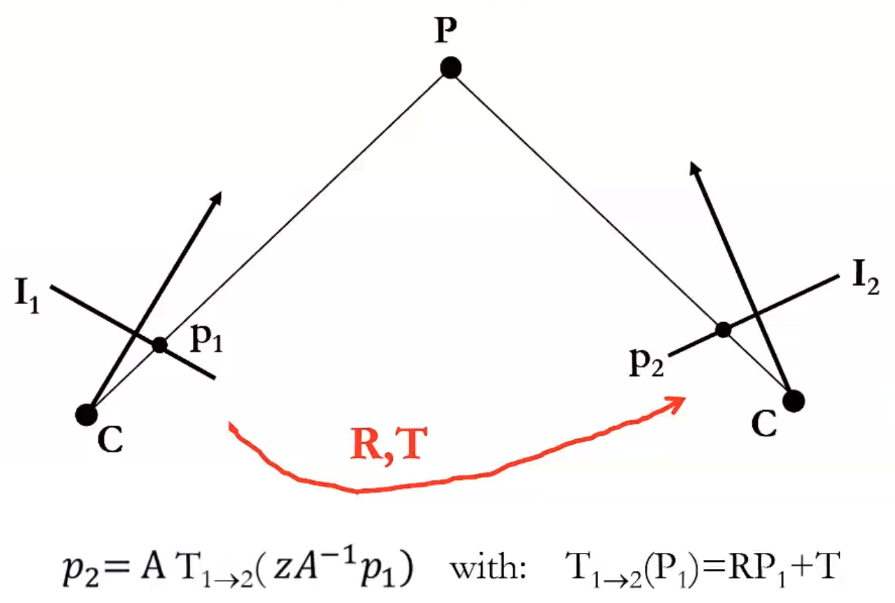

# Camera calibration

Camera calibration is about measuring the important parameters of a camera. Important, i.e. we want to detect some quantitative measurements on the image. 

The thing is, the mapping in perspective projection is **non-linear**, and we'd like it to be.

Now, why are the problems noisy? Well, all images are, since sensor are affected by noise.

So, we have to solve the equations in a way that is non subsceptible to noise.

The following is, as always, a mapping from real world coordinates to the image ones: $\left\{\begin{array}{l}
u=\frac{f}{z} x \\
v=\frac{f}{z} y
\end{array}\right.$

So, how do we turn these non-linear equations into linear ones? We have to move our POV from the euclidean one to the **projective space**, which is a mathematical instrument that is great to handle perspective projection. So, the vector space we're familiar with is the 3D euclidean space ($R^3$).

Now, let's turn a *Euclidean vector* into another vector, where we append a fourth coordinate, equal to $1$, which still represents the same point. Now, we just say that not only $(x,y,z,1)$ is valid representation, but if we multiply it by a scalar like $2$, we always get the same valid representation.What we are saying is that we can represent $(x,y,z)$ with 4 coordinates, and that all the representations that differ by a scalar $k$ are just the same. 

These 4 coordinates are called **homogeneous coordinates** (*projective coordinates*), and the vector space described by these coordinates is called **Projective Space**.

Basically, this transformation is always just a 4-th dimension added to the coordinates then the vector gets multiplied by a nonzero constant $k$.

Now, if we are given let's say a point in an n-dimensional projective space, the vector will consist in $n+1$ coordinates $[x_1,\dots,x_n,x_{n+1}]$. To do the inverse mapping, we'll divide everything by$x_{n+1}$ then remove the last dimension. Note that this allows us to represent infinity: if $x_{n+1}$ is $0$, the point is at infinity!

Let's consider the parametric equation of a 3D line: $\begin{array}{l}
\mathrm{M}=M_{0}+\lambda D=\left[\begin{array}{l}
x_{0} \\
y_{0} \\
z_{0}
\end{array}\right]+\lambda\left[\begin{array}{l}
a \\
b \\
c
\end{array}\right]=\left[\begin{array}{l}
x_{0}+\lambda a \\
y_{0}+\lambda b \\
z_{0}+\lambda c
\end{array}\right]
\end{array}$, where $\lambda$ just specifies how much we're moving along the direction. Now, we can expand this representation and append the $1$, then multiply it by a scalar $k$.

If we multiply it by $\frac{1}{\lambda}$, we get this: $\tilde{M}=\left[\begin{array}{c}
M \\
1
\end{array}\right]=\left[\begin{array}{c}
x_{0}+\lambda a \\
y_{0}+\lambda b \\
z_{0}+\lambda c \\
1
\end{array}\right]=\left[\begin{array}{c}
\frac{x_{0}}{\lambda}+a \\
\frac{y_{0}}{\lambda}+b \\
\frac{z_{0}}{\lambda}+c \\
\frac{1}{\lambda}
\end{array}\right]$ . So, if we take the limit for $\lambda\rightarrow\infty$ gets us $x_{n+1}=0$!

Now, how many points at infinity exist in a projective space? Infinite: we could append a 0 to every point.

That's nice because at the end, these can be handled in a projective space as normal points!

Note that $(0,0,0,0)$ is **undefined**, the origin is $(0,0,0,k)$.

So, why are we doing this stuff? Because perspective projection is more conveniently dealt with projective coordinates!

Please note that the value $k$ is **irrelevant!** 

So, let's denote a point $M$ irl and the image point $m$ as column vectors: $\tilde{\mathbf{m}}=\left[\begin{array}{l}
u \\
v \\
1
\end{array}\right] \quad \tilde{\mathbf{M}}=\left[\begin{array}{l}
x \\
y \\
z \\
1
\end{array}\right]$

Now, we can transform the perspective projection, which becomes a **linear transformation!**

We use as $k$ $z$, so that the thing simplifies: 

$\left[\begin{array}{l}
u \\
v \\
1
\end{array}\right]=\left[\begin{array}{c}
f \frac{x}{z} \\
f \frac{y}{z} \\
1 \\
d
\end{array}\right]=\left[\begin{array}{c}
f x \\
f y \\
z
\end{array}\right]=\left[\begin{array}{cccc}
f & 0 & 0 & 0 \\
0 & f & 0 & 0 \\
0 & 0 & 1 & 0
\end{array}\right]\left[\begin{array}{l}
x \\
y \\
z \\
1
\end{array}\right]$, where the last one is the projective representation of the point. So, we can get th image points by $k\tilde{m}=\tilde{P}\tilde{M}$ ,which sometimes is substituted by a $m\approx \tilde{P}\tilde{M}$, which mneans "equal up to an arbitrary scale factor".

Basically, $P$ is the **perspective projection matrix** (PPM) and it represents the geometric camera model. It's the equivalent of the previous equations of perspective projection between euclidean spaces. 

Now, let's assume that distances are measurable in **focal length units**, so the PPM becomes $\tilde{\mathbf{P}}=\left[\begin{array}{llll}
1 & 0 & 0 & 0 \\
0 & 1 & 0 & 0 \\
0 & 0 & 1 & 0
\end{array}\right]=[\mathbf{I} \mid \mathbf{0}]$, for example if the focal length is $8mm$, $f=2 \rightarrow 16mm$.

This is more compactly expressed by the notation $[I|0]$, where $I$ is an identity matrix and $0$ is that 0 column vector.

This type of representation is called **canonical or standard PPM**.

To come up with a useful camera model we still have two issues to address: image digitization and the 6 DOF rigid motion between the Camera Reference Frame and the World Reference Frame. There's no way to measure coordinates in an *abstract* reference frame. What can we do? We can apply $\tilde{m}=\tilde{P}\tilde{M}$, but to do so we have to measure the *world coordinates* $\tilde{M}$, therefore we need a coordinate system for the real world! 

There's one other thing that we can observe between the entities: actually, we cannot observe the image coordinates too! 

We need to find the 2 dimensions in the pixel grid. We can get the vector from the upper left corner, which represents the element at the righ pixel coordinates.

$\begin{array}{ll}
u=\frac{f}{z} x \quad & \rightarrow u=\frac{1}{\Delta u} \frac{f}{z} x=k_{u} \frac{f}{z} x+u_{0} \\
v=\frac{f}{z} y & \rightarrow v=\frac{1}{\Delta v} \frac{f}{z} y=k_{v} \frac{f}{z} y+v_{0}
\end{array}$ where $\Delta$ are the pixel sizes.

Now, we have the CRF coordinates, and we can move onto pixels. These two equations are still non-linear tho. This can be rewritten as a mapping between this new formulation and the PPM: $\tilde{\mathbf{P}}=\left[\begin{array}{cccc}
f k_{u} & 0 & u_{0} & 0 \\
0 & f k_{i} & v_{0} & 0 \\
0 & 0 & 1 & 0
\end{array}\right]$ and to get an image point we can mulitply it by $[x,y,z,1]^T$, getting us a column vector containing $[xfk_u+u_0z, yfk_v+v_0z,z]^T$, and dividing it by $z$ to *remove the tilde* we get $[x\frac{f}{z}k_u+u_0=u, y\frac{f}{z}+v_0=v]$. This means that the PPM can be rewritten to take into account pixelization. 

Now, there's another nice thing we can observe, i.e. this matrix can be factorized in two matrices: $\left[\begin{array}{ccc}
f k_{u} & 0 & u_{0} \\
0 & f k_{v} & v_{0} \\
0 & 0 & 1
\end{array}\right]\left[\begin{array}{llll}
1 & 0 & 0 & 0 \\
0 & 1 & 0 & 0 \\
0 & 0 & 1 & 0
\end{array}\right]=A[I|0]$

The matrix $A$ model the characteristics of the image sensing device, and is called **Intrinsic Parameter Matrix**. $A$ is **device specific!**

Now, sometimes you wouldn't find $fk_u,fk_v$ expressed as such, but as $a_u,a_v$, i.e. focal lengths in horizontal and vertical pixel sizes.

So far we have assumed 3D coordinates to be measured into the CRF, though this is hardly feasible in practice. Generally, 3D coordinates are measured into a WRF external to the camera, then the WRF will be related to the CRF by a **rototranslation** (i.e. a rotation around the optical center, then a translation). Therefore, the relation between the coordinates between the two RFs is $\mathbf{W}=\left[\begin{array}{l}
X \\
Y \\
Z
\end{array}\right], \mathbf{M}=\left[\begin{array}{l}
x \\
y \\
z
\end{array}\right] \Rightarrow \mathbf{M}=\mathbf{R} \mathbf{W}+\mathbf{T}$ , which can be rewritten in homogeneous coordinates. 

So far we have seen how to map a 3D point expressed in the CRF: $k\tilde{m}=A[I|0]\tilde{M}$, and we now need to consider the rigid motion between the WRF and the CRF: $k\tilde{m}=A[I|0]G\tilde{W}$

Now, the PPM can be expressed as $A[R|T]$, because $k\tilde{m}=A[RT]\tilde{w}$, or alternatively $\tilde{P}=\tilde{A}[I|0]G$.

The PPM is based on the pinhole model. However, real lenses introduce distortions to the model, especially cheap ones. The most significant deviation is known as **radial distortion**, and second order effects are induced by tangential distortion. 

Lens distortion is modeled through a non-linear transformation which maps ideal (*undistorted*) image coordinates into the observed image coordinates. 

## Calibration

Calibration tries to estimate all the parameters defining the camera model, $A,R,T$, where $A$ is intrinsic, $R$ and $T$ are extrinsic.

How do we actually estimate these? Basically, we can predict image points to the PPM as $\hat{m}= \hat{P}(A,R,T)\hat{M}$. $R$ and $T$ aren't obviously given, we have to estimate them.

What could the idea be? We plug the coordinates in, multiply them by the perspecgtive projection matrix, and get pixel coordinates. 

We'll need **calibration targets**: objects for which we **know the real world coordinates** (in a conveniently defined WRF), which have a set of **control points**. 

There's plenty of types of calibration targets, but typically *chessboard patterns* are used:

A **planar pattern** could be used too, which is obviously easier to do and super frequent.

Creating a calibration algorithm isn't straightforward, but most toolboxes (*OpenCV* too) do include some: it is a crucial step.

### How do they work?

We're now gonna illustrate the general principles behind these algorithms.

First of all, we'll require $n$ images with $m$ internal corners (considering a chessboard pattern, for example). $m$ is arbitrary, depending on the calibration pattern. So, which are the control points? Since we printed the pattern, we know the exact size of the squares: as long as we know the origin, we know the world coordinates of the control points!

Now, given the origin, the pattern is asymmetric: if you consider the internal squares, there's $6$ squares in a direction and $7$ in the other one. 

Having took these images, we have correspondence between the world coordinates and pixel coordinates; all the correspondences are *given* to the calibration engine.

Note that **we'll get a number of extrinsic parameters equal to the number of images**! We then take one of these to choose the reference frame. 

Note that lens distortion and intrinsic parameters are **device dependent**, so they stay the same for every image $n$.

$k \tilde{\mathbf{m}}=\tilde{\mathbf{P}} \tilde{\mathbf{w}}=\left[\begin{array}{cccc}p_{1,1} & p_{1,2} & p_{1,3} & p_{1,4} \\p_{2,1} & p_{2,2} & p_{2,3} & p_{2,4} \\p_{3,1} & p_{3,2} & p_{3,3} & p_{3,4}\end{array}\right]\left[\begin{array}{c}x \\y \\0 \\1\end{array}\right]=\left[\begin{array}{ccc}p_{1,1} & p_{1,2} & p_{1,4} \\p_{2,1} & p_{2,2} & p_{2,4} \\p_{3,1} & p_{3,2} &p_{3,4}\end{array}\right]\left[\begin{array}{l}x \\y \\1\end{array}\right]=\mathbf{H} \tilde{\mathbf{w}}^{\prime}$

Because of the choice of the calibration target (it is 2D), $z$ is zero for all the control points! 

Now, we can setup as many equations as $m \times n$.

Now, we consider all the $m$ equations related to a single image. Now, if $z$ is zero, when we multiply the first $p$ row by the column, $p_{1,3}$ is multiplied by zero and has no impact in finding the pixel coordinates. 

Then, when we consider the second row, the same thing happens!

The third one? Same thing. What we find is that we can just throw the third PPM column away.

We could indeed rewrite the equation in which we have eliminated the third column and $z$, the third coordinate of the world coordinates.

We therefore obtain $H\tilde{w}'$. The $'$ stands for *it is a $3\times 1$* vector instead of a $4\times1$ : these are planar coordinates!

Based on this choice of considering a planar calibration target, we transform the PPM from a $3\times4$  into a $3\times3$.

This $3\times3$ transformation, which maps points between two projective planes is known as **homography**: when the scene framed by the camera is planar, prospective projection becomes a simpler transformation called homography.

Note that **any two images of a planar scene are related by homography**!

The product of two homographies is an homography too.

Then the problem is, how do we estimate this homographies?

The key idea is using a set of such equations.

There's plenty of methods to estimate homographies. We'll use DLT. Now, we can rewrite the homography $\mathbf{H}$ transposing the rows and getting column vectors $h_i^T$. Now, these are projective equalities. 

The vectors $m$ and $\tilde{w}'$ are parallel, so the vector product is zero.

We can use that:

$k \tilde{\mathbf{m}}=\mathbf{H} \tilde{\mathbf{w}}^{\prime} \Rightarrow \mathbf{\tilde { m }} \times \mathbf{H} \tilde{\mathbf{w}}^{\prime}=\mathbf{0} \Rightarrow\left[\begin{array}{c}
v \mathbf{h}_{3}^{\mathbf{T}} \tilde{\mathbf{w}}^{\prime}-\mathbf{h}_{2}^{\mathbf{T}} \tilde{\mathbf{w}}^{\prime} \\
\mathbf{h}_{1}^{\mathbf{T}} \tilde{\mathbf{w}}^{\prime}-u \mathbf{h}_{3}^{\mathbf{T}} \tilde{\mathbf{w}}^{\prime} \\
u \mathbf{h}_{2}^{\mathbf{T}} \tilde{\mathbf{w}}^{\prime}-v \mathbf{h}_{1}^{\mathbf{T}} \tilde{\mathbf{w}}^{\prime}
\end{array}\right]=\mathbf{0}, \mathbf{H}=\left[\begin{array}{c}
\mathbf{h}_{1}^{\mathbf{T}} \\
\mathbf{h}_{2}^{\mathbf{T}} \\
\mathbf{h}_{3}^{\mathbf{T}}
\end{array}\right]$ 

We therefore get the matrix for the dot product$\left[\begin{array}{c}
\mathbf{h}_{1}^{\mathbf{T}} \\
\mathbf{h}_{2}^{\mathbf{T}} \\
\mathbf{h}_{3}^{\mathbf{T}}
\end{array}\right]\cdot \tilde{w}' \rightarrow \left[\begin{array}{c}
\mathbf{h}_{1}^{\mathbf{T}}\cdot w \\
\mathbf{h}_{2}^{\mathbf{T}}\cdot w \\
\mathbf{h}_{3}^{\mathbf{T}}\cdot w
\end{array}\right]$ 

Using mathematical tricks, we get $\left[\begin{array}{c}
i && j && k \\
u && v && 1 \\
\mathbf{h}_{1}^{\mathbf{T}}w && \mathbf{h}_{2}^{\mathbf{T}}w && \mathbf{h}_{3}^{\mathbf{T}}w
\end{array}\right]$ and we calculate the determinant, getting $\left[\begin{array}{c}
v \mathbf{h}_{3}^{\mathbf{T}} \tilde{\mathbf{w}}^{\prime}-\mathbf{h}_{2}^{\mathbf{T}} \tilde{\mathbf{w}}^{\prime} \\
\mathbf{h}_{1}^{\mathbf{T}} \tilde{\mathbf{w}}^{\prime}-u \mathbf{h}_{3}^{\mathbf{T}} \tilde{\mathbf{w}}^{\prime} \\
u \mathbf{h}_{2}^{\mathbf{T}} \tilde{\mathbf{w}}^{\prime}-v \mathbf{h}_{1}^{\mathbf{T}} \tilde{\mathbf{w}}^{\prime}
\end{array}\right]$ 

Putting $\mathbf{\tilde { m }} \times \mathbf{H} \tilde{\mathbf{w}}^{\prime}=\mathbf{0} $ means that we're looking for the unknowns $\mathbf{H}$, and we can *highlight* the unknowns as following: $\left[\begin{array}{ccc}
\mathbf{0}^{\mathbf{T}} & -\tilde{\mathbf{w}}^{\mathbf{T}} & \tilde{\mathbf{w}}^{\prime \mathbf{T}} \\
\tilde{\mathbf{w}}^{\prime \mathbf{T}} & \mathbf{0}^{\mathbf{T}} & -u \tilde{\mathbf{w}}^{\prime \mathbf{T}} \\
-\boldsymbol{v} \tilde{\mathbf{w}}^{\prime \mathbf{T}} & u \tilde{\mathbf{w}}^{\prime \mathbf{T}} & \mathbf{0}^{\mathbf{T}}
\end{array}\right]\left[\begin{array}{l}
\mathbf{h}_{1} \\
\mathbf{h}_{2} \\
\mathbf{h}_{3}
\end{array}\right]=\mathbf{A} \mathbf{h}=\mathbf{0}$, where $h_1$ is the first row transposed as a column vector. So, this is a system of 3 equations and 9 unknowns. 

There's another problem too: the equations are not linearly independent!

Note that the real unknowns in the homography are 8 and not 9: it is a projective transformation, and every projective transformation is projected up to **scale**, which we can set to 1.

So, we want to estimate 8 unknowns given $2m$ equations: this is a linear homogeneous system. Can we solve it precisely, having more equations than the unknowns? We can only solve this in a **least squares sense**, it's an *overdetermined system*! $A^*$ will sufficiently satisfy all of the equations.

The problem is now formulated as finding $\mathbf{H}$ such that $h^*=\operatorname{argmin}(\|A\cdot h\|^2)$, which is the best approximation.

The solution of this estimation problem can be obtained by computing the Singular Value Decomposition of $A=U\Sigma V^T$ with $A \in \mathbb{R}^{2m\times9}$, $U\in \mathbb{R}^{2m\times2m}$, $V \in \mathbb{R}^{9\times9}$. 

It turns out that $h^*$ is **the last column of V**, $v_9$, being V composed of the left singular vectors $[v_1,\dots,v_9]$.

Now, we're looking for the *best homography*, which makes the product equal to zero.

The error obtained in the minimization is called **algebraic error**.

We can refine the solution with the *Levenberg-Marquardt* algorithm for the non-linear minimization of the least squares problem $\min _{\mathbf{H}_{i}} \sum_{j}\left\|\tilde{\mathbf{m}}_{j}-\mathbf{H}_{i} \tilde{\mathbf{w}}_{j}^{\prime}\right\|^{2}, \quad j=1 \ldots . m$.

### Estimation of the intrinsic parameters

As $H_i$ is known up to a scale factor, we can establish a relation between $H_i$ and the PPM:

$\mathbf{H}=\left[\begin{array}{lll}
\mathbf{h}_{1} & \mathbf{h}_{2} & \mathbf{h}_{3}
\end{array}\right]=\left[\begin{array}{lll}
\mathbf{p}_{1} & \mathbf{p}_{2} & \mathbf{p}_{4}
\end{array}\right]=\lambda \mathbf{A}\left[\begin{array}{lll}
\mathbf{r}_{1} & \mathbf{r}_{2} & \mathbf{T}
\end{array}\right]$ 

notice that $r_1$ and $r_2$ are columns of the rotation matrix, therefore they are **orthonormal vectors**, so they are perpendicular! The scalar product is therefore $0$: $r_1^T r_2=0$.

$\begin{array}{l}
\mathbf{r}_{1}^{\mathrm{T}} \mathbf{r}_{2}=0 \quad \Rightarrow \quad \mathbf{h}_{1}^{\mathrm{T}} \mathbf{A}^{-\mathrm{T}} \mathbf{A}^{-1} \mathbf{h}_{2}=0 \\
\mathbf{r}_{1}^{\mathrm{T}} \mathbf{r}_{1}=\mathbf{r}_{2}^{\mathrm{T}} \mathbf{r}_{2} \Rightarrow \mathbf{h}_{1}^{\mathrm{T}} \mathbf{A}^{-\mathrm{T}} \mathbf{A}^{-1} \mathbf{h}_{1}=\mathbf{h}_{2}^{\mathrm{T}} \mathbf{A}^{-\mathrm{T}} \mathbf{A}^{-1} \mathbf{h}_{2}
\end{array}$

The square norms are obviously $1$. Now we have two equations for each **image**! The unknowns in the equation are the entries of $B=A^{-T}A^{-1}$ , where $A$ is upper triangular and $B$ turns out to be symmetric: **the unknowns are just 6** (*$3\times3$ symmetric*)!

As usual, rather than using 3 calibration images we prefer more images, thereby solving an overdetermined system.

Again, taking $n$ calibration images will get a system of $2n$ equations in $6$ unknowns.

What kind of system is that? In the end, we get $Vb=0$, with $2n$ equations and $6$ unknowns (you can skip the math in slide 34). We can solve that with **SVD**.

Once $A$ ha been estimated, it is possible to compute $R_i$ and $T_i$ for each image $i$:

$\begin{array}{l}
\mathbf{H}_{i}=\left[\begin{array}{lll}
\mathbf{h}_{1, i} & \mathbf{h}_{2, i} & \mathbf{h}_{3, i}
\end{array}\right]=\lambda \mathbf{A}\left[\begin{array}{lll}
\mathbf{r}_{1, i} & \mathbf{r}_{2, i} & \mathbf{T}_{i}
\end{array}\right] \\
\mathbf{h}_{k, i}=\lambda \mathbf{A} \mathbf{r}_{k, i} \Rightarrow \lambda \mathbf{r}_{k, i}=\mathbf{A}^{-1} \mathbf{h}_{k, i}, k=1,2
\end{array}$

As $r_{k,i}$ is a unit vector, $\mathbf{r}_{k, i}=\frac{1}{\lambda} \mathbf{A}^{-1} \mathbf{h}_{k, i}, \lambda=\left\|\mathbf{A}^{-1} \mathbf{h}_{k, i}\right\|, \quad k=1,2$. What we get is not exactly a rotation matrix $R$, but the closest orthogonal matrix. 

Now, we can SVD decompose $R$, and because $R$ is not perfectly orthogonal, $R^*=UIV^T$, where we substituted $\Sigma$ with $I$ to get a truly orthogonal result.

Now, we obtain $\mathbf{T}_{i}=\frac{1}{\lambda} \mathbf{A}^{-1} \mathbf{h}_{3, i}$.

We still need to find the **lens distortion** though. 

Now, given the homographies, we have both the real (distorted) coordinates of the corners as well as the ideal (undistorted) coordinates predicted by the homographies. Knowing $A$, we have the following model:

$\left(\begin{array}{c}
x^{\prime} \\
y^{\prime}
\end{array}\right)=L(r)\left(\begin{array}{c}
\tilde{x} \\
\tilde{y}
\end{array}\right)=\left(1+k_{1} r^{2}+k_{2} r^{4}\right)\left(\begin{array}{c}
\tilde{x} \\
\tilde{y}
\end{array}\right)$ and we first need to establish the relationship between distorted $(u',v')$ and ideal $(\tilde{u}, \tilde{v})$ (pixel) coordinates.

Therefore, to proceed, we need to know both the distorted coordinates and the undistorted ones. 

Now, the coordinates we have here **pixel coordinates**, but distortion happens **before pixelization!** So, we'd like to get the continuous coordinates. Is there a way to do so? $A$, the intrinsic matrix does the pixelization, so, since we have already estimated $A$, we can apply it to continuous distorted image coordinates, as well as we can apply $A$ to continuous ideal coordinates and get pixel ideal coordinates. 

We can therefore rewrite the previous equation as function of pixel coordinates, not continuous anymore:

$\left[\begin{array}{c}
u^{\prime} \\
v^{\prime} \\
1
\end{array}\right]=A\left[\begin{array}{l}
x^{\prime} \\
y^{\prime} \\
1
\end{array}\right]=\left(\begin{array}{ccc}
\alpha_{u} & 0 & u_{0} \\
0 & \alpha_{v} & v_{0} \\
0 & 0 & 1
\end{array}\right)\left[\begin{array}{l}
x^{\prime} \\
y^{\prime} \\
1
\end{array}\right] \rightarrow\left\{\begin{array}{l}
x^{\prime}=\frac{u^{\prime}-u_{0}}{\alpha_{u}} \\
y^{\prime}=\frac{v^{\prime}-v_{0}}{\alpha_{v}}
\end{array} \quad\left[\begin{array}{l}
\tilde{u} \\
\tilde{v} \\
1
\end{array}\right]=A\left[\begin{array}{c}
\tilde{x} \\
\tilde{y} \\
1
\end{array}\right] \rightarrow\left\{\begin{array}{l}
\tilde{x}=\frac{\tilde{u}-u_{0}}{\alpha_{u}} \\
\tilde{y}=\frac{\tilde{v}-v_{0}}{\alpha_{v}}
\end{array}\right.\right.$ 

Now, these quantities are known, and we can resolve to get the lens distortion parameter:

$\left[\begin{array}{c}
x^{\prime} \\
y^{\prime}
\end{array}\right]=\left(1+k_{1} r^{2}+k_{2} r^{4}\right)\left[\begin{array}{c}
\tilde{x} \\
\tilde{y}
\end{array}\right] \rightarrow\left\{\begin{array}{l}
\frac{u^{\prime}-u_{0}}{\alpha_{u}}=\left(1+k_{1} r^{2}+k_{2} r^{4}\right)\left(\frac{\tilde{u}-u_{0}}{\alpha_{u}}\right) \\
\frac{v^{\prime}-v_{0}}{\alpha_{v}}=\left(1+k_{1} r^{2}+k_{2} r^{4}\right)\left(\frac{\tilde{v}-v_{0}}{\alpha_{v}}\right)
\end{array}\right.$

So, this is a system of 2 equations in 2 unknowns, for every corner in every image, so we get $n\times n$ equations in 2 unknowns, providing us an overconstrained system, which is now no longer homogeneous. How do we solve that? In a least squares approach there's two methods, the first being this formula $\mathbf{D} \mathbf{k}=\mathbf{d} \rightarrow \mathbf{k}=\mathbf{D}^{+} \mathbf{d}=\left(\mathbf{D}^{\mathrm{T}} \mathbf{D}\right)^{-1} \mathbf{D}^{\mathrm{T}} \mathbf{d}$, the other one being finding the **pseudoinverse** (calculated through SVD). $k^*$ will therefore be the $k^*=argmin(\|Dk-d\|^2)$, which satisfies the equations as well as possible.

We can then obtain the radius of distortion by:

$\left[\begin{array}{ll}
\left(\tilde{u}-u_{0}\right) r^{2} & \left(\tilde{u}-u_{0}\right) r^{4} \\
\left(\tilde{v}-v_{0}\right) r^{2} & \left(\tilde{v}-v_{0}\right) r^{4}
\end{array}\right]\left[\begin{array}{l}
k_{1} \\
k_{2}
\end{array}\right]=\left[\begin{array}{l}
u^{\prime}-\tilde{u} \\
v^{\prime}-\tilde{v}
\end{array}\right] \quad  r^{2}=\left(\frac{\tilde{u}-u_{0}}{\alpha_{u}}\right)^{2}+\left(\frac{\tilde{v}-v_{0}}{\alpha_{v}}\right)$ 

As usal, rather than taking a single control point, we setup a system considering all of the equations we've got.

The system is not homogeneous. 

It now looks like we've got everything we need, but it is usual to add a final refinement to this initial guess, a non-linearity that reduces the geometric error, image reprjoection error.

# Depth cameras

Depth camera are cameras for which we obtain the $z$ axis too. What is usually done is outputting a **point cloud**, where for each point we get coordinates $x,y,z$.

Now, our PPM will be something like $[R|T]\cdot \left[\begin{array}{c}
x \\
y \\z \\1\end{array}\right]$ where $R$ has become a $3\times3$ identity matrix, and $T$ is a null column vector, therefore we get $[I|\empty] \left[\begin{array}{c}
x \\
y \\z \\1\end{array}\right]$

$\left[\begin{array}{c}
\alpha_{u} x+u_{0} z \\
\alpha_{v} y+v_{0} z \\
z
\end{array}\right]=\left[\begin{array}{ccc}
\alpha_{u} & 0 & u_{0} \\
0 & \alpha_{v} & v_{0} \\
0 & 0 & 1
\end{array}\right]\left[\begin{array}{l}
x \\
y \\
z
\end{array}\right]$ , which is $p^* A p$. So, we divide by $z$ because we want a formula in which we can plug $p$:

$\begin{aligned}
&\mathrm{p}^{*}=\mathrm{A} \underline{\mathrm{P}}\\
&\mathbf{P}=\mathbf{A}^{-1} \mathbf{p}^{*}\\\mathbf{P}=\mathbf{z} \mathbf{A}^{-1} \frac{\mathbf{p}^{*}}{\mathbf{z}}\end{aligned}$

Indeed, any depth sensor deploys a point cloud $x,y,z$ in which coordinates are in the camera referene system of the given optical sensor. Indeed, there's a whole branch of CV which is concerned with processing point clouds.

Thus, we get $P=zA^{-1}p$ with $A^{-1}=\left[\begin{array}{rrr}
\frac{1}{\alpha_{u}} & 0 & -\frac{u_{0}}{\alpha_{u}} \\
0 & \frac{1}{\alpha_{v}} & -\frac{v_{0}}{\alpha_{v}} \\
0 & 0 & 1
\end{array}\right]$. 

Now, if we get a camera and move it to scan a static scene, knowing the rigid motion (rototranslation) between the two views, we get

The transformation between the coordinates of the 3D point between the two systems is just a rototranslation!

There's a technique named depth from mono, which gets 3D points from a single image

Machine Learning is used in this sense. The question is, how can you train this? We've gotta show to the system images for which we know every pixel's depth.

The idea is the following: assume that a camera is predicting the depth for pixel $p_1$. Assume tat we know the rototranslation. If the predicted depth is correct, where should we find the corresponding pixel in the second view? If  the prediction is correct, my model is good, if not, we'll change the parameters!

We could obviously also have two different cameras!

# Image warping

In image warping, we have two images $I(u,v)$ and $I'(u',v')$, and we are given a warping function$\left\{\begin{array}{l}
u^{\prime}=f_{u}(u, v) \\
v^{\prime}=f_{v}(u, v)
\end{array}\right. \rightarrow I^{\prime}\left(f_{u}(u, v), f_{v}(u, v)\right)=I(u, v)$. For example, a warping could be a rotation, where the warping function would be the rotation transformation. We could use a warping to remove perspective deformation too.

We can proceed to a bilinear interpolation to compute the relationship between the input and the warp.

You can observe that the interpolated intensity is given by a weighted sum of the input intensities.

We can exploit warping thanks ot the lens distortion parameters, to get an undistorting warping function. For example, using Zhang's method:

$\left\{\begin{array}{l}
u^{\prime}=\tilde{u}+(k_{1} r^{2}+k_{2} r^{4})\left(\tilde{u}-u_{0}\right) \\
{v}^{\prime}=\tilde{v}+(k_{1} r^{2}+k_{2} r^{4})\left(\tilde{v}-v_{0}\right)
\end{array}\right.$ , which scan the output image, plug coordinates $\tilde{u},\tilde{v}$, and we find the undistorted coordinates.

What we want to obtain is an undistorted image, so we have to scan the output ideal and undistorted function. 

