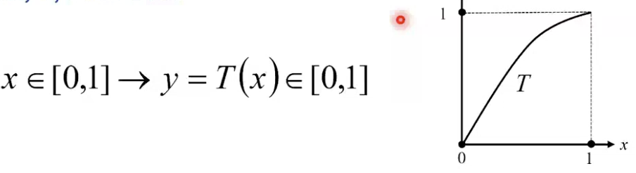
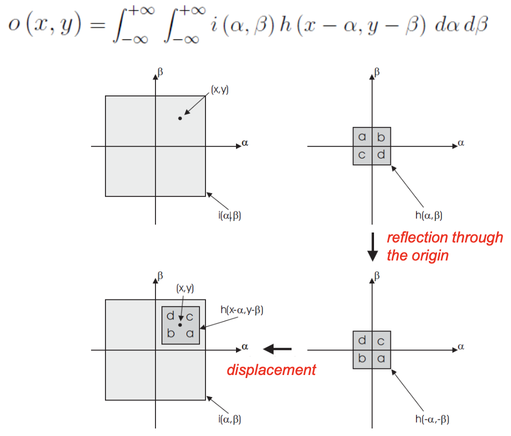
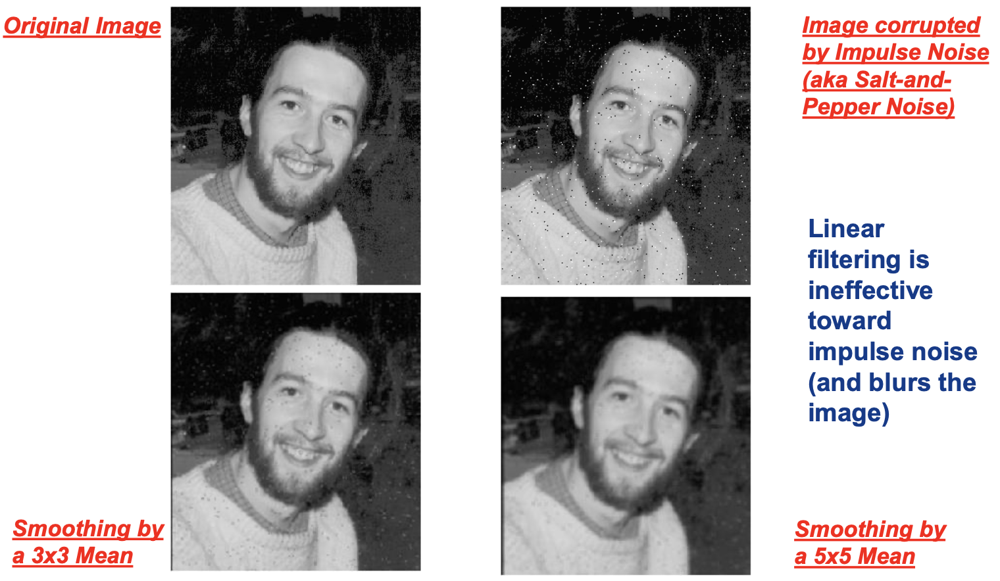
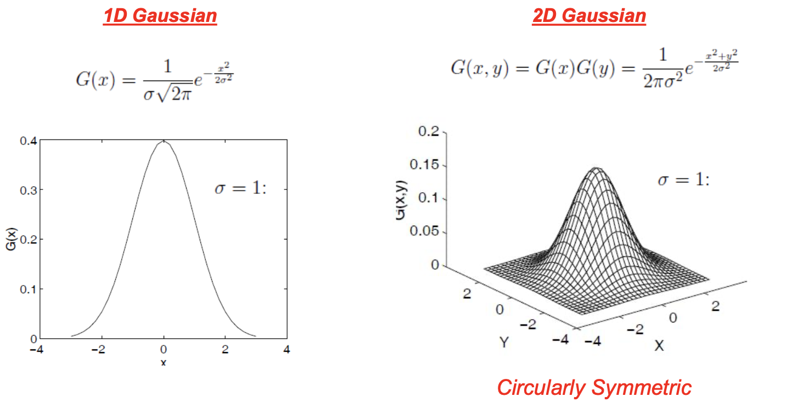
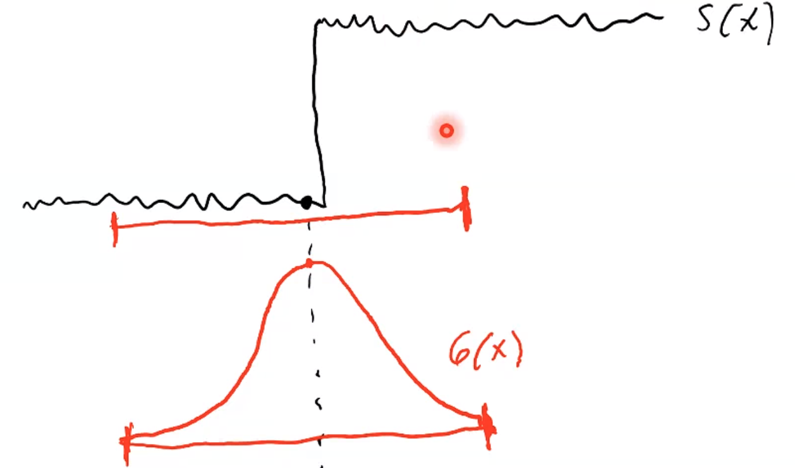
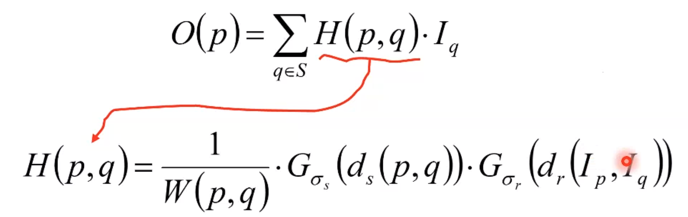

# Intensity transformations

We want to improve an image so that it becomes easier to analyze for CV.

We'll not go over too many image processing techniques. Intensity transformation are image processing operators aimed at enhancing the quality (the contrast) of the image. At most such operators rely on the computation of the gray-level histogram of the input image, we start by defining this useful function. The gray-level histogram of ani mage is simply a function associating to each gray-level the number of pixels in the image taking that level. 

Computing the histogram is straightforward: we define a vector $H$ having as many elements as the number of grayscale levels, then scan the image to increment the element of the vector corresponding to the level of the pixel.

These are operators that modify the histogram to improve the quality of the image. The intensity of a pixel in the output is computed only basing on its intensity in the input. It's just a mapping function from a gray level to another one.

### Thresholding operator

An example of this is the **thresholding operator**, where we can set a threshold graylevel and set to black all the intensities under that threshold and to white everything over that.

This is used to get ultra simple images, maybe to get objects.

These operators can be implemented as a LookUp Table, which is often convenient.

We can formalize these intensity transformations as follows:

$\mathbf{p}=\left[\begin{array}{l}
u \\
v
\end{array}\right], \forall \mathbf{p} \in \mathbf{I}: \mathbf{o}[\mathbf{p}]=\mathbf{L} \mathbf{U} \mathbf{T}[\mathbf{I}[\mathbf{p}]]$ 

So, apart from thresholding, we can cite linear contrast stretching. Now, we don't know anything about the content of the image, but from the histogram we can get an approximate quality determination. For example, we can check if the full range of grayscales is present: the contrast may not be good.

So, if we *stretch* the graylevel range, we should improve the contrast. 

We are spreading noise too, but we'll not deal with this now.

$\begin{array}{c}
s=\frac{s_{\max }-S_{\min }}{r_{\max }-r_{\min }}\left(r-r_{\min }\right)+s_{\min } \\
S_{\min }=0, s_{\max }=255 \rightarrow s=\frac{255}{r_{\max }-r_{\min }}\left(r-r_{\min }\right)
\end{array}$

The second equation is the most common formulation, where we remap the range into the whole range.

If the histogram is stretched but with a peak, it is kind of useless (minimum around 0 maximum around 255). Therefore, it needs a peak only with no *tails*. To solve this, we can apply the linear contrast stretching by using percentiles instead of min and max.

### Exponential operator

Until now, we treated all the pixels the same way, but working on the interesting area only might be useful.

This can be done with non-linear operators, like the **exponential** (aka gamma correction), where fiven $y$ the output and $x$ the input graylevel, we compute $y=x^r$ with $x=[0,1], r=0.25,0.5,2,4,\dots$ where we increase contrast in bright areas if $r>1$ in dark areas if $r<1$.

Now, if for example we had the range $0.2$ with $r=0.25$, which gets the darkest area a higher contrast, while the brighter ones are going to be squeezed into a smaller range.

The formula, with typical levels becomes $y=255^{1-r} x^{r}$.

The operator is called gamma correction because in the past it was used in CRT monitors, which resulted in an exponential operator of gamma $ \approx 2.2$, so they used a negative gamma as countermeasure.

### Histogram equalization

This is the most known operator. It uniformly spreads pixel intensities aceoss the whole available range, which usually improves the contrast. Why do we do this? **Improving the contrast, not flatting the histogram**. Unlike linear stretching, which requires manual intervention to set min and max, this one works automatically.

To find the mapping, considering a continuous variable x and a strictlt monotonically increasing function T:

The goal is turning the histogram into a flat one, using the theory of random variables. We know that there's a link between the PDF and the graylevel histogram.

Now, denoting as $p_X$ the PDF of x and $p_Y$ the PDF of y, as $T$ is monotonically increasing:

$\begin{array}{l}
\forall \tilde{x} \in[x, x+d x] \rightarrow \tilde{y}=T(\widetilde{x}) \in[y, y+d y] \\
\text {with } y=T(x), y+d y=T(x+d x)
\end{array}$

We take an infinitesimal interval of x, $x+dx$ mapping to $y+dy$. What if we pick any $\tilde{x}$ in the interval? Due to T monotonically increasing, we know that it is in the interval. So, the relation between the probabilities of RV x and y in the interval, we know that the probability of x being in the interval is the same.

So, the probability is $p(x \in [x_1,x_2]) = \int_{x_1}^{x_2} p_Xdx$ and if we take an infinitesimal interval we can establish this relationship between these two probabilities: the probability of x and y to belong to their infinitesimal intervals is exactly the same, which allows deriving the pdf of y as a function of T and the pdf of x:

$p_{y}(y) d y=p_{x}(x) d x \rightarrow p_{y}(y)=p_{x}(x) \frac{d x}{d y}$

Note that $\frac{dx}{dy}$ is the derivative of the inverse function : $x=T ^{-1}(y)$.

Now, what kind of function T should we use if we want a uniform result? We choose the **Cumulative Distribution Function CDF**, which is guaranteed to map into $[0,1]$ and be monotonically increasing:

$y=T(x)=\int_{0}^{x} p_{x}(\xi) d \xi$

So, our previous relationship now becomes

$p_{y}(y)=p_{x}(x) \frac{d x}{d y}=p_{x}(x) \frac{1}{\mathrm{dy} / \mathrm{dx}}=\frac{p_{x}(x)}{p_{x}(x)}=1$

Now, if T is that function, its derivative is exactly the PDF $p_X(x)$ getting to $1$. We got a RV whose PDF is always 1, therefore a **uniform random variable**.

We have thus found that by mapping any continuous random variable through its cdf we obtain a uniformly distributed random variable. Now, how can we use this to equalize an image?

We proceed by discretizing the previous result, i.e. by considering the cumulative PMF of the discrete RV associated with the graylevel of a pixel, whose PMF is given by the normalized histogram.

$\left\{\begin{array}{l}
N=\sum_{i=0}^{L-1} h(i) \\
\mathrm{p}(\mathrm{i})=\frac{h(i)}{N} \rightarrow j=T(i)=\sum_{k=0}^{i} p(k)=\frac{1}{N} \sum_{k=0}^{i} h(k) \rightarrow j=\frac{L-1}{N} \sum_{k=0}^{i} h(k) \\
\end{array}\right.$

# Spatial filtering

So, these operators are sometimes called  **local operators**. We now compute the output basing on the input pixel as before, **and its neighbourhood** (aka support of the pixel).

We use these for **denoising** and **sharpening**.

An important subclass is called **linear shift-invariant** operators, which we'll consider first.

## Linear shift-invariant operators (LSI)

Straightforward extension of 1D signal theory dictates their application to consist in **2D convolution** between the input image and the impulse response function (*point spread function* or *kernel*, i.e. the output of the pixel when the input is an impulse) of the LSI.

### Convolutions

First of all, considering a 2D signal $i(x,y)$ let's call an operator $T$ which generates the output signal. T is linear iff $T\left\{a i_{1}(x, y)+b i_{2}(x, y)\right\}=a o_{1}(x, y)+b o_{2}(x, y), \text { with } o_{1}(\cdot)=\sigma\left\{i_{1}(\cdot)\right\}, o_{2}(\cdot)=T\left\{i_{2}(\cdot)\right\}$.

If the input is a weighted sum of signals, the output is too.

Shift invariance is defined as: $T\left\{i\left(x-x_{0}, y-y_{0}\right)\right\}=o\left(x-x_{0}, y-y_{0}\right)$ so what we get is the same shift in the output as in the input.

Let us now assume $i(x, y)=\sum_{k} w_{k} e_{k}\left(x-x_{k}, y-y_{k}\right)$ and pose $h_{k}(\cdot)=T\left\{e_{k}(\cdot)\right\}$ which is the output of the operator when the input is $e_k$.

Due to the two properties, the output is the same weighted sum, shifted.

$\begin{aligned}
o(x, y) &=T\left\{\sum_{k} w_{k} e_{k}\left(x-x_{k}, y-y_{k}\right)\right\} \\
&=\sum_{k} w_{k} T\left\{e_{k}\left(x-x_{k}, y-y_{k}\right)\right\} \\
&=\sum_{k} w_{k} h_{k}\left(x-x_{k}, y-y_{k}\right)
\end{aligned}$

If the input is a weighted sum of displaced elementary functinos, the output is given by the same weighted sum of the displaced responses to elementary functions.

We know that if an operator is an LSI (linear/shift-invariant), if the input can be expressed as a weighted sum, it turns out that the output is given by the same weighted sum (the $w$ aren't gonna change) of the responses to the elementary functions shifted by the same quantity. 

This is useful: every signal can be expressed as a weighted sum of elementary functions. More specifically, a sum of displaced unit impulses (dirac delta function):
$$
i(x, y)=\int_{-\infty}^{+\infty} \int_{-\infty}^{+\infty} i(\alpha, \beta) \delta(x-\alpha, y-\beta) d \alpha d \beta
$$
We normally have a sum of a certain number of functions $e_k$, but now this is an infinite sum. We have this double integral summing across the whole 2D plane. The weights are the $i(\alpha, \beta)$ and not the $w_k$ anymore. 

What we can see is that the amount of shift is given by $\alpha,\beta$. So, how can we read this formula? This is expressed as impulses which can be located everywhere, and each fo them is multiplied by the value of the function in that position. We are seeing the function as impulses multiplied by the value of the function in the position they are located.

This property (that we can see a function as a weighted sum of weighted impulses) is known as the *sifting property of the unit impulse*.

The output we get if we feed the operator $T$ by the elementary function dirac delta is known as $h$, the **impulse response** or point-spread function: $h(x,y)=T\{\delta(x,y)\}$.

So, we know that for whatever input signal (every one of them can be expressed in this form) we can get the output of an LSI operator in this form. 
$$
o(x, y)=T\{i(x, y)\}=\int_{-\infty}^{+\infty} \int_{-\infty}^{+\infty} i(\alpha, \beta) h(x-\alpha, y-\beta) d \alpha d \beta
$$
Now that we've found this formula to compute the output of T, a convolution gets applied. More precisely, since we're working with 2D continuous signals, this is known as a **2D continuous convolution**. 

We often denote the convolution operation by the symbol $*$:
$$
o(x, y)=i(x, y) * h(x, y)
$$
The convolution has some useful properties: the **associative** property ($f*(g*h)=(f*g)*h$), the **commutative** property ($f*g=g*f$), the **distributive** property wrt the sum ($f*(g+h)=f*g+f*h$) and the **convolutional commutes** with differentiation ($(f*g)'=f'*g=f*g'$). The last one is pretty much esoteric but so useful. I want to compute the derivative of $f*g$ (could be first,second, third...), it is the same as applying that derivation to either one of the two functions.

 A practical interpretation of convolution: for every point in the domain, we're kind of multypling them (by a value linked to the function's value) and adding up all these products.

So, we have two functions $i$ and $h$ defined in the domain known as *plane $\alpha,\beta$*.

The first square is representing the set in the domain $\alpha,\beta$ in which $i$ is non-zero. Then we have $h$, another function which is non-zero in another region. Usually we consider $i$ as the input and $h$ as the filter: this is why $h$ has a smaller square. So, now, $a,b,c,d$ represent the set of values $h$ takes in the four subregions. We said convolution is about multiplying corresponding values, and if we look at $i$ in the definition, it appears unchanged, while $h$ is not appearing as $h(\alpha,\beta)$ but is manipulated. We have $h(-\alpha, -\beta)$: this means that we're flipping $h$ around the origin. $h$ not only undergoes a flip, but a shift too by $x,y$. So, to compute the convolution at $(x,y)$ we leave $i$ unchanged, then pick $h$, reflect it around the origin and shift it at $x,y$. Then, we multiply them together and sum them.

### Correlation

We can introduce the **correlation**:
$$
i(x, y) \circ h(x, y)=\int_{-\infty}^{+\infty} \int_{-\infty}^{+\infty} i(\alpha, \beta) h(x+\alpha, y+\beta) d \alpha d \beta
$$
Accordingly, the correlation of $h$ vs $i$:
$$
h(x, y) \circ i(x, y)=\int_{-\infty}^{+\infty} \int_{-\infty}^{+\infty} h(\alpha, \beta) i(x+\alpha, y+\beta) d \alpha d \beta
$$
Note that correlation, differently from convolution, **is not commutative**.

Convolution is about flipping and shifting, correlation is about shifting only. In convolution you take $h$ flip and shift, in correlation of $h$ vs $i$ you take $h$ and shift it only. Now, because $h$ gets reflected in convolution, left unchanged in correlation, there's a special case in which **the two coincide**.

If the function is symmetric around the origin (which often happens), if you flip you don't really change anything!

Let us now consider a discrete 2D KSI operator, $T\{\cdot\}$, whose response to the 2D discrete unit impulse (*Kronecker Delta Function*) is denoted as $H(l,j)$.
$$
H(i, j)=T\{\delta(i, j)\} \quad \text { with } \quad\left\{\begin{array}{ll}
\delta(i, j)=1 & \text { at } \quad(0,0) \\
\delta(i, j)=0 & \text { elsewhere }
\end{array}\right.
$$
In imag processing both the input and impulse are stored into matrices of given sizes. Conceptually, we need to slide the kernel across the whole image to compute the new intensity at each pixel, without overwriting the input matrix.

## Mean Filter

Mean filtering is the simplest way to carry out an image smoothing (i.e. a low-pass filtering). Note that the notion of frequency in images is applicable (Fourier's theory). When you low-pass a signal, remind that high frequencies are responsible for rapid changes in the signal, so the signal will be smoother. This is foten aimed at image denoising, though sometimes the purpose is to just cancel out small-size unwanted details that might hinder the image analysis task. 

Note that noise is usually in the high frequencies!

Another reason to perform smoothing is to create a so-called *scale-space*, which is a representation made of multiple images, smoothed by larger and larger filters, used, for example, to recognize objects.

Scale is the term used to denote *size in the image*: a small scale object occupies a small portion of the image.

The mean filter just **replaces each pixel intensity by the average intensity over a given neighbourhood**.

Formally, a mean filter is an LSI operator, but in practice we can just compute the mean. We can use **box filtering** to efficiently compute the mean by incremental calculation. 

In box filtering, we proceed adding a column and removing another one. Calling these columns $V^+$ and $V^-$. So, when we compute the sum, given the sum at position $i,j$, we simply add a column's sum and subtract the other one. Doing that from scratch, we would need $(2k+1)^2$ computations, resulting in a complexity of $\mathcal{O}(k^2)$, while using box filtering results in a complexity of $\mathcal{O}(k)$:
$$
s(i, j+1)=s(i, j)+V^{+}(i, j+1)-V^{-}(i, j+1)
$$

The latter is sometimes called *salt and pepper noise*, being built by adding outliers.

## Gaussian filter

This is the **best filter** among the linear operators. It's the most widespread for smoothing operations.

It's a filter whose kernel is a **Gaussian function**. Since we're dealing with 2D signals, this will be a 2D Gaussian. 

Note that a 2D Gaussian is just the product of 2 Gaussians along x and y.

The larger the $\sigma$, the stronger is the smoothing filter. This can be understood by observing that as $\sigma$ increases, the weights of closer points get smaller while those of farther points become larger.

Another way of proving this is computing the Fourier transform, which is another Gaussian with sigma $\sigma_\omega = 1/\sigma$, meaning that the higher the $\sigma$ the narrower the bandwidth of the filter.

If the Gaussian is large in the signal domain, it shall be narrow in the Fourier domain, and vice versa. 

The Gaussian is more effective than the Mean filter, as the frequency response of the former is monotonically decreasing, while the latter exihibits significant ripple.

The discrete Gaussian kernel can be obtained by sampling the corresponding continuous function, which is however of infinite extent. A finite size must therefore be properly chosen. 

Sigma is what decides how many coefficients we need for a precise approximation of the continuous filter: the larger the size of the kernel, the more accurate the approximaiton. Note that the computational cost rises with filter size, and the gaussian gets smaller when we move away from the origin. Therefore, we can use a *rule of thumb*: it is ok if we use a $k$ (size of the kernel, $2k+1$ squared for 2D) equal to $3\sigma$. 

It may be convenient/mandatory to convolve the image by an integer rather than floating point kernel. 

An integer Gaussian kernel can be obtained by dividing all coefficients by the smallest one, rounding to the nearest integer and finally normalizing by the sum of the integer coefficients. 

Another important thing is how we can make the filter faster. We can deploy the separability property, due to the 2D Gaussian being the product of 2 1D Gaussians, the original 2D convolution can be split into the chain of two 1D convolutions, i.e. either along x first and then along y.

## Median filter

This is a **non-linear** filter where each pixel intensity is replaced by th median over a neighbourhood, the median being the value falling half-way in the sorted set of intensities (*50-th percentile*).

This is able to deal with impulse noise too, without introducing significant blur. Yet, gaussian like noise can't be solved with a median filter.

## Bilateral filter

This is an advanced non-linear filter to accomplish the denoising of Gaussian-like noise without blurring the image: **edge preserving smoothing**. It basically only denoises the noisy areas.

Let's start with an example. Let's say we had a filter built like this:

A bilateral filter would smooth the *step*. 

The function of the filter is the product of two Gaussian functions:

where $d_r$ is the distance between intensities, which is large only for those pixels $q$ such that $I_q$ is near to $I_p$.

We want the filter to have a unitary gain, so if we multiply two gaussians, we get that all the coefficients have to be normalized by the sum of all the coefficients. 

The bilateral filter is not super-fast: it is computationally pretty heavy. 

### Non-local means filter

This is a more recent *edge preserving smoothing filter*, based on the key idea that the similarityamong parches spread over the image can be deployed to achieve denoising.

How large is the computational complexity of this? If we have $n$ pixels, we'll get a complexity of $n^2$: for each pixel, we have to take a weighted sum of all the other pixels in the image.

