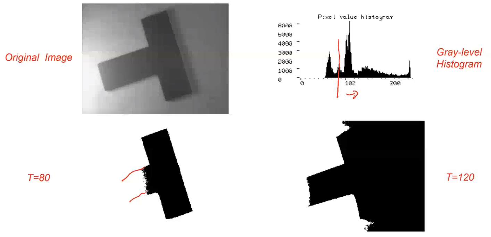
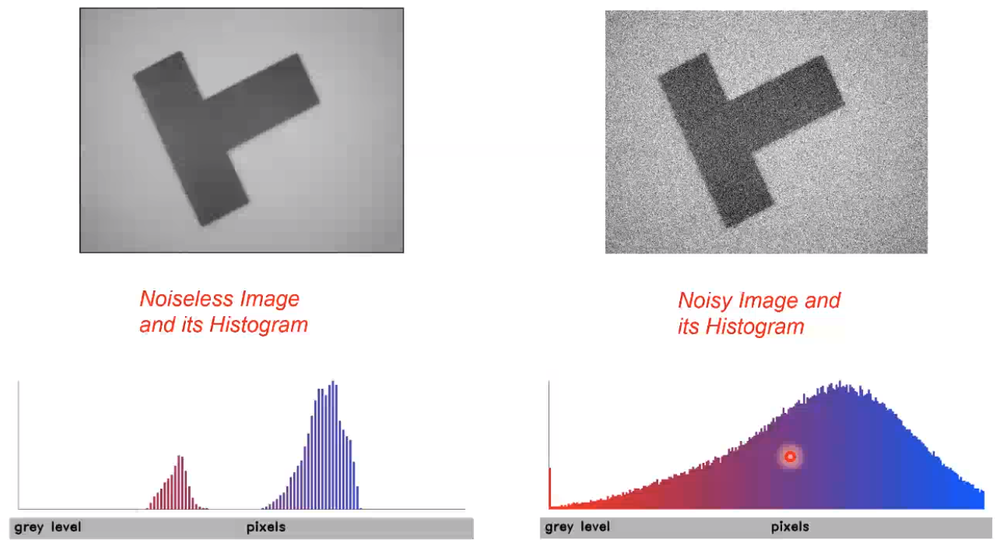
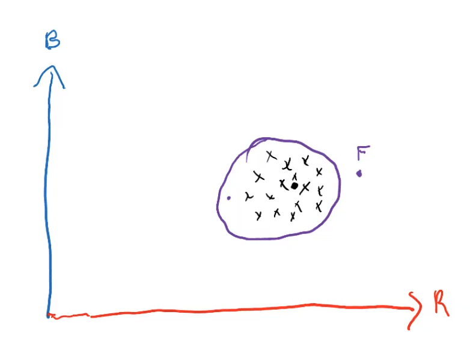
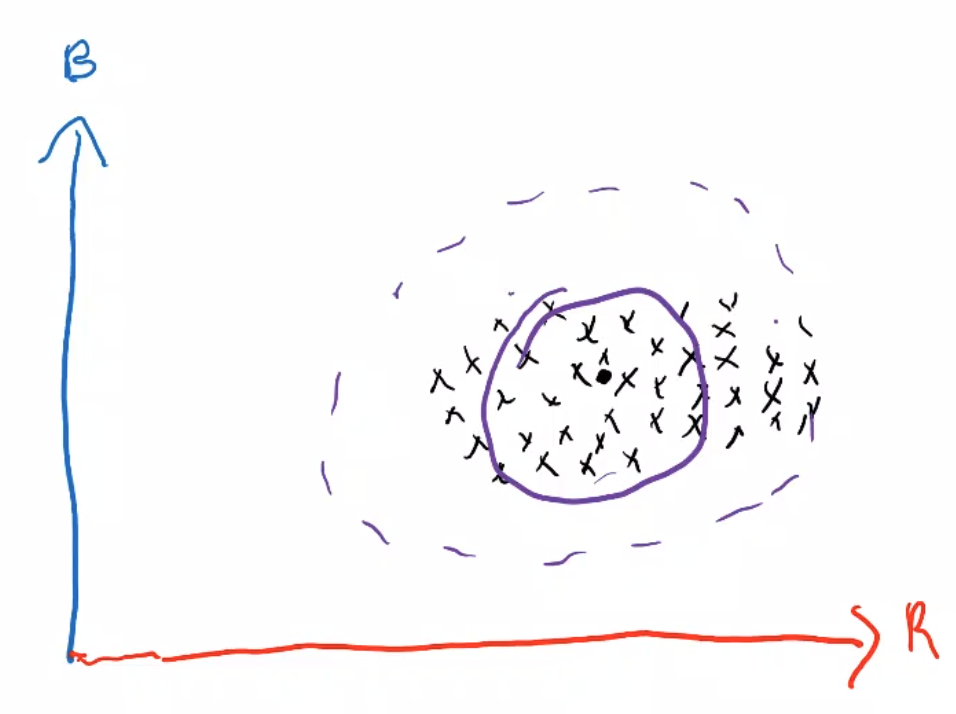

# Image segmentation

Image segmentation is about splitting an image in two disjoint regions having some semantics meanings. Typically, we'll want to split the image into *background* and *foreground*. This is usually achieved in two steps: the first being the *binarization* (labelling a pixel to the foreground and background), then, if the foreground contains different objects, we'll want to tell them apart.

One way of performing this is just thresholding the intensities.

Denoted as , a vector-valued function encoding a set of image properties, the goal of segmentation is to partition the image into disjoint homogeneous regions according to .

Typically, a good segmentation should preserve spatial proximity (i.e. two nearby pixels must belong to the same region unless they exhibit significantly different  values). In many CV tasks, segmentation brings in key semantic knowledge in th scene. 

In many cases, we work with *inherently binary images*, meaning that clearly, in the given image, there's two regions, one being dark and one being clear. 

The first step is to just perform this **binarization**.

Inherently binary images exhibit a clearly bimodal gray-level histogram, with two well-separated peals corresponding to foreground and background pixels. Therefore, binarization can be achieved straightforwardly by means of a thresholding operator deploying a suitably chosen threshold:

How do we pick the threshold? We simply can look at the histogram.

Whenever the histogram is not clearly bimodal (e.g. due to illumination varying), binarization by threshold obviously fails.

Sometimes it happens that the non-perfect bimodality is caused by noise, leading to the two modes *overlapping*. A smoothing to the image might solve that:

Due to our knowledge of the *unimodality* of the histogram being caused by noise, we shall apply a denoising filter!

In many practical applications stability over time of the lighting conditions cannot be guaranteed: we'll need an approach in which **no manual intervention is needed**, rather every image will first be analyzed by a suitable algorithm in charge of finding the right threshold for **that given image only**. This addresses well the issue of temporally varying lighting. Spatial variations will need other techniques, while temporal variations are solvable like this.

How do we compute these? There are multiple approaches, and we can start by simple heuristic approaches like:

-  (mean), working as long as pixels are equally distributed between the two classes. Every pixel below the mean will be considered as dark, every pixel above it will be light. Note that if we have much more dark/light pixels than the other, this won't work, as the mean will be biased towards the more common one! We could choose a percentile instead of the mean, but we have to get knowledge on the distribution;

- the **peaks method**, picking the value halfways between the two peaks (*local maxima*) in the histogram. The thing is: are there really gonna be two peaks? We suppose that the histogram is bimodal, if it is not, we can't use this method! Otherwise, forget about this approach. , which requires finding the two peaks, which often implies smoothing the histogram before looking for peaks to avoid the search being trapped into spurious local maxima

- **Otsu's algorithm**, which is an effective automatic threshold selection algorithm. The concept here is (and it is the case for most algorithm) finding the optimal threshold, which means optimal wrt some criterion. We'll perform an optimization of a function (or maximization of a reward). In this algorithm, we choose the threshold that minimize the *within-group variance* of the resulting regions, which basically states how homogeneous the region intensities turn out to be. To mathematically formalize this, we'll need some notation:

  - We'll define  as the set of gray levels in the image,  the number of pixels in the image,  entry of the image histogram and  the probability.

  - The mean  and variance  of the  associated to the gray levels can be expressed as  and . The  is the expectation, while the variance is the expectation of the square error wrt the mean.

  - We can now define the *within-group variances* generated in the binarization. Any threshold value  . If we want to compute the variance, we'll first want to compute the mean  and . How can we compute that, for example wrt the first class? We'll want to compute the pixels with intensity below the chosen threshold:  . Note tehat we shall not divide by  but by , i.e. the number of pixels in class 1 and not the whole of them. Now, if we multiply and divide by , we get  which is ! We can then rewrite this as  What's this last fraction? Let's define it as , being the fraction of pixels in class 1. Now, if I remember what  is, i.e. . Because of this definition, we finally get , , and  with .

  - In case we want to find the variances, we can go over the same steps, with the only difference being the function on which we are computing the expectation which is now .

    Recapping:

  ​		with 

​    

  - Now, we can find the *within-group variance*, which is the **weighted sum** of the two variances: . If this is small, it means that the classes are homogeneous! The search space is 1D, which makes it easy, but it could make sense to make this a little faster. This is obtained by sum algebraic manipulations turning this minimzation problem into an easier maximisation problem. Minimization of the within-group variance requires computing the means and the variances. By deploying a property of this parameter, i.e. its relation with the whole image's variance, we can cast this problem into a more efficient one.

  - We already introduced the whole image's variance, i.e. the expectation of the square error on the mean. Now, we can split this sum into two terms, being the sum up to  and the sum from  to . But then, what we'll do is, rather than considering , we can subtract and add  and do the same with , obtaining , allowing us to rewrite the expression of the whole image's variance as a sum of these. 

  - 

  - Now, we expand the binomials, do some math tricks I don't want to copy and get 

  - 

  - So, now we get , and we know that maximizing the between group variance minimizes the withing-group variance

  Finally:

  where  being the between-group variance, which is maximized. 

  So, as  is independent of , the above relation suggests we might wish to maximize the between-group variance rather than minimizing the within-group one, since we don't need to compute variances in the first one. Further computational savings can be achieved, getting to:

  ## Adaptive thresholding

  When the lighting isn't uniform, a spatially varying threshold should be adopted. Tipically, adaptive methods compute a specific threshold at each image pixel, based on the intensities within a small neighbourhood. However, too small a neighbourhood might lack either background or foreground pixels, which sould imply segmentation errors unless the issue is dealt with explicitly. For the sake of efficiency, we tipically adopt simple operators on each pixel, like the mean or the median. 

  ### Color-based segmentation

  This is another frequent technique. We don't tend to use color that much in CV (often it does not bring additional information wrt the additional cost). Sometimes we can segmentize object from the background basing on the color: we know the object and the background have a very different color. It is often the case that the user would be allowed to control the color of the background, choosing one that is different from the one in the foreground, like blue or green (the infamous *green screen*). For example, in the food industry, it is quite usual to use blue conveyor belts, since food is unlikely to be blue. We can denote the pixel intensity as a matrix in RGB:  .

  Then, segmentation can be achieved by computing and thresholding the distance between the pixel's colour and the reference background colour .

  How can we **estimate the reference colour**? This is tipically done by taking some training images, then estimating it, for example by taking pixels, then taking their mean:

We consider a threshold of color, then whatever color appears in the circle is part of the background, whatever is out of it is not.

It may happen that there's more variation along one axis or the other (i.e. the circle has to be *kind of oval*).

In such a case, the error we end up with is pretty high. 

To create a *oval* threshold, we can use a slightly more complex approach, based into taking into account not only the mean, but also next order statistics, the *covariance* (not the variance because we have a multivariate random vector).

Another kind of distance (different from this *Euclidean distance*) is frequently used. *We'll discover that in the next episode.*

## Mahalanobis distance

A far richer probabilistic characterization of the colour distribution among the foreground pixels can be obtained by estimating the covariance too:

In this way, we capture the correlation between channels too. The covariance matrix is symmetric. To go from the plain euclidean distance, we add the inverse of , the covariance matrix:

### Understanding the difference between Euclidean and Mahalanobis

To understand the difference between the two distances, let's for now assume that the convariance matrix is diagonal (this isn't true, actually). This means that the data are not correlated. Computing the inverse of this is easy:

Therefore, we can multiply the last two terms of the distance  getting .

Finally, we get:

  Contrary to the euclidean distance, the Mahalanobis distance weighs the differences along the components of the random vector differently. In particular, they are weighted according to the inverse proportionality to the learned variances. 

Now, which region of the RGB space determines the segmentation? 

This interpretation is of general validity! Indeed, the convariance matrix can always be diagonalized by a rotation of the coordinate axes. Thus, in the new coordinate system, it is a weighted sum of the contribution along the new axes, with weights being inversely proportional to the variances along the new axes. This is due to the *EigenValue Decomposition* (EVD) of any real and symmetric matrix:

Now, there's always a transformation which turns the covariance into a diagonal matrix. This is a rotation to matrix . So if we start with the initial data (color pixel), rotate them (in the color space) according to  we get what we want. 

