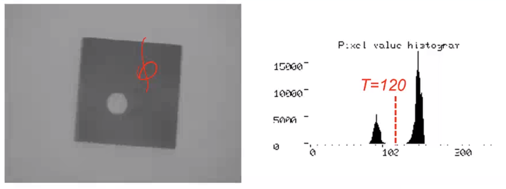

# Image segmentation

Denoted as $P(x,y)$, a vector-valued function encoding a set of image properties, teh goal of segmentation is to partition the image into disjoint homogeneous regions according to $P$.

Typically, a good segmentation should preserve spatial proximity (i.e. two nearby pixels must belong to the same region unless they exhibit significantly different $P$ values). In maany CV tasks, segmentation brings in key semantic knowledge in th scene. 

In many cases, we work with *inherently binary images*, meaning that clearly, in the given image, there's two regions, one being dark and one being clear. 

The first step is to just perform this **binarization**.

Inherently binary images exhibit a clearly bimodal gray-level histogram, with two well-separated peals corresponding to foreground and background pixels. Therefore, binarization can be achieved straightforwardly by means of a thresholding operator deploying a suitably chosen threshold:

How do we pick the threshold? We simply can look at the histogram.

