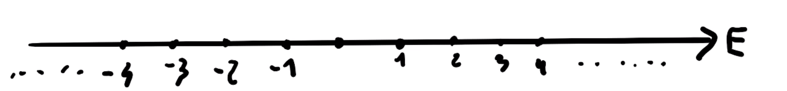
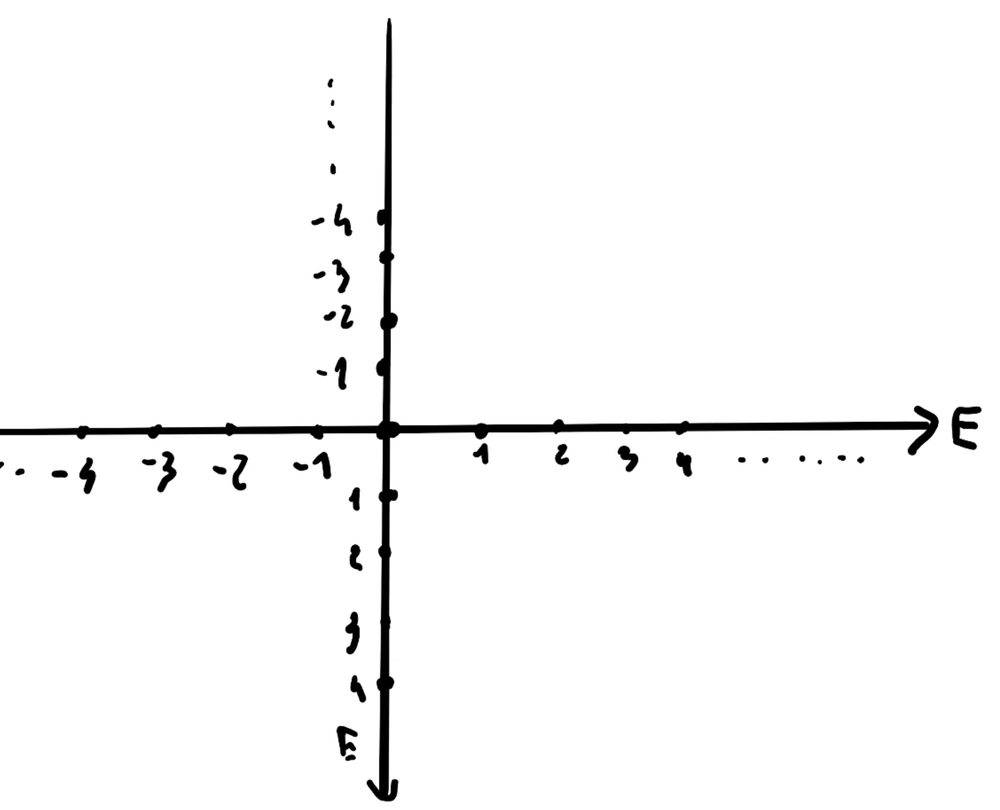
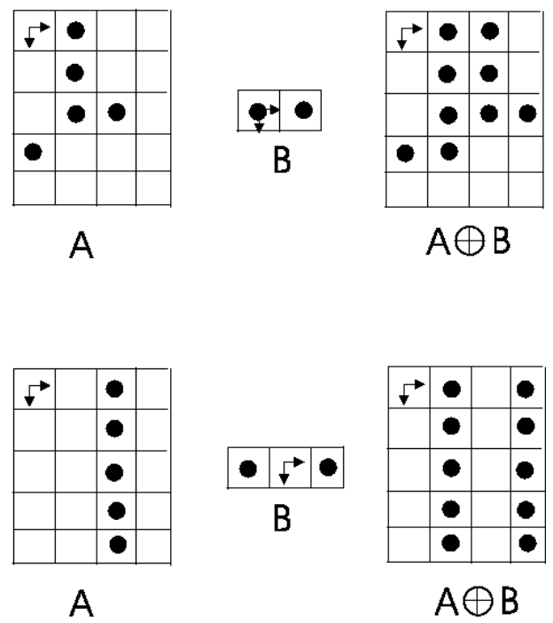

# Binary morphology

Binary morphology is more than *cleaning the binarization*. These are simple and effective tools to improve and analyse binary images, in particular those achieved by foreground/background segmentation. You can apply similar operators to grayscale images too. 

Formally, it is a **set of operators** that may correct, improve and perform analysis on binarized images. The language of mathematical morphology is the language of **set operators**, i.e. operators defined on sets, which process *one set by another set*. Obviously, one set will be the image and the other one a kernel. All these sets are indeed subsets of the **cartesian product of the set of integers per itself**: $E^2$, obtained by the cartesian product $E\times E$ with $E$ being the set of integers. 

Given the set $E$ of integers:

we take the Cartesian product, obtaining:

Now, $A$ will be the set of foreground pixels, and $A^C$ the set of background pixels. The binary morphology operators manipulate either $A$ or $A^C$ through a second set $B\subset E^2$, structuring the elements, which will process $A$ or its complement $A^C$. Being a subset of $E^2$, $B$ is a set of points in $E^2$.

## Dilation (Minkowski sum)

The **dilation** is defined as follows:
$$
A \oplus B=\left\{c \in E^{2}: c=a+b, \quad a \in A \quad \mathrm{e} \quad b \in B\right\}
$$

## Erosion

The **erosion** is defined as follows:
$$
A \ominus B=\left\{c \in E^{2}: c+b \in A, \forall b \in B\right\}
$$
It can be expressed in terms of translations of the structuring element:
$$
A\ominus B = \left\{c\in E^2: B_c \subseteq A\right\}
$$
It involves subtraction of the elements of one set from those of the other:
$$
A \ominus B=\left\{c \in E^{2}: \forall b \in B \quad \exists a \in A: c=a-b\right\}
$$
It is not commutative, associative only if the structuring element can be decomposed in terms of dilations, anti-extensive (i.e. the eroded set is contained into the original one) if the structuring element includes the origin, and it is an increasing transformation: $A \subseteq C \Rightarrow A \ominus B \subseteq C \ominus B$.

Contours may be used to extract contours, followed by a subtraction. 

Dilation and erosion have a great duality. In fact, given $\breve{B}$, $\breve{B}=\{\breve{b}: \breve{b}=-b, b \in B\}$, it can be shown that 
$$
\begin{array}{l}
(A \oplus B)^{c}=A^{c} \ominus \breve{B} \\
(A \ominus B)^{c}=A^{c} \oplus \breve{B}
\end{array}
$$
and if $B$ is symmetric ($\breve{B}=B$), we can say that:
$$
\begin{array}{l}
(A \oplus B)^{c}=A^{c} \ominus B \\
(A \ominus B)^{c}=A^{c} \oplus B
\end{array}
$$
Erosion and dilation by the same structuring element can be chained to selectively remove from either the foregrund or background, parts that do not match the structuring element *without causing any distortion to the other parts.*

## Opening and closing

Opening might be considered as a small erosion, while closing might be considered as a small dilation.

So, **opening** is just an erosion followed by a dilation on the same structuring element. So, we can now reason about trying to give an intuitive interpretation of the morphology operator. If we look at the original set and the open set, we can note that we've obtained B, translated at a certain position: **it's kind of just a translation of $B$ at a certain position**. It's a union of translations of the structuring element: **we cancel all of the pieces which do not match perfectly the structuring element**!

**Closing** is just a dilation followed by an erosion. 

We can now derive the already known interpretations for dilation (union of the translations of the strcturing element) and erosion (union of the positions at which we can translate the structuring element, added to the original one). 

We firstly have to discuss an important property: unlike erosion and dilation, opening and closing are **idempotent**. If we apply them again, we get the same result. 

We can derive the interpretation in terms of translations, dealing with dilation and erosion and knowing how we can interpret them in terms of translations of the structuring element. Let's now consider the latter operation for opening, i.e. the dilation. How can we write it in terms of translation of the structuring element? We know that it is the union of the translations of the structuring element, but where? It's the union of the tranlsation of \B at each point beloning to $A$ erosion $B$. But now, if point $y$ does belong to $A$ erosion $B$, what can we say about $B_y$, the translation $B$ of the structuring element at point $y$? A point belongs to an erosion if we can translate the structuring element and have it fully contained in the initial set. A point $y$ does belong to $A$ erosion $B$ if when we translate it, it belongs to $A$. So this $B_y$ enjoys the property of having to be contained into $A$. 

We can say that opening is given by the union of all those translations of the structuring element, such that those translations are fully contained inside $A$. 
$$
A \circ B = (A \ominus B) \oplus B = \bigcup_{y \in A \ominus B} B_y = \bigcup_{B_{u} \subset A} B_{y}
$$
The duality between erosion and dilation might intuitively infer a duality between opening and clsoing. Duality means that dilation of the background may be thought of as erosion of the foreground, and viceversa.

