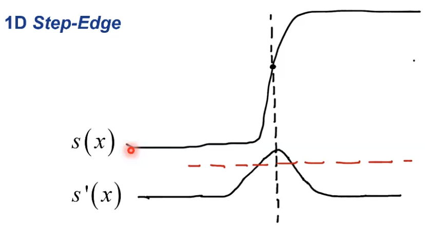
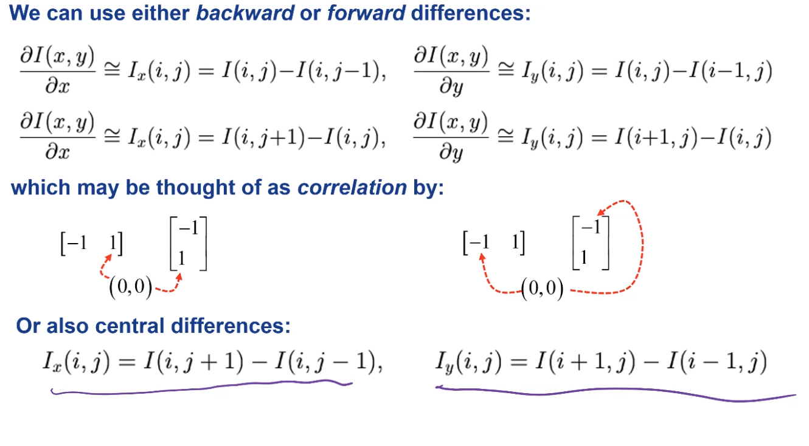
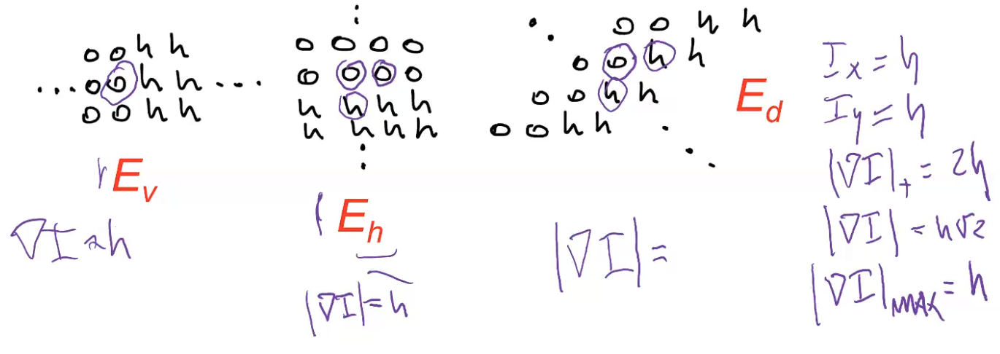
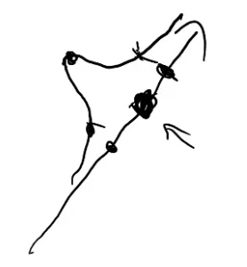
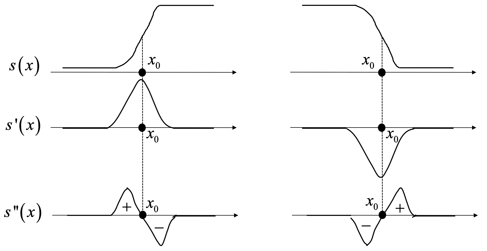
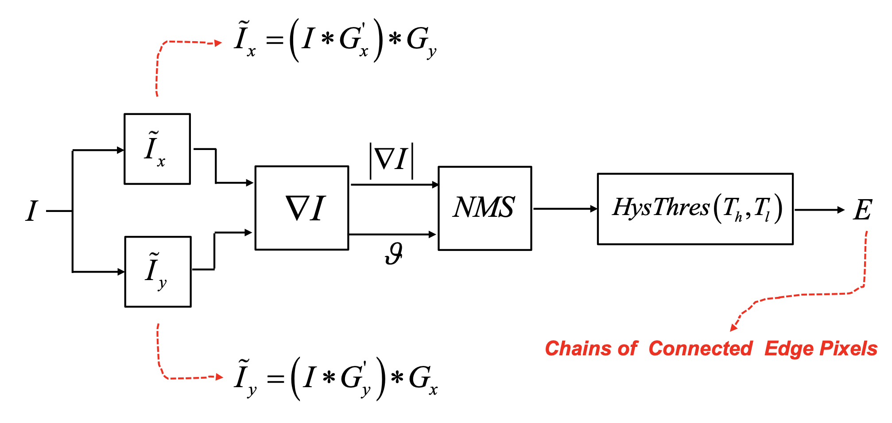

# Edge Detection

Edges (or contour points) are features that we can extract from an image (typically grayscale), important because they contain relevant semantic informations for the image. Previously, we talked about *region/blob features*. From now on, we'll be concerned with features which are *spatial points* extracted directly from the image. It's a different use of the same term. 

Edges are used in many downstream CV tasks, like background/foreground segmentation, template matching, stereo matching, visual tracking... Basically, edge detection is the key to **measurement tools**. 

There's no *mathematical definition*, but basically edge pixels are the ones lying between regions of different intensities. You don't find edges in uniform regions! They are inbetween different regions, separating them.

An edge detection algorithm will start with the picture, and will output an *edge map*, another image in which edge pixels are labeled. 

We'll start with a 1D model. A 1D step edge is just a sharp change of a 1D signal:

Now, if we compute its derivative, we get that it shows where the signal changes! We can therefore transform the signal into its derivative, and classify as edges all pixels in which the derivative is at a high level: we know that in the edge it will be high. We can just set a threshold and classify the derivative!

So, what we have understood is just that edges deal with signal changes, i.e. they are points in which the signal fastly changes. A high derivative means **edge**.

Now, we can make this 2D. The only difference is that in 1D an edge is defined by its *strength*, i.e. how fast it changes, while in 2D its **direction** is also relevant! A step could happen in any direction: maybe a vertical edge, an horizontal one, a diagonal...

If there's a point in which the derivative is high enough, that is an edge! We have to compute those in all the dimensions, though. We can compute the *directional derivatives*. If we compute the **gradient**, we get a vector containing the horizontal and vertical derivatives. 

Now, we can design our algorithm. We compute the magnitude of the gradient (i.e. its norm) $|\nabla I(x, y)|=\sqrt{\left(I_{x}\right)^{2}+\left(I_{y}\right)^{2}}$ and compare it with a threshold! We then can get the angle through basic vector math:
$$
\left\{\begin{array}{l}
\vartheta \in\left[-\frac{\pi}{2}, \frac{\pi}{2}\right]=\operatorname{atan}\left(\frac{I_{y}}{I_{x}}\right) \\
\vartheta \in[0,2 \pi]=\operatorname{atan} 2\left(I_{x}, I_{y}\right)
\end{array}\right.
$$
To approximate the gradient and simplify the thing, we can either compute the **backward** or **forward** **differences**. We could also compute central differences.

We can even approximathe the magnitude! 
$$
|\nabla I|=\sqrt{\left(I_{x}\right)^{2}+\left(I_{y}\right)^{2}} \quad|\nabla I|_{+}=\left|I_{x}\right|+\left|I_{y}\right| \quad|\nabla I|_{\max }=\max \left(\left|I_{x}\right|,\left|I_{y}\right|\right)
$$
The third approximation is faster and more invariant wrt edge direction. In fact, diagonal edges may confuse the first two methods:

Now, we have to **deal with noise**: edges may not be *sharp*. Taking derivatives of noisey signals is *an ill-posed problem*.

So, we can smooth the signal before computing the derivatives. Unfortunately, edges get smoothed too! The derivative of these edges is much weaker, then. 

How do we compute these *smoothed derivatives*? We could smooth and derivate in a single step: this is achieved by computing differences of averages (rather than averaging the image and then compute differences).

It all boils down to a correlation with the kernel $\frac{1}{3}\left[\begin{array}{ll}
-1 & 1 \\
-1 & 1 \\
-1 & 1
\end{array}\right]$ for the horizontal, while $\frac{1}{3}\left[\begin{array}{ccc}
-1 & -1 & -1 \\
1 & 1 & 1
\end{array}\right]$ for the vertical.

We may use central differences instead of forward ones, using the same approach. We compute an horizontal smoothed derivative of a difference between two vertical differences, using the kernels:
$$
\frac{1}{3}\left[\begin{array}{lll}
-1 & 0 & 1 \\
-1 & 0 & 1 \\
-1 & 0 & 1
\end{array}\right] \hspace{40px}\frac{1}{3}\left[\begin{array}{ccc}
-1 & -1 & -1 \\
0 & 0 & 0 \\
1 & 1 & 1
\end{array}\right]
$$
This is known as **Prewitt Operator**.

The central pixel could be weighted more to **improve isotropy**: 
$$
\frac{1}{4}\left[\begin{array}{lll}
-1 & 0 & 1 \\
-2 & 0 & 2 \\
-1 & 0 & 1
\end{array}\right] \hspace{40px}\frac{1}{4}\left[\begin{array}{ccc}
-1 & -2 & -1 \\
0 & 0 & 0 \\
1 & 2 & 1
\end{array}\right]
$$
This is known as **Sobel operator**.

Just for the sake of completeness, the *Frei-Chen operator* is the best with respect to isotropy, using kernels:
$$
\tilde{I}_{x}=\left[\begin{array}{ccc}
-1 & 0 & 1 \\
-\sqrt{2} & 0 & \sqrt{2} \\
-1 & 0 & 1
\end{array}\right] \quad \tilde{I}_{y}=\left[\begin{array}{ccc}
-1 & -\sqrt{2} & -1 \\
0 & 0 & 0 \\
1 & \sqrt{2} & 1
\end{array}\right]
$$
It's less used though, since it is a floating point kernel: this makes computation kinda difficult.

Now, a question: are we really satisfied with the idea of thresholding the gradient magnitude? Probably not that much: assume we use a not sufficiently high threshold, we miss edges, but if we use a lower one we may get too much! The aim is getting just one pixel associated with the edge: choosing the right threshold ain't absolutely easy. The threshold depends on the location in the image too! **There are weak and strong edges in a same image!** 

A better approach would be **finding the local maxima** of the absolute value of the derivative.

The process of looking for the maxima of the absolute value of the derivative along the gradient direction is called **Non Maxima Suppression**. Beware: it must be performed on the right axis! Direction matters. Since we don't know the direction of edges in advance, we'll locally perform a NMS based on the direction of the gradient at the point under examination. 

At the end, *if I have a pixel*, the gradient points in a direction, if this is an edge it must have a high derivative along that direction:

So, how do we perform this NMS correctly? There's two approaches. To perform NMS at a pixel P, the magnitude of the gradient has to be estimated at points that don't bleong to the pixel grid.

The other one is, assume A and B are not on the discrete grid of pixels. Because A,B and P are not in the pixel grid, we can't compute the gradient. So how can we assess that the magnitude is higher than a threshold, if we haven't computed it? A way to proceed might be estimating the gradient wrt to the gradient of the closest pixel in the grid. We'll estimate the gradient at $A$ by a linear interpolation by the gradient of the two pixels near $A$, and the same for $B$. Once we estimated that, we could perform our calculations.

The overall flow chart of an edge detector based on smooth derivatives and NMS is the following:

Once NMS has been performed, we end up with an edge map. Still, it's standard practice to apply another tresholding, pruning the output on the magnitude on the gradient, which however is only applied to the pixels that *survived* NMS.

To localize edges, we could also search for *0-crossings* of the second derivative, stating a maximum of the derivative. 

Tranposing this technique to 2 dimensional spaces, we should look for zero-crossing of the second derivative *along the gradient's direction*.

How do we take the derivative along a direction? Using the gradient, we can project it along the given direction. This means that we should compute the gradient, dot product by the unit vector of the direction we're considering. We could even use the *Hessian*, leading us to the same result.

We could rely on the Laplacian as second order differential operator:
$$
\nabla^{2} I(x, y)=\frac{\partial^{2} I(x, y)}{\partial x^{2}}+\frac{\partial^{2} I(x, y)}{\partial y^{2}}=I_{x x}+I_{y y}
$$
Using forward and backward differences, we can approximate, respectively, first and second order derivatives. 
$$
I_{x x} \cong I_{x}(i, j)-I_{x}(i, j-1)=I(i, j-1)-2 I(i, j)+I(i, j+1)
$$
And we can do the same for the derivative along y,finally getting the kernel:
$$
\nabla^{2}=\left[\begin{array}{ccc}
0 & 1 & 0 \\
1 & -4 & 1 \\
0 & 1 & 0
\end{array}\right]
$$
Now, to detect edges we would correlate the image with this kernel, and having done that we'll look for 0-crossings in the image. The thing is, noise is still an issue. Therefore, we should filter the image, using a **Gaussian Filter**. The algorithm is in fact called **Laplacian of Gaussian** (LOG). We denoise through a gaussian, then apply the Laplacian, i.e. perform a differentiation and search for 0-crossings. 

This edge detector allow us to choose the degree of smoothing (by changing $\sigma$). This *choosability of $\sigma$* reminds us the concept of image analysis. A certain $\sigma$ will filter out details, and leave just the scale we want. So, the LOG is also a tool used in multi-scale image analysis.

0-crossings are found by scanning the image by both rows and columns to identify changes of the LOG sign. Once a sign change is found, the edge may be localized in the positive region, the negative region, or where the absolute value of the LOG is smaller. This is the best choice, since it turns out closer to the 0-crossing.

Sometimes, one wants to loclaize edges with *subpixel accuracy*, i.e. with a resolution higher than a filter. In case of a LOG filter, this can be achieved quite straightforwardly: assuming we have a sign change, rather than localizing the edge exactly at the negative Laplacian, one could also perform a linear interpolation and find exactly the point which would allow to localize the edge between the two pixels.

To actually compute the LOG, we can exploit some properties of convolutions; this would be the computation to perform:
$$
\nabla^{2} \tilde{I}(x, y)=\nabla^{2}(I(x, y) * G(x, y))=I(x, y) * \nabla^{2} G(x, y)
$$
We know that differentiation commutes with convolution, so we could perform convolution with the laplacian of the gaussian, which are both convolutions. We can take the second derivative of the gaussian along x and y, and add them up. We get a circularly simmetric function, shaped like a reversed mexican hat. Because of that, it is called a *Mexican Hat Filter*. If we want to compute one single step LOG, we could perform this simple filter. This is an early approach, more frequently we'll use another one. This first approach could really grow large. There have been studies chasing the right mexican hat size.

The most famous among these studies says that we should choose a size in-between $3\omega$ and $4\omega$:
$$
3 \omega \leq d \leq 4 \omega, \quad \omega=2 \sqrt{2} \cdot \sigma
$$
We'd do better if we deployed an already-discussed property, **separability**, i.e. a way to perform gaussian smoothing faster, by a chain of 1D convolutions. Complexity of this boils down from quadratic to linear. We could apply this to the LOG. We have the mexican hat, but rather than using it as a 2D function, we remember that it is the product between a 1D gaussian along x and a 1D gaussian along y: $G(x,y) = G(x)G(y)$. Now, if we have to take its second derivative wrt the horizontal independent variable x, we could just differentiate $G(x)$ and not $G(y)$. 
$$
I(x, y) * \nabla^{2} G(x, y)=I(x, y) *\left(G^{\prime \prime}(x) G(y)+G^{\prime \prime}(y) G(x)\right)
$$

So, how do we use that? We could apply one of the convolution properties we have studied, i.e. the distributivity wrt the sum. The convolution of the sum, is the sum of the convolutions.
$$
=I(x, y) *\left(G^{\prime \prime}(x) G(y)\right)+I(x, y) *\left(G^{\prime \prime}(y) G(x)\right) \\
$$
Finally, rather than a large mexican hat, we'll compute the LOG through four 1D convolutions:
$$
=\left(I(x, y) * G^{\prime \prime}(x)\right) * G(y)+\left(I(x, y) * G^{\prime \prime}(y)\right) * G(x)
$$
rather than one 2D convolution. Complexity becomes $4d$ instead of $d^2$.

## Canny's Edge detector

The idea is defining formally what an optimal edge detector should behave, referring to 3 criteria:

- **Good detection**: the filter should correctly extract edges in noisy images;
- **Good localization**: the distance between the found edge and the real edge should be minimum;
- **One Response to One Edge**: the filter should detect one single edge pixel at each edge.

For the 1D case, we can p;rove thaqt the optimal edge detection is a first order Gaussian derivative. This result can prove the optimality of the Gaussian smoothing filter too.

To translate this into 2D, we should look for local extrema of the directional derivative (Gaussian).

Leveraging on the separability of the Gaussian, we can fasten things up, taking the derivative of the horizontal/vertical Gaussians separately. In practive, the derivative along x is $\tilde{I}_{x}(x, y)=I(x, y) *\left(G^{\prime}(x) G(y)\right)=\left(I(x, y) * G^{\prime}(x)\right) * G(y)$ and along y $\tilde{I}_{y}(x, y)=I(x, y) *\left(G^{\prime}(y) G(x)\right)=\left(I(x, y) * G^{\prime}(y)\right) * G(x)$.

NMS is often followed by thresholding of the gradient magnitude to help distinguish between real edges and unwanted ones. However, we could incur in *edge streaking*, i.e. that we don't get the full edge.

Considering 3 thresholds, we pick up the strong ones and check their neighbourhood for lower threshold edges: if there's a *gray* edge adjacent to a black one, it will probably be a real edge. As a consequence, since you're *growing* edges starting from the strong ones, tipically you don't get just an edge map, but a more advanced (informative) datas tructure, which is a list of edge chains (i.e. a list of pixels in which each element is a chain of connected edges). This means we won't have to label them: all pixels belonging to a chain will be a single edge.

So, the whole flowchart is: we compute smooth derivatives by Gaussian filtering, then, because we have the partial derivatives, we have the gradient and compute its magnitude and orientation, then go through NMS. Finally, we can do hysteresis thresholding.

Canny's edge detection is the most widely used nowadays. 