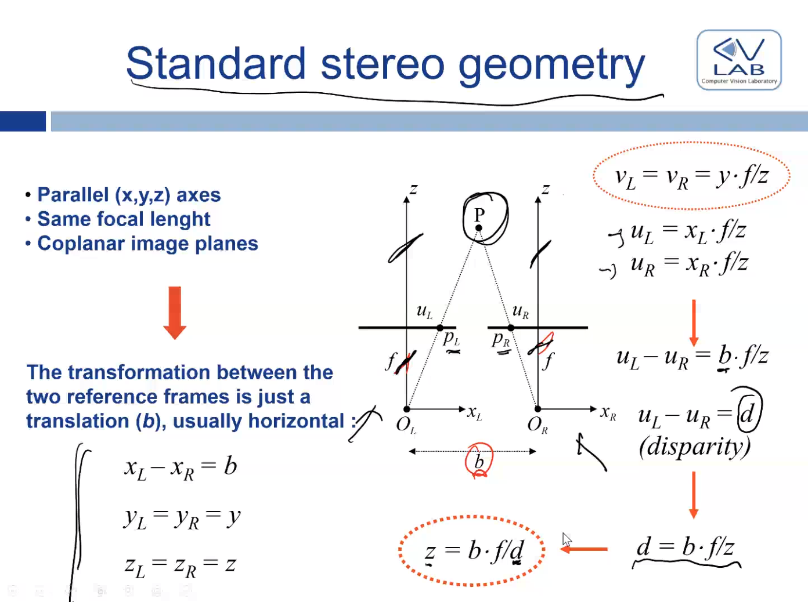
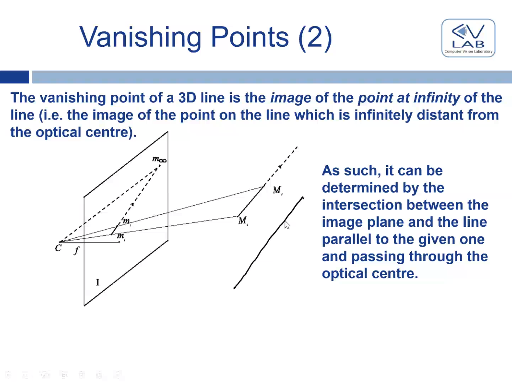
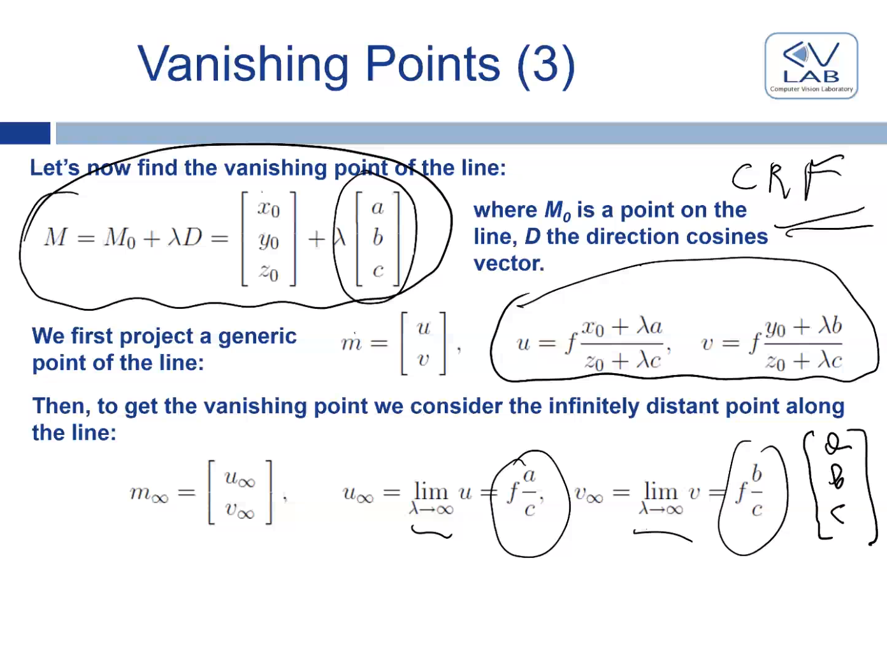

# Lesson 2, Image formation and acquisition

## Introduction

What we do in computer vision is we extrapolate infos from images. So, computer vision solves a different problem from computer graphics. To do that right, we have to understand the **image acquisition process**, in which we go from a real world scene to an image.

There's many aspects: one may be the **geometric relationship** between scene points and image points, one may concern the **radiometric relationship** between the scene and the image, and the last one being the **image digitalization** process.

First, we need to find a device to capture the image with. The simplest device is called a *pinhole camera*, just a hole in a box that reflects an image in a box. If we take a light ray emitted from a point in the scene, this ray will pass through the hole and hit the **photosensitive** material on the plane, therefore creating an image. Just as this one, every point will emit light in different directions, but because of the small size of the hole, just one ray will be able to pass the hole: the image is forged just by drawing straight rays from the points to the pinhole.

Obviously, **nobody uses these.** Nonetheless, these devices model the image formation that happens in more sophisticated devices: modern cameras' mechanisms are tremendously similar to this. 

## Perspective projection

We should now define the mathematical model behind this. This kind of geometric model is known as ***perspective projection***.

We should obviously define a **mapping** between the scene points and the corresponding image points! This mapping will be in the form of equations, composed by coordinates, regarding the two reference systems, a 3D one (the real world one), and a 2d one (the image plane). These two systems merge in the pinhole, the **optical center**. The 3D reference system  is named **camera reference system**. The 2D  one is called **image reference system**. 

Now, how can we find this relationship? Let's first consider the plane where x and u are.

Pay attention to the **minus**: this means that the image will be **inverted**!

To avoid the problems an inversion causes, we can imagine the image plane as lying in front rather than behind the optical center.

This proves an important fact: **image coordinates are a scaled version of the scene ones!** Thus, knowing a point's position in the real world, we can find its position in the image.

It is obvious that we'll lose some informations: we're in fact mapping a **3D space to a 2D one**. Indeed, the mapping is not a bijection: a given scene point is mapped into a unique image point, but the opposite isn't true. Thus, recovering the 3D structure from a 2D image is an ill-posed problem (the solution is not unique), we can only position the point on a line (corresponding to the dimension we lost).

This takes us to **stereo images**: having two images from differents POVs, we can infer the 3D coordinates!

Using **triangulation**, we therefore intersect the projection rays and associate them with the corresponding points in two cameras looking at the same scene.

### Standard stereo geometry

The two cameras are now just horizontally placed with a distance b. Therefore, they have the same focal length and coplanar image planes. The axis are parallel.

Therefore, the transformation between the two reference frames is just **a translation**, usually **horizontal**.

The reason why  is that we build the camera around this constraint: this simplifies things a lot.  is the same as ,  as . This way, a given 3D point will be seen at the **same height** in the image, the same vertical coordinates. 

So,  and  are equal, but  and  aren't, and we can use that difference to infer the third dimension we're seeking!

This quantity  is called **disparity**. We finally get the fundamental equation: depth is proportional to disparity.  

Now, knowing the disparity, we can obtain  thanks to the fact that corresponding points have the same . Thus, the search space is a line, it's one-dimensional. 

Now, how can we find a single correspondence? One problem could be that maybe you have a point you see in one camera and not the other one. We can therefore group similar pixels to find correspondences between the two images: we *slide* an image onto the other, and find the best match in the positioning of the pixels.

### Epipolar geometry

If you know the focal length and the relative position between the two cameras (**rotation, translation**) you can compute the **epipolar geometry.** Just knowing the **relative position** between the two cameras and the focal length! The search space of the stereo correspondence is always 1-dimensional, but being the lines oblique you can compute the **epipolar line** corresponding to the point. All the epipolar lines in an image meet at a point called epipoint. Given any two images taken under an arbitrary relationship, we can warp the images as if they were acquired through a standard geometry by computing and applying to both a transformation known as ***rectification.***

One might decide not to go into this complications implied by epipolar geometry, and go for standard geometry; but in practice, we can never get rid of rectification: it is almost impossible to perfectly align the two cameras!

### Some properties of perspective projection

- The farther objects are from the camera, the smaller they appear. For instance, a 3d line segment of length  lying in a plane parallel to the image at distance  from the optical center will have a length given by 
- Perspective projection maps 3D lines into image lines
- Rations of lengths are not preserved (**distortion**) unless we are in a planar, parallel to the image plane.

### Vanishing points

The **vanishing point** of a 3D line is the image of the point at infinity of the line, i.e. the image of the point on the line which is infinitely distant from the optical center. 

 

All parallel 3D lines will therefore share the same vanishing point, i.e. they meet at their vanishing point in the image, but at infinity (the 3D lines are parallel to the image plane).

To find the vanishing point of a line, we're gonna use the parametric equation of the line, where  is the equation,  is a point,  is the cosine of the angle between the line and the axis of the reference system (three-dimensional vector for each axis).

 

Now, how can we find the vanishing point? We first project a generic point of the line, to get it at infinity we have to set lambda to infinity! In fact, the larger the lambda, the more you move along the line. So, rather than projecting an ordinary point, if we take the limit with lambda going to infinity of the point equations, we get  and .

