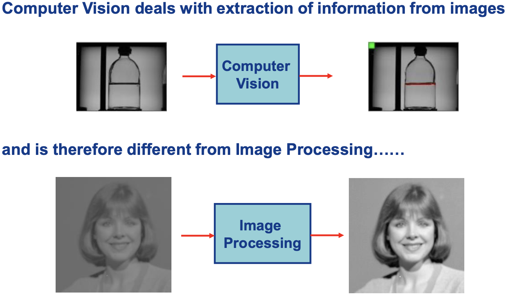
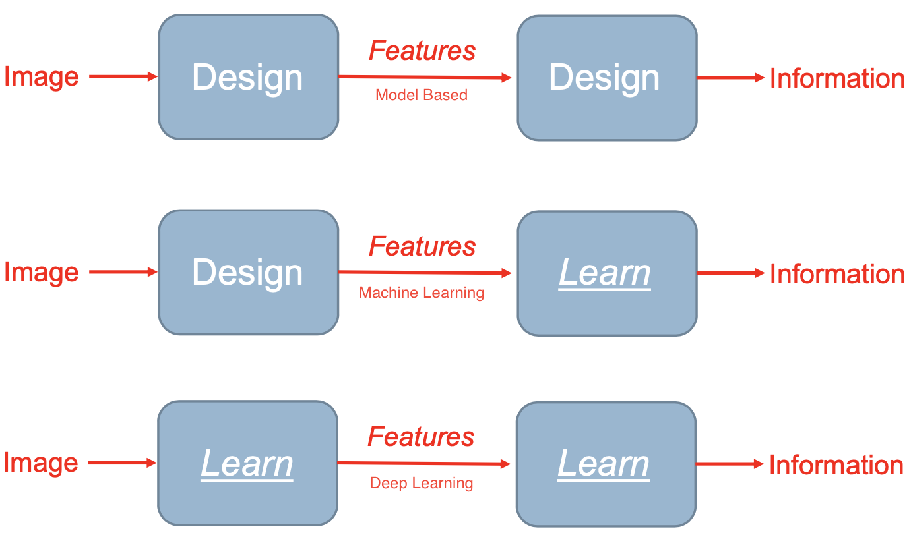

# Image processing and computer vision - prof. Luigi Di Stefano

* LAB + lesson
* Programming in Python with OpenCV
* Exam for other: couple of questions about the project, couple of questions about the theoretical part
* Exam for AI: you don't have to do a project, you can skip labs. Just an oral exam about the theory. If you want to do a project the oral will be about the project too (50/50); you can even attend the lab and do the curriculum project (3cfu) 

## What is computer vision?

So, **what is the difference between image processing and computer vision?** In the second one, we try to **extrapolate informations from the image**, the knowledge we need to get out of that image. For example, in industrial applications, computer vision could help in recognizing broken bottles.

Image processing is instead concerned with getting images in input, and images in output. Pixels to pixels. 

Sometimes, the two sciences **intersect**: for example, we might need to process the image to make it better, then analyzing in with computer vision!

One may ask: why the heck should I study this? CV might work by miming the brain, to understand images and get meaning out of pixels, to create robots...

Computer vision started around 1965 at the MIT, and quickly evolved in industrial and scientific applications. 

One example of successful project of the past is a master thesis of **broken tiles detection** for a factory in Modena, to separate broken tiles on the transport belts.

### Computer vision as process technology

Tipically, we talk about machine vision, which is tipically referred as computer vision systems in factories (industrial applications). What kind of machine vision systems can we find in the market today? We obviously go from cheap and simple to advanced systems.

* **Vision sensors**: cameras with a processor, preprogrammed to do a simple task. They behave like a *sensor*.
* **Smart cameras**: cameras with embedded computational intelligence, where the user can write programs and configurate parameters.
* **PC-based CV systems**: a *dumb* camera connected to a computer. Processing isn't done by the camera but by the computer.
* **Application specific vision systems**: systems designed for a specific application, either widespread throughout the industry or used in a particular sector.

### Deep learning

Why is it **deep**? Basically, you have a neural network which learns from raw data: it learns the features, as well as the classifier. You don't have to specify the features, it learns them. It is different from machine learning because of this: in ML you design the features.

