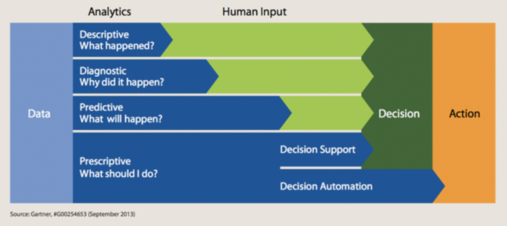
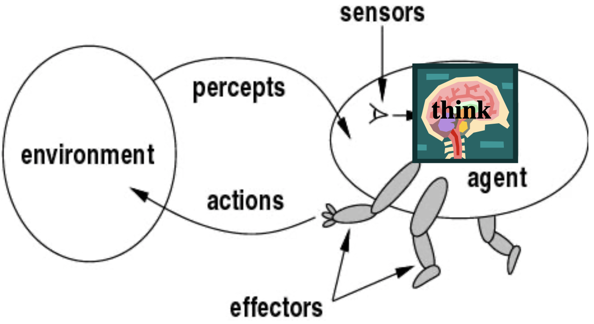

# Artificial intelligence - applications

## Knowledge based systems

Knowledge based systems are kind of easy: they are designed together with **domain experts**, based on some symbolic knowledge. Of course, in this case, the **bottleneck** is knowledge acquisition. 

The real problem is the time needed to extract the knowledge. We have, in general, 4 levels of decision support: descriptive (*what happened?*), diagnostic (*why did it happen?*), predictive (*what will happen*), prescriptive (*what should I do?*). The further, the lesser human intervention is needed. 

### Descriptive analytics

Human intervention is largely needed. If, for example, we wanted to model a productive process and we have some environmental constraints (e.g. water consumption), then you can simply describe data and learn from these, describing the components of the process components.

### Diagnostic analytics

E.g. we want to build a system to analyse data from a plant and realize a diagnostic system. 

### Predictive analytics

This one uses data to **predict future system evolutions**. For example, it could simulate the future evolutions basing on some actions. It tries to forecast future values of the temporal series, and could usee ML classification and regression. So if you had just a predictive analytics system, and wanted to take a decision, you have to perform a *what if analysis*: i.e. *what if I take this decision?*

These systems can also be done though machine learning, regression, simulations...

### Prescriptive analytics

These are able to optimize, solve problems, solve logic and therefore reach decisions where we need to select an optimal scenario.

###Spread

If we analyse the penetration of these analytics across all industries, we go from **99%** (descriptive), 30% (diagnostic), 13% (predictive), to **3%** on prescriptive analytics.

The **application domains** are endless: industry, public sector, global challenges....

## Applications

### Chess challenge

In 1997 Deep Blue beat Kasparov, a grandmaster at chess.

It used the **minmax** algorithm, which is kind of a brute force, designed to define the optimal strategy for one player and suggesting the best move by trying all of the possible moves recursively: this means a combinatorial explosion.

### AlphaGo

This was built by DeepMind, then bought by Google in 2016, it learns to play videogames better than humans. In march 2016 it beat Lee Sedol, world champion of Go, a game way more complex than chess ($10^{170}$ instead of $10^{50}$ )

### Jeopardy

Jeopardy is a quiz where you have possible answers and participants have to decide the most appropriate question for that answer. **Watson**, a super computer developed by IBM, won against Ken Jennings, famous for the record of 74 consecutive victories, and Brad Rutter. The knowledge in Watson has been built from texts, encyclopaedias and the web. Watson is large like 10 fridges. The idea is that intelligence is a mixture of knowledge and representation!

## Computer vision

Computer vision is a research field that's been investigated from the very beginning: if a computer can understand what it sees, it can do *extraordinary* things. 

But before deep learning, CV was basically done this way: you had an image, you tried to **extract** the relevant objects then tried to classify these objects. It was a bit stuck: you could not really achieve human-comparable performances. By using Deep Learning techinques (classifying the content in a set of concepts), the classification error got down **from 26% to 3%**. Humans are less efficient, floating around 5%. 

The problem with DNN is that they can sometimes make **big mistakes**: some modifications in few pixels could make a persian cat a toaster! 😿

They work great in a known and stable world, but we could have problems when working on **new data** that's far from the training data. They are **hardly explainable**, they do not distinguish between **casualty and correlation** (Civil engineers/Mozzarella cheese), and they are **not trustworthy**. 

## Robotics

We have now considered just the *think* part, but there's a lot of things happening when actions are taken!

In 1997, a contest (**Robocup**) was started in Japan with the goal of creating a soccer team within 2050, able to play against and beat the world champion team. 