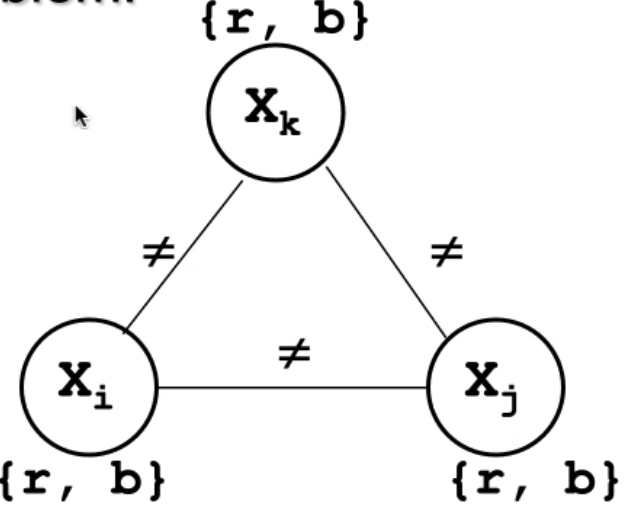

# Constraint satisfaction

In many AI problems we can find **constraints**: you have to take **decisions**, decide values for variables which are subject to constraints. We want to find the state of the problem that is compatible with all the constraints. 

For example, in the *Eight Queens Problem*, we have a **chessboard** on which we put 8 queens, which can move on the row, on the column and on the 2 diagonals. There are 92 possible solutions. You can generalise this problem to a $n\times n$ chessboard. For $n>3$ there always is a solution. So, we could already solve this with a **search**. We have to describe a **state**, starting from the root of the tree with an empty chessboard, then put 1 queen for each level. When we have placed 8 queens, we are there. 

The description of the state can be done in two ways, the first one being a 0/1 in case of non-queen/queen. With this, we can write the constraints. 

The second one might just be saving 8 variables containing the $x$ for the queen in the row: we can't assign two queens on a single row. This last thing is a constraint too.

So, we have **two types of constraints**: unary and binary. What do constraints do, generally? They force the assignments of variables to be **linked through a relation**. So, every assignment that I do to my variables is not free, rather it should satisfy these constraints. The first **unary** constraint we meet is the domain, i.e. $1 \le x_i \le 8$. Then, the **binary** constraints involve **two variables**. 

We could consider **scheduling** as a constraint problem, where the variables are the starting time of activities, and domains the possible starting times. Activities can be ordered: $Start_1+d_1 < Start_2$.

**Map coloring** too could be *constrainized*: we have to color a map and we have that two contiguous regions have to be different. So, how can you model this state? 

A **Constraint Satisfaction Problem** is defined on a finite set of variables, i.e. the decisions we have to take, the domains of the possible values, and a set of constraints. A constraint between k variable is a subset of the cartesian product of the domains, specifying which values are compatible with each other. The subset must not be explcitly defined but is represented in terms of relations. The solution is achieved through assignments.

The assignment is complete when all the variables are assigned to a feasible value.

Using constraints in search trees can reduce their complexity. Before instantiating and then failing, we could **prune** the search tree using constraints, to remove **portions** of the search space that are guaranteed to lead to a failure: we **prevent failures** rather than recovering.

This eliminates subtrees that lead to a failure, limiting unnnecessary backtracking.

Given a CSP, we have two approaches: **propagation algorithms** and **consistency techniques**. The first ones have traditionally been used during the search: while searching we propagate these constraints. Consistency techniques have instead been proposed for reaching properties. 

The available **a posteriori** algorithms are the **Generate and Test** (GT) and **Standard Backtracking.**

The **propagation algorithms** we'll see are **Forward Checking** and **Look Ahead**, where we constraint then generate.

## Tree search

We are exploring a search tree, where the initial state is the empty assignment ,and assign a variable at each level of the tree.

## A posteriori algorithms

### Generate and test

The **Generate and Test** is a very simple algorithm, trying to assign a random configuration to the variables in one shot, then check if it is ok. By using permutation, we are not discarding all the constraints, one remains: the variables are all different!

### Standard Backtracking

This is the search we have seen so far. Instead of assigning all the variables, we assign one at a time and check if the lastly assigned is compatible with the constraints. For the eight queens problems, this would have been a huge improvement from GT.

# Propagation algorithms

A pitfall of SB is that it uses constraints a posteriori, i.e. after the instantiation. Exploiting constraints involving free variables would detect this situation in advance. The idea begind a priori propagation algorihms is an **active use of the constraints** during search, **pruning** the tree. At every step we use the constraints actively, by removing values that are incompatible with the already done assignments. These values are stored in domains.

### Forward checking

At every assignment of a variable $x_i$, it **propagates** all the contraints involving $x_i$. It removes from the domain of other variables, the values which are incompatible with $x_i$: you don't have to *try*, they have been removed (their whole search tree was removed). This is very effective.

### Look Ahead

Look Ahead, besides checking the constraints with the current instantiated variable, also checks the **non-assigned variables**. Checking the existence, in the domains associated with non-assigned variables, of values that are compatible with...

This is a further step for propagating the constraints. We have two variants, **partial** and **full**. They all perform a forward checking step (I check the constraint between the assigned and the future), then **it checks for constraints between two unassigned variables!**

The **partial** one goes forward, from lower indices to higher indices. For every value in the domain of the variable we're checking, it checks if the other variable's values are compatible. 

In the **full** one, the check is performed in the two directions: from the start of the non-instantiated variables list, to the end. In the partial, we only checked forward,now we're checking forward/backward.

## Recap

We are still working in a tree search. We consider a depth-first search, assigning a variable at a time. So, at each step we either find a solution, discover a failure, or assign another variable. 

The search heuristic we'll use is crucial to explore the most promising branches. So, here we have the same problem. The order in which we select variables/values does not affect the completeness, but the efficiency. The degree of freedom, in propagation algorithms is you don't propagate anything, or you propagate through FC or LA.

## Search Heuristics

What the user has to do is deciding the order in which variables and values are selected (we therefore have two degrees of freedom). These can reallyinfluence the time needed to find a solution. So, heuristics are classified into two big groups: the ones **selecting the value**, and the ones **selecting the variable**.

There's a very simple criteria we can follow to choose the **variables**: choose the most difficult variables first. If we have a variable with a narrow domain, meaning less choices, we'll assign them first. 

For the **values**, we choose those that are less likely to be inconsistent. There's no general principle: we'll need domain knowledge. 

### Classification of heuristics

We can divide these into **static** and **dynamic**: the first one determine variable and value order **before starting the search**. This order remain unchanged during the search. 

**Dynamic** heuristics, instead, select the next variable at each step of labeling (i.e. the prcoess of assigning a value to a variable). We therefore do not have an assigned order before starting the search. 

Clearly, the latter are better. Usually we select *dynamic heuristics for variables*, and *static for values*. The computation of the perfect heuristic has the **same complexity of the original problem**. We therefore have to find a tradeoff.

# Consistency techniques

These have been originally proposed **not as algorithms to be performed during search**, but on the **original problem**. We can of course apply these during search, but they have storically been proposed as techinques on the initial problem. The idea is that we work on the original problem, and we remove values that are **not consistent in any solution**, starting from a notion of the *constraint graph*.

So, assigned to every constraint problem we have a **constraint graph**, where each node is a variable and each arc is a constraint, connecting two nodes for binary constraint, auto-connecting a node for unary.

We have different consistency levels. The first is called **node-consistency** (level 1):

*A node of a graph is consistent if for each value $x_i \in D_i$ the unary constraints are satisfied.*

For example, one of these could be a constraint like *this node can't be equal to 7*.

Then we can move to a higher level, **arc consistency**, being applied to every arc involving **two variables**. This arc $a(i,j)$ is consistent if for each value $x\in D_i$ there exists at least a value $y \in D_j$ such that the constriant is satisfied. $y$ is called **support** for $i$. We are now sure that if we remove a value, it will not appear in any solution. Notice that arc consistency is an **iterative procedure**, i.e. it continues as long as there are inconsistencies. The end is reached when we have no more inconsistencies, or we end up with an empty domain (i.e. the problem has no solutions).

**Mackworth** presented the **AC3 algorithm**, taking a CSP as input and returning the CSP with reduce domains. We have a queue of arcs, starting from the whole list of arcs, and we remove one at a time and for every arc we prune its variables domain. If I do so, I have to re-insert in the queue all of the arcs including the variables I have just pruned: deleting a value here might fail another constraint we already considered as done.

Now, having done that, what about the values that are still there? Are they all a valid solution? **No.** **All values removed by arc-consistencies are not part of any solution, but the remaining values are not necessarily part of a consistent solution!**

We then have to search!

We need a third level: **path consistency**.We can say that a path between the nodes $(i,j,k)$ is path consistent iff we have consistent values.

So, clearly we could also express a more general level of consistency: **k-consistency**. We could in fact have consistency levels up to $n$. K consistency checks every $k-1$ tuple of values against the constraints. 

Achieving k-consistency for a n-variable CSP, with $k<n$ does still not assure consistency. We have to reach $n$-consistency. Of course making this network n-consistent has the same complexity of solving the orginal problem. Generally, r-consistency is applied at each level of the search tree, and it is predetermined in every algorithm. In practice, constraint solvers are smarter than simply applying the n-consistency. 

A key feature for constraint solvers are **global constraints** (n-ary constraints), embedding a filtering algorithm. To achieve n-consistency, you have to face exponential complexity. 

The exercises are two types: provided the network, searching a solution applying propagation and heuristic, and given a simple problem description we have to formulate the constraints for the problem and possibly solve them.

