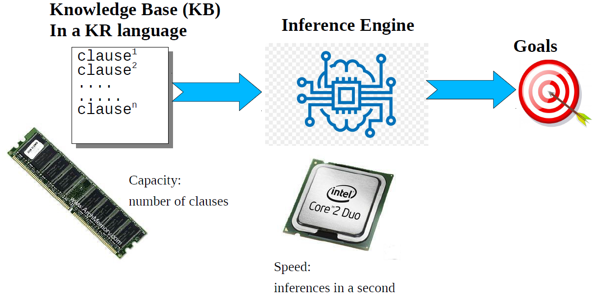
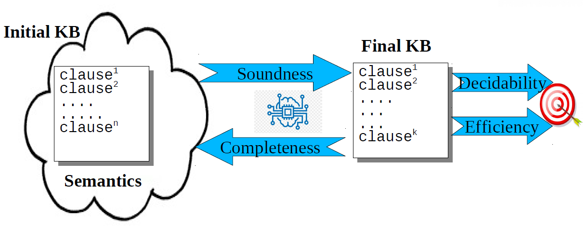

# Knowledge Representation

- Declarative Knowledge: describes knowledge without specifying any algorithm to solve a problem related to it. There are many ways to represent it, such as functional notation or logic languages like Prolog.
- Imperative Knowledge: describes an algorithm to solve a problem. Usually it is represented with high-level programming languages.

We will study how to build a mechanical process that exploits declarative knowledge the same result obtained by imperative knowledge.

**Knowledge Representation (KR)** is the area of Artificial Intelligence (AI) concerned with how (declarative) knowledge can be represented symbolically and manipulated in an automated way by reasoning programs.

## Knowledge Representation Languages

**KR Languages** are formal languages designed for representing (declarative) knowledge.

A **knowledge base (KB)** is a set of clauses representing the encoding of knowledge relevant for a given problem or domain.

A KR language has:
- **Syntax**: how the clauses are written.
- **Semantics**: the meaning of clauses. Semantics can be formal or informal (intended meaning) and associated to a notion of truth.
- **Expressive power**: ability to represent knowledge as comprehensibly as possible.

**AI Languages** such as Lisp (functional) and Prolog (logic) share these features:
- The presence of an interactive interpreter, so they are particularly useful for exploratory programming;
- They are dynamic languages having garbage collection and an absolute flexibility;
- They support symbols/terms as first class objects, so they are particularly suitable for symbolic programming;
- They support equivalence between programs and data: the functionalities of these languages can be easily extended writing meta-interpreters.

In this module we will study **Lisp**. This is an example of lisp notation:
```lisp
(defun factorial(n)
    (if (<= n 1)
        1
        (* n (factorial (- n 1)))))

;(factorial(3))
```
The reason for all these parenthesis is that you can look a list of data, whatever is inside a pair of parenthesis is a list of elements.

## The reasoning process

An **inference engine** (engine) is a program that takes as input a KB in a given KR language and performs a reasoning process.



A reasoning process can be:
- **Monotonic** when anything that could be concluded before an inference can still be concluded after the inference.
- **Non monotonic** if some conclusions can be invalidated after an inference.

Main properties of inference engines:
- **Soundness**: clauses generated in the reasoning process are semantically true.
- **Completeness**: all the clauses semantically true can be generated in the reasoning process.
- **Decidability**: the reasoning process always terminate with success or failure.
- **Efficiency**: the reasoning process is tractable.



There is a tradeoff between the expressiveness of the representation language and the computational tractability of the associated reasoning task.

Knowledge Representation Systems can be classified in two classes:
- **Logic Based KR systems** (studied in this module): exploits logic formalisms for Knowledge representation.
- **Hybrid KR systems** (studied in [module 3](../Fundamentals%20of%20AI%20-%20Module%203/README.md) and [module 4](../Fundamentals%20of%20AI%20-%20Module%204/README.md)): support complex reasoning mixing several inference engines. They may include components based on logic but the whole system cannot be easily modelled.
