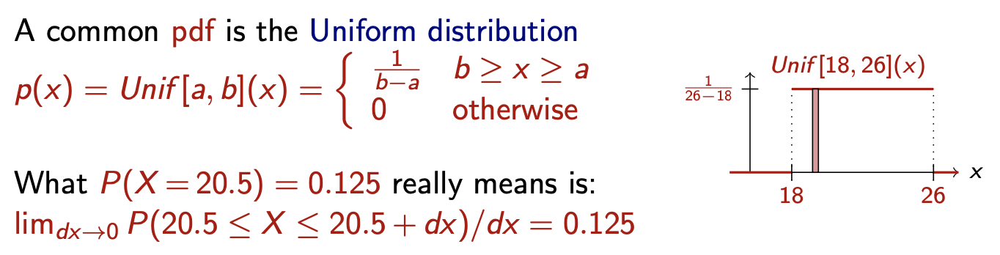
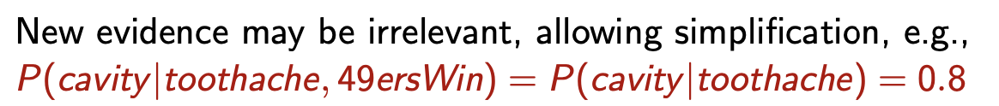
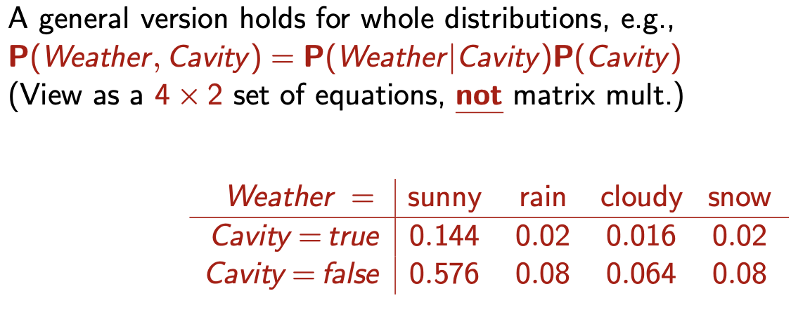
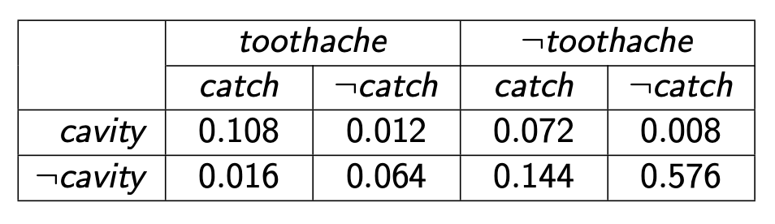

# Introduction

This module is about uncertainty and probabilistic reasoning. We cannot observe everything in the world, something will be hidden, non determinable, etc.
We need to be able to model this uncertainty.
When we make decisions we must keep a belief state and generate a contingency plan.
This module is composed by 10 hours of lecture in 5 lectures.

### Topics
- Basic probability notation: Probabilistic notations already studied in Statistical and Matematical Methods, Logical connectives
- Inference using full joint distributions: Take decisions basing on the modeled world
- Independence: Construct complex models of the world in an abstract way (more compact than probabilistic notation)
- Bayesian network representation: Another way of mdeling the world
- Constructing Bayesian networks
- Exact and approximate inference: Thought process based on baesyan networks 
- Simple case studies

### Material
- Slides on Virtuale
- The same of FAIKR mod 1 (Russel, Norvig, "Artificial Intelligence. A modern Approach"), chapters 13 & 14
- ipython notebooks on Virtuale

### Exams
Grades on an 8-point scale (to be summed with mod 2 and 4 and averaged with mod 1). Grades don't expire.

Two alterantives:
- Written exam
  - Questions and exercises, 4 dates a year (jun, jul, sep, jan)
  - slide 5 contains example case studies similar to questions in the exam
  - If you don't like your grade you can repeat it
- Project
  - Implementation of simple case study in pgmpy or other library
  - ipython notebook + good notebook comments or pdf report
  - Oral exam to present work done and answer questions (3 discussion periods in jun+jul, sep and jan+feb)
  - Can be done alone or in groups u to 3 people
  - You should give the project exam when you are ready to make it one-shot, you shouldn't get in a situation where you don't like your grade

## Uncertainty

Modeling an uncertain world with standard logical notations will lead either to false statements, conclusions that are too weak for decision making (for example full of conditionals).
Two methods for handling uncertainty:
- Default or nonmonotonic logic
  - Make reasonable assumptions and model the world with these assumptions ("Assume my car does not have a flat tire...")
  - Hardly usable for very complex scenarios
  - "Monotonic" = Will not take away conclusions if you add facts, the more facts you have, the more conclusions you have. "Nonmonotonic" => You can use facts which reduce conclusions.
- Rule-based systems with fudge factors
  - Introduce operators with quantified probability

Remark: Fuzzy logic handles degree of truth, NOT uncertainty.

### Probability
Probabilistic assertions summarize uncertainty. Probabilities relate propositions to one's own state of knowledge and aren't claims of a "probabilistic tendency" in the current situation.

Decision theory: In order to make decisions under uncertainty you need a way to model the uncertainty ("Probability theory") and a set of preferences basing on which you can obtain an "utility function" which quantifies how much I like a certain outcome ("Utility theory").

For example suppose  means that leaving home  minutes before the flight starts will mean I don't lose the flight. Suppose , , , leaving home 1440 minutes before will mean that we are almost certain not to lose the flight but we will havo to sleep in the airport, how desirable is that? We have to strike a balance.

### Basic probability notation
Consider the assertions about possible worlds.
**Logical assertions** say which worlds are ruled out.
**Probabilistic assertions** say how probable they are.

The set of all possible worlds is called the **sample space**, denoted .

Any subset  is an **event**.

Any element  is called a **sample point**/**possible world**/**atomic event**.

A **probability space** or **probability model** is a sample space with an
assignment  for every  such that  and .

A **random variable** is a function from sample points to some range, (e.g. reals or Booleans).

P induces a **probability distribution** for any random variable : 

A probabilistic **proposition** can be described as thedisjunction of events where a logic proposition of is true.

The syntax of propositions varies basing on the type of random variable. Some examples:
- **Propositional** or **Boolean** random variables: *Cavity=true*
- **Discrete** random variables (finite or infinite): Weather sunny,rain,cloudy, *Weather=rain*
- **Continuous** random variables (bounded or unbounded): *Temp=21,6*; *Temp<22,0*

The **Joint Probability Distribution** for a set of random variables gives the probability of every atomic event on those variables (i.e., every sample point).

This is easy when we have a world modeled by 2 RVs, but real applications are obviously more complicated than that. 

For example, we can have RVs with **continuous values**. Imagine we have got the temperature RV (between 10 and 20 deg.), the value of this temperature can be described by some distribution, like the **uniform distribution**:

or the **Gaussian (Normal) Distribution**.

These distributions differ in the probabilities given to discrete RVs. 

The probability for a discrete value is always between 0 and 1, and the sum of distributions must be 1. In the case of continuous values, we can't sum them! Therefore, we **integrate** obtaining the PDF:

So, one reason for things to get complicated are continuous values. Another one, is the fact that IRL you don't have 2 values but many of them! The number of events grows exponentially ().

We'll need something that gives us as much information as a joint probability distribution, but **more compact**! 

In the examples seen so far, we considered probabilities that we can call **prior**. Most commonly, we know something about the world, and we're in a position to betterm estimate the probability of events: for example, we may state the probability of the weather being sunny, given that it's 30 outside.

The **conditional probability** (aka *posterior*) tells us the probability of an event, given another one:

Note that *tootache* is **all we know**! If the dentist collected evidence for *tootache **and** cavity*, the probability of cavity becomes 100%. The less specific belief is still true, but it is not always useful. It may happen that new evidence is still irrelevant to the problem: this happens when the RVs are **independent**. We can use this notion of independence to *reduce our scope* to a more restricted set of RVs.

We can also write expressions that denote conditional probabilities in a more compact way by using **capital letters**: when something starts with a capital, it is true.

We're now talking about a distribution, not an event, and we have a bold **P**, denoting the whole distribution, *the whole table*. 

Conditional probability can be formally defined using this formula:

It basically is the ratio between the joint probability of  and , over the probability of .

The probabilities **chain rule** says that the joint probability of the probabilities , is the product of the probabilities  and ,  which can be further expanded: we'll repeat this until we have the probabilities of one single value, given everything else.

We'll see this formulation many times.

## Inference using full joint distributions

We'll now try to extract informations from full joint distributions. 

Starting from the joint distribution we see here, with binary RVs having probabilities, we think of a proposition as all the atomic events in which the proposition is true. We can compute the probability of  by summing the probability of the events in which  is true.

With  *tootache*:

We could even consider  *tootache or cavity*:

and also conditional probabilities

This is called **inference by enumeration**: we enumerate all the events and calculate probabilities. This is possible for small problems only, otherwise it becomes pretty complicated.

Let's think about this last expression for a while: we have the probability of not having cavity given a tootache. We don't consider this as the probability itself, but as the way of getting to the distribution .

We now have the Random Variable , which represents the distribution. This is simply a compact way of expressing the probabilities  and . It's a **vector**!

From the point of the distribution, we get that the denominator is just a normalization constant over the distribution: it's always gonna get normalized to the same values!

So another, even more compact way of expressing this is:

with  being a normalization constant we don't care about. Let's say in the end we get 2 values in our vector, and they don't sum to 1: we normalize it to make it so, and we're done!

When we're summing over a row or column, we are **marginalizing** or **summing out**: .

When we're considering evidence (a conditional probability, then), we're performing **reduction**, since we're considering the possible worlds that agree with the evidence: .

This is general what we can tell from the specific example. A **probability query** is something in the form *the probability distribution of some RV given some evidence*. There is one or more query variables, and one or more evidence variables. In order to answer this query, we consider the other variables (the hidden variables  that don't appear in the expression), and in order to compute the probability of  given the evidence, we apply the expression we've seen earlier, and in order to compute the joint probability of Y given the E evidence, we sum over the hidden variables (for all the values), and end up with the distribution.

This is **inference by enumeration**: we enumerate the possible worlds, and we sum the values. If there are not many, we can do that. This method has some obvious problems, two having to do with the **complexity** (time and space), the last one being how do we find the numbers for  entries. We'll need a more compact method. That's what we're going to see next.

