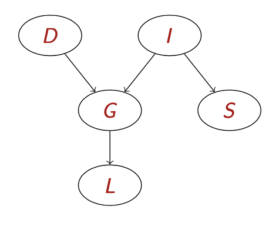

# Bayesian network representation

## Independence

Independence is related to what we've already seen. If we consider our model of the world with 4 independent variables, imagine that *cavity, tootache* and *catch* are binary RVs, and *Weather* is a discrete variable with 4 values. 

However, if we consider that the weather is independent from the *tooth situation*, we can separate these two worlds, and the distribution can be expressed with <!-- $2*2*2 + 4 = 12$ -->  values, instead of <!-- $2*2*2*4 = 32$ --> .

We get from 32 values to 12, only thanks to the observation that these are independent.

How do we denote **independence**? We use <!-- $\mathbf{P} \models(A \perp B)$ -->  to say that <!-- $A$ -->  is independent to <!-- $B$ --> . How can this be a property of the distribution? We can say that the probability of <!-- $P(A|B)=P(A)$ -->  or <!-- $P(B|A)=P(B)$ --> . A last way of saying this is <!-- $P(A,B)=P(A)P(B)$ --> .

Independence is a property of the way we model the world, but it is reflected in the distributions!

This type of independence (**marginal**) is very convenient but it is pretty rare: it is difficult to find separate values in the same domain.

Given that we have a cavity, the probe will catch. This happens even if we also have a tootache, or we don't. So if you already know that you have a cavity, whether you have a tootache or not, the probability of catch is the same:

<!-- $$
P(\text { catch } \mid \text { toothache, cavity })=P(\text { catch } \mid \text { cavity })
$$ --> 

How can I express this concept? This is **powerful**: we can forget about the tootache. We can express this by writing a simple conditional expression like the preceding formula. As we see, the independence is not absolute as before, but it is conditional:

<!-- $$
\mathbf{P} \models(\text { Catch } \perp \text { Toothache } \mid \text { Cavity })
$$ --> 

Therefore, if we gather the evidence, we can in exchange produce some independence expressions/relations that help us simplify the problem!

This idea is called **conditional independence**. Catch is conditionally independent of tootache given cavity, if the following holds: <!-- $\mathrm{P}(\text { Catch } \mid \text { Toothache, Cavity })=\mathrm{P}(\text { Catch } \mid \text { Cavity })$ --> , basically *tootache* is ininfluential.

Since the independence is symmetrical, we can write this in other ways, like saying *the probability of tootache fiven catch and cavity, is equal to the probability of tootache given cavity*:

<!-- $$
\mathrm{P}(\text { Toothache } \mid \text { Catch, Cavity })=\mathrm{P}(\text { Toothache } \mid \text { Cavity })
$$ --> 

The third formula uses the product: the joint probability of having tootache and catch, given cavity, is equal to the joint probability of the two distributions:

<!-- $$
\mathrm{P} \text { ( Toothache, Catch|Cavity) }=\mathrm{P} \text { ( Toothache|Cavity) } \mathrm{P} \text { ( Catch|Cavity) }
$$ --> 

These expressions are the same, the only change is that now we're having **conditionals**.

This is very important: imagine that we don't have 3 variables, but 100, the result of this possibility of *expressing conditional independence relations in our domain* will let us reduce the number of independent probability values that we must put in our system from an exponential number to, in the best case, a **linear number**.

Let's say we had 3 binary variables, where the combinations are 8 values, of which 7 are independent. Thanks to the conditional independence between tootache and catch, given cavity, we obtain an equivalent expression where the probabilities are equal to <!-- $\mathrm{P}(\text { Toothache } \mid \text { Cavity }) \mathrm{P}(\text { Catch } \mid \text { Cavity }) \mathrm{P}(\text { Cavity })$ --> .

So in total, we'll have 5 independent numbers instead of 7. This is a small gain in the example, but becomes big in real life.

## Bayes rule

This can be obtained thanks ot the product rule:

<!-- $$
P(a \wedge b)= P(a \mid b) P(b)=P(b \mid a) P(a)
$$ --> 

<!-- $$
P(a \mid b)=\frac{P(b \mid a) P(a)}{P(b)}
$$ --> 

This allows us to compute problems like the one that follows:

*1 individual in 50,000 suffers from meningitis, 1% from a stiff neck, 70% of the times meningitis causes a stiff neck. What is the probability that an individual with a stiff neck has meningitis?*

Now, lets's consider <!-- $\mathrm{P}(\text { Cavity } \mid \text { toothache } \wedge \text { catch })$ --> . If we also consider what we knew, i.e. that toothache is independent of catch, given cavity. Then, we can say that this can be expressed as the product of two probabilities:

<!-- $$
\begin{aligned}
&P(\text{Cavity}|\text{toothache} \wedge \text{catch} ) \\
=&\alpha \mathbf{P}( \text{toothache} \wedge \text{catch} \mid \text{Cavity} ) \mathbf{P}( \text{Cavity} ) \\
=&\alpha \mathbf{P}( \text{toothache} \mid \text{Cavity} ) \mathbf{P}( \text{catch} \mid \text{Cavity} ) \mathbf{P}( \text{Cavity} )
\end{aligned}
$$ --> 

We lastly hae to mention one classifier that we've already seen: the *Naive Bayes classifier*. These are quite efficient. This can be formalized as follows:

<!-- $$
\mathbf{P}\left(\text { Cause }, \text { Effect }_{1}, \ldots, \text { Effect }_{n}\right)=\mathbf{P}(\text { Cause }) \prod_{i} \mathbf{P}\left(\text { Effect }_{i} \mid \text { Cause }\right)
$$ --> 

Now, if we can make the independence assumption, the distribution can be expressed as a product of terms, where each term links an individual effect with a cause. 

## Bayesian networks

These are a way to represent knowledge. A very simple graphical notation that allows us to express conditional independence assertions in a graphical way. We find a directed **acyclic graph**. This is a bayesian network, and it allows us to capture direct consequences (tootache is a direct consequence of cavity), but another important information is what *is missing*: weather is disconnected from the rest, i.e. it is independent from the other ones.

To further build the network, we can add a *conditional probability table*, giving the distribution over <!-- $X_i$ -->  for each combination of parent values.

Note that we're not listing the *nots* in the tables: they're simply <!-- $1-P$ --> .

Let's give a look to another example: the *student network* (2nd book, not AIMA).

The interesting point here are the **reasoning patterns**. We can define various types of reasoning:

* **Causal**, we use it to make predictions;
* **Evidential**, used to produce explanations. We know nothing, and we want to *know whether George is a good recruit*. Imagine that he has a weak letter. Based on our evidence, is George a potential recruit? I.e. what is the probability of intelligence?
* **Intercausal**, allows us to infer reasons behind a conclusion, like *why did George score high?* 

### Compactness

A CPT for boolean <!-- $X_i$ -->  with <!-- $k$ -->  boolean parents has <!-- $2^k$ -->  rows for th combinations of parent values. Each row requires one number <!-- $p$ -->  for <!-- $X_i$ -->  true.

The number of parameters therefore grows linearly with the number of nodes, except for the full joint distribution, which grows exponentially.

Global semantics define, in practice, that the individual parent/child relations perfectly encode all the full joint probability distributions. In other words, <!-- $P\left(x_{1}, \ldots, x_{n}\right)$ --> , i.e. the full joint distribution probability is equal to <!-- $\prod_{i=1}^{n} P\left(x_{i} \mid \text { parents }\left(X_{i}\right)\right)$ --> .

For example, <!-- $P(j \wedge m \wedge a \wedge \neg b \wedge \neg e)=P(j|a)P(m|a)P(a|\neg b, \neg e)P(\neg b)P(\neg e)$ --> .

Now, we can illustrate how independence can be captured by a bayesian network through some examples: what is <!-- $L$ -->  independent of in the student network problem?

If we know the grade, then the letter is independent on anything else, since the letter only depends on ht grade. We can say that if G is in the evidence (i.e. given the grade), the leter is independent of anything else:

<!-- $$
P \models (L \perp D, I, S |G)
$$ --> 

If we still don't know anything, we can say that S is independent of D:

<!-- $$
\mathbf{P} \models(S \perp D)
$$ --> 

and we know that given I, <!-- $\mathbf{P} \models(S \perp G, D, L |I)$ --> .

### Flow of probabilistic influence

We want to know how to determine independence basing on the graph. They may have influence on one another basing on the **flow of influence**.

This flow can be either **direct** (direct causes and direct effect) or indirect:

* <!-- $X\rightarrow Y$ -->  (direct cause)
* <!-- $X \leftarrow Y$ -->  (direct effect)
* <!-- $X \rightarrow Z \rightarrow Y$ -->  (causal trail)
* <!-- $X \leftarrow Z \leftarrow Y$ -->  (evidential trail)
* <!-- $X \leftarrow Z \rightarrow Y$ -->  (common cause)
* <!-- $X \rightarrow Z \leftarrow Y$ -->  (common effect)

Note that if we know G (Z in the notation), the flow is **broken**! If the middle node is part of the evidence, there's no way for them to influence each other.

The last relation is different from the others. G is a common effect of D and I. D and I are independent, however they have G, a common effect. Now, if we don't see that effect (in the evidence), they keep being independent. However, if we know the grade, the two different causes are now linked! *If the guy is intelligent, but the grade is low, maybe the difficulty was high.* This works not only if G is in the evidence, but L too: in a way, L tells us something about G. If we have the element or its subtree, this is possible. 

Remember that bayesian networks are kind of symmetric: an arrow allows us to infer the inverse. *The flow can go in both ways.* Whenever I have a direct link, I can never say that two instances are independent. 

A trail is said **active** if either there is no node along the trail that is in Z, ad each time we got a V structure, we must have the contrary.

There is also a method to determine the independence, which is algorithmic and less intuitive. 

