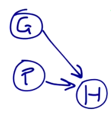
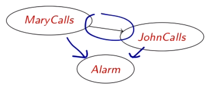
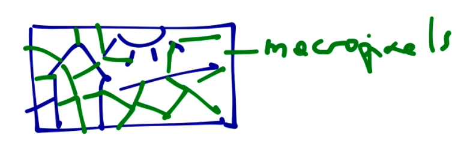

# Exact inference

We now have an idea about bayesian networks. We'll then want to understand how we can **construct them**! We won't construct big ones, since it would require lots of time, but we'll discover some imoprtant notions to rely on when constructing BNs.

The idea is that we must have a method such that conditional independence assertions (what we know about the domain, basically) guarantee the required global semantics (full joint probability distribution is equal to the conditional probability *given the parents only*). How can we construct this in such a way? How do we pick the parents? To do that we choose an ordering of variab les (any ordering for now) and then we consider the first variable, we add it to the network, then we add the second one, and so on... Every time, we question ourselves *shall we connect this to anything else? Is $X_1$ a parent of $X_2$?* We have to look at conditinoal independence: *is it the case that they are independent, i.e. $P(X_2|X_1)=X_2$*?

If this is respected, we **don't put the link**: they are independent, therefore we shouldn't put a link.

Then we add the third one, we ask ourselves $P(X_3|X_1,X_2)=P(X_3)?$, $P(X_3|X_1)=P(X_3)?$ and so on. The questions are obviously more: we have more possible connections. 

Let's try to construct the bayesian network for the *Monty Hall puzzle*.

*We’re guests on a TV game show. We stand in front of three closed doors. A prize hides behind one of them. We choose the door on the left. At this point, the host, who knows where prize is, opens the middle door, to reveal it is empty. We are offered to modify our choice. Should we?*

We'll consider the choice made by the guest as a random variable $G$. Prize is a random variable $P$. Then, there's the host, that will pick one of the doors, so another RV $H$.

Imagine that we choose the ordering $G, P, H$. We start with $G$, and then introduce $P$, asking ourselves if these two are independent. *Is $P$* independent of $G$? Assuming that no one changes the prize, we know that it is in a position and it does not depend on the guest choice. We don't put a link, then. Now, we insert $H$ and ask ourselves if the host picks a random door or not. He does not. We should test if $P(H|G,P) = P(H)$. And that is a no. Then, we should ask whether $P(H|G)=P(H)$, so basically, we know that the host will never choose the same door as the guest. So these are independent. Finally, we test $P(H|P)=P(H)$ to get if $H$ and $P$ are independent. 

Imagine that we want to construct a bayesian network for the *burglary problem*. If we choose different orderings, we end up with different networks, some being better of the others. Let's consider the ordering $M,J,A,B,E$.

First of all, is $P(J|M) = P(J)$? No! We don't know whether the alarm is ringing, so the fact that Mary calls enhances the probability of John calling. We should have independence, having previously considered the alarm, but now we don't! The next variable is the alarm $A$, and we ask ourselves: $P(A \mid J, M)=P(A \mid J) ? P(A \mid J, M)=P(A) ?$. Obviously, they are not independent, so we add arrows to the other two, but we now have more arrows than we'd like. The alarm is not caused by John calling, it is the other way around!

 

The knowledge that follows causes relation (from causes to facts) is easier to get than the other way around. 

We are not picking the variables in the natural order, and this makes things unefficient: we find more links than needed. 

This thing gets worse for continuous distributions!

The point of noisy-or distributions is to model multiple non-interacting causes, reducing the number of parameters to a linear one. It relies on the assumption that parents are the only possible causes of the effect.

We could now introduce hybrid (continuous+discrete) networks! Imagine we had the following network: a farm with a crop (wheat, for example), the weather, the cost of our produce...

We have that subsidy is boolean, harvest is continuous, and *Buys*, i.e. somebody buys or not, that is boolean again.

So we can say that the probability of cost, given harvest and subsidy, can be expressed as a gaussian. This is convenient because it allows us to describe the distribution with a small number of parameters. 

Not all the problems that involve probabilities have some *causality* inside. 

How can we model misconceptions and how they travel in the network? For example, can we say that if debbie finds out about the mistake, she will influence Alice? That does not reflect the situation we described: we want something mutual, they study together and either one of them finds about the problem and influence the other. This ability to influence can go either way: using a bayesian network would be a mistake! We'd be forced to put a direction in the arcs, which expresses the flow from causes to effect, and therefore it expresses it as an asymmetric situation. There are other models that allow us to describe these: **Markov networks** are similar to bayesian ones, but the links are undirected! They are characterized by compatibility factors (how likely the two variables are to have similar values) denoting affinity. For example, in slide 17, we don't have probabilities but just numbers that express the affinity of, for example, alice and bob being both false (30) or both true (10). How can we use these? We can use them in domains like image processing, if we tried to segment a picture: we have our initial division in *macro-pixels/areas*,  and the probability of two macropixels belonging to the same semantical area can be described in terms of affinity. There is an *influence* from one macropixel to a neighbour, but there is no directionality.

### Summary

Bayesian networks allow us to have a compact representation of joint distribution, allowing a natural representation for conditional independence. 

They are generally easy for non-experts to construct. We have seen canonical distributions like noisy-OR that allow compact representation of CPTs, like the *Gaussian*.

### Inference

The final idea to explore would be *how do we make inference basing on these?* What are some of the possible tasks? One would be the **probability query**, like *what is the probability of something given something?* We can also put things together, with **conjunctive queries**. Another type of query which can be done using BN is queries for optimal decision, together with some informations about the utility (like an objective function), then we can use it for decision making. 

Another important type of query is the **value of information**: imagine we have to take a decision, and probabilities depend on the evidence, but we don't have all the evidence! We then must pick some evidence to check! It basically decides what you gain by adding some evidence with respect to some other evidence.

Other types of inference are causal or inter causal reasoning.

A final type of inference (not on the slides) is **map query**, available in bayesian network professional tools, which will tell you what is the most probable value of a condition variable given the evidence. *What is the configuration of values that maximises the probability.*