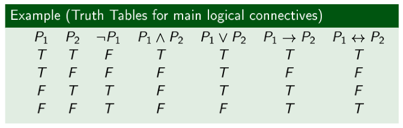
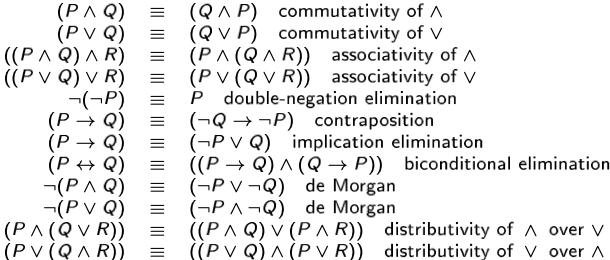

# Truth

First of all, we re-define **truth**: basically being in accord with fact or reality, or fidelity to an original or standard. Truth is usually associated to the sensible world: you observe an experiment, if it is repeatable than you have *truth*. For example, you throw a ball to the ground, it is true that it falls because it always will.

In mathematics, we have truth in, for example, *The sum of the internal angles of a triangle is $180$°*, but this becomes false in spherical geometry! The consequences are that the **axiomatic method is not a description of the sensible world**. The conclusion is that we **should replace the notion of pure truth** by the notion of **logical consequence**. The important one is the latter, which is based on the notion of truth. 

In mathematics, we can state that **a statement is true in a specific world, described by a specific axiom**. Rather than focusing on the **absolute** notion of truth, we focuse on a **relative** notion of truth, being relative on a set of axioms, i.e. a model where these axioms are true. Then, rather than talking about general truth, we are interested in the truth with respect to those axioms.

Now, let $\Gamma = F_1, \dots, F_n$ we say that $F$ is a logical consequence of $\Gamma$, written as $\Gamma|=F$, if it is always true that for each world in which all the formulas in $\Gamma$ are true, also $F$ is true. In other terms, whenever all the sentences in $\Gamma$ are true, $F$ is true too. We're not interested in knowing whether $F$ is always true, just in its world. 

Therefore, **truth is always defined with respect to a world** and a **given intepretation of symbols** in that world. We are not interested in the truth of a single sentence, but in the truth with respect to a set of other sentences, i.e. a **logical consequence**. 

## Syntax, semantics, rules

In general, for every system we distinguish **syntax** from **semantics**: the first being rules which tell us **how  sentences are formed**, the latter being the rules which tell us the **meaning of well formed sentences**.

How can we define a syntax? In many ways like informal (e.g. in natural language, for example, it is subject/verb/etc...), BNF, and inductive definitions.

So, how can we define semantics? Basically, if we take C (the language) as an example, what's the meaning of a *for statement*? In order to precisely define the semantics, we use many different methods, like operational semantics, denotational semantics, logical semantics... These are not being teached anymore (*bella*), but they are starting to being used at high levels too.

We have two main realms for semantics: **model theory** (concerning what is true) and **proof theory** (concerning what is provable). Hopefully, the two coincide. 

Propositional logic is the simplest logic, concerning propositions, i.e. statements about a reality which can be true or false. Who defines what is true and false? *Our specific interpretation*.

Now, we all know what propositional logic is (*do we?*), but how do we put propositions together? Using **connectives** (or, and, if...). Propositional logic uses a very restricted set of connectives, because we want to be precise. 

One should be careful, though, because the ordering of propositions may be crucial: *John drove on and hit a pedestrian* is very different from *John hit a pedestrian and drove on*. 

So, we need to create an artificial language with precise meanings: an **alphabet for propositional logic**, which contains a countable set of symbols $p_0,p_1,\dots,p_n$, connectives AND , OR, $\rightarrow$(implication), $\leftrightarrow$(double implication), $\neg$ negation, _ disjunction.

The propositions are also called atoms. 

Now, how do we define well-formed formulas? First of all, 

- **an atom is a formula** (atom=any propositional formula)
-  if $F$ is a formula, $\neg S$ is a formula
- if $S_1$ and $S_2$ are formulas, $S_1 $^$ S_2 $ is a formula
- If $S_1$ and $S_2$ are formulas, $S_1$_$S_2$ is a formula (disjunction, $\_$ being an OR)
- All well-formed formulas are formed by applying the above rules

The Backus-Naur Form (BNF) defines formulas analytically.

The third definition (100% precise) defines by induction: we have three rules, which define the set $X$. 

- For any propositional value $p_i \in X, \perp \in X$. 
- If I have two formulas $\varphi, \psi \in X \Rightarrow$ $(\varphi AND \psi)\in X, (\varphi OR \psi)\in X,(\varphi\rightarrow\psi)\in X,(\varphi\leftrightarrow\psi)\in X$
  - Be careful not to confuse $\Rightarrow$ with $\rightarrow$, the first one not being part of the language but the meta-language we use to describe the problem, while the latter is part of it.
- If I have $\varphi \in X, \neg \varphi \in X$

Note that the implication $A\rightarrow B$ was not included in the first syntax, because it can be derived by $\neg A \text{ OR } B$. 

Let's define **interpretations**: given a propositional formula, i.e. a set of atoms $A_1,\dots,A_n$, an interpretation $I$ is an assignment of truth values to $A_1,\dots,A_n$. For example, if we take the formula $G$ in the language defined by $(P\_Q)$ ^$\neg (P$^$Q)$. *ha cambiato slide scusate mi sono perso un pezzo dioccc*.

## Evaluation of a formula

Once we have the meaning of the symbols, we can use truth tables to evaluate the truth value of a formula:

## Model

The notion of **model** is important. We can say that an interpretation $INT$ is a model of the formula $F$ written $INT|=F$ if $F$ is true when the truth value of propositional symbols is defined according to $INT$.

Note that it is the same symbol we're using for logical consequence.

A **valid formula** is true, no matter the interpretation. A valid formula is also called a **Tautology**.

For example: $F\text{ or not }F$.

If $F$ is valid, we can write $|=F$.

For example, we prove the *deMorgan's Law*:

An **unsatisfiable** formula is always false, under any interpretation.

A formula which is not inconsistent is consistent/satisfiable.

Note that **invalid** $\neq$ **inconsistent**.

From the definitions we can prove that a formula is valid iff its negation is inconsistent (if you take a valid F it is true for every possible interpreation, so the negation is always false).

We say that a formula is **consistent** if there's at least one interpretation in which it is true. An inconsistent formula is always invalid, but an invalid formula isn't always inconsistent.

### Decidability

What we are interested in, given a formula, is checking wheter it is valid.

Suppose we have a set of axioms $A$ which describe some *world*. Then, we have a formula $F$. We want to know whether $A|=F$ i.e. $F$ is a logical consequence of $A$: it is true under all the possible interpretations which make the set of axioms $A$ true.

For example $F$ is a formula describing a fault in an electric circuit involving the variables $x_1,\dots,x_n$. *Is F satisfiable?* means: is there an $I$ such that $I|=F$?

So, to define whether a formula is valid, we can enumerate all possible interpretations (exponential, not so good), then evaluate the formula for each interpretation. The number of interpretations is finite: $2^n$.

Decidability is a very strong and desirable property.

A problem is **NP hard** when the best algorithm has **exponential complexity**.

With **logical equivalence** we mean that two formulas $F$ and $G$ are said so iff the truth values of $F$ and $G$ are the same every under interpretation of them. We can list some useful equivalence rules:

## Standard forms

We have two standard ways of writing formulas: the **Conjunctive Normal Form** and the **Disjunctive Normal Form**. A **literal** is an atom or the negation of an atom. A formula is said to be in **Negation Normal Form** iff negations only appear in front of atoms.

A clause is formed as $L_1 \text{V} L_2 \text{V} L_3$. Sometimes we write formulas in CNF as a set of clauses. 

The DNF is a disjunction of conjunctions of literals.

It is always possible to transform a formula into normal form by using the equivalences.

## Deduction theorem

Given a set of formulas $\{F_1,\dots,F_n\}$ and a formula G, $(F_1$/\ $\dots$ /\ $F_n) |=G $ meaning it is a logical consequence from the Fs. From the definition of logical consequence, we can derive that every interpretation $I$ which makes $F_1,\dots,F_n$ true makes $G$ true too.