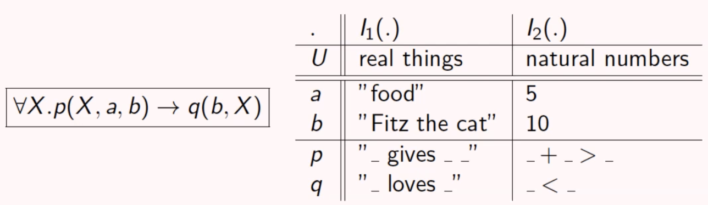

# First order Logic

This is sometimes called *predicate calculus*. Unitl now, we could have these totally correct interpretations:

*Note that the dot between $X$ and $p$ means that the universal quantifier applies to what comes after the dot, i.e. the whole formula. It is alternative to using the parenthesis.*

We notice that different interpretations can lead to totally different meanings! We now want to understand which is the meaning of a formula written in FOL. The presence of variables makes this a little bit more different than propositional logic. We need to fix a **universe** (a domain from which we take the values, like numbers, graphs, apples...), an **interpretation** of function and predicate symbols (if I take a predicate, what is the meaning of this predicate? We have to fix a meaning for any predicate symbol) and a **valuation** for variables (a variable needs to have a fixed value).

Now, formalizing these concepts, an interpretation $I$ of $\Sigma$ (which is a signature, i.e. set of functions+set of symbols) consists of:

- A universe $\Sigma$, a non empty set
- A function $I(f): U^n\rightarrow U$, for every n-ary function symbol $f$ of $\Sigma$
- A relation $I(p) \subseteq U^n$ for every n-ary predicate symbol $p$ of $\Sigma$

Once we have defined an interpretation, how can we interpret a term? We simply apply in a recursive way the definition of interpretation.

Our goal is being able to say, formally, when a formula is true or false. 

Given $I$ interpretation of $\Sigma$, $\eta$ variable valuation, $I,\eta \vDash F$ which means that it satisfies $S$, is defined as follows:

We want to define, for example, when $x>y$, we need to know the meaning of the terms, for example $x=3,y=4$, then we need to check if these values belong to the interpretation: $(3,4)\in I$?. 

Given a signature $\Sigma$, an interpretation $I$, and a formula $F$, we say that:

- $I$ model of $F$ or $I$ satisfies $F$ (written $I \vDash F$) when $I,\eta \vDash F$ for every possible valuation $\eta$
- $I$ is a model of theory $T$ when $I$ is a model of each formula in $T$

A sentence S can be *valid ($I \vDash S$ for every $I$), falsifiable ($I \vDash S$ for some $I$), satisfiable($I \nvDash S$ for some $I$), unsatisfiable ($I \nvDash S$ for every $I$)*.

## Important results

These are provided without proof, we trust those. The notion of logical consequence is the same we always see. A sentence/theory $T_1$ is a *logical consequence* of a sentence/theory $T_2$ if every model of $T_2$ is also a model of $T_1$, i.e. $I\vDash T_2$ implies $I \vDash T_1$.

Two sentences/theories are equivalent $\leftrightarrow$ if they are logical consequences of each other. Given that, **it is undecidable whether a FOL formula $F$ is true under all possible interpretations, i.e. $if \vDash F$.** We cannot list all the possible cases through the truthness table anymore, as we could do in propositional logic. In fact, we should now consider all possible universes of interpretations, domains... and this can't be done.

