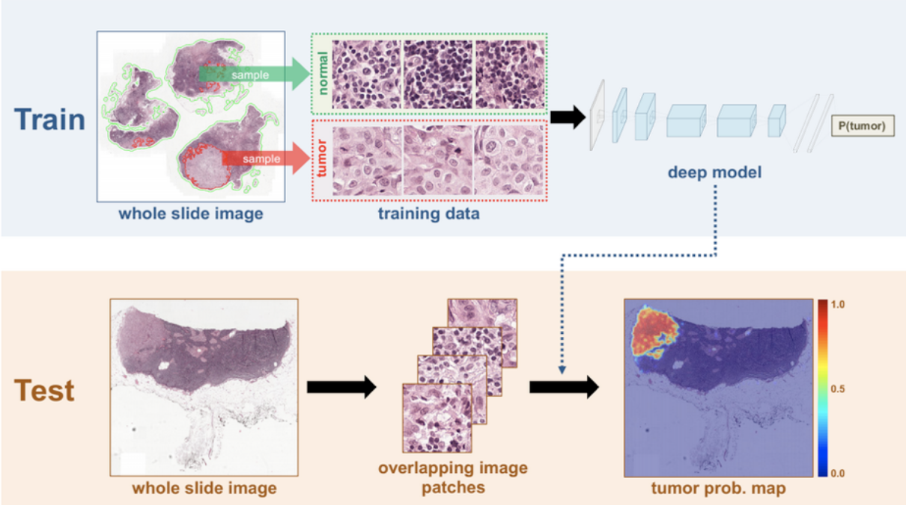
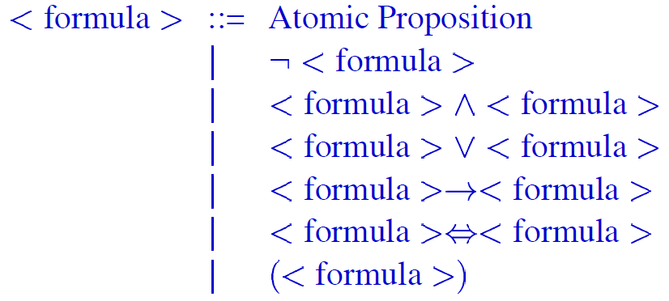

# Languages and algorithms for AI

There are 3 modules in this course: Gabbrielli, Zavattaro, Dal Lago. Basically, they are 3 different exams. The exams are not extremely difficult, the first module is written only, Zavattaro is usually a project, Dal Lago is a written exam.

Module 1 is about logics, Zavattaro is about cloud computing, Dal Lago is about theoretical complexity of algorihtms.

This is not a typical engineering course, more on the science side.

## Contents for module one

Basically, logic languages. In particular, logic programming languages and constraint programming languages.

We'll have an **introduction to logic**, with propositional logic, FOL, Resolution, Unification.

Logic programming and constraint programming.

## Material for the course

First of all, the **slides**, which contain all the technical material you'll need, without containing explanations: you won't understand anything by just looking at the slides.

It's important to attend lessons: without doing so, you won't understand anything.

The _Russel Norvig_ will be used too. We'll use _Logic and Structure_ by _Dirk Van Dalen_, which is available online.

Then, we'll use some resources on PROLOG, like _Triska - The power of PROLOG_, and on constraint programming, _The MiniZinc Handbook_.

## Two motivational examples

These should explain why we're studying these things. We're talking about programming in general, not AI.

### A combinatorial problem

Arrange three 1s, three 2s,..., three 9s in sequence in such a way that between two successive occurrences of the number , there are exactly  numbers netween successive occurrences of .
**Coding a solution would be a pain in the ass.** So we can work in a _declarative_ way, by expressing, for example, that the 1s have to be like .
This will have to be a sublist of the full sequence , containing 27 elements.
Then we consider the pattern for the 2s, .
We can do so for every number, than try to merge them thanks to a PROLOG program:

```prolog
sequence([_,_,_,_,_,_,_,_,_,_,_,_,_,_,_,_,_,_,_,_,_,_,_,_,_,_,_])
question(S):-
		sequence(S),
		sublist([9,_,_,_,_,_,_,_,_,_,9,_,_,_,_,_,_,_,_,_,9],S),
		...
		sublist([1,_,1,_,1], S)
```

The `question` is a **first order logic formula**.

Now, the **PROLOG interpreter** essentially constructs a derivation tree (depth-first search) and explores it. Suppose that we have to prove that this program **solves the problem**. What we can do is reasoning by induction on the structure of the terms we're using.

The first reason on why we're studying these languages is, as seen here, that they can allow you to solve problems in a super easy way.

### An optimization problem: the 🎂 problem

We need to bake some cakes for a party.

We know how to make two types of cakes, banana cakes and chocolate ones.

Each one of them has different ingredients and have different costs. We have a given set of ingredients in our store cupboard.

So, we can use MiniZinc to solve this problem, declaring our constraints and then simply maximizing the profit formula.

```minizinc
var 0..100 b; % no. of banana cakes
var 0..100 c; % no. of chocolate cakes

% flour
constraint 250*b + 200*c <= 4000
% bananas
constraint 2*b <= 6
% sugar
constraint 75*b + 150 * c <= 2000
...
solve maximize 400*b+450*c

output["no. of banana = \(b)\", "no. of chocolate = \(c)\n"]
```

## Declarative programming

The ideas we explored can be summarised into a quote from _Bob Kowalski_: _Algorithm=Logic+Control_, i.e. an algorithm has to be composed by the logic, and the control. In a traditional programming language you specify both of these, here, the revolutionary idea is that **the programmer takes care of the logic, while the control part is taken care of by the machine**.

This idea is generalized in **declarative programming** (opposed to _imperative programming_), which includes logic programming and constraint programming, where the programmer specifies the problem to be solved, not how.

We have 3 main paradigms: **logic** programming (Prolog), **functional** programming (ML, Haskel, OCAML), **constraint** programming (MiniZinc, CLP, ILOG).

Logic uses _relations_, functional uses _functions_, constraint uses _constraints_. No shit, Sherlock 🔎

## What the heck is logic?

It comes from greek, basically meaning the systematic study of the form of valid inference, and the most general laws of truth. It studies **the way human beings think**. When we think, we use _2 ingredients_: the notion of truth (what is true and false), and the notion of inference (i.e. deduction). E.g. _I have that all human beings die, I am a human being, therefore I die_.

_Leibniz_, in the 600s, said that a universal language would be achievable, allowing us to do reasoning in all kinds of subjects.

_HIlbert_ had a dream of _the complete axiomatization of all mathematics_, so that they could be expressed as a single set of axioms.

First of all, we should distinguish between types of logic:

- **Classical logic**, considering truth and inference. Normally it's interested in deriving new facts from the known ones. I can use the proof technique, in ways like the _reductio ad absurdo_, where I start from what I know, then assume that a third thing is false, and check if I obtain a contradiction;
- **Intuitionistic logic**, considering constructive proofs. The previous direct way is no more allowed: I must construct the proof, starting from the other proofs. If I start from X and Y and examine all the possible cases, and in no one W was false, then I deduce that W must be true: this isn't sufficient, _we need proof_;
- **Linear logic**, considering resources. _If I have X and Y, can I exchange them for W?_ _It rains today and it rains today._  _I have a server with 2TB and I have a server with 2TB. The total is 4TB!_;
- **Epistemic logic**, considering knowledge and belief;
- **Temporal logic**, considering evolutions in time: _sooner or later it will rain_.

### Why should we study logic?

There are several reasons:

- **Historical reason**: Computer Science _derives from logic!_ CS existed before actual computers existed. These studies on theoretical aspects of CS were crucial to the birth of computers.
- Logic provides a foundation for computation and declarative languages
- Logic is a paradox free language: in many circumstances we have what we call pradoxes (i.e. something that has apparently right reasoning, giving apparently right premises, apparently or totally wrong conclusions). The thing is, natural language allows paradoxes! In order to deal with this kind of problems, logic is a great tool.
  - An example of false paradox: 
  - I am a liar  I am a liar if and only if what I'm saying is not true  I'm not a liar?
  - Why do paradoxes happen? Metalinguistic (i.e. relating to a metalanguage, i.e. a language used to talk about language, something about the language) use of natural language, and self-application of a meta linguistic concept
  - How can we solve this problem? This is partially because of the natural language, but using mathematical language does not solve the problem: let  (set of all the  such that  does not belong to ), then I have two cases, either  belongs to  or not. Therefore,d  iff  (_Russel Paradox_)
  - There's paradoxes in CS too! Let's define a function , then , this means that functions are not only _total_, i.e. they can be undefined on some given input! An undefined function doesn't let the program terminate.
  - So, why don't we design a programming language where, by design, all the non-terminating possibilities are eliminated? We technically could do so, but we would be missing things like _whiles_ and _GOTOs_. This language would be less powerful than a Turing machine, which has power (in the sense of the set of computable functions) equal to the one of Python, C, Java... All of these languages are therefore equivalent, since they have the same set of functions. Now, if we take this _always-terminating language_, but the power of this language is strictly smaller than the power of a Turing Machine: you cannot compute functions that you can compute in C. Nonetheless, there are functions that terminate that still couldn't be executed in this language, like the _hackerman function_ ([related](https://www.google.com/url?sa=i&url=https%3A%2F%2Fwww.youtube.com%2Fwatch%3Fv%3DKEkrWRHCDQU&psig=AOvVaw0gWEJOAkBzBPHtkaxY2P9Z&ust=1603526792437000&source=images&cd=vfe&ved=0CAIQjRxqFwoTCND70fmgyuwCFQAAAAAdAAAAABAD)).
  - Therefore, **if we want to have the full expressive power** of a Turing machine, we **must have non-terminating programs**.
  - Termination is **not decidable** (for programming languages having the expressive power of a Turing machine)
  - Any programming language cannot express **every mathematical function**: the set of programs expressable in any programming language is countable, while the set of Boolean function is not countable. We cannot have any tool allowing to prove the correctness of a program.
  - Now, the idea is trying to formalize a language, separate from meta-languages, which allows us to avoid paradoxes. This is not so easy.
  - Let's consider the Curry paradox: _if this sentence is true, then Santa Claus exists._

## 2020-10-23 Lesson - **TODO**

[MS Stream link](https://web.microsoftstream.com/video/b3cfb9f9-1697-4ed8-b507-0c3add4961ba?list=user&userId=f9f103f3-1732-4b8e-8ba9-fff748a59273)

1. Metalanguage
2. Paradoxes in languages (natural, mathematical, ...) caused by overlap of language with metalanguage
3. Total functions
4. Facts
   1. Functions computed by programs are not only total
   2. Termination is not decidable
   3. any programming language cannot express all mathematical functions
5. Meaning of AI
6. History of AI

## 2020-10-26 Lesson

### Short history of AI

Why should we study logic in AI?

- It's a tool to express human reasoinng
- It's the foundation to a classic approach to AI
- It's the foundation of declarative languages, used in AI
- It's directly applicated in some programming languages used in AI

So, **what is AI?** Turing said that the only way a machine could behave intelligently is sounding like a human. Therefore, the **imitation game** was born, an operational test for intelligent behavior: machine fooling a person for 5 minutes. Note that the Turing test is not reproducible, constructive or amenable to mathematical analysis.

So, we have 4 possible definitions:

- Systems that think like humans
- Systems that act like humans
- Systems that think rationally
- Systems that act rationally.

Turing considers AI systems those which **act humanly**.

### Two main AI categories

1. **Symbolic computation**

   Here, the **reasoning is based on logic**.

   The general picture of an expert system is composed of two parts: the knowledge (on domain and control) and the inferential engine (the part of the system performing the deduction). The system itself does not create knowledge, just inference. The results are already in the data and in the knowledge. The system consists in units of computation, performing manipulation of symbols.

2. **Subsymbolic (connectionistic) computation **(deep learning, basically)

   Here, the following example provides inference on cancer: by analyzing lymph nodes, it provides insights on how possible it is that the patient has cancer. Here, a neural network is trained in order to recognize the patological situations. The machine has access to a very large set of labeled images. The first iteration has random parameters, therefore random predictions. Then, we take the provided answers, we compare them with the true ones and measure the error. Using some mathematical magic, and then tune the weights in order to reduce the error. Now, we can't derive rules from the model. There certainly are patterns in the data, but we can't know what these are. The machine identifies these patterns, extracts them and _create knowledge_: the machine is able to do something we can't do. The previous type had **rules** and you can check the reasoning made by the system, here you can't. The computation is the result of the computation of strongly connected small units. Once the network has been trained for a specific task, if you want to do something which is slightly different, you have to re-train the thing.

   

These are both very important, the future of AI will probably consist on the integration of these two things

### Symbolic computation

Also called **Expert systems** and **Decision Support Systems**. Examples are systems that ask doctor the syntoms/conditions of a patient and suggest a therapy basing on **pre-existing specialistic knowledge** in the medical field.

These can be implemented in standard languages such as python but it's better to **use formalisms strongly based on logic**. This is because we can represent all the facts and rules used by humans and let the system obtain a solution by creating a "_deduction tree_".

Of course these systems solve problems in a limited domain but they can perform better than human experts. The system **does not create new knowledge**. The knowledge is explicitly contained in the given rules. It is possible to make modification to the system logic.

### Sub-symbolic computation

System treated in other courses (**Machine Learning and Deep Learning**). Examples are neural networks which are trained on images of normal and pathological cells and can suggest the state of the cell in a new image.

The **knowledge is obtaind from the data**, but **it's impossible to extract any general rule** (which we can use outside the system). If any small modification is needed it is necessary to rebuild the system.

### The notion of truth

Any statement is true only in a certain domain (for example, the sum of inner angles of a triangle is 180° only in euclidean geometry, not in spherical geometry).

Since we are not able to define a global domain for a truth, working with logic we will not focus on the notion of thruth but rather the notion of **logical consequence** (which is derived from the notion of truth).

Given a set of sentences  (_promises_) and a sentence  (_conclusion_),  is a logical consequence of  () if it always true that if all the formulas in  are true then also  is true.

 logically equivalent to  and .

### Propostitional logic

In any logic or programming language we distinguish

1. **Syntax**: rules that define **how sentences must be constructed**
   - Defines the symbols used too represent propositions, variables, ...
   - Well formed sentences are called _formulas_
2. **Semantics**: rules which define the **meaning of well formed sentences**
   - Two realms (hopefully they coincide):
     - Model theory: what is true
     - Proof theory: what is provable

A **proposition** is a statement about some world which in that world can be true, false or neither (but not both). The truth or falsity in our interpretation is called **truth value**.

Propositions are joined with connectives (and, or, not...). We will use only useful connectives (for example, _but_ is used to convey surprise, we use instead _and_ which is neutral).

We define an **alphabet** of propositional logic, consisting of:

- A countable number of **proposition symbols** (also called **atoms**): 
- **Connectives**: 
- **Auxiliary symbols**: ,

The **syntax of propositional logic** can be defined with a recursive definition, an inductive definition or through Backus-Naur Form (BNF):



Once defined the syntax of a language, it's necessary to define the semantics: the first step is the definition of the **interpretation** of the formulas.
Given a set of atoms  which appear in a formula , an intepretation  of  is an assigment of truth values to each atom .

In propositional logic we use the Truth tables of the logical connectives.


