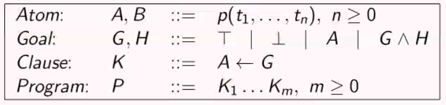

# Logic programming languages

The languages based on First Order Logic, where programs are formulas. A query for a program is also a formula. In order to define trhe semantics, we could take different paths: since the program is a set of FOL formulas, the semantic might be the same, or if we want something more *constructive* we could use a proof theory, a deduction system, and give the semantics in terms of resolution. That's what we'll do.

Taking as example any program written in a programming language (e.g. Python), how do we define the meaning, i.e. the semantics?

We will use the *Extended Backus-Naur Form*, a notation consisting of production rules in the form:
$$
Name: G,H ::=A | B, Condition
$$
where capital lettes are syntactical entities, symbols $G$ and $H$ are defined by the rule $Name$, if $Condition$ holds then $G$ and $H$ can be of the form $A$ or $B$.

The operational semantics describe, in a formal way, how the interpreter of the language would work. We give a precise definition of the behaviour of programs written in that language. This is done using a so-called *transition system*. This is not specific for logic languages!

We will provide the semantics of logic programming by using State transition systems. Transition system (TS) is an abbreviation for *Simple State Transition System*. What is that?

It's just a pair where the first element of the pair is a set of states, and the second component (indicated by an arrow) is a binary relation over states, called *transition relation*.

The idea is that if 2 states are related according to this specific relation "$\rightarrow$" this means that there is a transition from the state $S_1$ to the state $S_2$, meaning that if $S_1$ is the picture of my system (e.g. the values of all the variables in that moment), then I compute to the state $S_2$, the relation represents a single step of the computation. 

Definition of a **logic program**:

*A logic program is a set of axioms, or rules, defining relationships between objects. A computation of a logic program is a deduction of consequences of the program. A program defines a set of consequences, which is its meaning. The art of logic programming is constructing concise and elegant programs that have desired meaning.*

An atom is just a predicate applied to a certain number of terms, according to the arity. There a

A goal is either the true goal or the false goal, or $A$ (the syntactic category defined before, an atom). The conjunction of two goals is still a goal.

A logic program is a **set of clauses** which are btw called *Horn clauses* (has at least 1 positive literal). 

A successful final state has the form $<T, \theta>$ 

Now we need to define the transition rules, but before doing so we need two notions: **derivation** defined in the case of generic transition systems, which is a sequence of states such that we go from $S_1$ to $S_2$ which are related with the transition derivation step (the arrow), and the final state of one step is the initial state of the other one. We can define a **successful** derivation if the final state is successful, failed if not, infinite in there's an infinite sequence of states and transitions. A goal $G$ is successful if it has a successful derivation starting with $<G, \epsilon>$ or finitely failed if it has only failed derivations.

We have two types of non-determinismL the don't care (selection of the atom) and don't know (selection of the clause). With the selection of the atom, no matter the atom, if there exists a solution I can find it (don't care). On the other hand, for the don't know, for the selectoin of the clause really matters, and if you choose the wrong clause you could end in failure: changing the rule of clause selection can affect the semantics of your program. The rule selection can determine the results.

