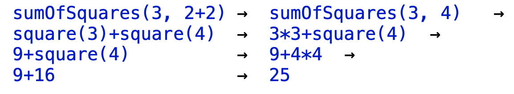
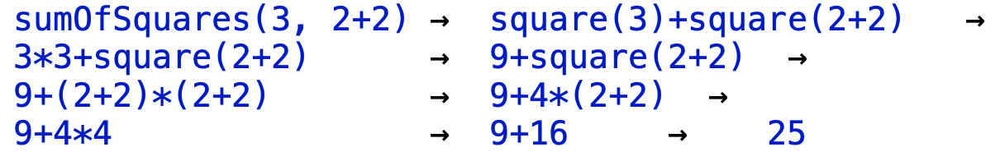
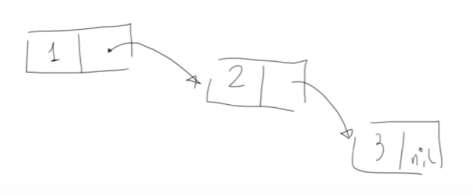

# Functional programming

Functional programming is a programming style that is grwoing in popularity because it allows us to work on small, medium and big quantities of data without having to do much changes. The same program can be executed locally or on distributed systems. 

First, some basic concepts (that we actually already introduced): traditionally, functional programming is based on **expressions**, so we typicallly write an expression, evaluate it, and print the result. This is known as REPL (*Read-Eval-Print-Loop*). This characterizes the style we previously mentioned. Obviously, the most important is the evaluation. How are the expressions we write evaluated? There are simple rules that are followed, these are the rules for standard operator expressions:

- We evaluate the single operands that are passed to the operator, once all the parameters (from left to right) have been evaluated,
- we evaluate the operands,
- then, we apply the operator to the operands.

When we assign variables, a name is evaluated by replacing it with the right hand side of its definition. The evaluation process then stops once it results in a **value**.

Note that `def` and `val` differ in the sense that when you write `def` the right-hand side is not immediately evaluated. If we had a `def` instantiated with a sum, the sum wouldn't be computed at the time of instantiation. So, the environment knows that there is an expression, and the association value is not computed, though it will be computed in case the `def` will be used in a *formula*, while for now it just saves the sum as a sum. If we used `val`, the right-hand side would be immediately evaluated. Note that the every time a `def` is used in an expression, it is computed: the result is not saved.
More info on variable types can be found [here](https://docs.scala-lang.org/overviews/scala-book/two-types-variables.html). To recap:

| Variable type | Lazy/Eager? | Stored? | Constant? |
| ----- | ----- | ----- | ----- |
| `def` | Lazy | Not stored | Yes |
| `val` | Eager | Stored | Yes |
| `lazy val` | Lazy | Stored | Yes |
| `var` | Eager | Stored | No |

Note that `def` will be used to define functions too:

```scala
def sumOfSquares(x:Double, y: Double) = 
	square(x)+square(y)
```

Scala is *lazy* in the evaluation of parameters, meaning that the evaluation of parameters is deferred as much as possible. 





As you can see, we may have two different evaluation strategies, leading to the same result. These are known as *call-by-value* (CBV) and *call-by-name* (CBN).
At the end, the two different strategies return the same result, but it is possible (in some cases) that one of them might infinitely loop and fail. 

They both reduce to the same values, **as long as**: there are no side-effects (no changing of the environment when the evaluation is performed) and both evaluations terminate. 

CBV has the advantage that it evaluates every function argument **just once**.

CBN has the advantage that a function argument is not evaluated if the corresponding parameter is not used in the evaluation of the function body.

We have side-effects where an evaluation of an expression changes the environment (i.e. the identifiers, their meanings, the constants, the body of the functions...). There are case in which, during the evaluation, the environment changes. When does this happen? If we for example define an identifier `var`, this allows us to change the value associated to this identifier, which has the side-effect of changing the environment, which before contained a different value for `x`.

The only way to have different results for CBV and CBN is having some modifications of the environment inbetween the two instants in which the evaluation starts and ends:

```scala
def f(x:Int) {
  y = y+1
  return x
}

y = 1
f(10+y)
```

Here, CBV would return 11, and CBN would return 12!

If we wanted to reimplement `&&` and `||`, we could do something like:

```scala
def and(x:Boolean, y:Boolean) = 
	if(x) y else false

def or(x:Boolean, y:Boolean) = 
	if(x) x else y
```

An important feature of Scala is higher order functions.
An example can be found [here](examples/6_HigherOrderSum.scala).

## Classes

We'll now start aiming towards OOP. Let's imagine we had a class `Greeter` that allows us to declare **fields** and **methods**, i.e. functions that describe activities executable by the object. 

We'll consider, for this example, this class `Greeter`:

```scala
class Greeter {
  val message = "Hello!"
  def SayHi() = println(message)
}
```

that we can use as follows:

```scala
val greeter = new Greeter()
greeter.SayHi()
```

We can extend this class as follows:

```scala
class ItalianGreeter extends Greeter {
  override val message = "Ciao!"
}
val greeter_it: Greeter = new ItalianGreeter
```

Note that we can skip the `()` in the creation of an object if it has **no parameters**.

Remember that `val` indicates immutable identifiers: our `message` will never change, but it can be overridden through the `override` keyword. This can also be applied to methods. 

We can add a **parameter** to the class:

```scala
class GenericGreeter(msg: String) extends Greeter {
  override val message = msg
}
val greeter_gen = new GenericGreeter("Bonjour!")
```

Note that we're considering the body of the class declaration as the body of the **default constructor**. 

We can even define other constructors:

```scala
class GenericWithDefaultGreeter(override val message: String) extends Greeter {
  def this() = this("Hallo Welt")
}
```

This adds a constructor without parameters `this()`, so the default behaviour will be `"Hallo Welt"`.

Every new constructor shall be linked to another one: when we add a new constructor, we should call another existing constructor in it, and so on, so that we build a calling chain that ends on the **default constructor**. 

Note that we previously generated objects specifying the type: `val greeter_it: Greeter = new ItalianGreeter()`. This explains the concept of **subtypes**: if a class extends another one, it will be a subtype of it.

We can say that `greeter_it` has the **static type** equal to `Greeter` (i.e. what the compiler expects), but inside the variable we can put objects of a different subtype, the **dynamic type** (i.e. what we put inside the `val` at runtime).

Another thing that shall be noted is that the behaviour of the `message` overriding in the last two code snippets is the same, we're just shortening the thing. 

### Abstract classes

Abstract classes are classes that are **not completely defined**. We may have an `AbstractGreeter` having a message variable, but missing its value:

```scala
class AbstractGreeter {
  val message: String
  def SayHi() = println(message)
}
```

Suppose that we perform a `new` on this: we'll fail because we're missing some content! We'll therefore have to **create an actual class** extending this abstract one:

```scala
class SpanishGreeter extends Greeter {
  val message="Hola!"
}
```

Note that we removed the `override`, since there is **no overriding** happening. Leaving it would still not cause any problems: it is **optional** indeed.

Example of usage of abstract classes: [9_IntSet.scala](examples/9_IntSet.scala)

We'll use classes to represent data and data structures. 

We could define a `Rational` (i.e. a numerator and a denominator) data type as a class, together with some useful methods:

```scala
class Rational (val x: Int, val y: Int) {
  def add(r: Rational) = new Rational(x*r.y +r.x*y, y*r.y)
  def neg = new Rational (-x, y)
  def sub(r: Rational) = add(r.neg)
}
```

We could even redefine operators, just by calling a function with the symbol. But how can we use this syntax on user-defined data types? We have to understand two things. When we have a unary method, infix notation can be used: `r add s` is equal to `r.add(s)`. Furthermore, we can call standard methods with the standard operators. If we use the infix notation on methods with these particular names, we can redefine the operators.

```scala
def + (r: Rational) = new Rational (num + r.denom + r.num * denom, denom*r.denom)
```

Full example: [8_Rational.scala](examples/8_Rational.scala)

### Dynamic dispatch

Scala follows the **dynamic dispatch** approach: when a method is invoked, the implementation in the class of the object is considered (considering the *dynamic type* and not the *static type*).


## Lists

If the array is the typical data structures in imperative programming, **lists** are the ones for functional programming.

We'll start by defining the **emtpy list**, `nil`, then every other list is just an extension of it, consisting in the head, and the rest of the list: `cons(h, l)`.

Imagine that we have a list `[1,2,3]` in memory, so that we save the first element, and a pointer to the rest of the list:



We have two operations: `head` and `tail`, used to access the two values in the structure.

`l1.head` would therefore be `1`, while `l1.tail` would be `[2,3]`.

We could therefore define a list `l2` as `cons(4, l1.tail)`, being equal to `[4,2,3]`.

This could only be done in **immutable** lists: if we modified `l1`, `l2` would change too!

## Traits

Usually, interfaces are similar to *abstract classes*, but they *simply present types*: signature of methods without the definition of the method itself. If we wanted to have something in-between, in the sense that *we want interfaces but some methods are defined*, we could introduce **traits**.

We are not expected to instantiate these, since they are defined as an abstract class, *without initialization parameters*.

```scala
trait Common {
  def philosphize()
}

trait Philosophical extends Common {
  def philosophize() = 
  	println("I am"+toString+", therefore I am!")
}

trait Colored extends Common {
  def philosophize() = 
  	println("It ain't easy being "+toString)
}
```

We can extend traits with traits!

Now, we extend the concept:

```scala
class Animal {}

class Frog extends Animal with Philosophical {
  override def toString = "green"
}
```

Note the `with` keyword. We are creating a double relation between class frog and the superclass animal (no multiple inheritance),  but we can add a list of traits! This is why it's a *rich interface*: there's code inside!

Note that adding **multiple traits** might result in **unwanted behaviour**.

This problem may be literally *overridden* with the keyword `override`:

```scala
trait Colored extends Common {
  override def philosophize() = 
  	println("It ain't easy being "+toString)
}
```

This basically **specifies the order** for the methods coexistance.

Example of usage of traits: [10_TotOrder.scala](examples/10_TotOrder.scala)

### Scalability

We can even define new primitives and mechanisms that resemble native. For example, we could redefine booleans:

```scala
trait Bool {
  def ifThenElse[T](t: => T, e: => T): T
  def && (x: => Bool): Bool = ifThenElse(x, ff)
  def || (x: => Bool): Bool = ifThenElse(tt, x)
  def not: Bool = ifThenElse(ff, tt) 
}
object tt extends Bool {
  def ifThenElse[T] (t: => T, e: => T): T = t }
object ff extends Bool {
  def ifThenElse[T] (t: => T, e: => T): T = e
}
```

Note that when the method is evoked, the parameters are evalued only if necessary (*lazy evaluation*).

**Scala** is called as such because of this: the user can expand the types as needed.

## Generic Classes

Besides the classname, we also have types. This can be instantiated when we want to specialize the class. 

## Type bounds

Before talking about these, we should indicate that what we have seen so far is something that relates with **polymorphism**, and essentially we have seen two forms: **subtyping** (the object changes its type) and **generics** (like lists, that change how they are instantiated).

Now, we can introduce the interplay among them: **covariance** if we want subtyping among generics, **type bounds** can be used to impose limitations on the type variables that are used when we have generic classes. 

We'll consider the function `id` that resembles an identity function for integer lists. 

We decide that the type of our `id` function becomes a parameter. We say that the return can be generic, and it should be the same as the parameter for `id`: it coincides with the type of what is passed!

## Covariance

We'll start by defining this concept, then try to get why it is important. Imagine a parametric type thatw e denote with C[T] (T is a type variable), and we consider two concrete types that we call A and B. These are possile instances for T. So if we use A we obtain C[A], if we use B, C[B].

We say that the parametric type C is **covariant** if we know that the two concrete types are in a subtyping relation, then we also impose this relation between the two instances:
$$
A <: B \Rightarrow C[A]<:C[B]
$$
What we see is a sort of mathematical definition of this concept, which is a **property for parametric types**. A parametric type is covariant if whenever we instantiate the parameters with two types in subtyping relation, also the two concrete obtained types are in the same relation.

**Why could this be useful?** We shall start from an example where the use of covariance could be dangerous: the *Java covariance pitfall*.

```java
// Java example that fails
public class Arrays {
  public static void main(String arg[]) {
    Derived[] arr1 = new Derived[10];
    Base[] arr2 = arr1;
    arr2[0] = new Base();
    Derived o = arr1[0];
    o.g(); // This fails! It's found in Derived but not in Base
  }
}
```

This means, for instance, that if we consider two types (*Base* and *Derived*, where *Derived* is a subtype of *Base*), given that this specific language considers arrays as covariant, we also have that Array[Derived] can be considered a subtype of Array[Base]. Given this, we could write instructions like `Base[] arr2 = arr1`, which is *correct* from the type point of view. 

This fails!

Note that considering mutable data structures as covariant **could really be dangerous**.

The general rule is *covariance is ok, provided that data structures are immutable, i.e. they can't be dinamically changed*.

Covariance is naturally admittable, and it doesn't create the problems we have seen in Java, in Scala:
- **lists** are **immutable**, we can't perform modifications
- **arrays** are mutable but **invariant** (not covariant)
- **vectors** are **immutable**: while `arr2(0) = new Base` is admitted, `vect2(0) = new Base` **is not!**

We'll now try to extend our list with an enriched interface. 

## Variant classes

We'll now talk about **covariant parametric types**: when we place `+` in front of a type variable, we say that the parametric type will be covariant. If we put `-`, it is contravariant. If no symbol is put, C is non-variant.

Contrapositivity is the inverse of covariance: 
$$
A <: B \Rightarrow C[A]>:C[B]
$$

Some examples of the usage of the `+` and `-` operators can be found in [11_CovarianceTest.scala](examples/11_CovarianceTest.scala) and [12_CovariantList.scala](examples/12_CovariantList.scala).

Considering [`Function1`](https://www.scala-lang.org/api/current/scala/Function1.html), having one parameter type and one return type.
Its interface has a method `apply`, which is what gets called when we call the function.
The compiler takes the object representing the function, calls `apply` and passes the parameter.
Why do we place the covariance decoration in front of the return, and the contravariance in the parameter? What does it mean to have subtyping on functions?

To understand this, we have to consider the way we look at subtyping when considering functions. This will reply to our question. When is a function **subtype of another function**? In other terms, when is it correct to consider `f` replacement of `g`. We can define some general rules to deal with subtyping in functions. Consider this code:

```scala
def useFunction (f: A=>B) = {
  val x: B = f(new A())
  x
}
```

This function `f` is applied to an object, and after this application it is correct to place the result inside the variable `x`.
If we executed `useFunction(g)`, `g` will receive an object of type `A`, so we want `A` to be compatible with `C`.
We want `g` to be a good replacement of `f`.
So we want `d`, the object returned by `g`, to be compatible with the type of the variable where this is constrained: the return type of `g` should be a good replacement of `B`, which is the codomain of F.
To recap:
$$
f: A \Rightarrow B; \hspace{1em} g: C \Rightarrow D; \hspace{1em} f <: g \Leftrightarrow A <: C, B >: D
$$

This has two important consequences :
- A type declared contravariant cannot appear as a return type (and cannot appear as type lower bound)
- A type declared covariant cannot appear as a parameter type (and cannot appear as type upper bound)

## Pattern matching

Pattern matching examples can be found in [13_PatternMatchingTest.scala](examples/13_PatternMatchingTest.scala).
