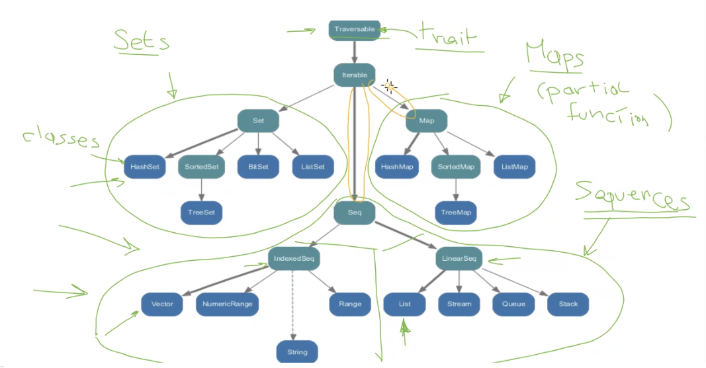
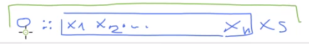
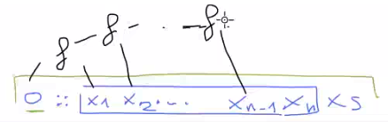

# Programming with collections

The scala standard library provides 3 main groups for collections:

* Sets
* Maps
* Sequencies

The latter are organised in 2 groups, the *indexed* and the *linear*. The first ones allow us to directly access an element knowing the index, while the linears have to be fully explored. Note that in the diagram, the green ones are **traits**: we can't instantiate them! We'll have to create something which has the type of this tree's leaves.



Note that some arrows are bold: this indicates the **standard implementation** of the types, for example if i tried to instantiate a *Set*, what I'll get is an **HashSet**. Each intermediary node has one and only one bold arrow.

The list will be the first one we'll explore. Then we'll see vectors (indexed sequence), sets, maps and probably streams. 

## Lists

Lists are immutable structures, homogeneous (all the elements are of the same type)

```scala
val fruit = List("apples", "oranges", "pears")
val nums = List(1, 2, 3, 4)
val diag3 = List(List(1, 0, 0), List(0, 1, 0), List(0, 0, 1))
val empty = List()
```

Note that `List()` is equivalent to `Nil`. 

The typical constructors are two, the one creating the empty list `Nil` and the constructor operator `::`, which creates a new list starting with the first of the two, and has the second one as tail. 

```scala
val fruit = "apples" :: "oranges" :: "pears" :: Nil 
val nums = 1 :: 2 :: 3 :: 4 :: Nil
val empty = Nil
```

There's obviously many additional methods, just look at the docs.

## Pairs and tuples

We can use **pairs** to find a nicer way of implementing things like a *merge based on pattern matching*:

```scala
def merge(xs: List[Int], ys: List[Int]): List[Int] = (xs, ys) match {
  case (Nil, _) => ys
  case (_, Nil) => xs
  case (x :: xs1, y :: ys1) =>
  if (x < y) x :: merge(xs1, ys) else y :: merge(xs, ys1)
}
```

If we know that both lists are non-empty, we match the more complex pattern.

Pattern matching examples can be found in [13_PatternMatching.scala](examples/13_PatternMatching.scala).

## Higher order list functions

We now start talking about functions that we can use on these collections to perform some standard elaboration on the data inside the collection. Let's start with some examples. 

*Suppose that we have one list containing doubles, and we want to obtain a new list by multiplying each single element by a given factor.* 

We could implement this ourselves, by using recursion:

```scala
def scaleList(xs: List[Double], factor: Double): List[Double] = xs match {
  case Nil => xs
  case y :: ys => y * factor :: scaleList(ys, factor) 
}
```

basically if the list is empty, we return the list, while if there's something we multiply the head by the factor, then recurse on the tail. 

An expert programmer knows that in the standard library we can find the `map`, which helps us in simplifying this thing:

```scala
def scaleList(xs: List[Double], factor: Double) = xs map (x => x * factor)
```

Map is able to transform data taken from the list, and it is implemented somewhat similarly to this:

```scala
def map[U](f: T => U): List[U] = this match { 
  case Nil => this
	case x :: xs => f(x) :: xs.map(f) 
}
```

While the map is used when we want to apply a transformation, another typical elaboration would be *extracting some chosen elements from a collection*. We therefore want to **construct a new list** containing the elements that **respect a given condition**. This is done by the **filter**:

```scala
def filter(p: T => Boolean): List[T] = this match { 
  case Nil => this
  case x :: xs => if (p(x)) x :: xs.filter(p) else xs.filter(p) 
}
```

It receives another function (a **predicate**, i.e. a function returning either true or false), and only those elements that **satisfy the predicate** will remain in the output of the filter.

There are some variants of the filter, like `filterNot` (keeping the elements that **don't satisfy the predicate**), `partition` (combines filter and filterNot, returning a pair).

Something that we may need is computing values as a **combination** of the elements, like the sum or product. These kind of functions are abailable and we can use them using the usual recursive schema: 

```scala
def sum (xs: List[Int]): Int = xs match { 
  case Nil => 0
  case y :: ys => y + sum(ys) 
}
```

This is a possible implementation. It could be done in a simpler way with `reduceLeft`, which performs operations on pairs of elements extracted from the list and combines them:

```scala
def sum(xs: List[Int]) =
	(0 :: xs) reduceLeft ((x, y) => x + y)
```



How does this work? `f` is an higher order function like the sum we defined. reduceLeft takes the first two elements, applies `f`, and then applies the function to this result and the next element of the list.



It starts from the left, combines two elements using f, and combines the result of `f` with the next value, and so on...

We could do the same thing for the global **product** of the list:

```scala
def product(xs: List[Int]) =
	(1 :: xs) reduceLeft ((x, y) => x * y)
```

Another similar function is `foldLeft`. This is different because it expects to receive two parameters: a value and a transformation function. `reduceLeft` only had the transformation function `f`. It is so because this can be also applied to empty lists, so we explicitly **indicate what should be returned with empty lists**.

```scala
def sum(xs: List[Int]) = (xs foldLeft 0) (_ + _)
def product(xs: List[Int]) = (xs foldLeft 1) (_ * _)
```

Note that these two parameters can be passed separately: instead of doing `f(a,b)`, we use `f(a)(b)`. We can also explicitly indicate only some parameters, like `f(a)` and getting as a return value a *new version* of the function `f` that will receive `b`: `f2(b)` with `def f2=f(a)`.

## Scala vectors

From an high-level point of view we can consider vectors as arrays: we can directly access cells by their index. Besides operators like *append*, we have other operators that allow us to change vectors (that are **immutable**, so we're actually creating a new vector!). For example, `v.updated(i,x)` generates a copy of `v` in which cell `i` has now value `x`. It does not change the previous vector. This seems a rather problematic operation: if we have a very big vector, and change just one element, we're throwing out lots of memory. To cope with this problem of costs, the idea is using a different approach: we create a new vector with `updated`, . Imagine that `v` is a *tree of pointers*, suppose that the element in position `i` is down the tree, we should just change the pointer in position `i`! If we change this pointer we're creating a mutable data structure, and this **doesn't happen in the standard libraries vector**. What we want to do is trying to make the **minimal copying possible**, so that we keep all the pointers except `i`. We will also need a father for these pointers, obtained by copy-pasting the father of the subtree, simply changing one pointer instead of the other ones. 

## Ranges

Ranges are another simple kind of sequence, representing evenly spaced integers. They have 3 operators, `to` (inclusive), `until` (exclusive), `by` (step value).

```scala
6 to 1 by -2
val r: Range = 1 until 5
```

All the things we have seen are rather different, but they're all implementation of the same trait `Seq`,  which includes many higher order functions that we can use on these data structures!

There are operations that are specific for sequences, like `zip` and `unzip`, generating sequences of pairs.

## For expressions

Imagine we wanted to compute the cartesian product on two vectors, and check some properties on the pairs: we want the sum to be a prime number. We could generate a map and then filter it through the property, but this isn't the best solution. We have a more clear syntax available: the **for**.

```scala
for {
  i <- 1 to 10
  j <- 1 to i
  if isPrime(i+j)
} yield (i,j)
```

There are two types of elements in this block: **generators** and **filters**. 

We could express **queries** on collections, maybe using two generators to iterate on a collection:

```scala
for {
  b <- books,
  a <- b.authors
  if a startsWith "Bird,"
} yield b.title
```

The interesting difference from python is that you can place user defined data structures into the generators (provided that they expose `map()`, `flatMap()` and `withFilter()`), not only ranges etc...

We can use for expressions to extract data. Imagine we had a collection `c` and a generator `x<-c` and a yield expression `e` that computes those values that will populate the result.
So, what should this particular `for` execute?
It should consider all the values inside `c`, apply `e` to each element, and place each result inside `R`. What is actually done by the language is a map, obtained as `c map(x=>e)`, where the map will compute the result of `e`.

Therefore, the two following snippets are equal:

```scala
for {
  x <- c
} yield e

c map(x->e)
```

Imagine we had two generators considering collection1 and collection2. We use `x1` for `c1`, `x2` for `c2`. We'll then need an expression `e` that takes `x1,x2` as args. 

## Sets

Sets can contain things of various types, we can create them using this syntax: `val fruit=Set("apple", "banana")`. We have the possibility of applying filters, check of it is empty... The interest thing to say is that sets do not have duplicates: if a transformation generates a value that is already in the set (for example, we divide an element by 2), it disappears! We could use sets to **solve the n-queens problem**.

## Summary

These are all immutable covariant collections from the package `scala.collection.immutable`:

- ~~[Traversable](https://www.scala-lang.org/api/2.12.0/scala/collection/Traversable.html)~~ ([deprecated](https://docs.scala-lang.org/overviews/core/collections-migration-213.html))
- [Iterable](https://www.scala-lang.org/api/current/scala/collection/immutable/Iterable.html)
- Sets
  - [Set](https://www.scala-lang.org/api/current/scala/collection/immutable/Set.html), can be created with Set(1,3,3) which will create a default implementation (HashSet) with {1,3}
    - `+` incl
    - `++` concat
  - [HashSet](https://www.scala-lang.org/api/current/scala/collection/immutable/HashSet.html) (default Set)
  - etc
- Maps
  - [Map](https://www.scala-lang.org/api/current/scala/collection/immutable/Map.html)
    - `_1` key
    - `_2` value
  - [HashMap](https://www.scala-lang.org/api/current/scala/collection/immutable/HashMap.html) (default Map)
  - etc
- Sequences
  - [Seq](https://www.scala-lang.org/api/current/scala/collection/immutable/Seq.html): Sequences
      - `++` concat (Returns a new list containing the elements from the left hand operand followed by the elements from the right hand operand.)
      - `+:` prepend
      - `++:` prependAll
      - `:+` append
      - `:++` appendAll
      - `exists()`
      - [`groupBy()`](https://www.scala-lang.org/api/current/scala/collection/immutable/Seq.html#groupBy[K](f:A=%3EK):scala.collection.immutable.Map[K,C]) partitions this immutable sequence into a map of immutable sequences according to some discriminator function.
      - [`forall()`](https://www.scala-lang.org/api/current/scala/collection/immutable/Seq.html#forall(p:A=%3EBoolean):Boolean) tests whether a predicate holds for all elements 
      - [`zip()`](https://www.scala-lang.org/api/current/scala/collection/immutable/Seq.html#zip[B](that:scala.collection.IterableOnce[B]):CC[(A@scala.annotation.unchecked.uncheckedVariance,B)]) returns a sequence formed from this immutable sequence and another iterable collection by combining corresponding elements in pairs
      - `unzip()`
      - [`flatMap()`](https://www.scala-lang.org/api/current/scala/collection/immutable/Seq.html#flatMap[B](f:A=%3Escala.collection.IterableOnce[B]):CC[B]) applies to each element a function which returns a collection, then flattens (merges) all the obtained collections
      - `sum()`
      - `product()`
      - `max()` (elements must implement [Ordered](https://www.scala-lang.org/api/current/scala/math/Ordered.html))
      - `min()` (elements must implement [Ordered](https://www.scala-lang.org/api/current/scala/math/Ordered.html))
  - [IndexedSeq](https://www.scala-lang.org/api/current/scala/collection/immutable/IndexedSeq.html): Indexed sequences, can be accessed at a certain index
    - [Vector](https://www.scala-lang.org/api/current/scala/collection/immutable/Vector.html) (default IndexedSeq)
      - [`updated()`](https://www.scala-lang.org/api/current/scala/collection/immutable/Vector.html#updated[B%3E:A](index:Int,elem:B):scala.collection.immutable.Vector[B]) replaces the element in a certain position
    - [Range](https://www.scala-lang.org/api/current/scala/collection/immutable/Range.html)
      - `1 until 5` = 1,2,3,4
      - `1 to 10 by 3` = 1,4,7,10
      - `6 to 1 by -2` = 6,4,2
    - etc
  - [LinearSeq](https://www.scala-lang.org/api/current/scala/collection/immutable/LinearSeq.html): Linear sequences:, accessible only sequentially
    - [List](https://www.scala-lang.org/api/current/scala/collection/immutable/List.html) (default LinearSeq)
      - Empty list: [Nil](https://www.scala-lang.org/api/current/scala/collection/immutable/Nil$.html)
      - [`::`](https://www.scala-lang.org/api/current/scala/collection/immutable/List.html#::[B%3E:A](elem:B):List[B]) add the element to the beginning 
      - [`map()`](https://www.scala-lang.org/api/current/scala/collection/immutable/List.html#map[B](f:A=%3EB):List[B]) (es: `def scaleList(xs: List[Double], factor: Double) = xs map (_ * factor))` where `(_ * factor)`=`(x => x * factor)`
      - [`filter()`](https://www.scala-lang.org/api/current/scala/collection/immutable/List.html#filter(p:A=%3EBoolean):List[A])
      - [`filterNot()`](https://www.scala-lang.org/api/current/scala/collection/immutable/List.html#filterNot(p:A=%3EBoolean):List[A])
      - [`partition()`](https://www.scala-lang.org/api/current/scala/collection/immutable/List.html#partition(p:A=%3EBoolean):(List[A],List[A]))
      - [`takeWhile()`](https://www.scala-lang.org/api/current/scala/collection/immutable/List.html#takeWhile(p:A=%3EBoolean):List[A])
      - [`dropWhile()`](https://www.scala-lang.org/api/current/scala/collection/immutable/List.html#dropWhile(p:A=%3EBoolean):C)
      - [`span()`](https://www.scala-lang.org/api/current/scala/collection/immutable/List.html#span(p:A=%3EBoolean):(List[A],List[A]))
      - [`reduceLeft()`](https://www.scala-lang.org/api/current/scala/collection/immutable/List.html#reduceLeft[B%3E:A](op:(B,A)=%3EB):B) for left associative operations
        - es: `def sum(xs: List[Int]) = (0 :: xs) reduceLeft (_ + _)`) where `( _+_ )`=`((x, y) => x + y)`
      - [`foldLeft()`](https://www.scala-lang.org/api/current/scala/collection/immutable/List.html#foldLeft[B](z:B)(op:(B,A)=%3EB):B)
        - es: `def sum(xs: List[Int]) = (xs foldLeft 0) (_ + _)`
        - es: `def maxLength(strings: List[String]) = (strings foldLeft 0)((len:Int, str:String) => len.max(str.length))`
      - [`reduceRight()`](https://www.scala-lang.org/api/current/scala/collection/immutable/List.html#reduceRight[B%3E:A](op:(A,B)=%3EB):B) for right associative operations
      - [`foldRight()`](https://www.scala-lang.org/api/current/scala/collection/immutable/List.html#foldRight[B](z:B)(op:(A,B)=%3EB):B)
    - [Queue](https://www.scala-lang.org/api/current/scala/collection/immutable/Queue.html)

### Relevant classes

- [scala.Some](https://www.scala-lang.org/api/current/scala/Some.html)
- [scala.Option](https://www.scala-lang.org/api/current/scala/Option.html)
