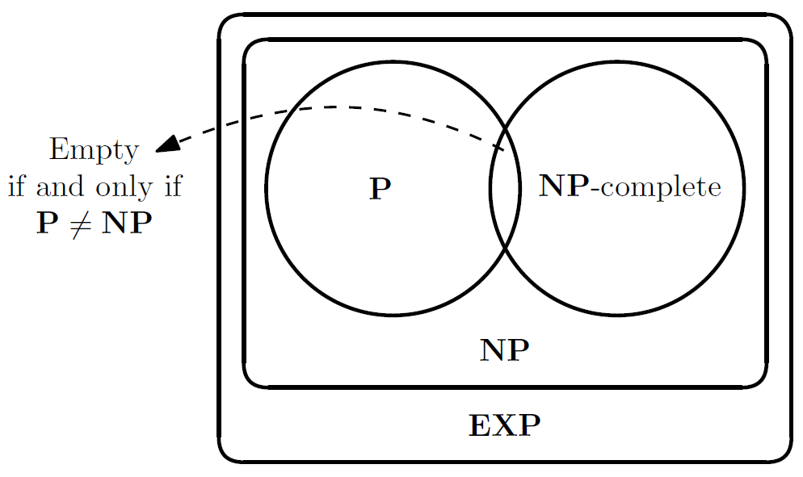

# Between feasible and unfeasible

This is another key concept: we want to look at what happens between the feasible and unfeasible. We labeled them by their presence inside P (the good ones), or their absence (the bad ones). These are non-trivial classes, but what happens inbetween?

P is the embodyment of tractable (i.e. feasible) problems, while EXP (containing the whole P) contains problem that cannot be solved in polynomial time too.
So, what we're looking for are classes of an hypothetical A:

Is there anything interesting in this *grey land* of problems which are known not to be in P, but trivially in EXP? We'll discover that there's a lot to be done, and a lot of interesting properties to be discovered. Many of the problems we see in AI are in this class. 

## The NP Class

The first concept is the **dicotomy between creating and verifying**.
Very often, the language we'd like to classify can be written as follows:

The language  is the language of all strings for which there exists a certificate y such that , seen as a pair, lies in a set of pairs of .
If we want to conclude that  is in , we characterize it by another language A (which is a set of pairs of strings), using a certificate  (which exists).
The other crucial part is , which is a polynomial function.
The certificate which certifies the presence of  in  must be sufficiently.
Think about  as a **test** about the fact that  is an appropriate certificate for . Sometimes this language  is itself decidable in polynomial time.
Does this imply that  itself is decidable in polynomial time?

The point is that one way of checking whether  is in  is looking for certificates. If we find a certificate the problem is solved!
If we cannot find a certificate which satisfies the test, and if we check **all certificates** we can say that  is not in .
The point is there's too many certificates: the strings of length  are exponentially many. Checking all of them is too expensive. Not necessarily, given , we can check all possible  (smaller than ). This is not the only way though. We could follow alternative rules.

There is a dicotomy between crafting a solution for the problem, and checking a candidate solution to be an actual solution. Finding  could be much more difficult than checking if  is a solution. Looking for the appropriate certificates cannot be done in polynomial time. Checking is easier. Crafting requires some sort of *creativity*, which algorithms generally do not have. 

### Modern definition of NP

And that's it. The complexity class **NP** can be defined as the set of all languages L for which there exists a polynomial  and a polynomial time TM  such that

We want M to return 1 when fed with the pair . NP is the class of languages for which **checking certificates** can be checked in polynomial time. This doesn't mean that we can find a solution in polynomial time, rather check certificates. 

So, M can be said **verifier** for . The class NP does not have a natural **counterpart**. It is a class of languages, and it's important for the definition that  is a language. Otherwise, it's not so easy to think about it as a generalization.

A **theorem** on which we will spend some time is the following: NP is one example of a class which is between P and EXP:

Examples of **NP** languages include *Maximum Independent Set*, *Subset Sum*, *Composite Numbers* (actually in **P**), *Factoring*, *Decisional Linear Programming* (actually in **P**), *Decisional 0/1 Linear Programming*.

### Original definition of NP

The class **NP** can also be defined using a variant of Turing machines, called the NonDeterministic Turing Machines or NDTM (this is the original definition and is the reason for the **N** in **NP**: non-deterministic).
A NDTM has and additional state  and two transition functions  and  instead of one and at each step one of them is chosen non-deterministically (currently only theoretical, not implementable).

We say that a NDTM  accepts an input  iff a possible evolution of  with input  which reaches .

 runs in time  iff for every  and for every possible nondeterministic evolution  reaches  or  within  steps with .

For every  and  we say that  iff there is a NDTM  working in time  such that  iff .

## NP-hardness and NP-completeness

The language  is said to be **polynomial-time reducible** to another language  (****) iff there is a poly-time computable function  such that .
 is a pre-order (reflexive and transitive).

For classes **P** or above it and , then  is at least as difficult as . 

A language  is said to be:
- **NP-hard** if . This means that it is at least as hard as any language in **NP**. Simplifying it means that it cannot be too easy (it could be un-computable, **NP**-complete or outside **NP**).
- **NP-complete** if  is **NP**-hard. Note that **NP**-hardness does not imply **NP**-completeness as a **NP**-hard language may be un-computable or outside **NP**.

Note that:
-  is **NP**-hard .
-  is **NP**-hard .

No such language has been found and  has not yet been proven (famous **P** vs **NP** problem).

Proving that a problem is **NP**-complete proves that the problem is not so hard (being in NP), but not so easy either (unless P = NP).

If we want to prove  to be **NP**-complete we have to prove two statements:
-  is **NP** (see above)
-  for any other language . Since   is transitive, we can simply prove that,  where  is a language already known as **NP**-complete.

### The Cook-Levin Theorem

A **kCNF** (**k-Conjunctive Normal Form**) is a propositional formula which is a conjunction of disjunctions ("clauses") which contain at most  literals.
  
The following languages are **NP**-complete:
- 
- 

This is a relevant proof of existence of **NP**-complete problems.