# Semantic Segmentation

#### Table of contents

- [Problem definition](#problem-definition)
- [Datasets](#datasets)
- [Kinect](#kinect)
- [Generalized IoU](#generalized-iou)
- [Slow R-CNN for segmentation](#slow-r-cnn-for-segmentation)
- [Fully Convolutional Network (FCN)](#fully-convolutional-network--fcn-)
- [Transposed Convolutions](#transposed-convolutions)
- [U-net](#u-net)
- [Dilated convolutions](#dilated-convolutions)
  * [Dilated backbone](#dilateted-backbone)
- [DeepLab](#deeplab)
- [Instance Segmentation](#instance-segmentation)
  * [Mask R-CNN](#mask-r-cnn)
- [Panoptic segmentation](#panoptic-segmentation)
  * [Panoptic Feature Pyramid Network](#panoptic-feature-pyramid-network)
- [Appendix: Random Forests](#appendix--random-forests)

## Problem definition

Given an RGB image of size W&times;H in input, produce another image of the same dimension, where each pixel _p_ = (_u,v_ ) has assigned a category _cu,v_ &in; [1,...,_C_].

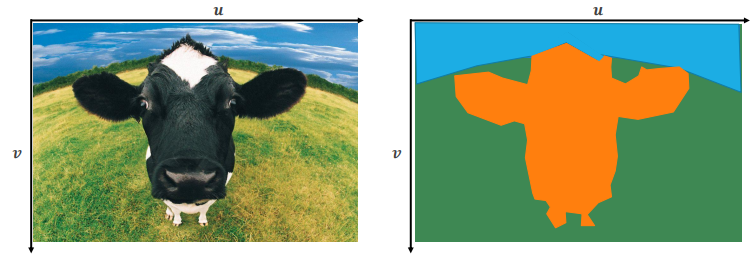

## Datasets

**PascalVOC** and **COCO** have both also datasets for semantic segmentation. As usual, PascalVOC is quite easy to solve nowadays, COCO is instead more challenging.

However **one of the most used datasets for object segmentation is ADE20K**. FOR ADAS, one of the most used is Cityscapes Dataset.

In general, datasets are quite small, because labeling is very expensive.

## Kinect

**Kinect**, like [Viola-Jones](9.md#viola-jones-object-detection-and-its-innovations) was one of the most successful applications of **traditional machine learning** into computer vision and of computer vision into commercial applications.

It uses a standard camera and an **infrared camera paired with an infrared projector**. With infrareds is possible to estimate the distance of objects from the camera, and it is used to create a **depth image of the human body**. From the dept image, the goal is to obtain **3D joint proposals** to predict the human pose.

The key design goals are **computational efficiency** are **robustness** and the innovative idea to solve this hard, ill-posed problem respecting the design goals is to approach it as a **body part segmentation problem**.

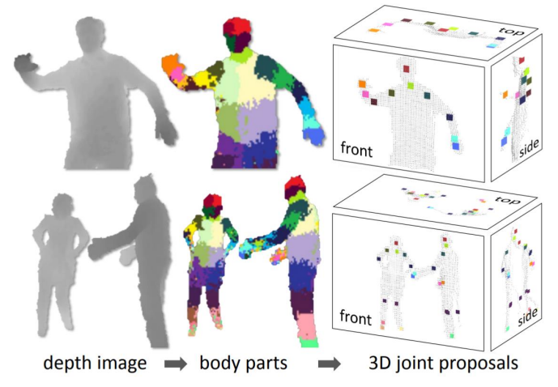

Since it is a traditional machine learning algorithm, we have to define features. At each pixel location _p_, given a **depth map _D_** and some **offsets _&Theta;_**, compute the **simple depth comparison features**:

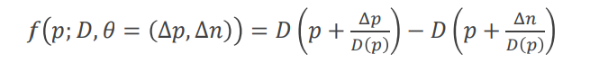

The offset is **normalized** (divided by _D_ (_p_ )) because objects more distant from the camera appear smaller.

These features are **very weak learners**, not effective on their own. However, they can be used together using **[random forests](#appendix--random-forests)**.

## Generalized IoU

[IoU for boxes overlap](#box-overlap-and-non-maxima-suppression--nms-) can be **generalized to segmentation masks**.

To compute **mIoU score** for a dataset, we average _IoUc_ over classes.

mIoU is the main measure to rank semantic segmentation algorithms.

## Slow R-CNN for segmentation

We can use [R-CNNs](9.md#r-cnn) also for segmentation, sliding a window at all possible positions to classify the central pixel of the window.

The loss is the sum of the standard multi-class cross-entropy loss over all pixels.

This approach is too slow, even slower than R-CNN for object detection.

## Fully Convolutional Network (FCN)

The problem of a fully convolutional approach is the convolutions shrink the spatial resolution and in semantic segmentation is very important to be precise at the pixel level.

One of the first architectures to solve this problem is the Fully Convolutional Network (FCN).

Once convolutions have generated a high-level features tensor, it is passed to a 1&times;1 convolution, called **scoring layer**, to fix the number of channels equal to the number of classes _C_. Now we need to **upsample**.

**FCN-32s** (called in this way because apply a total stride of 32) performs upsampling using a **standard, not-learned image processing operator**: bilinear interpolation. But in this way we can only **uniformly spread the coarse information in the final convolutional activation, obtaining very coarse masks**.

A possible solution is, in the same spirit of [FPNs](9.md#feature-pyramid-network), to **upsample multiple activations at different resolutions**. The additional connections between output and internal layers are referred to as **skips**.  
**FCN-16s** (total stride 16) has 1 skip and **FCN-8s** has 2 skips.

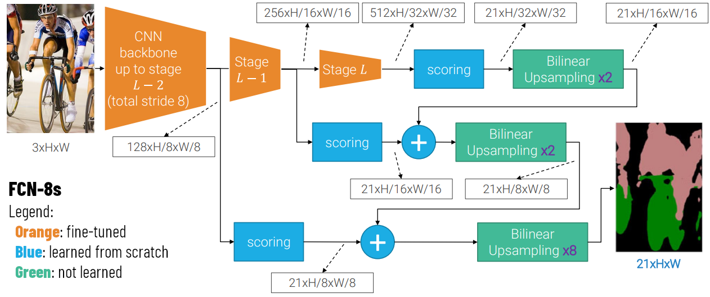

With the VGG backbone, there are basically no improvements after predicting from stride 8 activations. Also is very important to fine-tune the backbone.

## Transposed Convolutions

Standard convolutions **with stride > 1** are a form of learnable downsampling. How can we make a learnable upsampling?

First of all, let's recall that a 3&times;3 convolutions with stride 2 of a 5&times;5 image is the matrix product between the flattened input image and a 9&times;25 matrix _K_. Therefore, if I multiply by the **transposed matrix** _KT_, What I obtain is a **transformation that upsamples feature maps with learnable parameters**, called **transposed convolution**.

It is also possible to realize this operation without matrix multiplication because an equivalent **convolution with fractional stride** always exists. To realize a fractionally strided convolution which must move the kernel on the input at a pace lower than 1, you need to **insert 0s between input pixels**.

Fractionally strided convolutions are helpful to understand what's going on, but what is really implemented in the GPU is the equivalent transposed convolution.

Indeed transposed convolutions are more efficient because they can be realized without expanding the input. A transposed convolution with stride _n_ correspond to a fractionally strided convolution with stride 1_/_ _n_ .

In Pytorch you have `torch.nn.ConvTranspose2d` which implements transposed convolutions.

Other names for transposed convolutions are upconvolutions and backward strided convolutions.

## U-net

U-net was **the architecture that brought [transposed convolutions](#transposed-convolutions) to the front stage**. It is an extension of FCNs with a more pervasive use of skips.

It is divided in **encoder** and **decoder**. Every activation produced by a stage of the encoder has a skip connection with the corresponding level of the decoder. They use **concatenation** instead of the summation used in FCN. Another difference with FCN is that, besides transposed convolutions, also normal convolutions are used in the decoder to further process the activation of each stage.

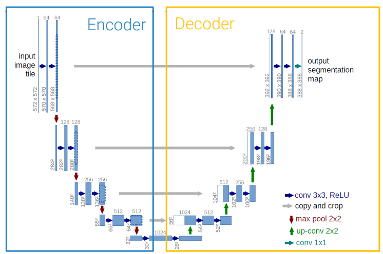

## Dilated convolutions

In semantic segmentation, there is tension between global, or at least regional, context needed to understand what the class of a pixel should be, versus precise, non-regional localization. **When I want some "what" I have to sacrifice some "where"** and vice-versa.

Dilated (or "atrous") convolutions solve this problem keeping **constant cost**. They insert holes like the fractionally strided convolutions, but instead of inserting them into the activation, they **insert the holes inside the kernel**, according to an additional parameter, the **dilation rate _r_** (_r_ = 1 gives the usual, dense convolution).

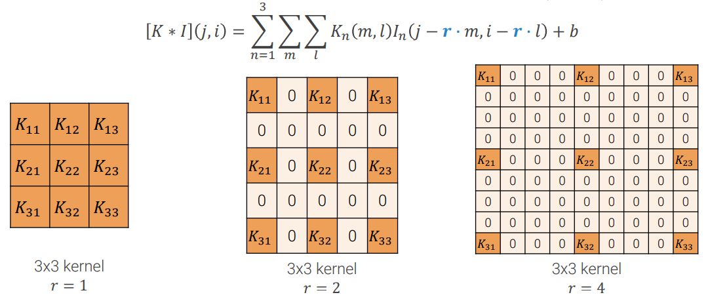

A dilated convolution by itself doesn't mean an easier semantic segmentation, but if we **stack** them with **exponentially increasing dilation rate _rl_ = 2_l_**. In this way, the receptive field grows exponentially, while keeping constant the resolution and the cost.

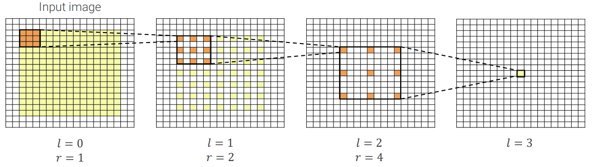

### Dilateted backbone

What people usually want to do is to take a **pretrained backbone** and make it use dilated convolutions. Let's take for instance a [ResNet](6.md#residual-networks--resnet-) backbone. At stage 4, the deepest version of ResNet has 3 bottleneck residual blocks, the first one with stride 2, the other ones with stride 1. The stride is performed in the internal 3&times;3 convolutional layer of the block.

Since the network is pretrained, when introducing dilation we want to respect the resolutions at which kernels were learned, so at the first block of the stage the convolution remains dense (_r_ =1), so it can work at the input resolution. The stride instead is removed (_s_ = 1) in order to not shrink the resolution further. The subsequent blocks are where the dilation rate is increased.

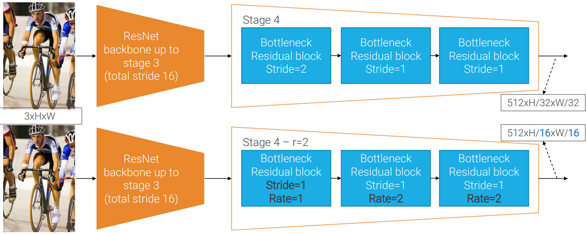

The idea, in general, is to **double the dilation rate in all the subsequent convolutions** each time we remove a stride that was halving the spatial resolution.

Iterating this process for all the previous stages, it's possible to create a full dilated backbone that processes images at full resolution. However, it becomes too computationally expensive due to the large resolution of the activations. The usual tradeoff is to have a total stride of 16 or 8.

## DeepLab

ResNet with dilated convolutions are the backbone used in **DeepLab**, the architecture for semantic segmentation proposed by **Google**. In the figure, the architecture for DeepLab v3 is shown as an example.

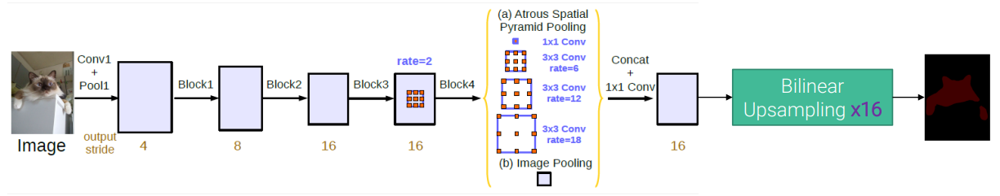

The other innovation of DeepLab is the **Atrous Spatial Pyramid Pooling (ASPP) module**, introduced in DeepLab v2. The idea is to apply different 3&times;3 conv kernels with increasing dilation rates at the same location. Then the outputs are concatenated by a scoring 1&times;1 conv layer.

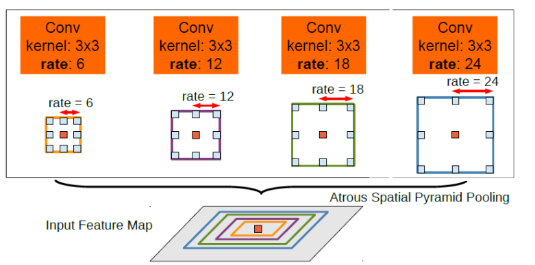

Since the last layer of the ASPP actually behaves like a 1&times;1 conv, because the dilation rate is so high that the kernel only considers the central pixel and pixels belonging to the padding, in DeepLab v3 it is substituted with a real 1&times;1 conv, which is faster. However, to emulate a larger rate convolution, without having this problem of the kernel using only padding pixels, a new layer is introduced which uses global average pooling.

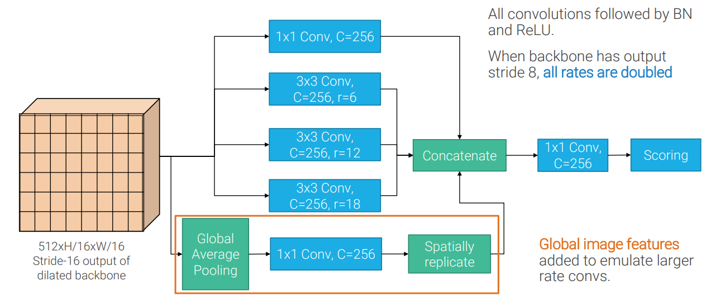

The last version of DeepLab, called **DeepLab v3+**, is a **hybrid** between the spatial pyramid pooling architecture of DeepLab v3 and the encoder-decoder architecture of [U-Net](#u-net). DeepLab v3+ is the state of the art for semantic segmentation and, with the proper backbone, it reaches an mIoU equal to 89.0.

## Instance Segmentation

Instance segmentation lays at the intersection between [object detection](9.md) and [semantic segmentation](#semantic-segmentation). Indeed the former separate instances but provides only a crude approximation of the instance shape (the box), while the latter separates different classes at the pixel level, but does not separate different instances.

Instance segmentation is the task of **detecting all instances of the objects of interest in an image, classifying them, and segmenting them from the background at the pixel level.**

### Mask R-CNN

Mask R-CNN is based on [Faster R-CNN](9.md#faster-r-cnn-with-fpn). For each proposal, it produces also a **mask**. It can easily be done by adding a **[fully convolutional network](#fully-convolutional-network--fcn-)** dedicated to this task. However, due to the quantization added by the Rol Pool layer, the mask does not align very well with the input. For this reason, an improvement of the Rol Pool which avoids both quantizations, called **Rol Align**, is used. It does the following:
 1. **Divide into equally sized subregions**, without snapping Rol to grid.
 2. **Sample feature values** at a regular grid of points within each Rol cell with **bilinear interpolation**.
 3. **Max (or average) pool** sampled feature values in each subregion.

Regarding the loss, it turned out that making the mask head predicting **a binary mask for each class** and making **only the mask of the correct class contributing to the loss** gives better results.

## Panoptic segmentation

In semantic segmentation, we label all the pixels with one of the classes we care about. On the other hand, in instance segmentation, we detect countable individual instances.
Semantic segmentation produces uncountable blobs of **stuff**. Instance segmentation produces countable masks of **things**.
**Panoptic segmentation unifies them**: it performs instance segmentation for things and then semantic segmentation for the remaining stuff.

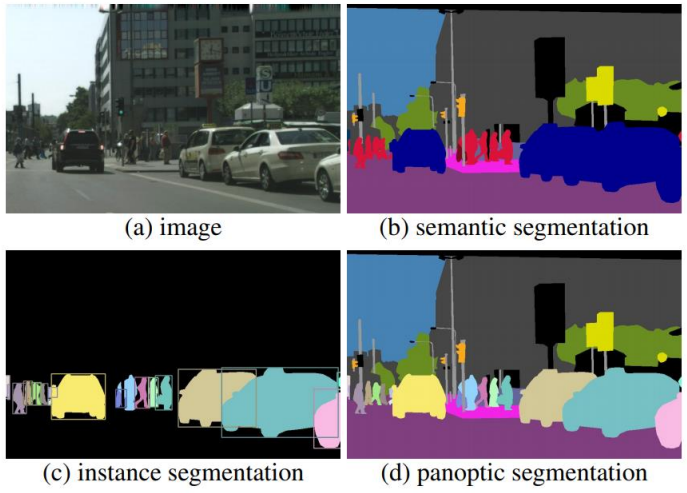

### Panoptic Feature Pyramid Network

Panoptic Feature Pyramid Network is one of the first models proposed to solve panoptic segmentation and it's a **"simple" modification of [Mask R-CNN](#mask-r-cnn)**. The standard Mask R-CNN's architecture solves instance segmentation for the _things_. It remains to solve semantic segmentation for _stuff_. Since it's not exactly clear which scale of the [FPN](9.md#feature-pyramid-network) you should use for semantic segmentation, they proposed to **rescale all the different pyramidal levels to a common resolution and then merge them**, either concatenate them or merge them. Then, on top of this merged tensor, you **run a new fully convolutional network**, called **Stuff FCN**.

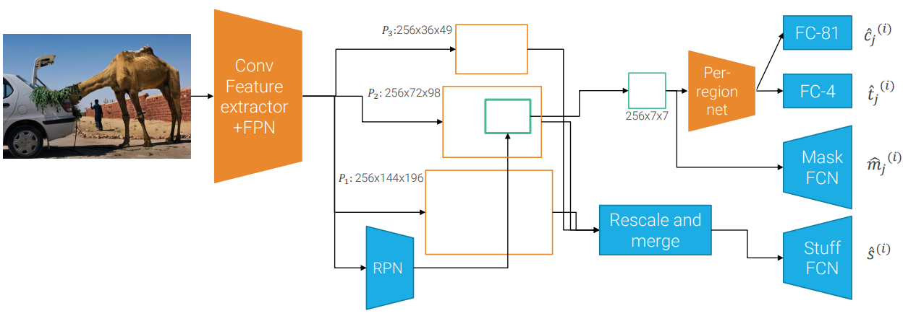

Of course the stuff FCN is run on all the pixels, so you have to decide how to **solve inconsistencies** for pixels detected by both the Stuff FCN and the Mask FCN.

## Appendix: Random Forests

A random forest is an **ensemble of decision trees**. Decision trees are simple but still very effective classifiers, but **find the optimal tree is NP-hard** and small perturbation in the data can lead to very different decision trees. Also, when tuned to reach low bias, they in general suffer from **high variance**.

To create a random forest, we must train _N_ tress on **random views of the dataset** and average their prediction. The idea is that the trees make uncorrelated errors, then the average of those errors will approach zero as the number of trees increases, reducing variance.

There are **theoretical guarantees** that using Bagging on unstable classifiers (like trees) improves their performance.

**Bagging stands for "Bootstrap AGGregatING"**: aggregating, by voting or average, _N_ classifiers trained on bootstrapped replicas of the same dataset.

Random forests use bagging but use also other mechanisms to enforce uncorrelation. Indeed, the problem with bagging is that, for some reason, a subset of features is particularly predictive, then the resulting trees will likely use them and will still be highly correlated. To reduce this correlation, **random forests select a random subset of features to define the split at each node**

Random forests are fast to train and test because trees can be evaluated in parallel in both phases. Also, they are **very interpretable** and robust models.
