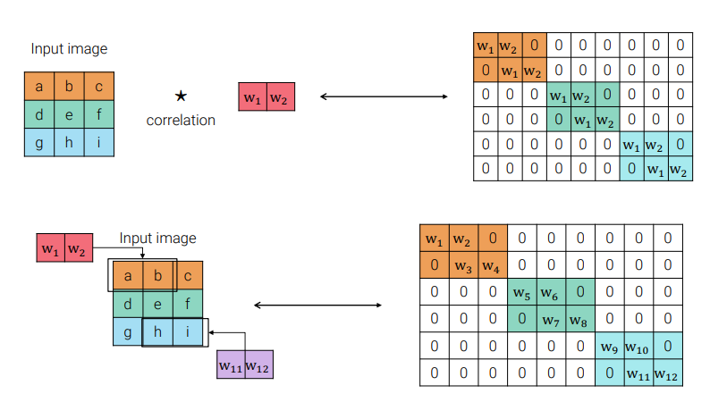
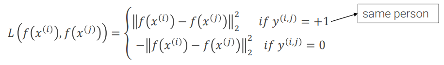
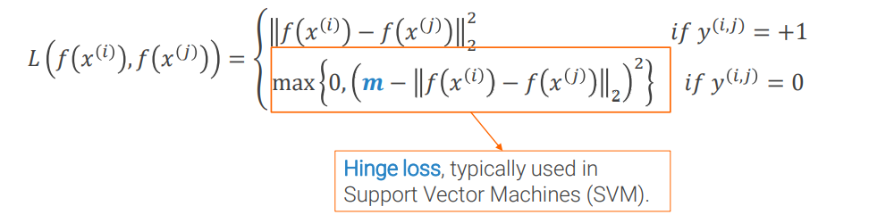
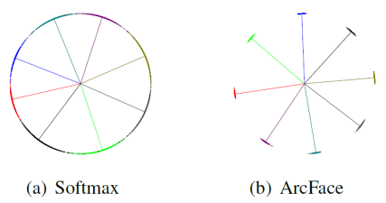

# Metric Learning

#### Table of Contents

- [Face recognition](#face-recognition)
- [Face verification](#face-verification)
- [Metric learning](#metric-learning)
- [DeepFace](#deepface)
- [Contrastive Loss](#contrastive-loss)
- [Triplet Loss](#triplet-loss)
- [FaceNet](#facenet)
- [ArcFace](#arcface)

## Face recognition

The goal of the problem is to match a given query face with one of the millions of identities contained in the database.

A naive approach is to take an image classification architecture and add on top of it a huge classifier (with one output for each identity in the database). The problem of this approach is that from empirical results on ImageNet we know that to learn 1000 classes we need 1.4 million images. So to learn 1 million faces we should need 1.4 billion training images.

Also, in most settings, face recognition is an **open-world problem**, i.e. users in the database can be added or removed. This means that with the naive approach proposed we should re-train the full network each time.

A better idea is to use the image classification architecture without the final classifier as a **feature extractor**, then use a k-NN classifier on the embedding to tackle face recognition.  
**How should we train such a network?**

In image classification, we used cross-entropy loss, which worked well in guiding the network to learn high-level and semantically rich embeddings. However, cross-entropy only enforces **linear separability**. **Distances between elements of the same class can be arbitrarily large** and distances between elements of different classes can be arbitrarily small.

## Face verification

Face verification is a problem **similar to [face recognition](#face-recognition), but simpler**. Given two images, the goal is to confirm that they depict the same person. It is usually solved by **learning a distance/similarity function** between images and a threshold.

**If we can solve face verification, then** given a query face, we can run face verification with all the faces in a certain database and see with whom we get most matches. In this way **we solve also face recognition.**.

## Metric learning

The idea of metric learning, aka similarity learning, is to **use a specific loss** at training time to guide the feature extractor to favor **a clustered structure of the embedding** such that
 1. the distance between samples of the same class is minimized;
 2. the distance between samples of different classes is maximized.

The first problem we have if we want to learn a network that gives us the similarity between samples is that it must see two samples together at training time. The solution, called **siamese network training**, is to **create two copies of the network with shared weights**. This is equivalent to having the same model running once on each of the two samples as if they were a mini-batch. Indeed, when using mini-batch, the flow doesn't change too much between standard and siamese network training, you only have to pay attention to how the mini-batch is built and how the loss is computed.

## DeepFace
DeepFace (Facebook, 2014) is one of the first deep learning solutions proposed to [face verification](#face-verification). It uses a **very simple network inside a quite complex pipeline**. Indeed it was developed at the beginning of deep learning development and the general idea was that deep networks should be treated gently. So to eliminate pose variance at the beginning of the pipeline they preprocess images to **frontalize faces**.

The network exploits this prior knowledge of faces only being frontal by using **locally connected layers** instead of convolutional layers. Locally connected layers apply a local filter like convolutions, but **do not share weights across different locations**. Hence they **are not equivariant to translations**. Indeed, while equivariance was important in convolutions to generalize the learned knowledge, it makes sense to remove it when processing aligned images, in order to specialize the filters.

After the network is trained with a standard cross-entropy + softmax training, the classifier at the end is removed to obtain a feature extractor. At this point, the last fully-connected layer is fine-tuned for face verification, the embedding is then normalized for both images, and then they are combined computing the absolute difference. The difference is then passed in input to a binary classifier (a fully connected layer), which outputs if the two faces represent the same person or not.

## Contrastive Loss
DeepFace still casts face verification as classification, which may not generalize well in open-world problems. How can we **introduce a loss enforcing directly a clustered embedding structure**? A simple loss that capture both intra-class and inter-classes requirements is

Indeed the minus in front of the second term enforces a big inter-classes distance. However, it's not great to have a negative loss, because when you average them in mini-batches it can create problems. Also **the second term is unbounded**, so the loss is never "happy" and it will try to push clusters further and further away even after they are already far enough.

So the previous loss doesn't look very promising, but with a small modification it can actually work: we introduce a **margin _m_** to lower bound the second term and to force it to be positive.

One of the first architectures to make contrastive loss popular again was **DeepID2** (2014) which used it in combination with cross-entropy loss.

## Triplet Loss

In [contrastive loss](#contrastive-loss), we enforce intra-class distance to be low and inter-class distance to be high independently, reasoning pair-wise.

The idea behind triplet loss is to express both constraints at once, **reasoning on triplets**, containing a sample image (called _anchor_), an image of the same class (called _positive example_), and an image of a different class (called _negative example_).

This formulation is **not very robust** because it does not guarantee large inter-class distances. Also, in this case, we can improve it with the **margin**.

The most important part in training embedding with the triplet loss is to **effectively form the triplets**. Indeed large datasets like the ones used in computer vision have an even larger number of possible features, some more informative than the others and it is important to pick only the most informative ones.  
In particular **is important the choice of the negative examples** because there is usually a lot of _easy negatives_, which are the negative examples already respecting the triplet loss' constraint at the beginning of the training or after really a few epochs.

Hence, a mini-batch is formed by picking a fixed number of images for _D_ identities and randomly sampled negatives. Then triplets are formed **online** by:
 1. creating all the possible (anchor, positive) pairs for each identity;
 2. performing the **semi-hard negative mining**: creating a triplet for each negative if 

## FaceNet

FaceNet (Google, 2015) uses as backbone an architecture developed at Google some years before: [Inception v1](6.md#inception-v1--googlenet-). As in [FaceNet](#facenet), **normalization of the output embedding is key**, in particular, they use L2 normalization. Also, some pooling layers within inception modules are L2 pooling layers instead of max pooling.

## ArcFace

Several modern works are trying to perform metric learning by **modifying the traditional softmax loss to also enforce high intra-class compactness** instead of using [contrastive loss](#contrastive-loss) or [triplet loss](#triplet-loss) because they are fragile: training is not easy and does not always succeed. ArcFace belongs to this line of studies.

In ArcFace, the output of the backbone is normalized, and then, recalling that [linear classifiers can be intended as template matching](2.md), each column is interpreted as a _template_. The last layer computes **angular distances** between templets and the embedding. To enforce intra-class compactness, ArcFace artificially adds a constant penalty (called _margin_) to the angle formed with the template of the correct class, in this way **features cluster around templates**.

