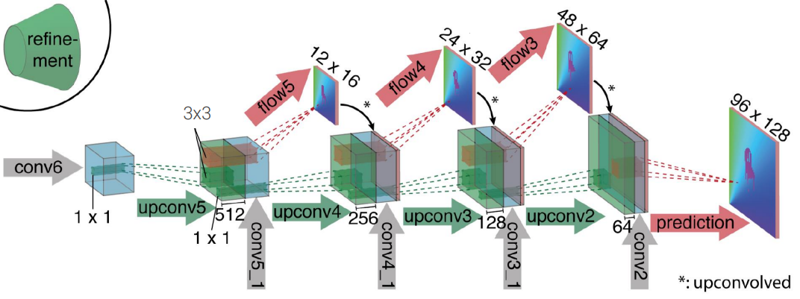
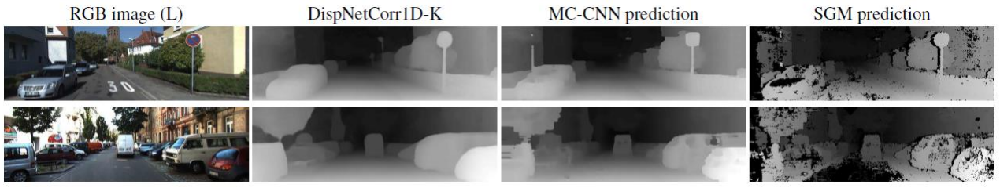
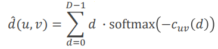
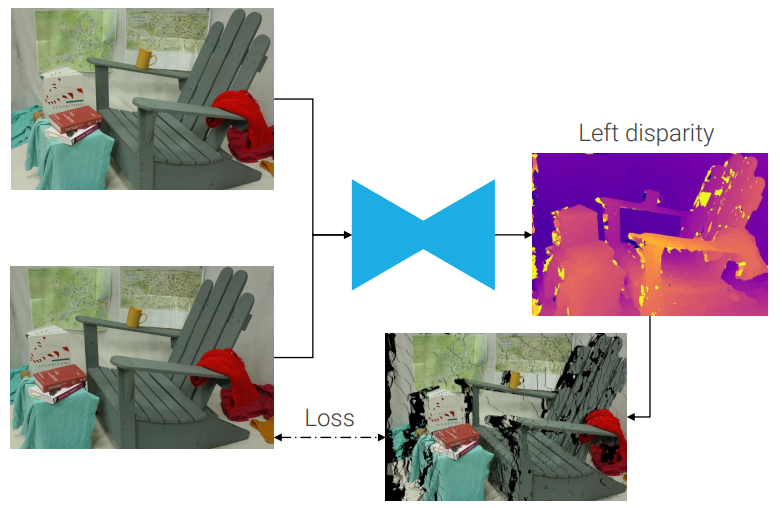
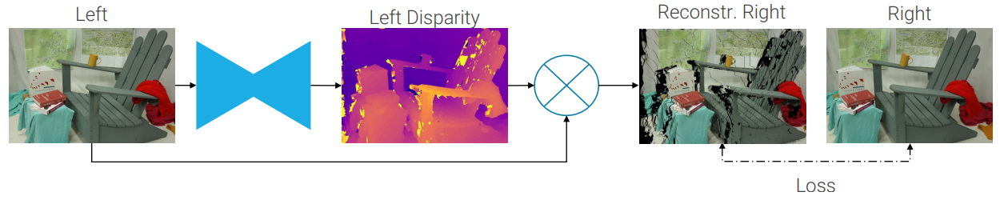
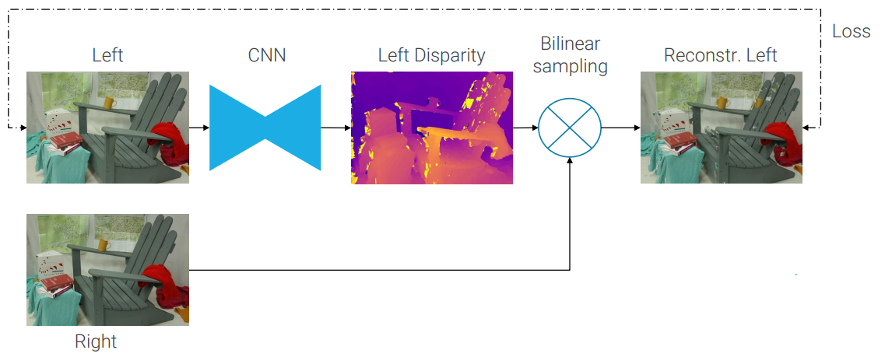
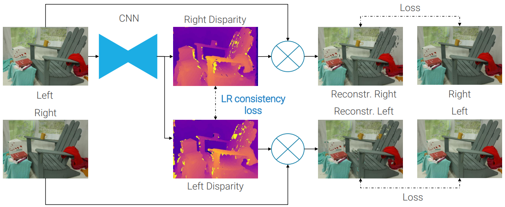

# 12. Depth estimation

#### Table of Contents

## Stereo vision

Stero vision was the most used technique to estimate depth before machine learning in computer vision. It uses two cameras with aligned optical centers, parallel image planes and the same **focal length _f_**. The only difference between the two reference frames is a distance along the horizontal axis, called **baseline _b_**.

These requirements, that can be obtained with perfect hardware alignemnt and/or rectification, guarantee us that corresponding points in the two frames will be along the same row and its **distance from the camera _z_** can be recovered from the **disparity _d_** = _uL - uR_ as **_z_ = _bf/d_**.

The problem of findining corresponding points, called **correspondence problem**, in traditional computer vision is ususally solved using robust matching costs (or scores), like the **normalized cross correlation _NCC_**, computed between windows.

The simplest method at this point is to compute, for each pixel, the matching cost with the pixels in the search space, each one with a different disparity. Then using the Winner-Takes-All methof: i.e. computing the arg max to take the disparity with the higest matching cost.

Computing all matching points for all pixels at all evaluated disparity we can create the **cost volume**, aka Disparity Space Image (DSI), which is a 3D data structure. Pixels' depths are then obtained reasoning on the full volume using, for example, the Semi Global Matching algorithm (SGM).

|  |
|:--:|
| *Traditional stereo vision pipeline* |

## Optical flow

A related problem to [stereo vision](#stereo-vision) is optical flow: **estimating the apparent motion of all pixels between two frames**.

It has less requirements than stereo vision (e.g. frames are not calibrated), but it does not recover depth.

## MC-CNN

The first part of the first part of the traditional stereo pipeline to be solved with deep networks has been the computation of the matching cost. This is done with a [siamese network](11.md#metric-learning) trained to extract features from the two patches, then features are concatenated and a classification head estimates the cost patches as being correspondent or not. This architecture was named MC-CNN (matching cost convolutional neural network).

## Datasets

The standard benchmark for optical flow and stereo is KITTI. Due to the high difficulty and costs needed for labelling scenes with stereo or flow ground truth, only 200 training images and 200 test images are available.

For this reason a large **synthetic dataset** has been released by the authors of [DispNet](#flownet-dispnet). Networks are usually trained on it and then fine-tuned on KITTI.

## FlowNet/DispNet

After MC-CNN, also end-to-end solutions to predict directly the disparity map from a pair of images have been invented. The first proposal was an architecture used for solving [optical flow](#optical-flow) (FlowNet), which was then re-casted to solve stereo (DispNet).

It starts with a fully convolutional siamese network to extract features. Then matches are computed with a [correlation layer](#correlation-layer) and further processed with an encoder/[decoder](#decoder) structure very similar to [U-net](10.md#u-net)

|  |
|:--:|
| _FlowNet/DispNet architecture. The refinement module is a decoder._ |

### Correlation layer

The correlation layer wants to **mimic the computation of matching costs** performed in traditional stereo pipelines. Indeed doing the dot product between the features at a certain location (_u,v_ ) and the features at the same location plus a displacement (_du, dv_ ) it is almost the NCC. In particolar, it is an unnormalized NCC.

This dot product can be implemented like a standard **convolutional layer without learnable parameters**, indeed the features from one side of the siamese network are acting like the kernel.

#### FlowNet's correlation layer

For [flow](#optical-flow), you have to specify (hyperparameters) the number of displacements _D_ to prob along **every dimension**.

The output would be in principle a 4D tensor of shape D&times;D&times;H&times;W, but it is reshaped to D2&times;H&times;W because convolutions need a 3D tensor.

To reduce the computational cost, the correlation layer usually has some **stride**.

#### DispNet's correlation layer

For stereo, we know that corresponding points must lay on rows, so **only a horizontal 1D search space is probed**. Hence it is way cheaper and usually **stride is not needed**.

### Decoder

#### FlowNet's decoder

Expanding the refinement module we can see that is made only by [upconvolutions](10.md##transposed-convolutions) and skip connections, like a [U-net](10.md#u-net)'s decoder. The main difference with U-net is that, since depth estimation is an harder problem than [semantic segmentation](10.md#problem-definition), you need a more **careful supervision**, consisting in computing the L1 loss at all resolutions and then computing an output for all the intermediate layers of the decoder and supervisionate all of them (flow5, flow4 and flow3 in the figure).

|  |
|:--:|
| _FlowNet's refinement module: U-net-like decoder, with upconvolutions and skip connections._ |

#### DispNet's decoder

DispNet follows the same organization of FlowNet, but it introduces **convolutions in between upconvolutions** in the decoder, to reduce checkerboard artifacts.

### Results

Both DispNet and MC-CNN are way better than traditional algorithms. MC-CNN is much slower but, with the proper backbone can achieve better results than DispNet.

## GCNet

Geometry and Context Network, aka GCNet (2017), builds a **real** cost volume and tries to combine the effectiveness of deep learning with the 30 years of knowledge of traditional stereo algorithms.

### Feature extraction

At the beginning of the model we extract high level features from the images with in a **siamese encoder**, which is a [ResNet](6.md#residual-networks--resnet-) backbone with total stride 2.

### 4D Cost Volume

At the end we have two tensor containing the features of the two input images. At this point what we did in [DispNet](#flownet-dispnet) was to pass them through the [correlation layer](#correlation-layer) that computes the matching costs using the unnormalized NCC, which is not learned.

In GCNet, instead, we want to **learn also the matching cost**, because [MC-CNN](#mc-cnn), which [was the state of the art](#results), learn it.

So, given the two 3D feature maps, we **create a 4D data structure**, in the following way: for each location (_u,v_ ) in the first feature map (first two dimensions), for each disparity _d_ (third dimension), you take the corresponding location (_u+d, v_ ) in the second feature map and you concatenate the features of the two positions (fourth dimension). **To sum up, the 4 dimensions of the resulting tensor are (_horizontal spatial resolution, vertical spatial resolution, disparity, features_ )**.

This is similar to what the correlation layer of DispNet does, but it uses concatenations instead of dot products. this choice lets the subsequent layers learn the best aggregation function.

### 3D U-net

At this point of the pipeline we have the 4D tensor described in the previous section and **we want to obtain a real cost volume**, which is a 3D object without channels: the three dimensions are height, width and the disparity. At each position it must contain the corresponding matching cost.

This is done by a **U-net architecture which uses 3D convolutions** instead of 2D convolutions. 3D convolutions are very expensive, so this module of the whole architecture has a very high computational cost.

### Differentiable argmin

We have obtained a real cost volume, now we could perform [Winner-Takes-All](#stereo-vision) on each spatial location, obtaining the disparity for the whole resolution. The problem is that **argmax and argmin are not differentiable** and its gradient with respect to its input is flat.

The authors propose to realize it with a **differentiable alternative**. Given the vector of costs _cuv_ (_d_ ) at location (_u,v_ ), the output disparity is given by the **soft argmin**.

Indeed, the softmax function amplifies the difference between the cost functions and the value of the summation will be very similar to the one of an argmax (actually an argmin, since there is a minus inside the softmax) function, because the softmax of the highest cost function will be close to 1, while all the other ones will be close to 0. Since they are multiplied for the corresponding disparity, the disparity with the higest matching cost will contribute almost entirely.

### DispNet versus GCNet

GCNet is slower and requires more memory to train (3D cons are costly) but it is also more accurate and converges faster. However GCNet has higher error on foreground objects.
All subsequent successful networks are based on one of them.

## Depth from monocular cues

Deep learning makes possible problems that were previously unfeasible. Indeed, in principle, it is not possible to recover depth information from a single image, which is a mathematically ill-posed problem, but humans can do it based on their experience of the 3D world. If humans can learn it, then maybe also machines can learn it. Training a machine to mimic this ability of the human visual system is referred to as the solving the **single-view (or monocular) depth estimation** problem.

Preliminary attempts used the classical supervised framework we have used so far. However to train it you learn a lot of synthetic data as in stereo and then expensive hardware like Lidar or Kinect for fine tuning on the real scenario.

On the other hand is relatively easy to obtain a pair of aligned images and predict a disparity. If we do not have the disparity ground-truth, can we still understand if our prediction is a _good_ disparity? The disparity is actual the offset to apply to a pixel in the left image to find the corresponding pixel in the right image, which should have the same RGB value.  
So, we can use the estimated disparity and the left view to **_hallucinate_ a novel right image and evaluate its quality by its similarity to the real right image**. This is an example of **self-supervision**.

### Monodepth

This idea can also be used to solve depth from mono and the first architecture to propose it is called Monodepth (2017).

One problem is that, starting from the input image, we are performing **forward mapping**, which is not ideal because it **results in holes in the reconstructed images**. To solve it we can predict a disparity map aligned with the right image to perform **backward mapping**. So, we pick a pixel in the output image, we check the correspndent dispairity and we use to take the corresponding pixel in the input image. However **disparities are continuous values**, how can we move by non integer coordinates? This can be simply solved with a **(bi)linear interpolation**.

Since we are using backward mapping, the predicted disparity must be aligned with the input image, so the resulting pipeline is the following:

To compare the ground truth left image with the reconstructed one we have to choose a good distance function. From k-NN experiments we know that L2 norm is not very effective. A mix of a perceptual distance, **structural similarity SSIM index**, and L1 norm was faounf to be the most effective mix.

This version already produces a relatively good depth map from a single view. yet, the inferred disparities exhibit many **_texture-copy_ artifacts**, i.e. artifact created copying textures in the input image.

To solve this problem and improove results, Monodepth compute both left and right disparity maps, better exploiting the right image. This also allows to calculate a **LR consistency loss** between the two reconstructions.

The CNN **architecture** used by MonoDepth is a DispNet-like network **without the correlation layer**.

The results are pretty striking: Monodepth **performs even better than supervised approaches**

## SfMLearner

Monodepth results are impressive, but still requires stereo images at training time, which are not commonly available. **Structure from Motion Learner (SfMLearner)** relaxes this limitation, by applying the same sel-supervised image reconstruction idea **to unlabeled videos**.
