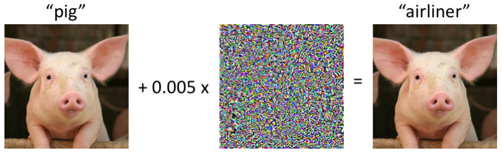
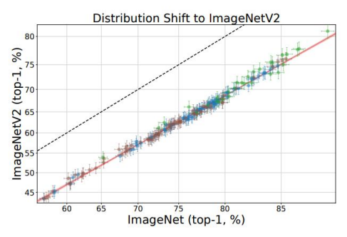

# 13. Recent topics

## Limitations of supervised learning

Supervised learning is great but labels are expensive (ImageNet 21k took 22 human years, and it "only" contains 21k concepts) and ground-truth is a convenient fiction: for real problems does not exist a ground-truth.

Also supervised learning is prone to several problems. For example every CNN can correctly classify the left picture in this image, but if you just use SGD to backprop with respect to the input, instead of to the weights, trying to find a transformation of the input that increases the score of another class, you can actually find a noise pattern that when added to the input image is imperceptible for humans, but leads the model to wrongly classify the image.

Also supervised learning, no matter what, **will cheat**. It wants to bring the loss down for the particular dataset it is trained on. Studies trying to understand how much performances on a particoular benchmark move on another benchmark show that changing the dataset with a similar one results in lower performances, with a 10% gap on top-1 accuracy. Things are even worse when using different dataset e.g. using images containing sketches of the object instead on photos.

**Supervised learning** probably cannot overcome this gap by itself, because it **does not let our network learn common sense**.

Common sense is the general understanding of the world, before to try to solve a task.

## Self-supervised learning

When used to learn effective representations to improve supervised learning, unsupervised learning is often referred to as self-supervised learning.

An example is **pretext task training**, consisting in solving a task you don't care about, but which is easy to solve with no labels and forces the network to learn representations that will encode how the world looks like.

Pretext task training is used as pre-training, then the model is fine-tuned on the real supervised task.
