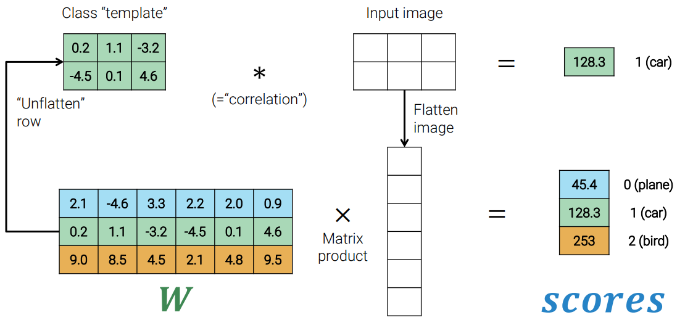
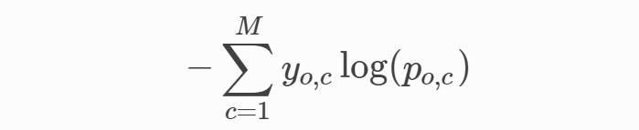
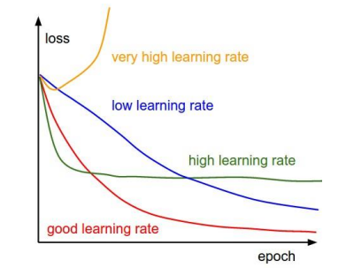

# 2. Linear classifier

#### Table of Contents

- [Introduction](#introduction)
- [Linear classifier as template matching](#linear-classifier-as-template-matching)
- [Learning as optimization](#learning-as-optimization)
- [The loss function](#the-loss-function)
  * [0-1 Loss](#0-1-loss)
  * [Softmax function and cross-entropy loss](#softmax-function-and-cross-entropy-loss)
  * [Losses in PyTorch](#losses-in-pytorch)
- [Gradient-based optimization](#gradient-based-optimization)
  * [Gradient descent](#gradient-descent)
  * [How to compute gradients](#how-to-compute-gradients)

## Introduction

In [lesson 1](1.md) we have seen how to use kNN to create an image classifier. The main problem is that it needs a lot of samples, so now we see what happens if we use just one **global parametric** model.

What we want to find are a function _f_ and a parameter _W_, such that, given an image _x_, _f(x;W) = class_, where _class_ is a scalar.
Since _class_ is a scalar, and _x_ is an _N_ &times;1 flatten vector, the easiest approach is to define _f(x;W) = Wx_ with _W_ being a 1&times;_N_ vector. In this way, the result _class_ is a scalar and our only concern is to find a proper vector _W_.

This is actually a **bad idea since classes are assigned to integer ids randomly**, so 2 classes with nearby ids do not necessarily share visual similarities.

A better approach is to look for a parameter _W_ such that, given an image _x_, _f(x;W) = Wx = scores_, where scores is a vector _M_ &times;1, with _M_ the number of classes, so _W_'s size is _M_ &times;_N_. What we obtain is a **score** for each class and the predicted one will be the class with the highest score.

## Linear classifier as template matching

This process corresponds to correlating an image with each class "template". Templates are learned during training.

Actually, _f_ is defined as _f(x;θ) = Wx + b_ (with _θ = (W, b)_ and _b_'s shape equal to _Mx1_). _b_ is called _bias_ and it makes the model more flexible.

## Learning as optimization
The **hypothesis space H** of a machine learning model is the space of the functions it can learn. So the learning step corresponds to **solve the optimization problem** that finds the best function _h*_ ∈ H such that **_h* =_ argminh∈H _L_(_h,Dtrain_)**. In a parametric model this means finding the best parameters _θ*_ such that
_θ* =_ argminθ∈Θ _L_(_θ,Dtrain_).

## The loss function

_L_ is called **loss function**, aka objective function, cost function, and error function. If the loss is high our classifier is performing poorly and we also expect low accuracy. Otherwise, our classifier is good.

### 0-1 Loss
Defining it as the number of errors (**0-1 loss**) is not a good choice, because the number of errors is insensible to small (and sometimes also big) changes of the parameters, so the 0-1 loss does not tell us if we are "moving" in the "right" direction.

### Softmax function and cross-entropy loss
There are theoretical and practical reasons to **prefer a loss that transforms the scores computed by the classifier into probabilities** and then perform **maximum likelihood estimation** of _θ_. The simplest way to transform random scores into a probability mass function over the space of classes is the **softmax** function. It applies the exponential function to scores, and then normalizes the scores vector.

After we have applied softmax to our scores, we can think of our linear classifier as a family of probability mass functions over the classes given an image, indexed by the vector of parameters _θ_. Then, if we calculate the maximum likelihood estimation of _θ_ we obtain the **cross-entropy loss**.

Where _M_ is the number of classes, _yo,c_ is equal to 1 if class label _c_ is the correct classification for observation _o_ and it's equal to 0 otherwise, _po,c_ is the predicted probability of _o_ belonging to class _c_.

In other words, the cross-entropy loss is equal to **the negation of the logarithm of the predicted probability for the correct class.**

The name _cross-entropy_ comes from a distance used in information theory.

### Losses in PyTorch

In PyTorch, there are both `NLLLoss` (where NLL stands for negative log-likelihood) and `CrossEntropyLoss`. The former expects raw scores, while the latter expects probabilities.

## Gradient-based optimization

Our goal is to reach a low point, ideally the global optimum, in the **loss landscape**. However, the landscape is not visible, since we only know the height where we currently are. What we can do, then, is **follow the slope** to reach a lower point. This gives no guarantee we will find the lowest point, but it's more efficient than performing a random search.

For the multivariates function, the largest slope decrease is in the **opposite direction of the gradient: -&nabla;_f_ (x)**.

### Gradient descent

Formalizing this idea we come up with an algorithm called gradient descent:

 - (Randomly) initialize _&Theta;_ (0);
 - for _e_ = 1,...,_E_ epochs:
   * **Forward pass**: classify all the training data to get the predictions and the loss;
   * **Backward pass**: compute the gradient;
   * **Step**: update the parameters: _&Theta;_ (_e_ ) = _&Theta;_ (_e_ &minus;1) &minus; _**lr**_ &sdot;_g_

Where _**lr**_ is a new hyperparameter called **learning rate**. It is a key hyperparameter since it strongly affects the training.

### How to compute gradients

Gradients can be computed **numerically**, which is an easy method to implement, but slow and approximate. Another way is **analytically**, by exploiting the rules of calculus and, in particular, the **chain rule**. This is an exact method, but still very slow. The best way is **automatically**, by **automatic differentiation**, e.g. with the backpropagation algorithm.
