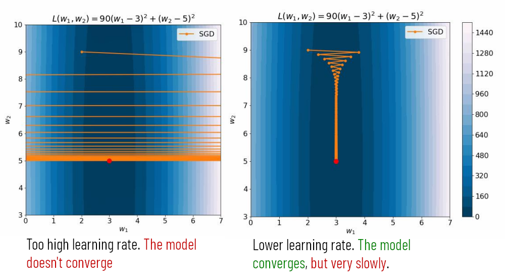
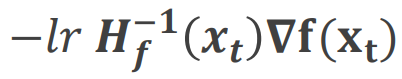
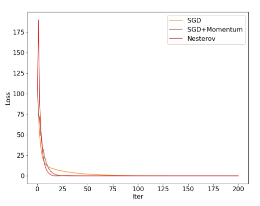
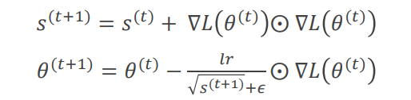
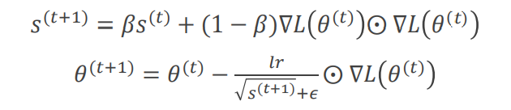
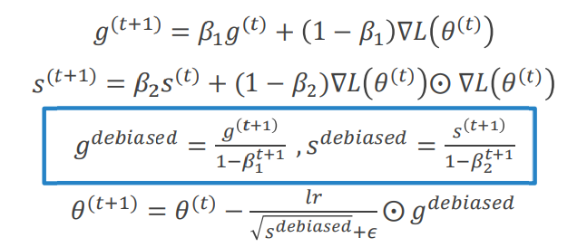
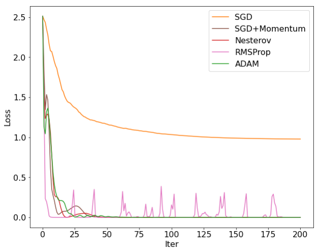

# 3. Improving gradient descent

#### Table of Contents

- [Limits of gradient descent](#limits-of-gradient-descent)
- [SGD - Stochastic Gradient Descent](#sgd---stochastic-gradient-descent)
- [SGD - Stochastic Gradient Descent with mini-batches](#sgd---stochastic-gradient-descent-with-mini-batches)
- [Problems with gradient descent and SGD and how to solve them](#problems-with-gradient-descent-and-sgd-and-how-to-solve-them)
  * [Second-order methods](#second-order-methods)
  * [Critical points and Momentum](#critical-points-and-momentum)
    + [Nesterov momentum](#nesterov-momentum)
  * [Adaptive Learning Rates](#adaptive-learning-rates)
    + [AdaGrad](#adagrad)
    + [RMSProp](#rmsprop)
    + [ADAM](#adam)
    + [AdamW](#adamw)
- [High dimensional spaces are tricky](#high-dimensional-spaces-are-tricky)

## Limits of gradient descent

Gradient descent is one of the possible ways to find the solution to the problem of minimizing the loss. Our loss decomposes into a sum of contributions of individual examples in the training set. Since the gradient is a linear operator, this means that also the gradient decomposes into a sum of gradients.
So if we have a very big dataset, like ImageNet (1.3M of training images) **we must compute the gradient for each image and the sum of all of them, just to know in which direction perform one step, which usually is very tiny**, since the learning rate is usually small.

This is very inefficient but it's the only way to compute the _exact_ gradient. The point is that this is not actually the real gradient, indeed even if ImageNet is large, it is just a small fraction of all the possible images of its 1000 classes, so **the gradient computed by gradient descent is an approximation of the _true_ gradient**, even when computed on all available training data.

## SGD - Stochastic Gradient Descent

So if our only possibility is to rely on an approximation, at least we can choose a more efficient one, like the **Stochastic Gradient Descent (SGD)**, which is sometimes called _on-line gradient descent_, since it consists in **updating the model immediately after each sample** is received. One important step in the SGD is to **randomly shuffle** the samples at each epoch, because it minimizes the probability of having a bad ordering of our input data. The algorithm can be summed up in these steps:
 - Randomly initialize parameters
 - for _e = 0,...,E-1_ epochs:
   * Randomly shuffle examples in _Dtrain_
   * for _i = 0,...,N-1_:
     - forward pass
     - backward pass
     - update the parameters

## SGD - Stochastic Gradient Descent with mini-batches

A compromise between the two extremes of updating the model only after that every image in the training set is processed and updated after each image, is to use a **mini-batch of data of size _B_** at each iteration instead of a single example. This is called **Stochastic Gradient Descent with mini-batches**, but more often than not people just simply say SGD to refer to this version with mini-batches, instead of that to the base SGD. The number of parameters updated in each epoch will be _U = |N/B|_.

The algorithm can be summed up by these steps:
 - Randomly initialize parameters
 - for _e = 0,...,E-1_ epochs:
   - Randomly shuffle examples in _Dtrain_
   - for _u = 0,...,U-1_:
     - forward pass over _B_ examples
     - backward pass over _B_ examples
     - update the parameters

What is a **good choice for _B_**? Usually **larger batches provide smoother (less noisy) estimations of the gradient and also better exploit parallel hardware**. However, very large batches could be too big for GPU's memory. Usually **a good choice is a power of 2 that fits in the GPU's memory**. Smaller batches may have a regularization effect and result in better generalization, at the cost of higher runtime.

## Problems with gradient descent and SGD and how to solve them

Gradient descent and SGD (with or without mini-batches) **like "spheres"** because in this case, the convergence is straight and fast. **In other shapes, like "canyons" performance can be very slower** and/or we could be forced to use small learning values in order to guarantee convergence (resulting in even more slow performances).

|  |
|:---:|
| _SGD's behavior in a canyon_ |

### Second-order methods

The solution is to use a so-called **second-order method**. The idea is to **generalize Newton's method for a multidimensional case**. This means taking larger steps in areas of low curvatures and smaller steps in areas of high curvatures. Doing some math, it turns out the best update is _&minus;f'(xt)/f''(xt)_. When theoretical conditions are met (quadratic functions) we get convergence in one step without using the learning rate, unfortunately in the real world, our loss is not quadratic at all. So we have to compute this:

  
where _Hf_ is the Hessian matrix, which is the matrix of the second-order derivatives.

In modern machine learning we have millions of parameters, and storing _H_ requires _O(k2)_ memory. Moreover, we have to invert it, which takes _O(k3)_ operations. There are algorithms to reduce memory and time complexity in the batch case but they are yet to be extended successfully in the mini-batch case. This makes **second-order methods impractical**.

### Critical points and Momentum

Another problem of (S)GD is critical points, like saddle points and **local minima, which can attract and halt the optimization**, even if in reality is difficult to be halted by a saddle point, but it is still probable for local minima.

One of the most used modifications of SGD, which also solve this problem, is **momentum**. The key idea is to add a _velocity_ term to SGD, so now the update rule is:

_v (t+1) = &beta;v (t) &minus; lr &nabla;L(&theta; (t))_  
_&theta; (t+1) = &theta; (t)_ &plus; _v (t+1)_

Where _&beta;_ &in; [0,1) is the momentum. It reduces the effect of noise and allows to obtain faster convergence.

#### Nesterov momentum

> _It is better to correct a mistake **after** you have made it_  
-Geoffrey Hinton

It's a variant of momentum proposed in 1983.

_v (t+1) = &beta;v (t) &minus; lr &nabla;L(&theta; (t) **+ &beta;v (t)**)_  
_&theta; (t+1) = &theta; (t) + v (t+1)_

The concept is to look ahead to the next position, calculate the gradient there, and use it to correct the computed direction at the current point. usually, there is not a big difference in performances between Nesterov momentum and base momentum, but sometimes using Nesterov's helps get better performances.

|  |
|:---:|
| _While there is a big difference between using momentum or not, the improvement of using Nesterov momentum rather than the standard one is very small, but sometimes it helps._ |

### Adaptive Learning Rates
If changes in the steepness of the loss are axis-aligned, we can think also of momentum as:
 - **reducing the step** of updates for dimensions whose gradient direction is not consistent across iterations;
 - **increasing the step of updates** for dimensions whose gradients direction is consistent across iterations.

However, **momentum** does not assume that effects are axis-aligned and **may therefore lead to better solutions if properly tuned**. Yet, **adaptive learning rates methods**, and especially [ADAM](#adam), **tend to work reasonably well even when their parameters are not perfectly tuned**.

#### AdaGrad

It proposes to rescale each entry of the gradient with the inverse of the history of its **squared** values. The name, which stands for Adaptive Gradients, is misleading, since it **adapts the learning rate**, and not the gradient

  
where &odot; is the element-wise product and _s (t)_ is a vector with an entry for each parameter (i.e. search space's dimension). So each entry will be big according to how big the gradient updates for the corresponding parameter were.

What happens is that weights receiving small gradients have their effective learning rate increased, while, on the other hand, weights receiving large gradients have their effective learning rate decreased. The main problem of this approach is that **it may reduce all learning rates too early**, when we are still far from a good minimum. This is due to **_s (t)_ monotonically increasing**.

#### RMSProp

This modification to [AdaGrad](#adagrad) introduces a parameter &beta; &in; [0,1] (typically 0.9 or higher) to govern the decay of _s(t)_ through an **exponential moving average (EMA)**

What happens is that the more the history is in the past, the less it influences the computation of the new learning rate.

#### ADAM

ADAM (ADAptive Moments) can be thought as the **combination between [RMSProp](#rmsprop) and [momentum](#critical-points-and-momentum)**. Indeed, besides storing the running average of gradient's squared values, it also stores the running average of gradient's values, which is a momentum-like term. This new term counteracts the effect that we are getting with RMSProp. Indeed if we are getting big gradients awlays in the same direction, RMSProp does not take into account that they are consistent. It only sees that they are big and tend to diminish the learning rate in that direction, while momentum does the opposite.

The bias-corrected estimates in the formula are used because, since _g_ (0) = _s_ (0) = 0 and _&beta;_1, _&beta;_2 are usually large (typically 0.9 and 0.99 respectively), the first values of _g_ and _s_ will be very small, regardless of the value of the gradient.

#### AdamW
<small><i>This is not part of the program of the 2021/2022 course, I just studied it because it was important for my paper's presentation. I put it here because it may be useful also for someone else</i></small>

**TODO**

## High dimensional spaces are tricky

You should not trust at all intuitions based on a 2D or 3D parameter space, because high dimensional spaces do not match them.
