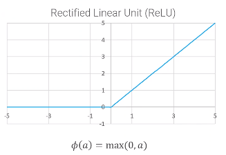
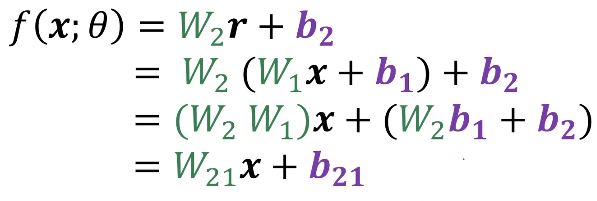
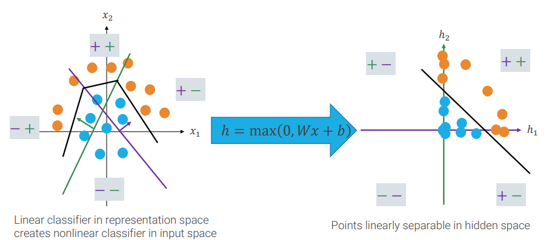
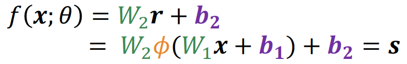

# 4. Image Representation

#### Table of Contents

- [VLAD: vector of locally aggregated descriptors](#vlad--vector-of-locally-aggregated-descriptors)
- [Neural networks](#neural-networks)
- [Activation functions](#activation-functions)
- [Terminology](#terminology)
- [Universal approximation](#universal-approximation)

The representation chosen is important, for example switching to polar coordinate could make feasible a linear decision boundary, where only a non-linear decision boundary was possible in the input feature.

A bag of visual words (aka bag of features) is a histogram that counts the frequency of appearance of every codeword from a dictionary.

The first problem is how to extract visual words.  The first step is "words" detection, you can either use a regular grid of positions and randomly sample the scale or run an interest points detector.
Then you can choose if use the patch around each key-point as a word, or compute some descriptors, like the SIFT.

Then you create the codebook by clustering (usually with simple k-means) extracted patches (or descriptors) in a finite set of centroids.

Finally, you match detected key-points with the codebook and construct the histogram.

## VLAD: vector of locally aggregated descriptors
A successful evolution of the trivial approach described above is VLAD. Histograms are replaced with representation of the differences of input words with respect to the codewords, i.e. their relative position with respect to the codeword.

## Neural networks
Just stacking together two linear classifiers we obtain one simple neural network.  

We obtain a new parameter, which is D, which is the size of the inner layer.

While &phi;, called activation function, is a non-linear function, usually a sigmoid or, better (because is more efficient), a Rectified Linear Unit (ReLU).

We need to insert an activation function, because without a non-linear step, we end-up again with a linear classifier and we have no benefit in stacking together linear classifiers.

## Activation functions

ReLU collapses points into axes

## Terminology

_x_ is the **input tensor**, _r,s_ are the **activations**, _Wi, bi_ are **parameters**.  
Every layer is called a **fully-connected layer**. A neural network with 2 or more layers is also called a **Multi-layer perceptron**.

## Universal approximation

While single perceptrons cannot compute everything, networks with just a single layer can approximate every continuous function.

Using more than a single hidden layer does not increase the number of computable functions, but increasing the depth can be seen as an exponential gain in the number of neurons needed to properly approximate a function.
