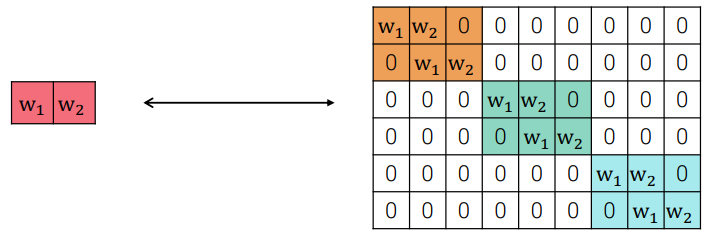
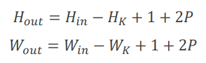
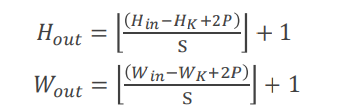
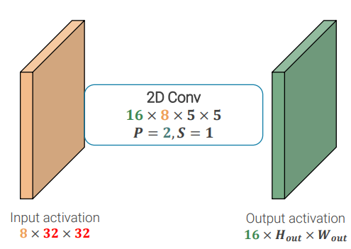
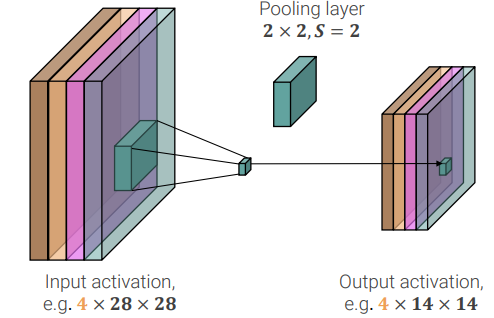
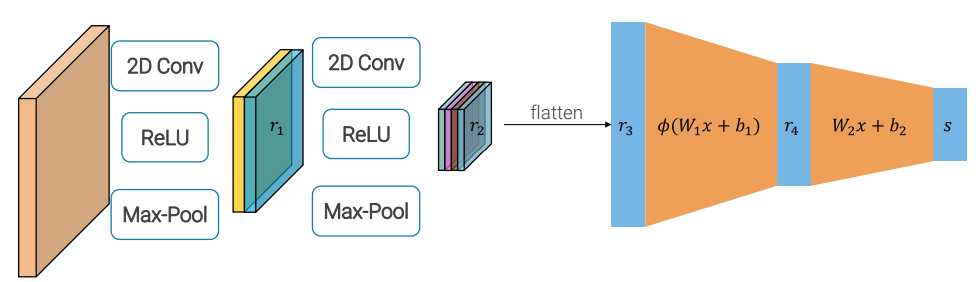

# 5. Convolutional Neural Networks

#### Table of contents

- [Convolution as matrix multiplication](#convolution-as-matrix-multiplication)
- [Multiple input channels](#multiple-input-channels)
- [Multiple convolutional layers](#multiple-convolutional-layers)
- [Relationship between spatial dimensions](#relationship-between-spatial-dimensions)
- [Receptive Fields](#receptive-fields)
- [Convolution parameters and flops: example](#convolution-parameters-and-flops--example)
- [Common layers in CNNs](#common-layers-in-cnns)
  * [Pooling Layers](#pooling-layers)
  * [Fully Connected Layers](#fully-connected-layers)
  * [Batch Normalization](#batch-normalization)
    + [Layer Normalization](#layer-normalization)
    + [Instance Normalization](#instance-normalization)

## Convolution as matrix multiplication

Convolution can be interpreted as matrix multiplication if we reshape inputs and outputs. The resulting matrix is a **linear operator** which **shares parameters** across its rows, is **sparse**, naturally adapts to **varying input sizes** and is **equivariant to translations**

## Multiple input channels

Images have 3 channels, so we have to extend our definition of convolution to deal with 3-dimensional tensors. So our kernel will be of size _3 x HK x WK_.

What is obtained is still a 2D convolution, but over **vector-valued functions**, and not a 3D convolution since we do not slide over channels. So the output image will have only one channel, which is called a feature map or activation map.

We can repeat the process with a second kernel with different weights and so on.

## Multiple convolutional layers

Convolutional layers can be interpreted as a constrained form of linear layers. Hence, they follow the same needing of inserting **non-linear activation functions** between them in order to meaningfully compose them.

## Relationship between spatial dimensions

In general

  
where _P_ is the padding and _S_ the stride.

## Receptive Fields

The input pixels affecting a hidden unit are called its **receptive field**. For instance, if we apply a _HK_ &times; _WK_ kernel size at each layer, the receptive field of an element in the _L_th activation has size  
_[1 + L(HK - 1)]_ &times; _[1 + L(WK - 1)]_.

If we want to increase the receptive field we can use **strided convolution**.

## Convolution parameters and flops: example

Let's suppose we have an input activation of size 8&times;32&times;32 and a convolution layer of size 16&times;8&times;5&times;5 (16 kernels of size 8&times;5&times;5) without striding (_S_ = 1) and with zero padding equal to 2 (_P_ = 2).

The number of **parameters** needed for the convolutional layer is 16&times;(8&times;5&times;5 + 1) = 16&times;201 = **3216**.

The output activation will have 16 channels, because we have 16 kernels, while height and width will be 32 - 5 + 1 + 2P = 32 - 4 + 4 = 32. So the output activation will have size 16&times;32&times;32, so it is composed by 16&times;32&times;32 = 16384 values (about 64 KB).

Each value is obtained as the dot product between the weights and the input, which requires _n_ multiplications and _n_ summations for an input of size _n_, i.e. _2n_ flops. So, the total number of flops is 16384&times;8&times;5&times;5&times;1 &cong; **2.5M flops**.

## Common layers in CNNs

In **Convolutional Neural Networks** (short form CNNs), besides convolutional layers, there also other layers:
 - [non-linear activations](4.md#neural-networks);
 - [fully connected layers](#fully-connected-layers);
 - [pooling layers](#pooling-layers);
 - [(batch-)normalization layers](#batch-normalization).

### Pooling Layers

 > _“The pooling operation
used in convolutional
neural networks is a big
mistake and the fact
that it works so well is a
disaster.”_
> \- G. Hinton

A pooling layer aggregates several values into one output value with a **pre-specified (not learned) kernel** of size _WK_ &times; _HK_. Usually, a stride _S_ > 1 is used. A common choice is a 2&times;2 kernel, with _S_ = 2 and _max_ as kernel function, which is called **max-pooling**.

The key difference with the convolution is that **each input channel is aggregated independently**, it has no learnable parameters and it provides **invariance** to small spatial shifts.

Without stride (_S_ > 1), pooling itself does not downsample the layer.

### Fully Connected Layers

A CNN is composed by _N_ convolutional+[pooling layers](#pooling-layers) (+ [ReLU](4.md#neural-networks)) followed by _M_ fully-connected layers, that, all together, compose the so-called **feature extractor**. The feature extractor is followed by a last fully connected layer, called the  **classifier**.

### Batch Normalization

Deep architectures following the pattern of the previous figure are **very hard and/or slow to train**.

This _**could**_ be caused by the fact that the representation _r_ that the classifier (the last fully-connected layer) tries to classify changes at each training. Moreover, the gradient that it receives was computed to improve the performance of the "old" _r_. This phenomenon is called **internal covariance shift**: the change in the distribution of network activations due to the change in network parameters during training.  
It can be thought of as if we were training our model on photos made by a camera whose lenses are never cleaned and progressively become dirtier after each photo, distorting the image.

The idea behind batch normalization is to **normalize the output of a layer during training** in order to have zero mean and unit variance **in a batch** for each dimension and then reintroduce flexibility into the learned representation through **learnable per-dimension scale and shift parameters** _&gamma;__i_ and _&beta;__i_.

The **batch normalization layer behaves differently in training and test times**. Indeed, at test time, we don't want that our predictions depend on other items of the batch, but we want that it only depends on the input itself, deterministically. This is not possible if we compute the normalization according to a mean and a standard deviation calculated over the batch. So, the solution is to compute _&mu;j_ and _&sigma;j2_ as the running averages of the values seen at training time.

In this way _&mu;j_ and _&sigma;j2_ are **constant** values, hence **batch normalization becomes a deterministic linear transformation** and can be fused with the previous fully-connected or convolutional layer having no impact on the number of flops.

**Pros**:
 - allows to use higher learning parameters;
 - careful initialization is less important;
 - training is not deterministic, acts as regularization;
 - no overhead at test time.

**Cons**:
 - **it isn't clear why it is so beneficial**;
 - need to distinguish between training and testing time makes the implementation more difficult and maybe the source of many bugs;
 - does not scale down to micro-batches.

#### Layer Normalization

Since normalization turned out to be so important, people have proposed different ways to normalize. One of the things they tried to address is **the problem of having two different behaviors at training and test time**.

Layer Normalization is probably the most successful attempt to tackle this problem.

Instead of normalizing across the batch, **normalization is computed across the sample**. So now it doesn't matter anymore what is in the batch with a certain sample and the behavior at training time can be fully translated at test time too.

It is mainly used for RNNs and Transformers.

#### Instance Normalization

Instance normalization was proposed for generative tasks where results should not, in general, depend on the contrast of the content image. So **has nothing to do with internal covariance shift and is not particularly tied with batch and layer normalizations**, but it has only a similar name.

It works only for convolutional layers and normalization is computed across spatial dimensions.

It has the same behavior at training and test time.
