# 6. CNN Architectures

#### Table of Contents

- [AlexNet](#alexnet)
  * [Recap](#recap)
- [ZFNet/Clarifai: a better AlexNet](#zfnet-clarifai--a-better-alexnet)
- [VGG (Visual Geometry Group)](#vgg--visual-geometry-group-)
  * [Stages](#stages)
  * [Recap of VGG-16](#recap-of-vgg-16)
- [Inception v1 (GoogLeNet)](#inception-v1--googlenet-)
  * [Stem layers](#stem-layers)
  * [Naïve Inception module](#na-ve-inception-module)
    + [1&times;1 convolutions](#1-times-1-convolutions)
  * [Inception module](#inception-module)
  * [Final layers](#final-layers)
  * [GoogLeNet summary](#googlenet-summary)
- [Inception v3](#inception-v3)
- [Residual Networks (ResNet)](#residual-networks--resnet-)
  * [Bottleneck residual block](#bottleneck-residual-block)
  * [Further model tweaks](#further-model-tweaks)
    + [ResNet-B](#resnet-b)
    + [ResNet-C](#resnet-c)
    + [ResNet-D](#resnet-d)
- [Inception-v4 and Inception-ResNet-v2](#inception-v4-and-inception-resnet-v2)
- [ResNeXt](#resnext)
  * [Grouped convolutions](#grouped-convolutions)
  * [Results](#results)
- [Sequeeze-and-Excitation Net (SENet)](#sequeeze-and-excitation-net--senet-)
- [MobileNet](#mobilenet)
  * [Depthwise Separable Convolution](#depthwise-separable-convolution)
  * [Inverted Residual blocks](#inverted-residual-blocks)
  * [MobileNetV2](#mobilenetv2)
- [Wide ResNet](#wide-resnet)
- [EfficientNet](#efficientnet)
  * [Compund scaling](#compund-scaling)
  * [EfficientNet-B0](#efficientnet-b0)
- [Neural Architecture Search (NAS)](#neural-architecture-search--nas-)
- [Non-deep Networks](#non-deep-networks)

## AlexNet

> _All our experiments suggest that our results can be improved simply by waiting for faster GPUs and bigger datasets to become available_

Due to the little memory GPUs had in 2012, convolutions are split into 2 GPUs and done in parallel. For this reason they are called **grouped convolutions** _(For a detailed explanation see [ResNext](#grouped-convolutions))_

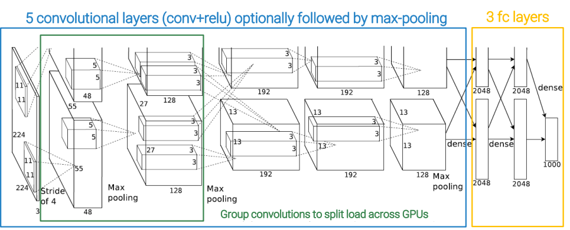

Input elements are downsampled to 256&times;256&times;3 and then a random crop of 224&times;224&times;3 is taken. So in the end the input element has 150528 values.

AlexNet used a mini-batch of 128 elements so, if we consider that activations are usually floating-point numbers that require 4 bytes to be stored, the total memory in MB for a mini-batch is 128&times;150528&times;4/1024/1024 = 73.5.

The first step is to apply a very large convolution (96&times;11&times;11) with a lot of stride (S = 4) and a padding of 2 (P = 2), which is a bit mysterious. Since there are 96 kernels, the output will have 96 channels. To calculate activation H/W we can use the formula:
(W_in_ - W_K_ + 2P)/S + 1 =  
= (224 - 11 + 4)/4 + 1 = 55.

This is what nowadays we call a **stem layer**, but it's terminology that comes from subsequent works. Namely is a convolutional layer whose only purpose is to **bring the resolution down**, because particularly for image classification the full resolution is not needed and only increases computational cost.

The number of parameters is now (W_K_ &times; H_K_ &times; C_in_ + 1) &times; C_out_ = 34944 and we can use it to calculate also the number of flops = #activations &times; (W_K_ &times; H_K_ &times; C_in_) &times; 2 = 27 Gflops.

Given activation size and #parameters, we can calculate the memory needed, recalling that **we need to store the activation itself AND the gradient of the loss for every one of its entries**, i.e. another tensor of the same size. Also for every parameter, we will need to store its value and the gradient of the loss for it. If using momentum, we need to store the velocity, too, and since we are using Adam it will be stored twice.

So it is very hard to have a precise estimate of memory requirements, but we can get approximate values by considering twice the activation size and 3-4 times the #params. In this way, we obtain around 283.6 MB of memory needed. All this data are summed up in the following table:

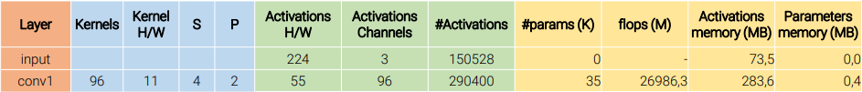

Then we have pooling, which is a very cheap operation. All pooling layers have a bit of overlap between receptive fields (size 3&times;3 and stride 2) because this was found beneficial, reducing top-1 and top-5 errors compared to 2&times;2 with stride 2.

Pooling does not change the number of channels, so it remains 96, while the activation H/W halves to 27. The number of learnable parameters is 0 (so no memory is needed). Also, the number of flops is negligible, because we only have to check a 3&times;3 matrix and compute the maximum. Even the size of activation is negligible.

Applying the same reasoning to all the 5 convolutional layers followed by optional pooling layers we obtain this table:

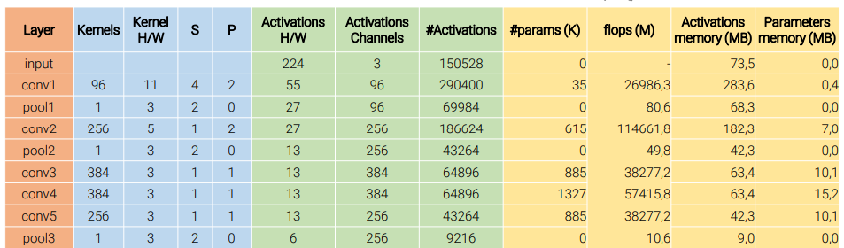

Then we have an interface between convolution layers and the dense layers. We arrive here with a 6&times;6 matrix with 256 channels, which flattened becomes a vector with 9216 entries. This operation has almost no cost because is only a different way to watch data that are already in memory.

The first dense layer in AlexNet has 4096 rows.  
In dense layers, there are many more parameters than activations. In terms of flops is less expensive than convolutional layers. The same considerations apply to the other two dense layers. We finally obtain the complete table:

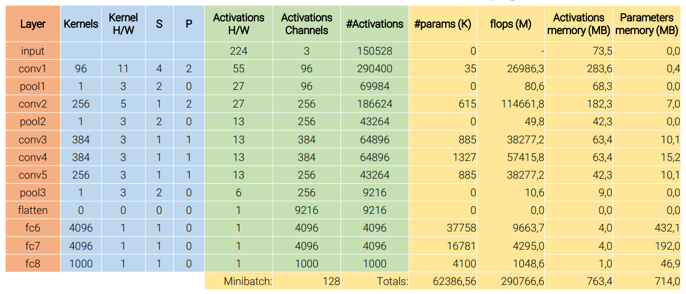

### Recap

 - **Heavy stemming** immediately bring down the resolution, because since we want to expand a lot the channels, would be immensely costly to keep also a big spatial resolution;
 - **nearly all parameters are in the three fully connected layers** at the end;
 - the **memory needed for the parameters is more than the one needed for the activations**, while, as we will see, usually is the contrary;
 - **almost all the computation is in the convolutional layers**;

## ZFNet/Clarifai: a better AlexNet

The next year researchers tried to change AlexNet's hyperparameters to improve it. AlexNet's author itself found out that aggressive stride and large filter size in the first layer results in dead filters and missing frequencies in the first layer filters and aliasing artifacts in the second layer activations. To counteract these problems, he and his company, Clarifai, propose using 7&times;7 convs with stride 2 in the first layer and stride 2 also in the second 5&times;5 conv layer.

## VGG (Visual Geometry Group)

VGG's goal was to explore **depth combined with a simple design** because AlexNet was based on too many unexplainable numbers.

VGG's researchers, to maintain the design as simple as possible, allowed only the combination of:
 - **3&times;3 convolutions, S=1, P=1**, which doesn't change image size;
 - **2&times;2 max-pooling, S=2, P=0**, which halves the image size;
 - **#channels doubles after each pool**.

They started with **11 trainable layers** (8 convs + 3 FC, remind that pools are not trainable layers). For computational limits, they had to break their constraint of doubling #channels after the last pool.

Then extended it to 13, 16, and 19 trainable layers.  
Batch norm had not been invented yet, so they did not manage to train 19 layers directly. So they trained the 11 layers first, then passed to the 13 layers' architecture and pre-initialized the 11 layers in common with the values already obtained. And they repeated this process until 19 layers.

### Stages

VGG introduces the idea of stages: a **fixed combination of layers**. In VGG, stages are aither:
 - conv-conv-pool;
 - conv-conv-conv-pool;
 - conv-conv-conv-conv-pool.

One stage **has the same receptive field of a larger convolution**, but **requires fewer params and computation** and introduces more non-linearities. This improves the number of flops and params, but the **#activations doubles**.

### Recap of VGG-16

Is way bigger than AlexNet. The computation stays constant across stages, but it's a **huge number of flops**: each convolution takes almost 5 Gflops. this is **due to the absence of stem layers**. This also reflects on memory: the **activations at the beginning are huge** (&asymp; 3 GB), so at the end, more than 14 GB are needed.

Also, keeping the fully connected layers at the end results in having a **huge number of parameters**, larger than AlexNet but very similar in the evolution.

So, even if **they show that deeper networks consistently perform better**, this regular design is too constrained and has too many drawbacks.

## Inception v1 (GoogLeNet)

> _The main hallmark of this architecture is the **improved utilization of the computing resources** inside the network. This was achieved by a **carefully crafted design** that allows for **increasing the depth and the width of the network while keeping the computational budget constant**._

Google's goal was to increase the depth and utilize resources as carefully as possible.

The model is composed of **three main parts**:
 - stem layers;
 - stack of nine _inception_ modules;
 - global average pooling + classifier.

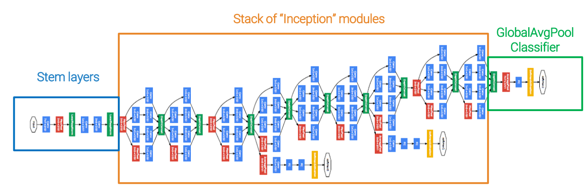

The model has 22 trainable layers, if they are intended as the number of modules that data have to traverse sequentially to reach the end of the model. The total modules are about 100.

### Stem layers

Being aware of ZFNet's lesson showing that we have to be **gentle when bringing down the spatial resolution**, Google researchers used **5 layers** and not only a single stem layer, because it creates aliasing artifacts.

They downsample the inputs from 224 to 28 W/H using convolution's kernels large at most 7&times;7 and strides equal to 1 or 2.

This requires about **130 Gflops**, **124 K parameters**, and **2 GB of memory**, which is **nothing compared to the 10 layers used by VGG** to reach 28&times;28 which requires 2.4 Tflops, more than 1.7 M parameters, and 13 GB of memory.

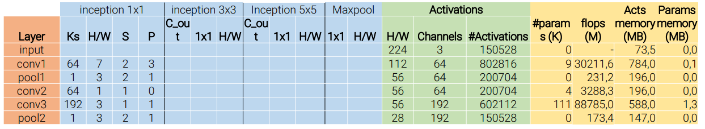

### Naïve Inception module

The naïve inception module is a multi-branch architecture, in which the same full tensor is processed by 4 modules in parallel:

 - 5&times;5 convolution with stride 1;
 - 3&times;3 convolution with stride 1;
 - 1&times;1 convolution with stride 1;
 - 3&times;3 max pool with stride 1.

No one of these modules changes the spatial resolution. The inception module is very **hard to motivate**, one interpretation is that you _decide not to decide_: assuming that you do not know if it is a good idea to have a 5&times;5 conv, a 3&times;3 conv, or a max-pooling at a certain point in your architecture, if you compute this compute all these operations in parallel and then you stack them, there is **at least one path** from the beginning to the end of your architecture that **has the right combination**.  
_(Note that this is not the official explanation, but Prof. Salti's one)_

However, if you just follow naively this idea of having multiple alternatives you can have some trouble because pooling preserves the number of channels in the input and if output channels are stacked with output channels of the other three parallel modules, then the number of channels will grow over and over, and computation will become expensive very soon due to the presence of convolutions.

#### 1&times;1 convolutions

When thinking about 1&times;1 convolutions, it is important to remember that there is an implicit dimension: actually, it is a 1&times;1&times;_C_ convolution, where _C_ is the depth of the input tensor.

It is a powerful tool that allows **changing (usually shrinking) the depth** of the activations while preserving the spatial size. It mixes the channels without any sort of spatial reasoning.

It's important to notice that if I just focus on a spatial location, what 1&times;1 convolution does exactly what a linear layer does (it multiplies the input vector by a vector of weights and adds a vector of biases), as illustrated in the following figure.

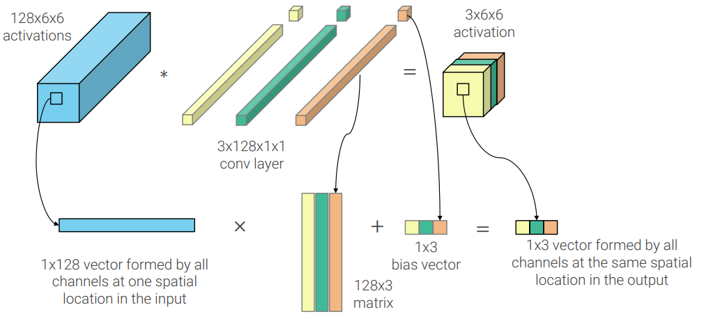

So **a 1&times;1 conv is like a fully connected layer at each spatial location**. This is why it is so powerful, because a fully connected layer is a linear perceptron, and two or more linear perceptrons are a universal approximator. So replacing generic convs with stacks of 1&times;1 convs does not result in losing any representation of power.

### Inception module

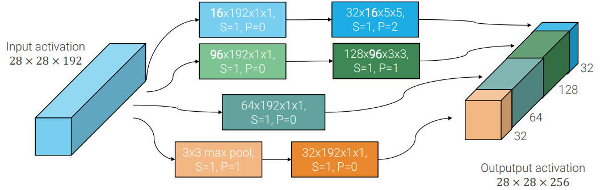

The **real inception module** not only uses 1&times;1 convs as of the possible paths of the multibranch architectures but also to **shrink the number of channels** in the other branches (before the larger convolutions and after the max-pooling) to **keep the computational cost low**.

The stack of Inception modules works at different resolutions: at certain points, they inserted **max-pooling with stride** to bring down the revolution, to reduce the computational cost.

### Final layers

In the previous architectures what we did at the end of the network was flattening and then using some fully connected layers. Let's suppose we have just one final fully connected layer. If the last activation is 4&times;3&times;3, then it is flattened to a 36&times;1 vector. If we have 1000 thousand possible classes in output, then the matrix of weights will be 1000&times;36, which is a very large tensor.

The idea of Google researchers was that at this final stage I probably have in my activations very high-level features (_this thing has legs_, or _this thing is red_) which are not spatially localized but tend to be global properties. Then to limit the cost of the final classifier they propose to compute the average of each channel of the final activation. So, in the example above, our 4&times;3&times;3 is passed to a **global average pool layer** and becomes a 4&times;1 tensor, so the weights matrix will have only 1000&times;4 parameters.

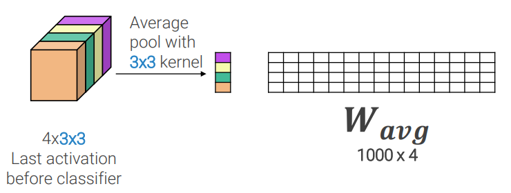

In GoogLeNet this results in having **1 million parameters** and **less than 270 Mflops**. Nothing if compared to VGG that at the same stage needed 124 million parameters and 31 Gflops.

A nice side-effect of global average pooling is that, if it is implemented carefully (like Tensorflow and PyTorch do), you are just required to define the output size of your tensor and not the input, so you can define it only once and apply it to any tensor. In PyTorch, it is called `AdaptiveAvgPool`.

### GoogLeNet summary

Overall it requires **only 7 million parameters, 390 Mflops, and 3.3 GB of memory** and it achieves better results than VGG.

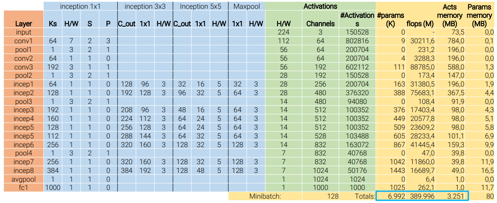

## Inception v3

After Inception v1, another paper came out one year later proposing two different versions: Inception v2 and Inception v3, with the latter outperforming the former, so v2 never existed in practice.

**Inception v3 has the same base ingredients as v1**, but the Inception modules are a bit _smarter_ and **factorize large operations in smaller ones** (for example the 5&times;5 conv is factorized in two 3&times;3 convs) to increase computational efficiency and to reduce the number of parameters.

Also, they do not have a single Inception module repeated over and over, but they have 3 versions of the Inception module with different factorizations that are used at different spatial resolutions.

## Residual Networks (ResNet)

**Stacking more and more layers does not automatically improve performances**. On the contrary, we can notice that with too many layers the testing error increases. This could be caused by overfitting, but since **we can observe also a training error increase**, that cannot be the only reason.

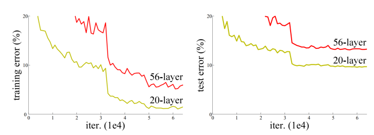

A more complete explanation is that optimizing very deep networks is hard. However, of course, a deeper network can perform as a less deep network: if a network with 20 layers achieves performance X, then we can stack 36 more identity layers and we should keep performance at X.
However **for Stochastic Gradient Descent (SGD) is impossible to learn identity layers**.

So the proposed solution is to change the networks so that learning identity functions is easy by introducing **residual blocks**. Implemented by adding **skip connections** skipping two convolutional networks.

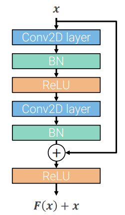

The identity function (the input that skips convolutions and that is proposed identical to itself in output) is **perturbated** with the output of the convolutional layers. This perturbation is implemented with a **biased sum** of the two outputs. **In the beginning, the perturbation is very small** (0 for biases), so the network starts very close to the identity function and learns an "optimal" perturbation of it.

Residual networks follow the idea of VGG of having a **regular design organized into stages**, but stages, in this case, are combinations of residual blocks, and the first block of each stage halves the spatial resolution (with stride 2 convs) and doubles the number of channels. So the network is **sequential**, not like Inception.

A critical point in ResNet is the large usage of **batch norm layers**

The structure of **ResNet-18**, for example, is the following one:
 - stem layer;
 - 4 stages composed of 2 residual blocks each;
 - global average pooling layer.

ResNet uses only a single conv+pool layer, reducing only to 56&times;56, probably because residual blocks are lightweight compared to Inception modules. While at the end it uses the same average pooling + linear layer.

The residual blocks described so fare cannot be used as the first block of a new stage because the number of channels and the spatial dimensions do not match along the residual connection (the dashed arrow in the following image)

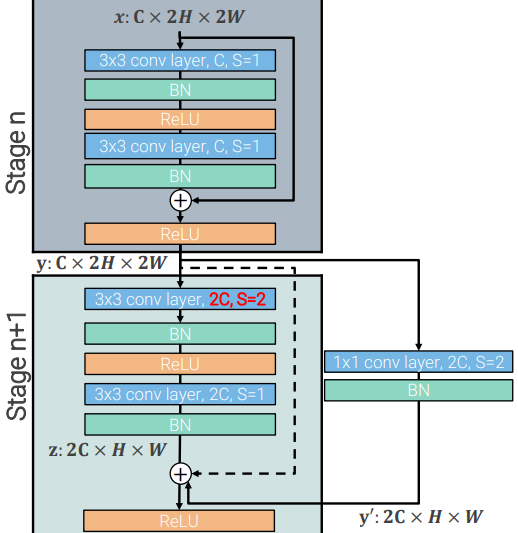

So in this particular case we don't have the pure identity skip connection, but something that adjust dimensions: **1&times;1 convolution with stride 2 and 2C output channels** (the solid arrow in the previous image).

Residual connections make possible to properly train deep networks that outperform shallower networks.

### Bottleneck residual block

The bottleneck residual block is a variant of the standard residual block based on the idea of having more or less the same computational cost but **less parameters**. The reason is that stacking too many traditional residual blocks makes the parameters grow too fast and it is impossible to properly use them for training on big datasets.

While a standard residual block performs spatial reasoning twice by two 3&times;3 convolutional layers, a bottleneck residual block is a compromise that performs **spatial reasoning only once** (with a single 3&times;3 conv) and on only C channels, where C is **1/4 of the number of channels in input**. The reduction of channels is performed by a 1&times;1 convolution, as in Inception modules.

Since we have residual connections, we need to **restore the original number of channels**, and this is done by another 1&times;1 convolution.

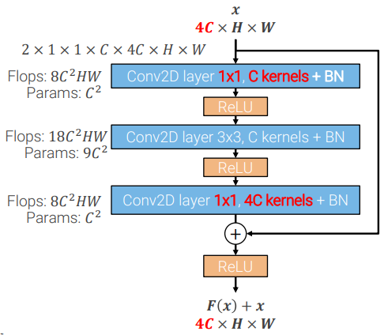

In this way, **the number of parameters goes from 18C2 to 11C2**

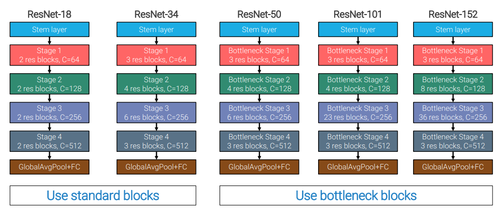

### Further model tweaks

There are a few variation of ResNet that improve its performances:

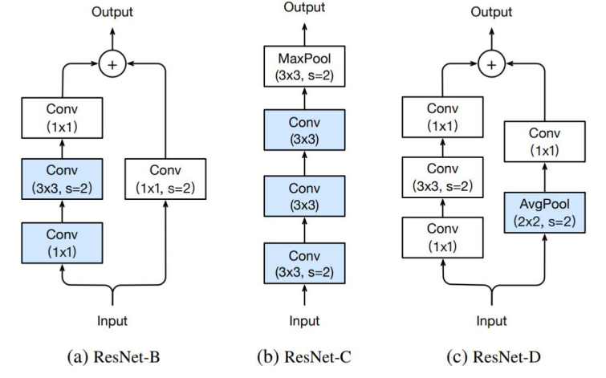

 - #### ResNet-B
In the traditional ResNet the first convolution of each stage has stride 2, in order to adjust spatial resolution. However when we have bottlenecks blocks, the first layer is as 1&times;1 convolution. Having a 1&times;1 convolution with stride 2 would mean that only one every four activations in the input tensor is used. So a lot of operations used for computing the whole tensor would be wasted, since only 1/4 of the activations is used. So, ResNet-B **moves the stride 2 into the 3&times;3 convolution**.

 - #### ResNet-C
ResNet-C implement a **gentler stem**. The single 7&times;7 stride 2 convolution in the stem layer is replace with three 3&times;3 convolution, the first one with stride 2. It costs a bit more in terms of resources, but results are better.

 - #### ResNet-D
ResNet-D, sometimes also called ResNet-B2, is an **improvement of ResNet-B**. Indeed, also the 1&times;1 stride 2 convolution used to match dimensions of the "identity propagation" uses only 1/4 of the input activation. Moving the stride into a new 2&times;2 stride 2 AvgPool layer before it fixes the problem.

## Inception-v4 and Inception-ResNet-v2

Inception-v4 is a larger Inception-v3 with a more complicated stem.

In the same paper where Inception-v4 was presented they also tried to apply the residual connections idea to the Inception module, in the so called Inception-ResNet-v2, which set the new state of the art.

## ResNeXt

The idea of ResNeXt is to combine the regular path of VGG and ResNets, and the more complicated and multi-branch path of Inception modules. This is obtained by taking bottleneck residual blocks and transforming it in a multi-branch block, keeping the complexity as low as possible.

Each bottleneck residual block is decomposed into _G_ parallel branches through **grouped 1&times;1 convolutions**. Each branch's 3&times;3 convolution, which is the operation more impacting on complexity, just processes _d_ channels.

Fixing _G_, is possible to find a value for _d_ which keep the complexity equal to the one of standard bottleneck block, but which performs multi-branch computation.

### Grouped convolutions

Grouped convolutions were **at first presented in [AlexNet](#alexnet)** to split the load of work into 2 GPUs, but then they were not used anymore, since more recent GPUs was starting to have enough memory. ResNeXt does not use them to work on multiple GPUs but, as discussed, to increase the accuracy of the model without increasing the complexity.

Instead of having kernels that see all the input channels to produce one output channel each, each one of the _G_ **grouped kernel** just sees a subset of the input channels of size _Cin / G_. At the end the output shape of a grouped convolution is the same of a regular convolution, but the computation inside is cheaper: **_G_ times less parameters** and **_G2_ times less flops**.

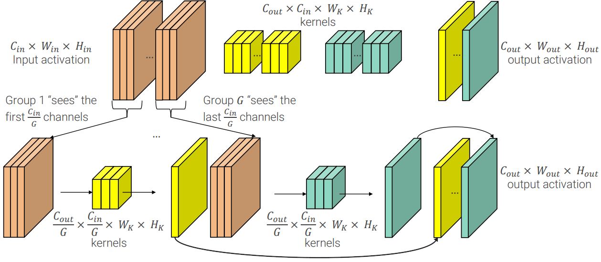

### Results

Grouped convolutions allow us to **process more channels with the same number of flops**. Although we will just look for relationships just in subsets, that's actually reasonable, because **not all the features may need to be combined to achieve good higher level representations**. For example something that detects features for the sky has no need to be merged with the  features used to create the high-level representation of a cat.

Indeed, even by creating just two branches, is possible to **reduce the top-1 error** and it becomes lower and lower as the number of branches increases, despite the number of channels that communicate each other decrease (in order to keep the number of flops constant), until things saturate a bit, as you can observe in the following table.

In term of overall performances the gain is not huge if you look at the metrics used for competitions, because there people use a lot of augmentation and all the architectures from ResNet onwards get more or less the same results. This is why from now on people focus more on the **single crop testing**, a metric that you obtain when you apply the model to the image only once and after having cropped it to 224&times;224. In this case it is possible to see ResNeXt improvements.

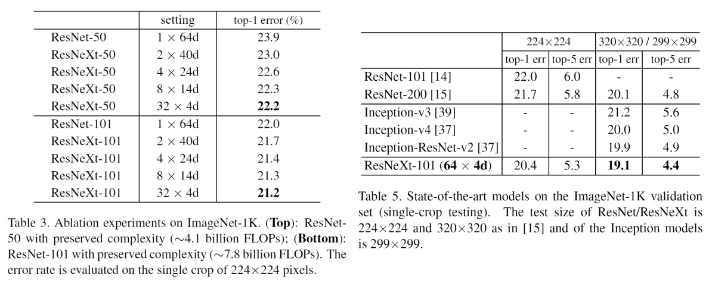

## Sequeeze-and-Excitation Net (SENet)

The following year (2017) war run the last edition of the ILSVRC competition and it was won by **SE-ResNeXt-154** which proposed another architectural improvement that you can add on to ResNet, ResNeXt, and so on.

If you think to a kernel in one of the CNN models seen so far, it looks at all the input channels (or at a subset, in case of grouped convolutions) to produce its output channel, but it has no communication with the other kernels in the same layer, which produce other output channels. So the **output channels are produced independently, making impossible for the layer to learn dependencies between channels**.

The idea to solve this problem is taking a a residual transformation that produces an H&times;W&times;C tensor and adding to it a new branch that produces a 1&times;1&times;C vector (C numbers, one for each channel) to **reweight channel-wise** the tensor produced by the residual transformation.

This new branch first **squeezes the information of each channel in a number and then you compute the _excitation_, which is the scaling factor**.  
The squeeze is just an average global pooling that compresses the representation to a single number for each channel.  
The excitation part, given an hyperparameter _r_ which is usually a very high number like 16, at first compresses even more the representation with a fully connected layer that produces a 1&times;1&times;C/_r_ vector. Then it goes through a ReLU to obtain non-linearity, and then, by another fully connected layer, it goes back to a 1&times;1&times;C representation. These two fully connected layers that compress and the decompress the number of channels are called a **bottleneck**. The excitation part, finally, applies a Sigmoid, to have scale factors between 0 and 1.

The idea is that the compression done by the bottleneck makes the module loose representation power and forces it to learn meaningful relations between channels, choosing which ones are relevant.

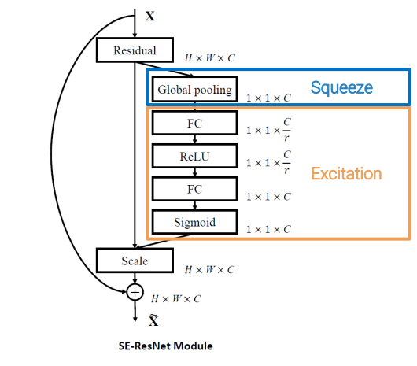

## MobileNet

One very important dimension to explore was making things more efficient while not losing in accuracy, because **ResNeXt, ResNet and SENet are not lightweight**, for instance they don't run well on mobile phones.

### Depthwise Separable Convolution

This led to the realization that you can implement a standard convolution (for example a 3&times;3 convolution) in a more effective way.

A 3&times;3 convolution does 2 things at once:
 - it filters things spatially with the convolution kernel;
 - it mixes the channels to produce new representations.

It's the most expressive transformation you can have with 3&times;3 kernels, but it's also very expensive.

**Depthwise Separable convolution** implement a single 3&times;3 convolution as a sequence of two convolutions:
 - a **3&times;3 _completely grouped_ convolution** (the number of groups is equal to the number of channels, meaning that every channel is processed independently), **to realize the filtering**;
 - a **1&times;1 convolution to realize the mixing**.

These two convolutions are called, respectively, **depthwise convolution** and **pointwise convolution**.
This brings to a reduction of flops of almost 10 times and it was the core idea of **MobileNetV1**

### Inverted Residual blocks

In the paper presenting **MobileNetV2**, researchers showed with a theorem that applying ReLU in the compressed domain of a [bottleneck residual block](#bottleneck-residual-block) may result in **information loss**.

So the proposed to invert expansion and compression:

 1. take _C_ channel and **expand** them to _tC_ channels, where _t_ is the _expansion ratio_;
 2. **process** them with a 3&times;3 convolution;
 3. **compress** them back to _C_ channels to realize the residual connection

To counteract the increase in computation due to the 3&times;3 convolution being executed in an expanded domain with a lot more channels, it is realized as a **depthwise convolution** (a grouped convolution with _tC_ groups).

The last difference is the **removal of non-linearities between residual blocks**, because it would be performed in the compressed domain, and, as the demonstrated, this may result in information loss.

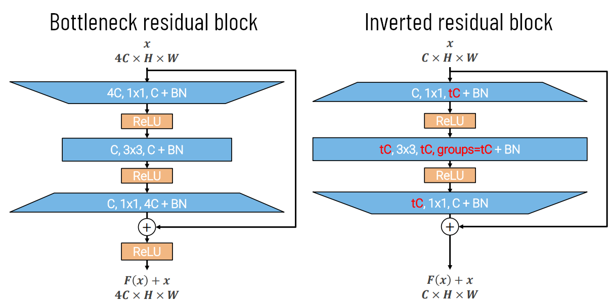

### MobileNetV2

BombileNetV2 is a stack of inverted residual blocks with ReLUs in between.

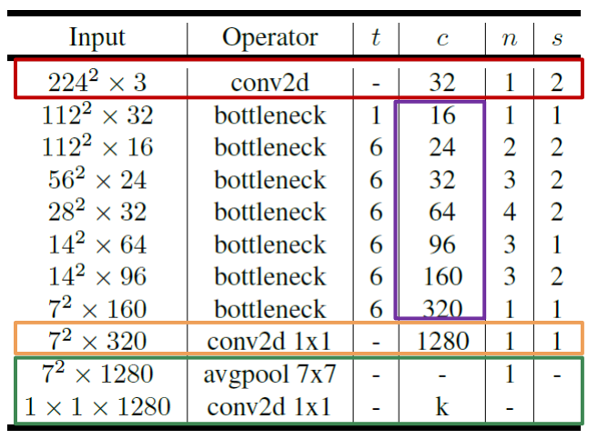

 🔴 The **stem part** is very small, being composed by just one convolutional layer with stride 2, because the number of channels is already low, since they will be expanded inside the inverted residual blocks.

 🟣 In the stack of inverted residual blocks, **the number of channels grows slowly** compared to other architectures, so you have something expensive only at the very end of the stack. When a block downsamples the activation, it applies stride=2 to the inner 3&times;3 convolution ([ResNet-D](#resnet-d) trick).
 In order to limit the complexity of the network, they don't care about match dimensions, so **whenever spatial dimensions or number of channels do not match** between input and output, **there are no residual connections**.

 🟡 At the and of the stack representation **is expanded** with a 1&times;1 convolution before feeding the final classifier, because we are working in the compressed domain and we don't want the classifier to reason in the compressed domain.

 🟢 The final classifier is the usual one.

## Wide ResNet

While [MobileNet](#mobilenet) researchers was trying to improve efficiency, other architecture were proposed to **improve accuracy**. The most famous is **Wide ResNet** which instead of increasing depth try to increase **width, i.e. the number of channels at each layer**.

A widening factor _k_ is introduced to modify a ResNet and the resulting model is referred as WRN-_n_-_k_. For example WRN-50-2 is a version of ResNet-50 (50 layers) with twice the channels.

They found that trading depth for width can give similar performances. Indeed ResNet-152 and WRN-50-2-bottleneck have similar top-1 and top-5 error (even a bit better for the Wide ResNet), the latter requires more parameters and flops, but is still faster in practice because there is less sequential computation, thanks to the reduced number of layers.

## EfficientNet

### Compund scaling

Wide ResNet (and partially also ResNeXt) questions the paradigm of depth as the main way to increase performances scaling up the model.

Given a fixed computational budget to scale up my model we have 3 alternatives:
 - increase the depth (original ResNet approach);
 - increase the width (Wide ResNet approach);
 - increase the input resolution (ResNeXt approach).

Scaling up a baseline model in one of these 3 dimension result in a model with higher accuracy, but this gain **quickly saturate** after reaching 80% top-1 accuracy.

The **compound scaling** proposed in EfficientNet mixes all the 3 alternatives and overcome the limitation of single dimension scaling. Indeed, **scaling dimensions are not independent**:

> _Intuitively, for **higher resolution** images, we should **increase network depth**, such that the larger receptive field can help capture similar features that include more pixels in bigger images.  
Correspondingly, we should **also increase network width** when resolution is higher, in order to capture more fine-grained patterns with more pixels in high resolution images._

EfficientNet uses a **compound coefficient _&Phi;_** which is an indicator of how many resources I have.

The baseline network B0 corresponds to _&Phi;_ = 0. Since FLOPs approximately increase by 2_&Phi;_ when scaling by _&Phi;_, another model, let's call it B1, with _&Phi; = 1, needs the double of the resources of B0.

Now we define multipliers for the three scaling dimensions: depth _d = &alpha; &Phi;_, width _w = &beta; &Phi;_ and resolution _r = &gamma; &Phi;_. Since they are multipliers of the baseline's specs, they are numbers greater than 0.

Note that with _&Phi;_ = 0 we have _d_ = _w_ = _r_ = 1, that corresponds exactly to the baseline network.

The problem is to find _&alpha;_, _&beta;_ and _&gamma;_. Since we have _d,w,r_ > 0, then _&alpha;,&beta;,&gamma;_ > 1. Also, we know that FLOPs in convolution scale linearly with depth, but quadratically with width and resolution and we want that resources double for each increase of _&Phi;_. So we force _&alpha;&sdot;&beta; 2&sdot;&gamma; 2_ &asymp; 2.

This is a very hard optimization problem to solve, so it's solved in an approximated way, by grid search around the baseline model when doubling the amount of resources. The solution found is then used to scale up the model for any value of _&Phi;_.

So, from now on, researchers stopped to present architectures, but they started to present **families of architectures** that show how the single architecture can scale up.

### EfficientNet-B0

To reach the state of the art, they applied compound scaling to their own baseline network, which is a **variant of MobileNet-v2 obtained with [Neural Architecture Search](#neural-architecture-search--nas-)**.

It uses a very simple stem and inverted residual blocks with 3&times;3 or 5&times;5 kernels which include Squeeze and Excitation add-on blocks.

## Neural Architecture Search (NAS)

It's possible, even if very hard and costly, to **automate the design** process of a new architecture. The proposed **reinforcement learning** method uses a RNN, called the _controller_, which samples candidate architectures, train them on ImageNet and get their accuracy. With these accuracies it's possible to compute the gradient to update the controller. This is an immensely costly process, but the train controller learns to output good architectures and it can also trained with a **multi-objective reward** to optimize not only accuracy but also other metrics like _latency_.

## Non-deep Networks

A [very recent paper](https://arxiv.org/abs/2110.07641) showed for the first time that a network with a depth of just 12 can achieve over 80% top-1 accuracy on ImageNet. This is not the state of the art, but is still important, because low depth means also low latency since there are less layers to traverse.

The building blocks used are RepVGG SSE blocks, showing us that old concepts (like VGG blocks) can be rediscovered and reused effectively in new architectures.
