# 7. Regularization

#### Table of contents

- [Model capacity](#model-capacity)
- [Bias and variance](#bias-and-variance)
- [Regularization](#regularization)
  * [Parameter norm penalties](#parameter-norm-penalties)
  * [Early stopping](#early-stopping)
  * [Label smoothing](#label-smoothing)
    + [KLDiv loss](#kldiv-loss)
  * [Dropout](#dropout)
    + [Weight scaling](#weight-scaling)
  * [Stochastic depth](#stochastic-depth)
  * [Data augmentation](#data-augmentation)
  * [Color augmentation (jittering)](#color-augmentation--jittering-)
  * [Cutout](#cutout)
  * [Mixup](#mixup)
  * [CutMix](#cutmix)
- [Double Descent](#double-descent)

## Model capacity

[As we said](1.md#model-capacity), the **model capacity** is an indication of **how complex/flexible** the functions that can be learned by the model are.

Increasing the model capacity we are able to fit the model better and this is beneficial because it brings down the validation error, until we start to fit also noise and/or irrelevant features that do not apply well to unseen data (overfitting).

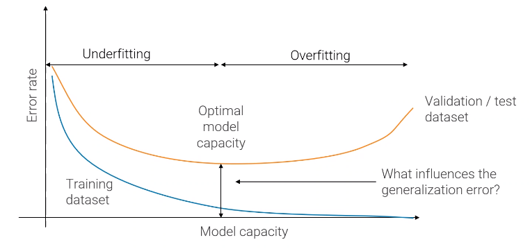

Since the model capacity is a very general indicator, we will focus on single hyperparameters: network width and depth, input resolution, admissible range for values of parameters, training time.

To visualize what underfitting and overffining are, suppose we fit _N_ data points, generated by a noisy quadratic equation_y_ = (_ax_02 + _bx_02 + _c_ ) + _&epsilon;_ with different models, which are polynomials of segree _K_ of the form 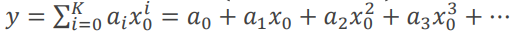.

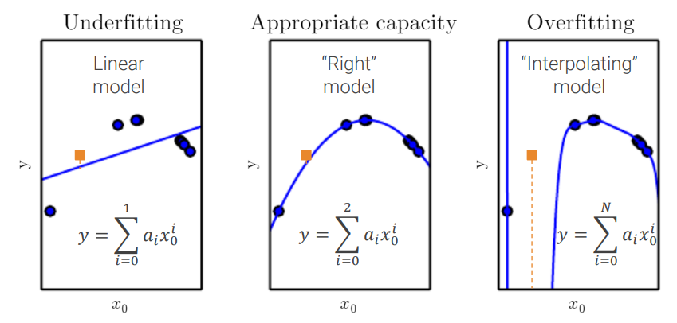

## Bias and variance

Each possible training dataset is a sample from the true population. Hence, every time we collect a training dataset _Ditrain_ and we train the **same model** we will get **different results**.

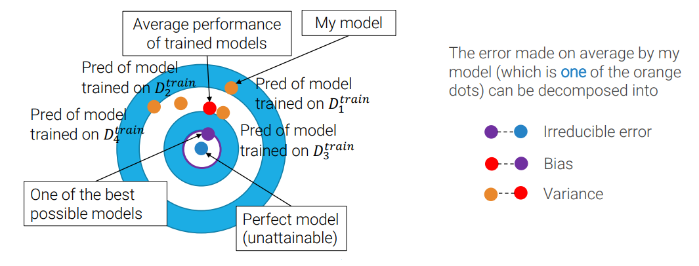

The error can be divided in
 - **irreducible error**: distance between the best possible models and the perfect model;
 - **bias**: the distance between the average performance of trained models and one (the closest) of the best possible models;
 - **variance**: the distance between my model and the average performance of trained models.

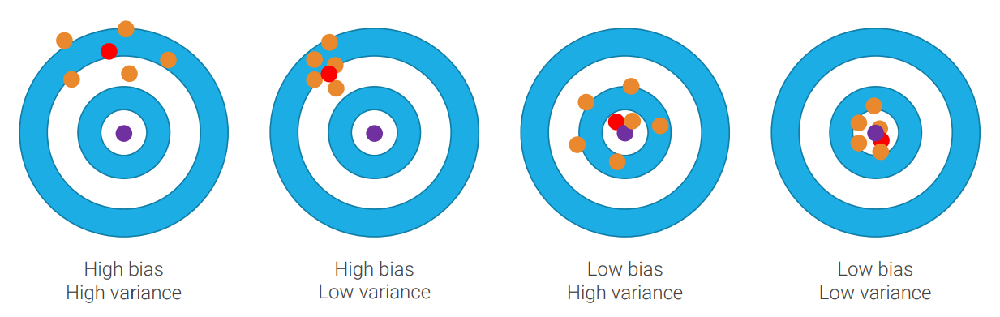

Usually we do not have _n_ training datasets, but only **one validation and one training dataset**, so we approximate **bias with training loss** or accuracy and **variance with the difference between training and validation loss** or accuracy.

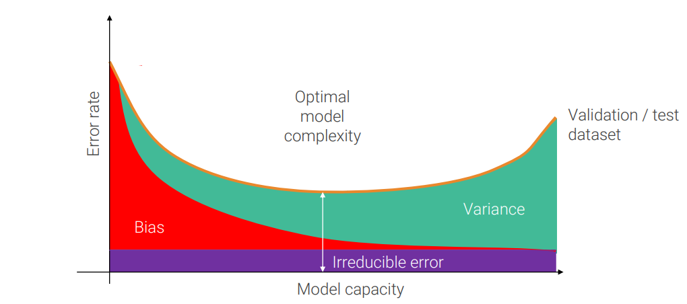

To get the optimal model is unfeasible to try all possible combination, because is too expensive, so in practice usually you leverage high capacity models to reach low bias and then try to reduce their variance.

This second step of reducing variance usually requires more data, but if they are not available it's possible to rely on **[regularization](#regularization)**.

## Regularization

Regularization is any modification we make to a learning algorithm that is intended to reduce its generalization (test) error, but **not** its training error.

Now we will review specific techniques.

### Parameter norm penalties

When using parameter norm penalties, we add a term to the loss, called **regularization loss**, which guides training to prefer simpler models.

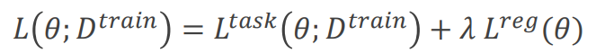

Where _&lambda;_ is a new hyperparameter. Usually _Lreg_ (_&Theta;_ ) is **_l2_** or _l1_ norm.

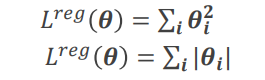

**_l2_ regularization** is also called **weight decay** because, through some math steps, we can see that every gradient descent step drives weights toward the origin (makes them decay) before applying the same update used when regularization is not present.

_l2_ regularization is already implemented in Pytorch's `torch.optim.Adam`. Indeed the parameter `weight_decay` (default value 0) is _l2_'s _&lambda;_.

### Early stopping

**Training time is an hyperparameter** controlling the effective capacity of the model. By using, at inference time, the best performing model on the validation set, we are effectively selecting the best value for this hyperparameter.

| 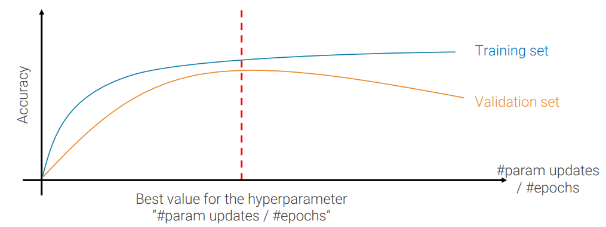 |
|:---:|
| <small><i>the "/" means "or" and not "divided"</i></small> |

### Label smoothing

Cross-entropy loss has the one-hot encoding of the true label as target. Yet, it can not reach it: to have loss equal to 0, softmax of the correct label should be 1, hence scores should tend to infinite.

Label smoothing, originally proposed in [Inception v1](6.md#inception-v1-googlenet), assumes that labels are not perfect and smooths them.

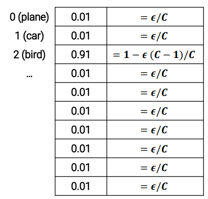

#### KLDiv loss

When using label smoothing in PyTorch, we cannot use `torch.nn.CrossEntropyLoss` because its implementation assumes that you have one-hot encoding vector. Instead you have to use the **Kullback-Leibler divergence loss** implemented in `torch.nn.KLDivLoss`. Be aware that cross-entropy and KLD cannot be directly compared, since cross-entropy is equal to KLD plus a constant, so it's larger.

### Dropout

In each forward pass, **randomly set some activations to zero**. The probability of dropping is a hyperparameter _p_, usually between 0.5 and 0.2.

The idea of dropout was inspired to Hinton by his bank:

>I went to my bank. The tellers kept changing and I asked one of them why. He said he didn’t know but they got moved around a lot. I figured it must be because it would require cooperation between employees to successfully defraud the bank. This made me realize that **randomly removing a different subset of neurons on each example would prevent conspiracies and thus reduce overfitting**.

#### Weight scaling

Dropout makes predictions at training time stochastic, but we want output as test time to be deterministic (this is the same problem found in [batch normalization](5.md#batch-normalization)). A solution could be to _average out_ the stochasticity at test time. but everything is slowed down because you need to pass each example through the network several times, sampling a different mask each time and then average predictions.

A faster way is weight scaling. The idea is to have all the neurons at test time (no drop out) and rescale their value by the probability of dropout _p_.
A similar way is to rescale the value at training time, rather than at training time, rescale by 1/_p_. This second approach, called **inverted dropout** is preferred as it leaves test time unchanged.

### Stochastic depth

A general template for regularization is to **add randomness at training time** and **average it out at test time**, like we have seen with [dropout](#dropout) and [batch norm](5.md#batch-normalization).

This template can be used also for full [ResNet blocks](6.md#residual-networks-resnet): at **training time** we **shrink depth** dropping with probability 1 - _pl_ the convolutional path of a ResNet block, i.e. keep active only the residual identity path.

The survival probability decreases with depth following the formula 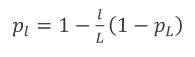

At **test time**, instead, we use the **unmodified network**.

### Data augmentation

The concept is to increase the number of samples generating new data by applying to input images any transformation that maintains the label valid.

It is very effective, because it not only adds stochasticity like the other methods, but it also increase the number of data which results in **reducing variance**.

Common transformations are **rotation** and **flipping**, but they are not always feasible. For example rotation does not maintains the label valid when applied to written text (e.g. a _q_ becomes a _b_).

Another common transformation employed by [ResNet](6.md#residual-networks-resnet), which inherited from [VGG](6.md#vgg-visual-geometry-group), is **multi-scale training** that consists, at **training time**, in **randomly scale** the image, **sample a random crop** of it and applying random **horizontal flip** and **[color augmentation](#color-augmentation--jittering-)** to the cropped patch.

At **test time**, instead, we rescale at fixed scales and average results.

### Color augmentation (jittering)

This technique implement at first by [AlexNet](6.md#alexnet) and then by [ResNet](6.md#residual-networks-resnet), consists in apply **random color change of all pixels** at training time (while doing nothing at test time). The color change is computed sampling three color offstes (one for each RGB channel) from a Gaussian (_&mu;_ = 0, _&sigma;_ = 0.1) and rescaling them by weights learned from data (with a principal component analysis, not a subject of this course).  

### Cutout

Cutout consists in remove (put pixels equal to the average value over the whole dataset) a random square region of the input image with 50% probability. It forces the network to use a more diverse set of features, helping generalization.

### Mixup

Mixup consists in **random blending of images** at training, **blending also the labels**, according to a blend probability sampled from a probability density function _Beta_ (_&alpha;,&alpha;_ ), _&alpha;_ &in; (0, +&infin;). The blending is performed **averaging the RGB values of corresponding pixels** While at test time we simply pass unmodified input. This should force the network to act linearly between classes and have smoother transitions from one class decision to another. Both these effects helps generalization.

### CutMix
<small><i>This is not part of the program of the 2021/2022 course, I just studied it because it was important for my paper's presentation. I put it here because it may be useful also for someone else</i></small>

As in [Mixup](#mixup) we sample a random blend probability from a probability density function _Beta_ (_&alpha;,&alpha;_ ). Note that _Beta_ (1,1) is equal to uniform distribution (0,1).

The difference with Mixup is that CutMix replaces an image region with a patch from another training image and generates **more locally natural image than Mixup**. It can be thought as a **combination between Mixup and [Cutout](#cutout)**.

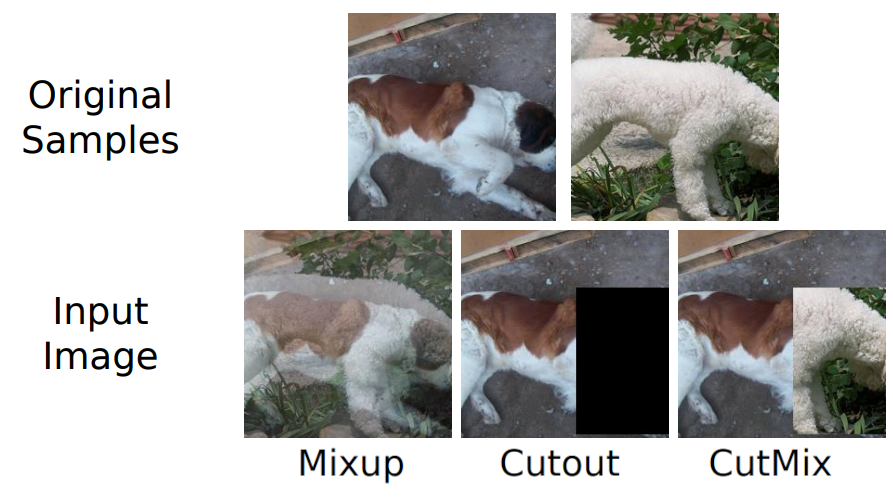

## Double Descent

Double descent is a recent discover (2019). It turned out that increasing the capacity of the model (for example making it deeper and/or training it for more epochs) even after the training error has reached its minimum, leads to an **interpolation threshold** after whose also the test error starts to decrease again.

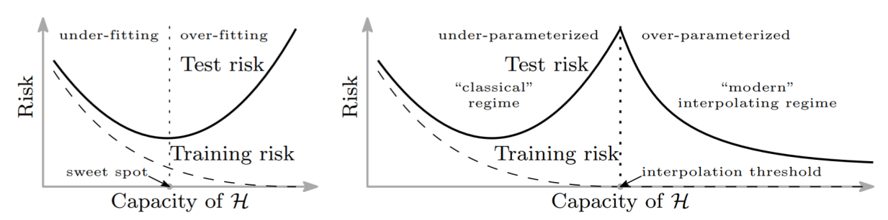
