# Object detection

#### Table of Contents

- [Problem definition](#problem-definition)
- [Datasets](#datasets)
- [Viola Jones object detection and its innovations](#viola-jones-object-detection-and-its-innovations)
  * [AdaBoost](#adaboost)
  * [Haar-like features](#haar-like-features)
  * [Integral images](#integral-images)
  * [Cascade](#cascade)
- [Box overlap and Non maxima suppression (NMS)](#box-overlap-and-non-maxima-suppression--nms-)
- [Detector confidence](#detector-confidence)
- [Other pre-Deep Learning detectors](#other-pre-deep-learning-detectors)
- [Object localization](#object-localization)
- [Transfer Learning](#transfer-learning)
- [Detecting Multiple Objects](#detecting-multiple-objects)
- [Region proposals](#region-proposals)
- [R-CNN](#r-cnn)
  * [Bounding box correction](#bounding-box-correction)
  * [Warping](#warping)
- [Fast R-CNN](#fast-r-cnn)
  * [RolPool layer](#rolpool-layer)
  * [Costs revised](#costs-revised)
  * [Fast R-CNN with ResNet](#fast-r-cnn-with-resnet)
  * [Fast R-CNN loss](#fast-r-cnn-loss)
- [Faster R-CNN](#faster-r-cnn)
  * [Region proposal network](#region-proposal-network)
    + [Training RPNs](#training-rpns)
  * [Faster R-CNN limitations](#faster-r-cnn-limitations)
- [Multi-scale detection](#multi-scale-detection)
  * [Feature Pyramid Network](#feature-pyramid-network)
  * [Faster R-CNN with FPN](#faster-r-cnn-with-fpn)
- [One-stage detectors](#one-stage-detectors)
  * [SSD: Single Shot MultiBox Detector](#ssd--single-shot-multibox-detector)
  * [YOLOv3](#yolov3)
  * [Multi-scale Training](#multi-scale-training)
  * [Training one-stage detectors](#training-one-stage-detectors)
    + [Hard negative mining](#hard-negative-mining)
    + [Focal loss](#focal-loss)
    + [Class weights](#class-weights)
  * [Retina Net](#retina-net)
    + [Multi-label classification](#multi-label-classification)
    + [Retina Net Loss](#retina-net-loss)
    + [Model initialization](#model-initialization)
    + [Resina Net Recap](#resina-net-recap)
- [Anchors-free methods](#anchors-free-methods)
  * [CenterNet](#centernet)
  * [FCOS](#fcos)
  * [EfficientDet](#efficientdet)
  * [Multi-scale feature representations](#multi-scale-feature-representations)
  * [Compound scaling](#compound-scaling)
- [2021 Innovations](#2021-innovations)

## Problem definition

The input is an RGB image of size _W_ &times; _H_, while the output will be **a set of _objects_** where each object _oj_ has its category _cj_ &in; [1,...,_C_ ] and a bounding box _BBj_ = [_xj,yj,wj,hj_ ]. Objects are usually defined as anything countable.

It is a more complicated task than image classification, because the output has a **variable length** and both categorical and spatial information. Also, usually images are processed at **higher resolution** than in image classification because more details are needed.

## Datasets

One of the most important datasets for object detection is **Pascal VOC**, which has 11450 images containing more than 27000 objects belonging to 20 categories. It is nowadays a quite simple dataset to approach.

A more complex and modern dataset is **COCO** which has more than 100K images with objects belonging to 80 categories.

Beside general datasets, more specific datasets exists, like **KITTI**, which is for autonomous driving purposes.

## Viola Jones object detection and its innovations

The _Robust Real-Time Face Detection_ algorithm by Viola and Jones is one of the first successful applications of machine learning into computer vision and of computer vision into commercial products. It enabled **real-time face detection** in unconstrained environments in 2001 and it is still in use today.

It brought three main innovations:

 - Efficient **multi-scale rectangular features** computed by means of **integral images**;
 - a machine learning technique called **AdaBoost algorithm**;
 - **Cascade** to attain real-time speed.

### AdaBoost
**Boosting** is one of technique to build an ensemble of classifiers. Ensembles are the most powerful classifiers in traditional machine learning.
The characteristic of boosting is that the classifiers you ensemble together are **_weak classifiers_** (aka _weak learners_).
A weak classifier is a classifier whose accuracy is slightly better than random guessing. boosting gives theoretical guarantees that if you create an ensemble of weak classifiers according to certain recipes dictated by the boosting framework, then the ensemble will converge to a _**strong learner**_, formed as a weighted combination of the weak learners' responses.

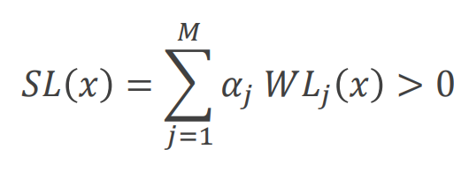.

Boosting can be intended as a bias reduction technique, since weak learners suffer an high bias, which is instead small in a strong learner.

AdaBoost is an effective incarnation of boosting.

An example of a weak classifier is a _decision stump_, which is a classifier thresholding only one feature.

AdaBoost algorithm:

 1. Given _n_ training samples (_x(i),y(i)_ ), initialize their weights _w(i)_ = 1/_N_
 2. For j = 1,...,_M_
   1. Fit the best classifier _WLj_ to the weighted training data
   2. Compute the weighted error rate _&epsilon;j_
   3. Compute _&beta;j_ = 1 - (_&epsilon;j_ ) / (_&epsilon;j_ )
   4. Updates weights for wrongly classified examples _w(i)_ = _w(i) &beta;j_
   5. Renormalize _w(i)_to sum to 1
 3. The strong classifier is 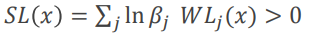

### Haar-like features

The simplest classifier, similar to a decision stump, for computer vision are **Haar-like features**
A Haar-like features consider rectangular regions with a specific position inside a rectangular window. The values (in gray-scale) of the pixels inside the rectangles are multiplied by the sign of the rectangle they belong (-1 or +1) and summed.
The week learner response is 1 if sum is greater (or lesser) than a certain that must be learnt.  
In Viola-Jones work, windows have size 24&times;24 and contain 2, 3 or 4 rectangles, disposed only in bands or checkerboards.

### Integral images

Computing rectangular features in a window can be very expensive if is not implemented in a smart way. For this reason, the authors proposed the use of **integral images**. The idea is that if you have to compute a lot of time sums of values in a image, then it's more efficient to first build an integral image, which can be computed with **only one scan of the input image**, and then use it to query the sum of the values with just a look up.

The process to build the integral image simply follow this recursive rule:

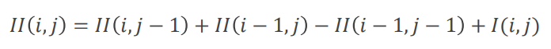

where _I_  is the input image and _II_  its integral image.

In integral images each pixel has the value of the sum of the corresponding pixel in the input image **plus the values of the pixel with smaller coordinates** of the input image. It is shown in this picture:

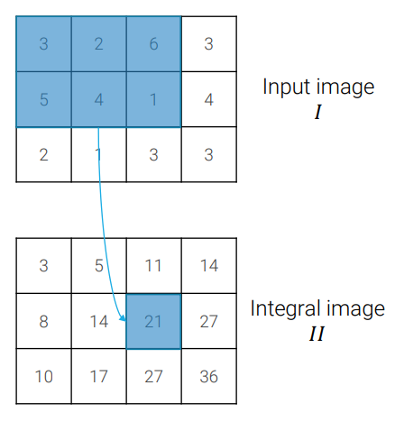

In this way the sum of pixel of any rectangle can be computed in **constant time**.

At test time the strong classifier is applied to all spatial locations in the image, so Viola-Jones is an example of **sliding window detector**.

Also, faces are not necessarily big 24&times;24 in the test set, hence **multi-scale detection**. Once integral images are calculated, it's more efficient to rescale the detector rather than rescaling the image

### Cascade

To obtain good performances, about 200 features are needed to classify each path. Even if each feature can be computed very fast thanks to integral images, there are still **too many windows in an image to achieve real-time performance**.

**Cascade** is a simple but very effective pattern, based on the idea that if you have to explore a lot of locations in an image, but you have prior knowledge that what you are searching is rare, then most of the time is wasted on areas of the image where it is immediately evident that there are no faces.

So, a lot of time can be saved using a simpler classifier to discard some patches. The classifier cannot discard any face, so it must have **100% recall**, but can have a very **low precision**. This simpler classifiers are made using only the first features of AdaBoost. Other features are added in cascade, until the strong classifier is composed.

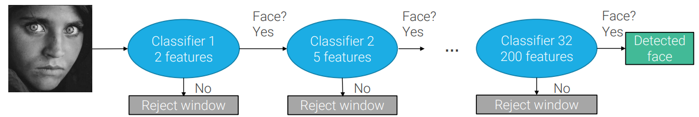

Obviously you have to train classifiers having in mind that they will be used in cascade, so they must have, as discussed, 100% recall (or still very high).

## Box overlap and Non maxima suppression (NMS)

Faces will give rise to **several overlapping detections** in test images. To check if two boxes overlap, we measure the **Intersection over Union (IoU)** score (aka Jaccard index or similarity), which, quite obviously, is equal to the area of the intersection over the area of the union.

 - 0.55 IoU corresponds to partial overlap;
 - 0.75 IoU corresponds to good overlap:
 - 0.90 IoU corresponds to perfect overlap.

To select a single bounding box between all the overlapping ones, we usually use the **score**, which measures the **confidence** of the detector in its prediction.  
The score used for Viola-Jones is the unthresholded response of the Strong Learner.

To obtain a single detection we perform the **Non maxima suppression** of boxes:
 1. Consider the highest scoring bounding box;
 2. eliminate all boxes with overlap greater than a threshold (i.e. IoU > 0.5);
 3. repeat until all boxes have been tested.

## Detector confidence

IoU is also used to compare detectors. The overlap between target bounding boxes and detections is used to says if detections are correct or not and evaluate performances of a detector. In particular, a bounding box is a **true positive (TP)** if its overlap with a ground-truth bounding box is greater than a **defined threshold _&rho;IoU_**. Otherwise it is a **false positive (FP)**.
Deciding this hyperparameter can be problematic and it influences the number of TPs and FPs, and therefore also the recall and the precision.

There is also another way to influence the number of TPs and FPs, which is varying the **minimum confidence _&rho;min_** to accept a detection. Increasing _&rho;min_  we increase the precision while reducing the recall. So, a good way to evaluate a detector is by its **precision-recall curve**, which is a scatter plot with precision and recall on the axis and where each point corresponds to a different _&rho;min_.  
_&rho;IoU_ is instead fixed to 0.5.

To have an idea of detector's performances independently from the threshold, we can compute the **average precision (AP)** which is the area under the precision-recall curve.

If there are multiple class, the final score on a dataset is given by the **mean AP (mAP)** across classes.

Until now we have kept _&rho;IoU_ fixed to 0.5, which is a quite low value. Increasing it we can obtain different (lower) APs for each class. COCO computes the AP for a class as the mean of APs computed with _&rho;IoU_ &in; [0.5: 0.05: 0.95], and the anverages them across classes to get the **COCO mAP**.

## Other pre-Deep Learning detectors

Another very popular sliding window detector was the Histogram of Gradients (HoG) detector.

It accumulates gradients in a histogram of orientations (like SIFT) for each 8&times;8 cell, and at then and the image is classified by a linear SVM into _person_ or _not person_ classes.

The state of the art before deep learning was reached by **Deformable Part Models (DPMs)**, which is a generalization of HoG for more classes.

## Object localization

To see how deep CNNs we studied for image classification can be extended to the problem of object detection, let's first consider a simpler problem, called **object localization**. In object localization you assume that you have only one object in the image. So instead of predicting one class, like in image classification, the network must predict one class and one bounding box per image.

To predict also a bounding box, CNNs for image classification are extended having two parallel linear layers after the final global pooling instead of only one. One layer predicts the logits for each class (then the predicted class is predicted with an argmax), the other one predict 4 numbers which are the position the bounding box.

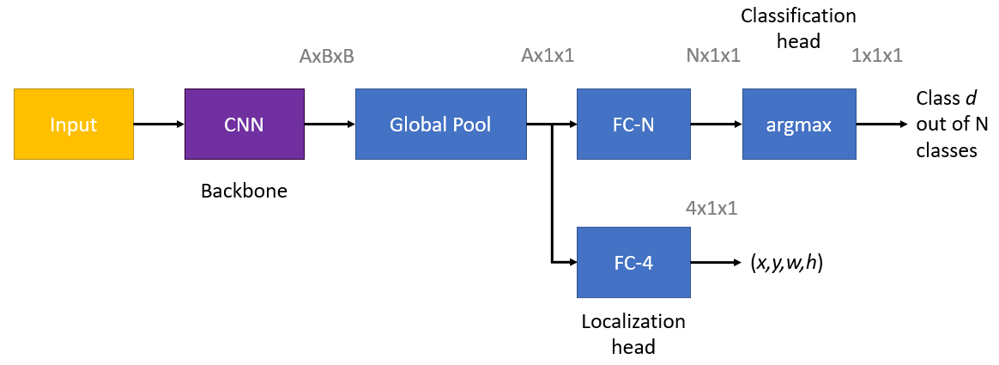

However this approach, very used in the past, is nowadays a bit questionable, since with the global pooling we totally loose spatial information, and that's not the best way to anchor a bounding box prediction which.

As loss function, we can obviously use the softmax for the classification, while for the bounding box at the beginning an L2 loss was used, which is the root-mean-square error. To put the two losses together, the total loss _L_ is the cross entropy (CE) of the classification loss plus the localization loss. This is the first example of **multi-task learning** we see in this course. As common in multi-task learning, it's not a good idea to optimize the two things as the same level. Also the two losses could (and in our case do) span different ranges. This is why the localization loss is multiplied by an hyperparameter _&lambda;_. So we have **_L = CE_ (_Lclass_ ) + _&lambda; Lloc_**.

## Transfer Learning

Since Coco is not as large as ImageNet, the backbone network is pre-trained on ImageNet for classification only and then on COCO for localization. this technique is called **transfer learning**. You can decide if completely **freeze** the backbone after the pre-training and train only the heads on the new task, or if doing **fine-tuning** and change a bit also the weights of the backbone.

In the case of fine-tuning you anyway start with a frozen backbone, and you unfreeze it only after that the classifier has started to do quite good predictions. Also, the learning rate used for fine-tuning should be smaller than the one used in pre-training.

Another good idea for fine-tuning is to have progressive learning rates which are smaller (eventually 0) for lower layers and higher close to the heads.

## Detecting Multiple Objects

As in Viola-Jones and other pre-deep learning techniques, we can have a **sliding detector** which solves the object localization problem. To handle the patches where there are no object we need to **add a new class for background**. Since background patches are far more frequent, we have to pay attention to create mini-batches that always includes also some positive-examples. The total loss becomes _L_ = _CE_ (_Lclass_ ) + _&lambda;_**_I_ [_c_ &ne;_bg_ ]** _Lloc_, where the **indicator function** _I_ [_c_ &ne;_bg_ ] is 1 when the ground-truth class _c_ is not background, otherwise it's 0.

The problem with this approach is that there are too many boxes to try and the computation of each box is slower than in Viola-Jones and cannot be speeded up with integral images or cascade. So it is impossible to try all the boxes and the only solution is to use **region proposals**.

## Region proposals

Region proposal algorithms attempt to segment an image into regions that may likely be objects. It doesn't want to have a very high precision, but it want to have a **very high recall**.

The first step is to segment the image into highly uniform regions, called **superpixels**.
Then superpixels are aggregated to create regions. Using color, texture and size criteria, the most similar regions are grouped into a new region and new similarities are calculated between the new region and its neighbors, until the whole image becomes a single region.

This process create a hierarchy of aggregations and good candidates can be at any level of the hierarchy.

The described algorithm is called **selective search**.

## R-CNN

The **very first attempt** to bring CNNs into object detection consists in combinate object localization with selective search. The result is **Region-based CNN (R-CNN)**, which use [AlexNet](6.md#alexnet) architecture.

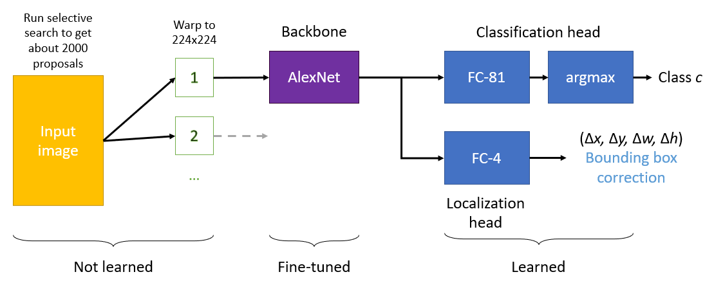

### Bounding box correction

As shown in the image, instead of bounding box position, the localization head returns a **bounding box correction** relative to the position and the dimension given by the selective search

In the output bounding box _x_ is not summed to the correction &Delta;_x_ directly, but to its multiplication by the box width _w_. The same is for the vertical component. This is done because big boxes usually need to move the center more to be properly corrected.

For correction to dimensions, instead, _w_ and _h_ are multiplied by the exponential of their correction &Delta;_w_ and &Delta;_h_. This is done because the exponential of 0 is 1, so correction 0 means no correction. This is easier for the model to be learnt rather than having correction 1 meaning no correction.

The multi-task loss it's the same, but the localization loss _Lloc_ is &parallel;_t'_ &minus;_t_  &parallel;22, where _t_ is the target bounding box and _t'_ is the predicted bounding box after correction.

### Warping

During warping, some **context is added** by expanding the region size to a new size that will result in 16 pixels of context in the warped frame.

## Fast R-CNN

Even if CNN is run only on 2000 proposals, R-CNNs are still too slow. The largest number of flops are required by the first convolutional layers, so the idea is to run first convolutions only once for the whole image instead that once for proposal.

### RolPool layer

The interface between the convoluted whole image and the per-region fully connected layers is the **RolPool layer** that crops and wraps the conv features according to proposals.

This is done by **converting** activations inside Regions of Interest, corresponding to rescaled Selective Search regions, **into activations with fixed spatial dimensions**, the one required by remaining layer of the network. Algorithmically, given a region _R_:
 1. rescale the coordinates of _R_ according to the stride used in the convolutional layers;
 2. snap _R_ to grid, in order to have integer coordinates;
 3. max pool over sub-regions with adaptive-size kernels, in order to have the dimensions needed by the linear classifier.

Steps 2 and 3 are source of **quantization**. It will be discussed in future lessons.

### Costs revised

With these adaptations, the number of flops required by the convolutional layers is kept under control and the **bottleneck becomes the small per-region network**.

### Fast R-CNN with ResNet

Modern versions of Fast R-CNNs use ResNet instead of AlexNet. The backbone feature extractor run once on the whole image is ResNet up to stage 3, while stage 4 and average pooling are run as per-region network.

### Fast R-CNN loss

Fast R-CNN uses the same bounding box correction of R-CNN, but introduces a so-called **smooth L1 loss** (aka a Huber loss), which is less sensitive to outliers and easier to optimize for large values than the L2 loss.

Smooth L1 loss have many benefits, indeed it will be largely used also after its introduction for fast R-CNNs.

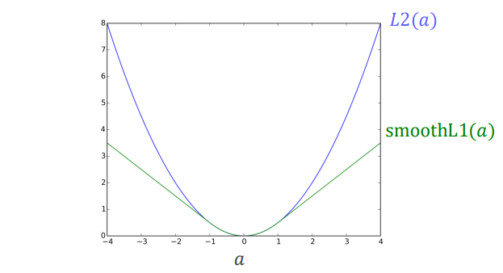

## Faster R-CNN

The most problematic part of Fast R-CNNs is the region proposal algorithm, because it isn't learned and because it is slow.

In faster R-CNN the also **proposal boxes are learnt**. It is done by the **region proposal network (RPN)**, which takes in input an already features-extracted image and outputs each proposal with an associated _objectness_ score, which describes how much it is probable that an object (no matters of which label) is in the box.

At test time, only the top _n_ proposals, sorted by their objectness score, are processed. _n_ is a new hyperparameter.

The rest of the architecture is equal to [Fast R-CNN](#fast-r-cnn).

### Region proposal network

The region proposal network solves an [object localization task](#object-localization). Indeed, for each portion of the image it has to say if there is an object or not (which can be thought as assigning a class) and give the bounding box.

So, it needs to slide a window on the image like [Viola-Jones algorithm](#viola-jones-object-detection-and-its-innovations), but since this step is performed on an already convoluted image, which is smaller, it needs to be applied less times and on a very small receptive filed, like 3&times;3.

Since proposing a bounding box is a too complex task, an **input proposal**, called _**anchor**_, is introduced, so the problem becomes **correcting** the input proposal. Anchors are fixed-scale and aspect-ratio boxes.

Actually, for each space location more than one anchor is proposed, so, at each step of the sliding process, the regional proposal network **predicts _k_ objectness scores and _k_ corrections**, where _k_ is the number of the anchors.

Since the RPN needs to be a very light layer, it is realized as a two-layers CNN with two heads.

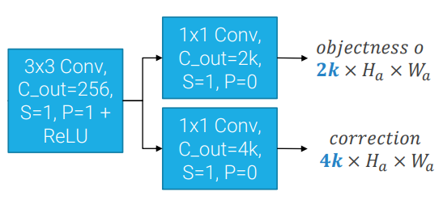

#### Training RPNs

Training RPNs is very messy. Indeed, for an activation of size _H_ &times;_W_, there are _kWH_ total anchors and for each anchor  you have to decide if it corresponds to an object or not. To do that, you use the _j_-th anchor _BBA_ as a positive (object) sample if the [IoU](#box-overlap-and-non-maxima-suppression--nms-) between the ground-truth bounding box _BBGT_ and _BBA_ is:
 - greater than a certain threshold (e.g. 0.7);
 - or largest than the IoU between  _BBGT_ and all the other proposals (even if under the threshold).

On the contrary, you use it as a negative (background) sample if it has an IoU lower than another threshold (e.g 0.3) with all the ground-truth boxes in the image.

All the other anchors are ignored.

Keeping in mind that this is an unbalanced problem, **a mini-batch is formed by stacking all the positive anchors and enough negative anchors to reach the mini-batch size _B_**, because random sampling the mini-batch is not ideal since you risk to have only negative samples.

Then the usual multi-task loss with the cross entropy and the [smooth L1 loss](#fast-r-cnn-loss) is used.

### Faster R-CNN limitations

Faster R-CNN takes an image and create a **very coarse image in terms of spatial resolution**: even if small scale anchors are provided, it may miss object small than the gird size.

## Multi-scale detection
To attain scale-invariant detection and detect large and small objects alike, the main approach before CNNs was based on **image pyramids**, which were processed to obtain **feature pyramids**.

The naïve approach to obtain feature pyramids with CNNs would be to run a CNN at each scale and perform detection of each activation to create a pyramid of activations, but both inference and training time grow significantly.

The key to keep computational time slow is to realize that CNNs already produce a pyramid of activations, but with **different semantic quality at different depths**. So we could run the [RPN](#region-proposal-network) not only on the last activation, but also on the intermediate ones. The problem with this approach is that it produces bad proposals for middle activations, due their low semantic quality.

### Feature Pyramid Network

A feature pyramid network (FPN) solve the just discussed problem,  **hallucinating high resolution features with high semantic value**.
The regular forward path, which in this architecture is called _bottom-up path_, is extended with a _top-down path_, where the last activation is consecutively merged with intermediate activations.

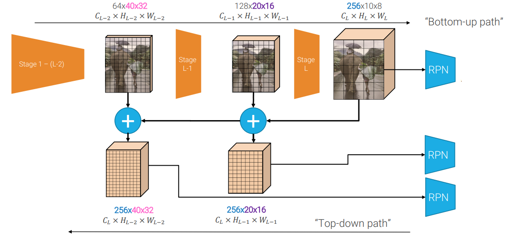

The merging must:

 - fix the resolution of the spatially coarse activation with a **Nearest Neighbor Upsampling**;
 - fix the number of channels of the poor semantic quality activation with a **1&times;1 convolution**;
 - **sum** the fixed activations;
 - pass the result through a **3&times;3 convolution** to reduce aliasing artifacts created by the nearest neighbor upsampling.

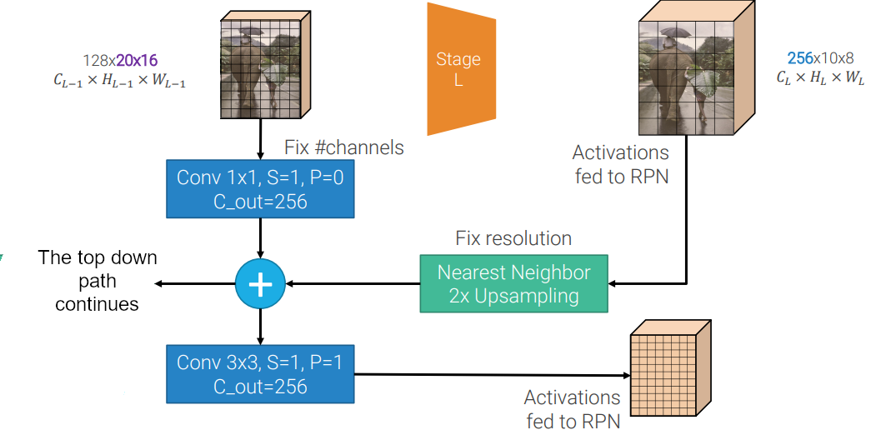

The nearest neighbor upsampling and the 1&times;1 convolution are often referred as **lateral connections**.

### Faster R-CNN with FPN

The backbone feature extractor combine with the FPN creates a **pyamid of features** usually reffered to as _P_, with _Pi_ the _i_-th level of the pyramid.

How the [RPN](#region-proposal-network) can decide to what level of the pyramid project each proposal? This decision is made according to an empirical but effective rule: a proposal of area _w_ &times; _h_ is assigned to the level _Pk_ with 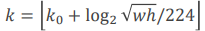. The 224 is due to the fact that images in ImageNet have size 224&times;224. _k0_ is usually the last level for biggest objects. Proposal with smaller areas make the logarithm negative, so _k_ is a lower level.

In PyTorch, `torchvision.models.detection.fasterrcnn_resent50_fpn` construct a Faster R-CNN model with a ResNet-50-FPN backbone. This is the baseline for an object detection algorithm.

## One-stage detectors

Faster R-CNN with FPN are sometimes called **_two-stage_ detectors**. The first stage is composed by the feature extractor, the FPN and the RPN and it's run once per image. The second stage, which on the contrary is run once per proposal, is composed by the RolPool layer and the per-region classification and correction.

Since the proposals are already learned in first stage, the are probably already quite good before the correction done in the second stage. So the main purpose of the second stage is only to classify objects. Therefore, **in application where classification is not needed, the second stage can be thrown away**. Of course we obtain worse results, because there is no correction, but computation is very faster.

Also, we can enhance the RPN to reintroduce classification, obtaining a **one-stage detector**, also called single stage detector, single shot detector or dense object detector.

One-stage detectors are composed by the feature extractor, which is the **backbone**, by the FPN which is the **neck**, and by the **detection head**, which is an enhanced variant of an RPN that instead of the objectness score, in output has the anchor category (the anchor correction remains the same that in classic RPN).  

Instead of having _C_ classes plus 1 for the background, a possible **variant** is to have just _C_ classes and keep the objectness score to sort boxes and perform non-maxima suppression. Another variant is to have category-specific correction.

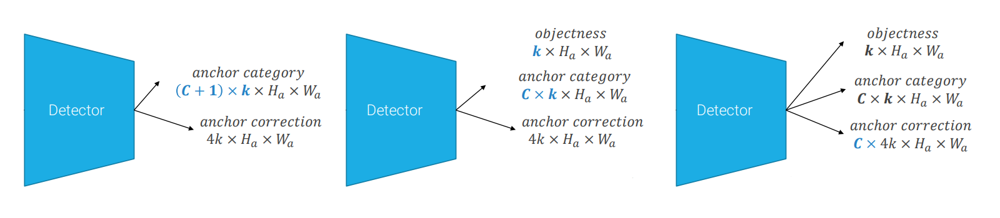

No matter what variant we are using, is always possible to stack all these outputs in a combined single tensor with the appropriate number of channels.

### SSD: Single Shot MultiBox Detector

SSD is one of the first single stage detectors, often used as baseline. The **backbone is composed by the first stages of a VGG architecture**. It was introduced before FPNs, so **there isn't a neck**, instead a detector head, which is a 3&times;3 convolutional layer with _ks_ (_C_ +1+4) output channels where _ks_ is the number of anchors at that scale, is placed after each activation produced internally by the backbone.

Like others one stage detectors, when you run it you obtain a huge tensor, with 8732 anchors per class. So, at test-time thresholding and NMS very important to discard most of the proposals.

### YOLOv3

You Only Look Once (YOLO) is another very famous one stage detector. YOLOv3 was the last implementation proposed by the original author (Joseph Redmond) and it's one of the most used ones. Many other versions of YOLO, both official and unofficial, have been made.

YOLOv3 uses a **custom backbone (DarkNet-53)**, which is a kind of variation of ResNets, optimized to have a good trade-off between classification accuracy and speed. DarkNet is wider than ResNet in order to better exploit GPU's resources.

Also the **FPN is customized**. The key difference is that it **concatenates activations** form different stages instead of summing.

YOLO proposes **"learned" anchors**, which are learnt by defining a distance between boxes' shapes and then using them to run k-means clustering on ground-truth boxes. YOLO v2, which introduced this technique, learns 5 anchors. YOLOv3 learns 9 anchors.

Another innovation is relative to **anchor correction**, which in Faster R-CNN does not **constrain the position of the center of the bounding box** to remain in the cell originating it. Moving the center in another cell has no sense, because an anchor is generated for each cell. This causes a lot of trouble at the beginning of the training, because anchors can move freely across the image, taking a long time to stabilize. So, through the sigmoid function, they impose a correction &in; [0,1].

### Multi-scale Training

Since one-stage detectors use only convolutions and max pooling layers, they can be applied to images of any size above a minimum size of 32&times;32. However, if the network is trained only on images of a certain resolution, it does not perform well on different resolutions. **Multi-scale training** and fine-tuning solve this problem forcing the network to learn to predict well across a variety of input dimensions. It is composed by the following steps:

 1. Train the backbone on ImageNet with fixed input resolution, e.g. 224&times;224.
 2. Fine-tune the backbone for 10 epochs on ImageNet at double resolution, e.g. 448&times;448.
 3. Change the resolution of input images for detection. Since the network applies stride 32, we can pick multiplies of 32, from 320 up to 608.
 4. When fine-tuning on the detection dataset, every 10 epochs pick a random size among them, resize the input image to that size and continue fine-tuning.

This allows the model to be run at test time on any resolution (but odd multiplies of 32 are better) without re-training the network. This makes possible to easily trade accuracy (mAP) for speed (FPS).

### Training one-stage detectors

Object detection is an **imbalanced problem**, because there are a lot more background boxes than object boxes.

Imbalanced problems usually have a **within class problem** in the larger class (the negative/background class in our case), and a **within classes problem** between al the classes.

Indeed there are a lot of regions that are **easy negatives** which occupy most locations in a randomly sampled mini-batch and contribute no useful learning signal, making harder to learn to correctly classifying hard negatives (within class problem) and positives (within classes problem)

Both Viola-Jones and two stage classifiers have naturally solved this problem. The former with the cascade, the latter implicitly sampling hard negatives by training only on the top scored proposals.

One-stage detectors, instead, are trained on the fill set of anchors, so it's important to have counter measures against class imbalance, otherwise **a mini-batch will on average contain most, if not all, easy negatives** making the training very slow or even unsuccessful.

#### Hard negative mining

What they proposed in [SSD](#ssd--single-shot-multibox-detector) is **hard negative mining**, which is a quite intuitive way to focus on hard negatives. To know which samples are hard negatives, all the negative anchors are sorted by classification loss, then NMS is performed to remove overlaps, and only the top ones are used in the mini-batch, up to a 3:1 ratio with respect to positive examples.

#### Focal loss

[Hard negative mining](#hard-negative-mining) is a working solution, but it's unsatisfactory, because **the network sees only a subset of the negative examples in training**.

Let's take a step back and restart from the binary cross entropy definition:

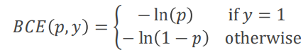

where _p_ is the probability assigned by the model to have label _y_ = 1.

We can simplify this expression using an intermediate variable _pt_, which is the probability of the true class:

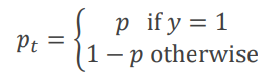

and rewrite _BCE_ (_p,y_ ) = _BCE_ (_pt_ ) = &minus; ln(_pt_ )

The standard cross entropy loss has a non-trivial magnitude  even when examples are correctly classified, i.e. when _pt_ >> 0.5. So, when there are lots of easy negative, the classifier has not a big incentive in focusing in wrong classified samples, because it can keep to improve things it is already doing well, still having the same reduction in the loss.

This can be solved by changing the loss and using a (binary) **focal loss**.

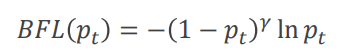

Where _&gamma;_ is a tunable **focusing** hyper parameter (usually 2).

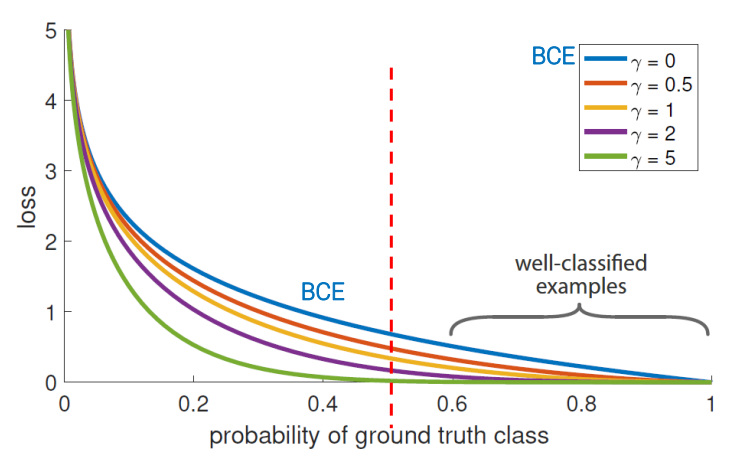

#### Class weights

The focal loss helps the detector to focus on the hard example that is detecting wrong, solving the within class problem in the negative class. To solve also the **within classes problem**, a common technique is **class weights**.

In the binary case, a weight _&alpha_ &in; [0,1] weighs the loss for the positive class, while 1-_&alpha;_ weighs the negative class. Usually _&alpha;_ is set to the inverse class frequency or tuned as a hyper-parameter.

The cross entropy with class weights takes the form

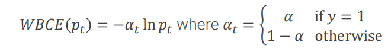

But since, **class weights serve a complementary purpose with respect to the [focal loss](#focal-loss)**, they are usually used together:

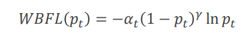

### Retina Net

Retina Net is a plain **[one-stage detector](#one-stage-detectors)** which introduced **[focal loss](#focal-loss)** for the first time.

It has a very simple and elegant design. It has a **[ResNet](6.md#residual-networks--resnet-) backbone** with an **[FPN](#feature-pyramid-network) neck** and then **detection heads**.

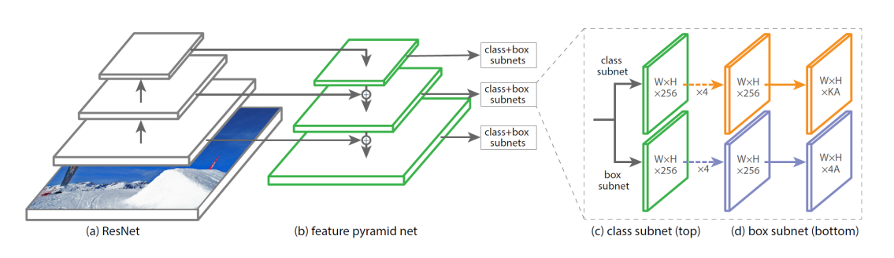

A small innovation, but still used by almost all the subsequent one-stage detectors, is that the branches of the detectors head which predict the class and the bounding box are **completely separated**, not sharing parameters. The reason for doing this is that the classifier wants to aggregate information spatially to come up with a decision, while the bounding-box regressor wants to reason on well spatially localized information.

#### Multi-label classification

In both [Retina Net](#retina-net) and [YOLOv3](#yolov3) the assignment of the class to the box is treated as a **multi-label classification** problem. Instead of assuming that classes are mutually exclusive, which leads to a multi-class problem, each detected box **can have from 1 to _C_ classes**, which are **not assumed to be mutually exclusive**.

For example a bounding box can be both a _woman_ and a _person_. Of course the detector will give an high logit to both classes, but then, in the standard multi-class problem, they are passed to the softmax function, which is designed to amplify tiny differences between scores. So at then end only one of the two class will have an high probability.

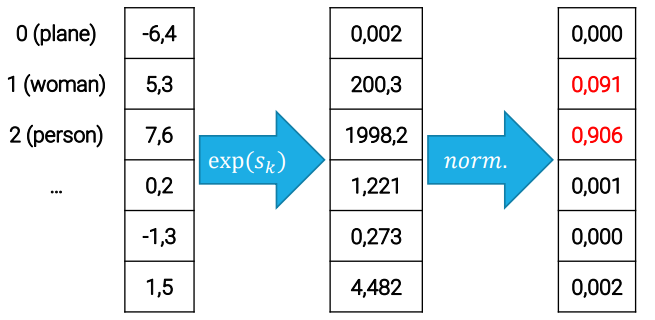

But in multi-label classification, **_C_ independent sigmoid functions** are used to compute the probabilities, and in the example above we obtain high probabilities for bot _woman_ and _person_.

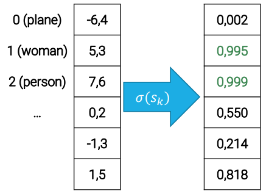

This is very useful for dataset where classes are nested (like _woman_ and _human_), but also for datasets, like [COCO](#datasets), which do not have this characteristic.

#### Retina Net Loss

Since Retina Net uses **[multi-label classification](#multi-label-classification)**, the classification loss for the _j_-th box in the _i_-th image becomes the sum of _C_ binary cross entropy terms.

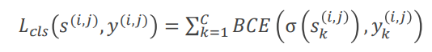

where the ground truth _y(i,j)_ is **not anymore a one-hot encoding**, but can have as many 1s as it wants. This has the nice side effect or not needing the background class anymore, indeed it is represented by a ground truth vector of all 0s.

It also uses **[weighted](#class-weights) [focal loss](#focal-loss)**, then the classification loss actually is

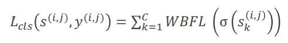

Then, the final loss used by RetinaNet for an image uses it in conjunction with the usual **[smooth L1](#fast-r-cnn-loss)** regression loss, **for all the anchors in the image**

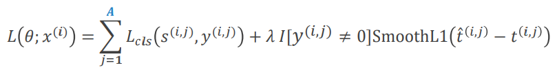

#### Model initialization

[Retina Net](#retina-net) also introduce a **careful initialization** to properly handle imbalanced classes.

When we normally initialize a model we take  random weights _wk_ from a gaussian distribution with _&mu;_ = 0 and _&sigma;_ = 0.01 and we set the biases _bk_ equal to 0.

This is a problem with imbalanced classes, because, when we multiply the inputs for the weights, we still have values following the  gaussian distribution with _&mu;_ = 0 and _&sigma;_ = 0.01, then we sum the biases, which are 0, so nothing changes.  
This means that the probability of observing a value greater than 0 (i.e. of observing a sample belonging to class 1), is 0.5, which does not reflect the imbalance between class.

Being _&pi;_ the prior frequency of positives (e.g. _&pi;_ = 0.01), then we initialize each _bk_ as 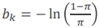

#### Resina Net Recap

 - Simple and elegant [one-stage detector](#one-stage-detectors) composed by:
  - [ResNet](6.md#residual-networks--resnet-) backbone;
  - [FPN](#features-pyramid-network) neck;
  - detection heads.
 - Main innovations are:
  - separated branches for classification and bounding box regression;
  - [multi-label classification](#multi-label-classification) (like in [YOLOv3](#yolov3));
  - [careful initialization](#model-initialization) to handle imbalanced classes.
 - The [loss](#resina-net-loss) combines:
  - [weighted](#class-weights) [focal](#focal-loss) [multi-label](multi-label-classification) loss for classification;
  - [smooth L1](#fast-r-cnn-loss) loss for bounding box regression.

## Anchors-free methods

Both two and one-stage detectors use anchors. But anchors have some limitations:
 - in practice the more anchors the better, and this **brute force approach** is not efficient;
 - we have **a lot of duplicated entries for an object**, which must be handled with NMS, which is however not differentiable, and then not learnable;
 - assignment of anchors to ground truths for training is based on **manually selected thresholds** and **hand-crafted rules**.

These limitations carried to create **anchors free methods**

### CenterNet

To overcome anchors' limits, CenterNet proposes to represent **objects as points**.

Given an image of size 3&times;H&times;W, the aim of the network is to produce a heatmap _Y_ with values in [0,1] and size C&times;H/R&times;W/R with output stride R. R is usually small (e.g. 4) because we want to have high localization. This was not needed in anchors localization models, which used higher strides (e.g. 16 or more).

To recover the discretization error caused by the output stride, the network also predicts an offset O of size 2&times;H/R&times;W/R for each center point.

Finally, it also predicts the bounding box size S of size 2&times;H/R&times;W/R.

The backbone is a  **fully convolutional [encoder-decoder architecture](#TODO)**.

On top of the backbone there are three separated heads with the same structure: 3&times;3 conv + ReLU + 1&times;1 conv. One produces the heatmap, one produces the offsets and one produces the bounding boxes.

At **inference time** you look for local maxima in the keypoint heatmap, and by definition this doesn't create duplicate detections.

To make the **ground-truth heatmap**, you take the center of the bounding box, you project it in the lower-resolution output heatmap and you put the value of the located pixel to 1, then you update it with an unnormalized gaussian kernel to obtain a smoother heatmap.

The loss for the heatmap is a focal loss with an additional weight to reduce the loss around the ground truth location.

Points can be seen as special anchors: single, shape-agnostic, anchors. But "anchors" are assigned to ground truth boxes based only on location, not on the overlap of the boxes. This remove manual thresholds. Also detection is performed by finding local maxima in a heatmap, therefore we have one box per object without NMS.

This is a very flexible design. For example, it can be expanded, even if not to the state of the art, to **3D detections** or **joint detections**

### FCOS

FCOS is a anchor-free model based on the same ideas of [CenterNet](#centernet).

### EfficientDet

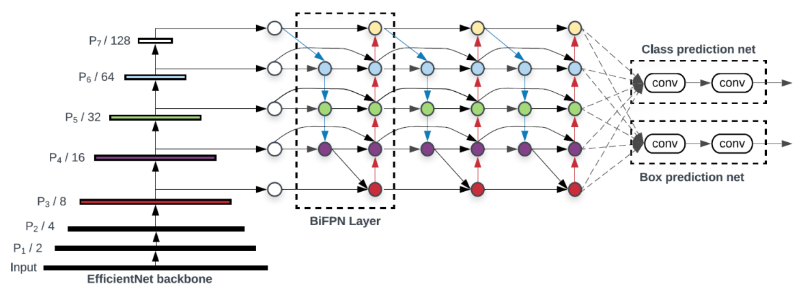

EfficientDet is made by the same team of [EfficientNet](6.md#efficientnet) and indeed uses it as **backbone**. It approaches the same problem, but in object detection rather than in image classification: if I have more computational budget and I want to scale my model up, [what should I do?](#compound-scaling).

The dimensions to consider are:
 - **backbone**;
 - **image resolution**, like seen in [YOLOv3](#yolov3);
 - **neck**;
 - **detector network**.

### Multi-scale feature representations

Beyond compound scaling, the only innovation of EfficientDet, is a new alternative to the traditional [FPN](#features-pyramid-network). Let's start seeing some previous FPN alternatives.

One of the first alternative to FPN was **PANet** (Path Aggregation Net), which adds a **bottom-up path** that downsamples hallucinated features at higher resolution to merge them into coarse ones.

Since, with PANet, multiple-paths and connection across different scales turn out beneficial, [Neural Architecture Search](6.md#neural-architecture-search--nas-) was used to search for more effective architectures. The model obtained, called **NAS-FPN** has a crazy, irregular design which however achieves performances similar to PANet while using less parameters. NAS-FPN also introduces the idea of **repeated blocks** which can be stacked together.

EfficientDet's team decided to use the repeated blocks idea of NAS-FPN, but to return to the regular design of PANet. So, they introduced **weighted bi-direction feature pyramid network (BiFPN)**, which is the state of the art nowadays.  
Compared to PANet, a BiFPN block removes the convolution after the last and the first layers of the backbone, which is instead directly upsampled and merged. Also it has skip connections.  
Another innovation are **learnable weights** to sum features.

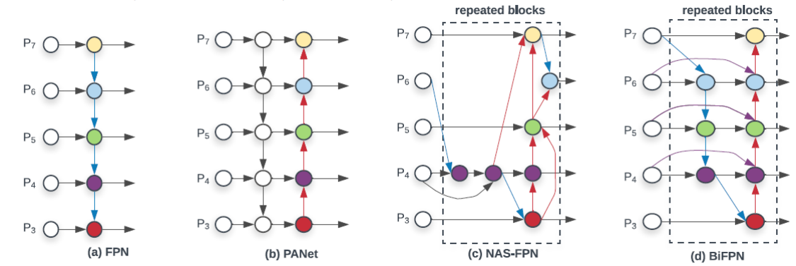

### Compound scaling

In the spirit of EfficientNet, **EfficientDet proposes a single compound scale coefficient _&Phi;_** to scale all these elements coherently in a one-stage detection framework. However, given the larger number of decisions, scaling is not based on grid search, but on heuristic rules.

 - **Backbone**: the EfficientNet backbone is scaled according to its rules: **D_&Phi;_ uses B_&Phi;_**.
 - **Input image resolution**: Since the last layer of the backbone has a total stride of 128 pixels, it makes sense, when increasing input size, to moving in steps of 128, in order to have an additional pixel in the last activation for each step. Hence resolution is linearly increased using **_rinput_ = 512 + _&Phi;_ &times; 128**.
 - **BiFPN network**: a small grid search was performed only for the width parameter. The rule is _Wbifpn_ = 64 &times; (1.35)_&Phi;_, _Dbifpn_ = 3 + _&Phi;_
 - **Detection network**: same width as BiFPN, linearly grow depth: _Ddet_ = 3 + &LeftFloor;_&Phi;_ /3&RightFloor;

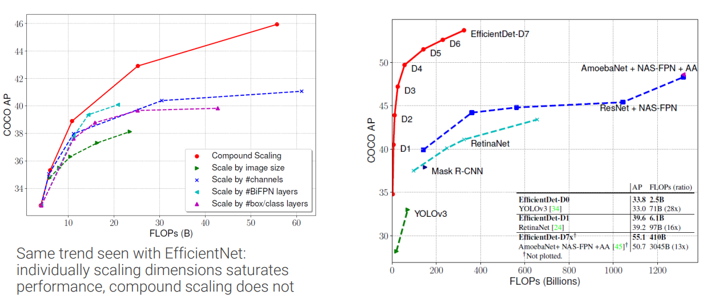

## 2021 Innovations

What presented was the state of the art in 2020, but a lot changed in 2021. Here some pointer are presented:

 - **Specialized backbones** like [CSPNet](https://openaccess.thecvf.com/content_CVPRW_2020/html/w28/Wang_CSPNet_A_New_Backbone_That_Can_Enhance_Learning_Capability_of_CVPRW_2020_paper.html) (2020) and [ResNeSt](https://arxiv.org/abs/2105.14447) (2020).
 - **Combine cascade with two-stage detectors** to improve proposals, like in [Cascade RCNN](https://openaccess.thecvf.com/content_cvpr_2018/html/Cai_Cascade_R-CNN_Delving_CVPR_2018_paper.html) (2018) and Cascade RPNs.
 - Improve performance by **improving assignment of anchors** to foreground and background classes, like in [Adaptive Training Sample Selection](https://openaccess.thecvf.com/content_CVPR_2020/html/Zhang_Bridging_the_Gap_Between_Anchor-Based_and_Anchor-Free_Detection_via_Adaptive_CVPR_2020_paper.html) (2020), [Probabilistic Anchor Assignment](https://arxiv.org/pdf/2007.08103.pdf) (2020) and [Optimal Transport Assignment](https://openaccess.thecvf.com/content/CVPR2021/papers/Ge_OTA_Optimal_Transport_Assignment_for_Object_Detection_CVPR_2021_paper.pdf) (2021).
 - Replace L1 loss for localization with a **IoU-aware loss**, like in [Generalized IoU Loss](https://openaccess.thecvf.com/content_CVPR_2019/html/Rezatofighi_Generalized_Intersection_Over_Union_A_Metric_and_a_Loss_for_CVPR_2019_paper.html) (2019) and make also **classification IoU-aware** like in [Generalized Focal Loss](https://arxiv.org/abs/2006.04388) (2020)
 - [**CenterNet2**](https://www.lvisdataset.org/assets/challenge_reports/2020/CenterNet2.pdf) (2020), which is a probabilistic interpretation of two stage detectors, which uses CenterNet instead of RPN.
 - **New versions of YOLO**, like [YOLOv4](https://arxiv.org/abs/2004.10934) (2020), YOLOv5, and, in particular, [**YOLOX**](https://arxiv.org/abs/2107.08430) (2021).
