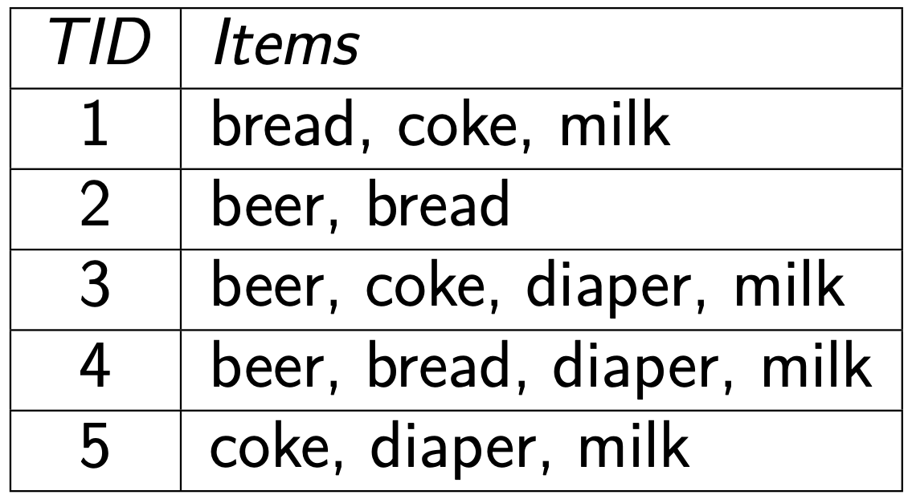
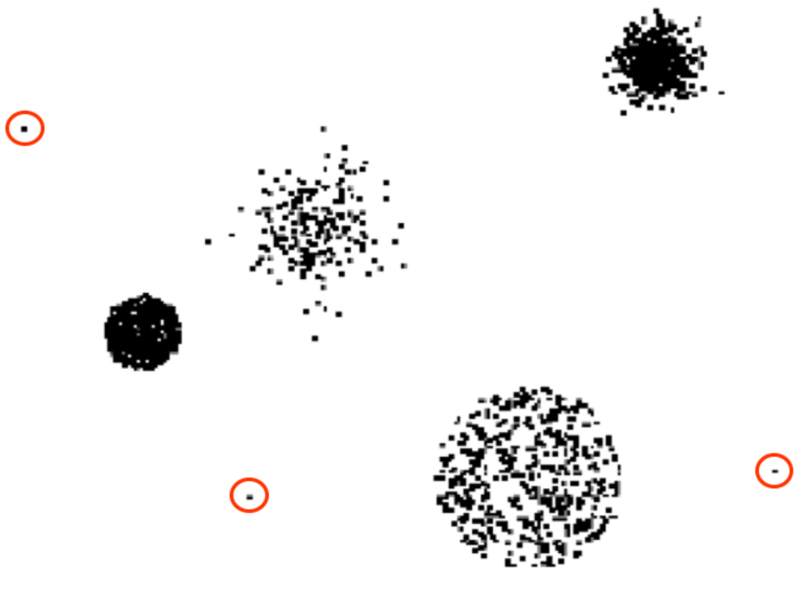

# Data and datasets

So, **what is a dataset?** It is a set of $N$ individuals, where each individual is described by $D$ values. In essence, it can be seen as a *relational table* with $N$ rows and $D$ columns. 

Let's first start with some issues on the data: of course, data is raw material, so there's lots of issues. Data can be qualitative or quantitative. Data are **never perfect**. Nowadays, with the automatic collection of data, problems are reduced but still exist. There can be **outliers**: a small amount of data which are different from the others, due to anomalies/errors, but could even represent *surprising* data. Some mining techniques are **more robust** than others.

**Better data quality usually implies better insights.**

Therefore, pre-processing activities are essential.

We could have a quick look at a few examples from the [**UCI ML repository,**](https://archive.ics.uci.edu/ml/index.php) and find things like:

- Iris
- Adult
- Breast Cancer
- Wine quality
- Car evaluation

### Data types

Data can be expressed in **various ways**. It can be made of *numbers, letters, classes, symbols.*

Generally, we speak about **numbers** (*quantitative information*), and **labels** (*qualitative information*).

When speaking about **numerical data**, we divide it into:

- **Interval**, where the difference is meaningful, like dates
- **Ratio**, which have a univocal definition of 0, like degrees

When dealing with **categorical data**, we divide it into:

- **Nominal**, a set of labels, where the information allows us to distinguish a label from another one but not order them (for example, male/female)
- **Ordinal**, where the values provide enough informations for a total ordering (for example, when labelling low/medium/high)

**What are the possible transformations?** For **nominal** data, we can do every possible one-to-one correspondence, e.g. the Social Security Number can be arbitrarily reassigned. For **ordinals**, we must preserve the order, e.g. low/medium/high --> 1,2,3. For **intervals**, we can use linear functions. For **ratios** we can use *any* mathematical function.

### Number of values

We can distinguish between **discrete domains** and **continuous domains**. Nominals and ordinals are *discrete*, possibly binary. Intervals and ratios are *continuous*. 

### Asymmetric attributes

In asymmetric attributes, only the presence is considered important (a non null value). Presence is more significant than absence. 

### General characteristics

It's best to discuss some features:

- **Dimensionality**: we can talk about large data and tall data. The difference is also qualitative: when d is big, some operations perform badly
- **Sparsity**: when there are many zeros/nulls
- **Beware the disguised nulls**: a widespread bad habit is to store zero or special values when an information is not available
- **Resolution**, has a great influence on the results, too detailed data can be affected by noise, while too general data can hide patterns

### Data matrix

What's a data matrix? It can be seen as a relational table, **with a constraint**: we expect all the attributes to be numeric. This way, we can interpret every row as a point in a vector space with N dimensions, where N is the columns number. 

### Document representation

This type of data is related to textual representation, i.e. a sequence of words. So, how can we represent documents for the sake of ML? Of course, a text is a complex sequence, but a way to represent a document array is the representation of the contained words. 

### Transactional data

Here, each record contains a set of objects. Strictly speaking, it is not a relational table: we have a variable number of elements!

An example might be the market basket:

### Graph data

These are used in webpages, set of nodes and arcs, molecular structures...

### Ordered data

This represents some kind of space, spatial data, temporal data, sequential data, genetic bases...

## Data Quality

So, which are the **possible problems**, how can we **detect** and **solve** them? Some examples of problems might be noise/outliers, missing values, duplicated, inconsistencies...

### Noise

Noise is a modification of the original value, uninteresting mixed to the interesting data.

### Outliers

The **outliers** are data whose characteristics are considerably different from most of the data in the dataset. For example, the red-circled dots are outliers.

If you look at the other points, each of them has many *neighbours*, while the red-circled don't.

### Missing values

Sometimes, data were not collected or the information is not applicable (e.g. income for a children). So what can we do with missing values? We can **skip** objects with missing values, remove the column itself (if all the missing values are in the same column), estimate them/default, insert all the possible values (weighted with probability).

### Duplicated data

This situation is *quite common* when we are merging data from **different sources.** We can therefore clean the data, but it's pretty difficult.