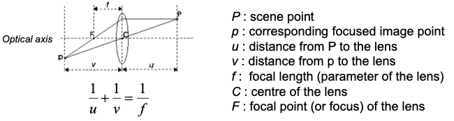

# Image formation acquisition

## Vanishing points

Missing this part, sorry

All we need to know, to find the orientation of the camera, are the vanishing point -> knowledge of the vanishing point of a sheaf of parallel lines allows the detrmination of the unknown orientation of the lines.

A simple application of this, is the ability to drive a robot into hallways just by tracking the dominant vanishing point and keeping it at the centre of the image.

Knowing the vanishing points of two orthogonal directions allows for determining camera orientation wrt to a scene plane. Perspective effects may be not so evident: this is going to happen under certain circumstances of image acquisition. When this is the case, the model can be simplified to an approximation, by a *scaled ortogrphic projection*. It is a projection from straight lines, therefore has a weak perspective. What we get is a scaled projection, indeed the size is not the real one.

So, **when should we use this?** This is the case of two different settings: when we have a range of depth which is more than the depth itself, i.e. we're very distant. Remember, perspective projection is about scaling coordinates by depth. 

### Using lenses

A scene point is on focus when all its light rays gahtered by the camera hit the image plane at the same point. In a pinhole device this happens to all sceen because of the verys small size of the hole. Therefore, the camera features an infinite depth of field. That is because ideally, a single light ray passes the hole, so there is no way for the light to spread.

The drawback is that such a small aperture gathers a really small amount of light. Therefore, cameras rely on lenses to gather more light from the scene point and focus it on a single image point. This enables much smaller exposure times. However, the DOF is no longer infinite!

Cameras often use complex optical system, therefore we will consider an approximate model, the **thin lens equation.**

### 

Let's consider the center $C$ as the pinhole point. Don't confuse the *focal length* with the one in the pinhole camera. They're two different distances. While a pinhole camera features an infinite DOF (all points will be on focus), according to this equation we can only focus a given distance to the camera. To find image points, we can just consider the ray from the point to the center, then to the image plane. Therefore, we can just consider the single diagonal ray betwen $P$ and $p$. Now we have to consider the image distance $v$, aka effective focal length. 

We can model a pinhole with a normal camera just by considering the pinhole the center of the lens, and the focal length $v$. From now on, we'll keep using the pinhole model having in mind that the optical center is the center of the lens, the focal length is the focal distance. Remember the pinhole: the $f$ distance now is $v$. Now, let's review the two implications we discussed previously about the constraints of the lens instead of the pinhole:

- If we wanted to fix $v$ therefore choosing the distance of the image plane, $\frac{1}{u}+\frac{1}{v}=\frac{1}{f} \rightarrow u = \frac{vf}{v-f}$ Due to $u$ and $v$ related to $f$ by this equation, we can find $u$. Therefore, we can focus on the sole image plane.
- Maybe we want to fix $u$, then I shall use a certain image distance given by this equation: $\frac{1}{u}+\frac{1}{v}=\frac{1}{f} \rightarrow v = \frac{uf}{u-f}$

Therefore, given the chosen position of the image plane, scene points both in front and behind the focusing plane will be out-of-focus, therefore applying as circles, known as *blur circles* or *circles of confusion*.

## Diaphragm, DOF, F-number

Now, picturing a matrix of pixels, assume the blur circles are smaller than the sensor's pixel, the blur isn't noticeable. If it is bigger, it is captured by more pixels and you'll see the blur. But if the light is just collected by a single pixel, you won't see the blur. This is what makes things work. 

Cameras often deplot an adjustable diaphragm (iris) to control the amount of light gathered. The smaller te diaphragm, the larger turns out the DOF. 

The **F-number** is the ratio of the focal length to the effective aperture of the lens ($f/d$). F-number discrete units (known as *stops*) are usually reported on the diaphragm to allow the user to adjust the aperture. 

### Focusing

To focus on objects at diverse distances, another mechanism allow the lens to translate along the optical axis with respect to the fixed (the sensor is soldered to the PCB) position of the image plane. Now, if $v=f$, $u=\infty$, so at the first position we are focusing at infinity, then by moving the lens further away we are at the minimum focusing distance, which is a parameter of the optical device. 

There's another used type of lenses, used in high-end applications, the **telecentric lens**, where we have a diaphragm placed at the focal distance. We know that in thin lens, parallel rays are deflected to pass the focus. Now, if this is the case, and we put the diaphragm in the point, we can only capture the parallel ray, since other rays will be stopped! The idea is that we can gather light as if it was gathered to parallel rays. So, the projected points are not in a perspective projection anymore, but an **ortographic projection**. 

Why is this needed? Because ortographic projections do not exhibit perspective distortion! Therefore, they are used in machine vision to analyse 3D objects with high accuracy. 

### Fundamental radiometric relation

Now, another important relationship between scene points and image points involves ***irradiance*** $E$, i.e. the amount of light incident on a point, and ***radiance*** $L$, i.e. the amount of light emitted by a point in a direction.

The fundamental radiometric relation shows that the irradiance is proportional to the radiance of the corresponding scene point:

$E(p)=L(P) \cdot \frac{\pi}{4} \cdot\left(\frac{d}{f}\right)^{2} \cdot \cos ^{4} \alpha$

There are some details of computer graphics that we can leverage in computer vision. The *radiance* depends on the power and position of the **light sources**, as wewll as on the reflectance properties of the material. Such reflectance properties are usually described by a complex function called *Bi-Directional Reflectance Function*. Thus, it is possible to determine the amount of light emitted in a certain direction given the amount of light received from the sources. Two simplified and opposite reflectance models are given by the Lambertian and specular surface. The ratio is called *albedo* $\rho$. So the ouptut of the light is the albedo multiplied by the irradiance. 

## Image digitization

First, let's take an abstract-conceptual view of the process. Generally speaking, the image plane consists of a planar sensor which converts the irradiance into an electric quantity. These electrical quantities are put in a 2D grid, which is then sampled and quantized since the electrical quantities are continuous, not discrete. 

- **Sampling**: the planar continuous image is sampled evenly along the two axis.
- **Quantization**: the continuou values are quantized into $l=2^m$ discrete levels known as *gray-levels*. Thus, $m$ is the number of bits used to represent a pixel. 

If the image is colored, every point has 3 values, representing the RGB channels. 

In many CV applications, grey-scale is used: it often happens that colors don't add useful informations, adding bulk and complexity.

