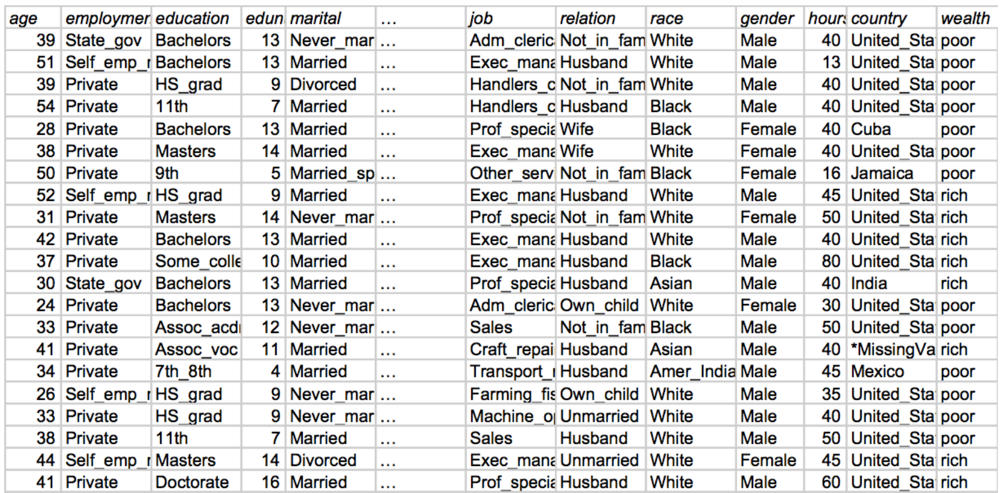
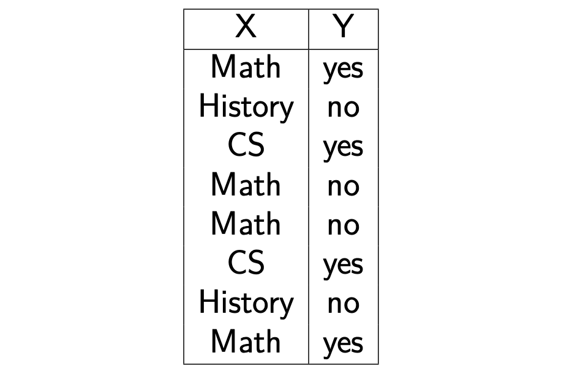
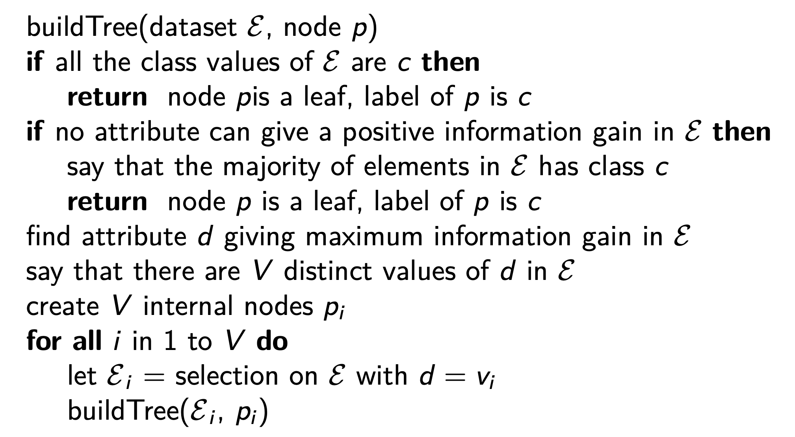

# Classification

Given a dataset composed of D attributes, one of these is the **class**, i.e. a finite value provided by the supervisor. We want to learn how to guess the value of the D-th attribute (class) for individuals which have not been examined by experts.

## Classification model

It is an algorithm which, given an individual for which the class is not known, computes a guess of the class. In general, the algorithm can have different _flavors_ distinguishable by _parameters_: some values which can be tuned to influence the quality of the result.

So, we'll want to choose the learning algorithm, let the algorithm learn its parametrization, then assess the quality of the model.

We'll learn using a **training set**, which contains already classified individuals. This will obviously have to be similar to the other ones, as to be representative. When the learning is done, we want to **estimate the accuracy**, for which we'll use a new set, already labeled, to check if the model computes them right.

There are two _flavors_ for classification:

- **Crisp**: the classifier assigns to each individual one label
- **Probabilistic**: the classifier assigns a probability for each of the possible labels

## Classification with decision trees

Decision trees have a quite long story, and have been improved in several ways.

A tree has inner nodes. We start from the root, with a test. For instance, we could test an attribute  of an element . If, for example, , we'll execute the right node, if not we'll execute the left one. Than, the same thing happens with the inner node. When we come to an end, it will be a prediction, i.e. a **leaf node**. The thing is: we've gotta learn what decisions to put in the decision tree, and this is what the training aims to achieve.

Given a set  of elements, we'll grow a decision tree as follows:

- If all the elements belong to a class  or if  is small, generate a leaf node with label 
- Otherwise, we choose a test based on a single attribute which may have  (at least two) outcomes, and will become the root of  branches

There are many problems to solve: which attribute should we test, which kind of test, what does _ is small_ mean?

So, given a census dataset, we may ask ourselves: _can we learn the wealth attribute just by looking at the other ones?_

Let's first perform an **exploratory analysis**, i.e. looking at the data, maybe generating histograms...

We could generate a -dimensional contingency table, through SQL or whatever. Contingency tables could give us an insight on correlations between attributes, but we could need lots of them! _A shit fucking ton of 'em!_

So, how can we evaluate if a pattern is interesting? To do so, there are several methods. One of them is based on _information theory_, born thanks to the concept of entropy.

To introduce this concept of entropy, an example is needed. Given a variable with 4 possible values and a given probability distribution, an observation of the data stream could return BAACBADCDA. If I want to transmit to a remote agent those readings, I can encode them for instance with two bits, (00,01,10,11). Therefore, the transmission will be 01000010010011101100... But what happens if I the probability distribution is uneven?

Of course, the already said coding works, but we could do better: there's a coding requiring a smaller average of bits per symbol:

Even with 3 symbols with equal probability, this technique could save bits!

In the general case, given a source  with  possible values, with their probability distribution, the best coding allows the transmission with an average number of bits given by .  is the entropy of the information source .

### Meaning of entropy of an information source

High entropy means that the probabilities are mostly similar. Low entropy means that some symbols have much higher probability. Higher number of allowed symbols gives higher entropy.

In a binary source, the entropy goes to 0 when one of the probabilities goes to 1 and the other to 0.

So, what is the purpose of these considerations on entropy? Let's consider a toy example, where in the  column is the graduation of a friend, and the  column contains whether the person likes _Joker_ or not. We can derive the probabilities from value frequencies.

Now, let's consider the entropy of Y considering only the rows in which . When we filter by Math, the entropy stays , but when we filter by History, the entropy goes to .

This could also be interpreted as the minimum number of bits needed to transmit the value if the receiver know . So, the conditional specific entropy is:

, therefore,  provided some insight on .

Now, how can we decide if a person likes _Joker_ or not?

### Information Gain

Now we can formally define the **Information Gain**, which states the amount of insight that  provides in the forecasting of .

So, **how can we use** the information gain? It could help us predict the probability of long life given some historical data on person characteristics and life style. _Higher IG means that a 2D contingency table would be more interesting._

Getting back to the decision tree, **how can we decide which attribute to test?** Now the answer is obvious: we should choose the one with the maximum information gain for the class in the dataset! Having decided this, we'll now have a number of subtrees to generate.

Deciding the attribute giving the highest IQ couldn't always be the right choice. But we'll get to this later.

So in the end, the algorithm looks like this:

We'll execute the generated decision tree on the training set itself, count the number of discordances, thus obtain the **training set error**. Obviously, when trying to use the tree with the test set, the error rises.

Is there any general lesson we can learn from this fact? With a smaller tree we increase the training error, but we decrease the test error. Bigger trees are more prone to overfitting.

## Overfitting

In real life, there's noise in data. The ability to predict classes is indeed not perfect, and we'll sometimes make wrong predictions. **Overfitting** happens when the learning is affected by noise.

Stating this in a formal way, while a decision tree is a hypothesis of the relationship between the predictor attributes and the class. If  is the hypotesis, we can define the error of the hypothesis on the training set , and the error of the hypothesis on the entire dataset .  overfits the training set if there is an alternative hypothesis  such that

Overfitting is caused by two phenomenons, the **presence of noise** and the **lack of representative instances**.

**Everything should be made as simple as possible, but not simpler.**

**Pruning** a decision tree is a way to simplify it.

Pre-pruning means early stopping the tree while it is growing, post-pruning is a pruning done after the tree is finished.

The **validation set** is a third dataset, which we can use after the pruning. In this way, my set will be more reliable: I'm using fresh data.

There are many ways to prune data, one of these is the **statistical pruning**: it uses statistics to infer if a new node I'm generating is prone to being affected by noise.

The **minimum description length principle** states that when the complication is bigger than the reduction of errors we are basically wasting our time.

The supervised data are then split in 3 parts:

- **Training set**, to build the model;
- **Validation set**, to tune the model and minimize the error;
- **Test set**, to assess the final error.

### Minimum Description Length

This is another _way of thinking_. We know that the learning process produces a theory on a set of data, which can be then used to predict the class on a set of data. So, how can we describe this theory? We could encode the theory, and the errors underneath. So, the length of the theory is the sum of the length of the tree + the length of the errors. So, the **Minimum Description Length Principle** states that we should choose the theory with the **shorter description**: a bigger theory includes bigger errors. In the extreme cases, we may have a very simple theory with lots of exceptions, and a very complex theory with a few exceptions.

A decision tree is not **extremely powerful**: it's a compromise, it works and it's not too computationally heavy. We should choose a single attribute to train it, otherwise it might get too complicated.

### Characteristics of a decision tree

It is a **non-parametric approach** to build classification models. Finding the best one is **NP complete**, while the heuristic algorithms allow to find sub-optimal solutions in reasonable time. The run time use of a DT to classify new instances is extremely efficient: , where  is the height of the tree.

### Choosing the attribute to split the dataset

We're looking for the split generating the maximum **purity**. We can use some functions, like **Information Gain**, **Gini Index**, **Misclassification Error**, the latter being the worse one.

Of course there are several variants for building these trees, we can use different strategies for the construction, the pruning...

# Evaluation of a classifier

**Model selection** is essential to the good design of a classifier: when I have hyperparameters to tune, I need to select several alternatives. But in practice, when we say model selection we go to a _higher level_, because we can select between different learning algorithms too. We could also go further: before feeding the data, we can transform them!

We need **measures** to compare different algorithms, strategies, etc... and choose the best one!

Empirically, the more training data we have the best we train the dataset.

We can define a **confidence interval**, a concept that derives from the Bernoulli process, i.e. forecasting each element of the test set is like one experiment of a Bernoulli process, a binary success/failure. 

Therefore, the empirical frequency of error is $f=S/N$.

With some algebra we can compute the **Wilson Score Interval**, which is the abscissa delimiting the area $1-\alpha$ for a normal distribution. The formula doesn't have to be remembered.

So, $\alpha$ is the probability of a wrong estimate. Increasing $N$, with constant empirical frequency, the uncertainty for $p$ narrows. 

## Accuracy of a classifier

Accuracy and error frequency are complements ($A=1-e$). Error frequency is thes um of errors of any class, divided by the number of tested records. A good statistic could be the maximum error frequencies instead. 

So, why should we use other statistics? Maybe, estimating the cost of errors might need more statistics.

Every ML algorithm has hyperparameters to tune, and several training loops are usually needed to find the best set of hyperparameters.

It is crucial to obtain a higly reliable estimate of runtime performance. Sometime it is necessary to find the best compromise between the optimisation step and the quality of the result. 

The train/validation loop is usually faster than cross validation. 

## Performance measures of a classifier

We already know what the accuracy is. For the moment, let's consider **binary predictions**. There are other possible indicators, like velocity, robustness, scalability, interpreatability. A classification error could have different consequences, which could be dangerous!

Another important measure is the  **f-measure**, i.e. the armonic mean of precision and recall, aka F1 score or balanced F1 score: $F=2\frac{precision\cdot recall}{precision+recall}$.

### Beyond the accuracy

When we evaluate the quality of a classifier, we should also take into account the *a-priori* information, i.e. the distribution of our supervised data. If the classes are perfectly balanced, we'll be correctly guessing the accuracy, but by chance. If, instead, our dataset is heavily unbalanced, like in the case of a disease with $2\%$ of positivity.

So, when we evaluate a prediction, instead of just using accuracy, we should use a metric that considers the distribution. 

So, considering a confusion matrix with 3 classes, we have accuracy $\frac{\sum TP_i}{N}$, precision $\frac{TP_i}{P_i}$ and recall $\frac{TP_i}{T_i}$. There will obviously be a number of false predictions. So, let's say that the classifier $\overline{C}$ generates this confusion matrix. Then, we have 200 predictions, in 100:6:40 proportion, of which 140 are correct. 
If we had a random classifier $R_{\overline{C}}$ which generates the same proportion, but randomly, 82 predictions are exact **by chance**. The improvement of $\overline{C}$ over $R_{\overline{C}}$ is 58. We now can define $k(\overline{C})=58/118=0.492$ as the **improvement** of the classifier.

This statistic evaluates the concordance between two classifications. 

$k$ is therefore the ratio between the concordance exceeding the random component and the maximum surplus possible. $-1$ means a total disagreement, $0$ a random agreement, $1$ total agreement.

### Cost of errors

Our decisions are driven by predictions, and bad predictions imply a **cost**.

The easy solution is computing the weighted cost of errors, i.e. errors which have an higher cost should be avoided more. We can even alter the dataset by duplicating the examples for which the classification error is higher, in this way the classifier will become more able to classify the classes for which the error cost is higher.

## Evaluation of a probabilistic classifier

So, up to now we were considering a **sharp** classifier (crisp prediction), giving an exact answer. What if we were working with a probabilistic classifier?

If we need an instant decision, a crisp classifier is good, but if the classification is part of a bigger process involving several evaluations, a probabilistic output could be more accurate.

### Lift chart

This is used to evaluate various scenarios, depending on the application. Let's consider a dataset with 1k positives and apply a probabilistic classification scheme. We want to make a bidimensional chart with two axis, shere $x$ is the sample size, and $y$ the positive samples. 

Now, a straight line plots the number of positives obtained with a random choice of a sample of test data, while the curve plots the number of positives obtained drawing a fraction of test data with decreasing probability. So, with the *sorting* I generated with my classifier, if I take the first 10% of my dataset we're able to get 400 positives. To reach another 400, we need to get to 40%. 

So, this line is the number of positives I get with my probability classifier. The larger the area between the two curves, the best the classification model.

### ROC curve

The ROC curve describes a tradeoff between the hit rate and false alarm in a noisy channel. The noise can alter the recognition of the transmission, and alters the two levels according to a gaussian.

With less noise the two gaussian are better separated. 

Moving the threshold, we change the ration between false positives and false positives. A good classifier gives us an increase in TP with a small increase in FP.

Threshold steps allow to track the ROC curve: we sort the test elements by decreasing positive probability, set the threshold to the highest probability, then move.

Decreasing the threshold increases the recall.

