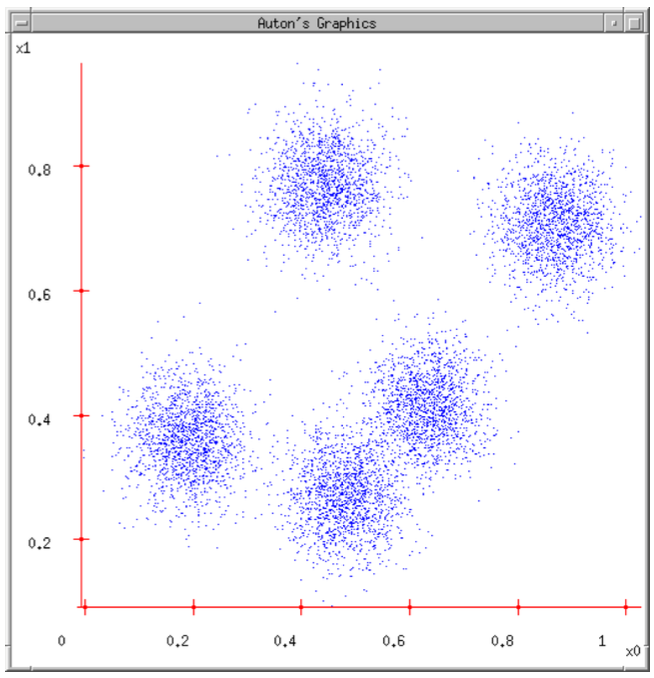

# Clustering

Given a set of  ovjects, the task is now finding a partitioning in K clusters and possibly a number of noise objects.

We want this classification to *emerge from the data*. Our mapping ahs to maximize the intra-cluster similarity, and minimize the inter-cluster one.

There's a large number of methods, like partitioning, hierarchic, methods based on linkafe, density, statistics...

## K-means clustering

We'll start with an intuitive algorithm. Given a 2D dataset, where we have *5 clouds*, how can we model this distribution?

So, how do we guess the numver *five* in a D-dimensional space? In order to reason about this, we consider the idea of **transmission**: we have this 2D dataset, with each point being a pair of coordinates, and we want to **transmit** this by using only two bits per point. This transmission will obviously be lossy. Our task is to find the best approximation in this transmission: we need a coding/decoding mechanism, where each point will be encoded/decoded. We could split the plane into 4 subsquares 00,01,10,11.  

We could the partition the space into a different grid, moving the *centroid* (average of the vector/center of gravity) to the *clouds* of points. 

So, let's say that a user gives us the number  of clusters. Given that, we can start with a random set of centroids (temporary centers), then start labeling the points of the dataset. For each one, we can find the nearest center to the point. 

After that, each center can find the center of gravity of its points (which are the ones having that center as the nearest one), and move the center there.

Remember that **centroid=center of gravity**.

### Distortion

We now have two functions, encoding and decoding. Since the encoding is lossy, the result will be different from the input. We can define the distortion as the difference between the original value and the decoded one: .

Which properties are requested to the  to have minimal distortion? 

-  must be encoded with the nearest center (otherwise it could be reducible by changing center)
- The partial derivative of distortion with respect to the position of each center must be zero, because in that case the function has either a maximum or a minimum
  - 
  - 
  - Therefore, each center **must be the centroid** of the points it owns!

### Improving a sub-optimal solution

We can alternately perform steps 1 and 2: it can be proved that after a finite number of steps, either one of the two steps produces no change, reaching a final state.

### Algorithm termination

Note that the distortion function is **convex**: this means that we can reach a final state!

There's a finite number of configurations, and if after one iteration the state changes, the distortion is reduced. In summary, sooner or later there will be no new reachable states. 

*Is this the best solution?* No, we could end in a state which is not the best one.

How do we choose the number of clusters? We could consider it as an hyperparameter, since the best value is a compromise.

It may happen that a centroid does not own points: if the initial random values are particular, our cluster may become empty, resulting in a different number of clusters. In this cases, we should change the centroid to a new one, maybe changing the seed.

Sometimes it's a good idea to remove outliers before computing the k-means. 

K-means is generally so fast that it's good to be used for data esploration.

If we discretize the values, using as discretizing values the centroid of he cluster, we simplify the data thus reducing the error: w want to transform a continuous domain inot a discrete one. 

K-means is the basis for vector quantisation and for choosing color palettes.

It is surprisingly fast and fairly efficient. Though, it has weanesses: it is defined for spaces where the centroid can be computed, it requires the K parameter, it is very sensitive to outliers, doesn't deal with noise, and doesn't properly deal with non convex clusters.

The evaluation of a clustering scheme is very important, but we don't have informations )it is non-supervised) about that: we need some measures.

We should distinguish patterns from random apparent regularities, find the best number of clusters.

### Cohesion

It's the proximity of objects in the same cluster, it should be high. It is the sum of proximities between the elements of the cluster and the geometric genter: *centroid* (means of dataset), *medioid* (element whose average dissimilarity from the others is minimal). 

### Separation

Measures the inter-proximity, there are several possibilities: measuring the distance between the nearest objects, the most distant, the centroids.

### Global separation of a clustering scheme

Which is the weighted sum of the distances. It is weighted so that bigger clusters have bigger influence.

We can find a link between cohesion and separation. Let  be the total sum of squares, which is composed by  and .

### Silhouette index of a cluster

For each  object we compute the average distance with respect to the other objects in its cluster, and call this . Then, we compute the average distance from all the objects of the cluster (for any cluster), and find the minimum with respect to all the clusters. This value is called 

Then, we calculate the silhouette index as 

When , the object is very well clustered, when  it's not. 

We can compute this for each object, then average it for the full dataset. 

Silhouette index is a good measure, but it has a bad aspect: it requires significant effort for the computation!

## Looking for the best number of clusters

The measures are obviously influenced by the K number. SSE and silhouettes are the most used measures. Note that when we reach the right number of clusters the slope changes: the SSE decreases more slowly.

We can even use **supervised measures**, like a partition named **gold standard** to validate a clustering technique which can be applied later to new data.

# Hierarchical clustering

This is also quite old, and it generates **a nested structure** of clusters, which can be **agglomerative** (bottom-up), where we start considering each point as a cluster then aggregate, or **divisive**, where we start with a single cluster which gets partitioned.

The output is called a **dendogram** or a **nested cluster diagram**, which represent the same structure and can be used either for agglomerative or divisive. The first are more widely used. 

## Agglomerative

To decide which clusters to merge, we compute the **separation** between clusters.

### Single linkage algorithm

We initialize the clusters, one for object, then we compute the distance matrix between the clusters, squared, symmetric, the size is the number of objects N while the main diagonal is null. So, while he number of clusters is greater than 1, we merge them and delete from the distance matrix the relative rows and columns.

The space and time complexity is , in the worst case having  iterations to reach the final cluster. For the i-th step we get that the search of the pair to merge is , while the recomputation of the distance matrix is . So, time, in summary is , reducible to  with indexing.

# Density-based clustering

We have two obvious solutions: a grid-based one, where we split the space by a grid, and an object-centered one, where we define the radius of a hypersphere and attach to each object the number of objects being inside that square.

So, let's assume the second solution, which is used in **DBSCAN**.

First, we need some definitions: a **border point** is on the border of the readius, while a **core point** won't. So, we define a radius and the nighbourhood of a point che -hypersphere centered at that point. 

To define the direct density reachability, we define a threshold  and define as core a point with at least  in its neighbourhood, as a border otherwise. We then define that a point  is directly density reachable from point  iff  is core and it is in the neighbourhood of .

Direct density reachability is not symmetric, in the example  is not directly density reachable from , since  is border.

Border points can be part of a cluster if they are not noise, i.e. they are connected by density to a core point.

These methods are good in finding clusters of any shape, robust wrt noise, but have problems when clusters have widely varying densities.

Being based on distances between noises, the complexity is , reduced to  if spatial indexes such as  are available. It is very sensitive to the values of  and .

Decreasing these two values reduces the cluster size and increases the number of noise points.

## Model based clustering

Here, we want to estimate the parameters of a statistical model to maximizr the ability of the model to explain the data. The main technique is the usage of **mixture models**, which view the data as a set of observation from a mixture of different probability distributions.

### Expectation maximization

If the data can be approximated by a single distribution, the derivation of parameters is straightforard, but generally this isn't possible.

The algorithm works in this way:

- we set an initial set of parameters
- We repeat two steps:
  - Expectation: for each object we compute the probability that the objects belongs to each distribution 
  - Maximization: given the probs, we find the new estimates of the parameters that maximize the expected likelihood
- Until: the parameters do not change

## Kernel Density Estimation

We consider, for each point, its kernel function (*influence function*), which is a symmetric and monotonically decreasing function. For example, if you have a Gaussian kernel

### DENCLUE algorithm

We derive a density function, identify the local maxima, associate each point with a density attractor by moving in the directions of maximum increase in density, define clusters consisting of points associated with a particular density attractor, discard clusters which have a density attractor incompatible with the threshold, the combine thoes that have a compatible density.

This method has a strong theoretical foundation on statistics, it's good at dealing with noise and different shapes/sizes, but has expensive computation and trouble with high dimensional data.

# Remarks

We have seen 4 types of clustering: **partitioning** (*k-means*), **hierarchic**, **density-based** and **model-based**.

The effectiveness decreases with dimensionality and noise level, and the computational cost increases with dataset size and dimensionality. 

Clustering is used in summarization, data compression and search of the nearest neighbours.

