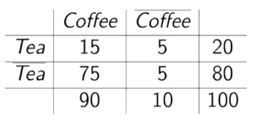

# Association rules

Let's start with an example topic, the **market basket analysis**, proposed in 1992 just to introduce this chapter. 

*Given a set of commercial transactions, find rules that will predict the occurrence of an item based on the occurrences of other items in the transaction.*

Some examples of association rules are $\{bread, milk\}\rightarrow\{coke,eggs\}$ where the curly parenthesis specify sets, the arrow means *if the left is included, then the right is*.

We must be careful, we say *implication* but the meaning is *co-occurrence*, **not the logical implication**.

An association rule is an expression in the form $A\Rightarrow C$, where $A=\{Milk, Diaper\}$ and $C=\{Beer\}$ are itemsets. We need **rule evaluation metrics**: **support**, i.e. the fraction of the $N$ transactions that contain both $A$ and $C$ (filter the transactions containing $A$, and count those that contain $C$), and **confidence**, i.e. measuring how often all the items in $C$ appear in transactions that contain $A$.
$$
\text{sup}=\frac{\sigma(Milk, Diaper, Beer)}{N}\hspace{20px}\text{conf}=\frac{\sigma(Milk, Diaper, Beer)}{\sigma(Milk, Diaper)}
$$
Note that support is antimonotonic: when you add an item the support may only be equal or decrease.

Rules with low support can be generated by random associations, e.g. I buy champagne and diapers.

Rules with low confidence are not that reliable.

Now, our goal is, given a set of transactions, we want to find all the rules that satisfy some support/confidence thresholds. We could try a **brute-force approach**, listing all the possible association rules and computing support and confidence, then pruning rules that fail the thresholds, but this is **computationally prohibitive**.

## Frequent itemset generation

We have some strategies for this: reducing the number of candidates $M$ or reducing the number of comparisons $NM$.

### Apriori principle

This says that if an itemset is frequent, then all of its subsets must also be frequent. This holds due to the following property of the support:
$$
\forall X,Y: (X\subseteq Y)\Rightarrow sup(x)\ge sup(Y)
$$
We use this to prune: the infrequent subsets are not useful.

We can then generate candidates, defining $C_k$ the candidate itemsets of size $k$ and $L_k$ the frequent itemsets of size $k$. Now, $subset_k(c)$ is the set of subsets of $c$ with $k$ elements.

Now, we represent $L_k$ as a table with $k$ columns where each row is a frequent itemset. We'll let the items in each row of $L_k$ be in alphabetical order (i.e. *lexicographic*), then, we can generate the candidates $C_{k+1}$ by a self join on $L_k$.

This is called a-priori because the computation is level-wise, and the evaluation at level $k$ uses the **prior knowledge** acquired in the previous levels, to reduce the search space.

So, which factors affect the complexity? First of all, the **minimum support threshold** (lowering it results in a higher number of frequent itemsets, which may reduce pruning and increase the maximum length of itemsets): the number of complete reads is given by the maximum length of frequent itemsets+1. Secondly, the **dimensionality** of the dataset, which is proportional to the computational, memory and I/O costs.

So, there are a few ways of reducing the number of these frequent itemsets. It is useful to identify a significant subset of these:

- **Maximal Frequent Itemsets**, i.e. the smallest set of itemsets from which the frequent itemsets can be derived
- **Closed itemsets**, i.e. the minimal representation of itemsets without losing support information
  - $X\rightarrow Y$ Is redundant if there exists $X'\rightarrow Y'$ such that the support and confidence are the same, with the prime being subsets of the normal sets. 
  - There are lots of algorithms to compute these

A *MFI* does not have any frequent immediate supersets. The MFI are near the border dividing frequent by not frequent itemsets in the lattice.

## Confidence from the supports

The **confidence** can be **computed from the supports!**
$$
\text{conf}(A\Rightarrow C) = \frac{sup(A\Rightarrow C)}{sup(A)}
$$

## FP-growth

This is an alternative way of computing association rules, different from priori, which has some problems: it needs to generate the candidate itemsets (which are a lot), and it needs multiple scans of the database to check the results. The FP-growth algorithm transforms the problem into a search of patterns by looking at nodes. First of all it scans the DB to find the support of 1-itemsets, creating a root for the tree. Then, we reorder the items for descending support, focusing on the root node of the tree. The idea is to match the prefix of a transaction, and add new branches when needed. In the end, we'll have a tree containing the items having support of the path from the root to the node. Note that we reordered them because if an item has a higher support, it is better to put it near the root. The numbers are incremented every time I find a common prefix. 

So, what can we do with this tree? We consider the complete set of frequent items projections of transactions in the DB, derivable from the respective FP-tree. 

### Performance

This algorithm has better results with lower runtime. Note that Apriori won't be computed for small support thresholds. 

## Rule generation

We have already seen that it is sufficient to know the support of the frequent itemsets. In particular, following a good strategy, we can even have some pruning. Given a frequent itemset $L$, we can find all the non-empty sybsets belonging to $L$ having a confidence higher than the threshold. If the size is $k$, there are $2^k-2$ candidate rules. How can we generate these? Generally, confidence is not anti-monotone. If we consider the rules generated from the same itemset, we can forecast the direction of the *antimonotonity*.

When we move an item from the left to the right, the numerator does not change, but the antecedent decreases, so the support will not decrease. Considering a given itemset, we can have a series of descendants. If a rule has low confidence, all of its descendants can be pruned. 

In apriori, we can generate candidate rules by merging two rules sharing the same prefix. We will then prune the rule if it has low confidence. Of course, the effect of support distribution can influence the way fo working with the dataset: real datasets can have a skewed support distribution. It means that the choice of the support count to filter is not easy. So, how can we set the appropriate threshold? If it is too high, we could miss itemsets, if it is too low, we have too many itemsets. 

### Multiple minimum supports

Having different minimum supports for different items, we could maybe choose the minimum between them. The traditional apriori could be modified to deal with multiple minimum supports.

### Pattern evaluation

Generally, the algorithm tends to produce too many rules. We can encounter redundancies. We can use several measures to rank the rules, other than support/confidence. The **interestingness measures** can be used pretty much anywhere in the process. How can we compute these measures? Given a contingency table, i.e. a table containing the elements needed to compute those, we check the confidence of the various implications.

Statistical independence proves that these rules can be non-symmetrical. We can either have statistical independence, positive correlation, or negative correlation.

The **lift** measure is the ratio of the confidence of A implies C, divided by the support of C. It evaluates to 1 for independence, it is insensitive to rule direction, and it is the ratio of true cases wrt independence.

The **leverage** is the probability of A and C minus the joint probability of them. It evaluates to 0 for independence. 

The **conviction** takes into account the deviation. 
$$
\operatorname{conv}(A \Rightarrow C)=\frac{1-\sup (C)}{1-\operatorname{conf}(A \Rightarrow C)}=\frac{\operatorname{Pr}(A)(1-\operatorname{Pr}(C))}{\operatorname{Pr}(A)-\operatorname{Pr}(A, C)}
$$
It's the deviation of incorrect predictions wrt to independence.

With an *higher support*, the rule applies to more records. With *higher confidence*, we habe higher chance that the rule is true for some record is higher, with *higher lift*, the chance that the rule is just a coincidence is lower, with *higher conviction*, the rule is violated less often than it would be if the antecedent and the consequent were independent.

A good measure must be 0 or 1 if A and B are statistically independent. It should increase monotonically with $Pr(A,B)$ when $Pr(A)$ and $Pr(B)$ remain unchanged, and should decrease monotonically with $Pr(A)$ (or $Pr(B)$) when $Pr(A,B)$ and $Pr(B)$ (or $Pr(A)$) remain unchanged.

We can say that there are lots of measures, usually the confidence is the base, and other measures support that.

### comparing mono-dimensional and multi-dimensional

In the **mono-dimensional** the events are **transactions**, while in the multi-dimensional they are tuples. 

Most software packages for association rules discovery do not deal with quantitative attributes, so we can **discretize** things.

## Multilevel AR

Another variant of AR are the **multi-level rules**, back to the basket market analysis. We know that in a real DB we can have tens of thousands of items, and this generates a fragmentation of the rules. Sometimes this can be useful, sometimes not. Experts prefer reasoning at a higher level. A common background knowledge is the organization of the items into a hierarchy of concepts. If we move up in the hierarchy, the support will tend to increase. In other words, we go from specialized to general and new rules can become interesting. If we do the opposite, i.e. we go from general to specialized, the support decreases, and can go under the threshold. A level change can influence the confidence in any direction. It may also happen that the specialized rule has the same confidence of the specialized rule, and it doesn't add knowledge. For example, we can say low-fat milk is a subclass of milk. If we have 1k transactions, 80 with milk+bread, 114 with milk, 20 with low-fat milk+bread, 28 with low-fat milk. We build 2 rules:

- $milk \rightarrow bread$ (support $8\%$, confidence $70\%$)
- $low-fat milk \rightarrow bread$ (support $2\%$, confidence $71\%$)

Rule $b$ has almost the same confidence of $a$, so it doesn't add informations. 

This tells us that generally, if we need to discover association rules, we can start with frequent itemsets at the top level of abstraction, and go deeper decreasing the threshold in lower levels. 

