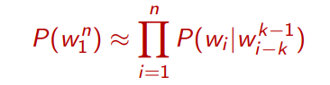

# 4. N-gram language models

## Language models

### Probabilistic language models

These models are based on assigning probabilities to sentences, in order to achieve spell and grammatical error correction, smart typing, machine translation, argumentative and alternative communication systems, speech recognition, summarization, question-answering and also other tasks.

If _win_ is a sequence of _n_ words _w1, …, wn_, the **chain rule** says that:

To estimate these probabilities the naïve approach of just count and divide is not suitable, since there are so many possible sentences that we will never see enough data for estimating them. So we must rely on the **Markov Assumption**:
_P(the|its water is so transparent that) ≈ P(the|that)_ with _k=1_ or _P(the|its water is so transparent that) ≈ P(the|transparent that)_ with _k=2_. In general:

_P(wi|w1i-1) ≈ P(wi|wi-ki-1)_

Therefore:

The simplest case is the one where the history doesn't matter (_k = 0_) and it is called **unigram model**, while with _k = 1_ we have a **bigram model**, where only the previous word matter. We can extend to trigram, 4-grams, 5-grams and, in general, **N-grams**. But more we extend the problem, more memory we need, so it's impossible to capture **long-range dependencies**. But still, N-grams models can be useful in some applications, in particular with _N < 4_, because more extended N-grams requires too much memory.

## Estimating N-grams probabilities

In practical we do everything in log space to avoid underflow and because sums are faster than products.

N-grams captures **syntactic** phenomena, but also cultural phenomena: for example we could have over a restaurants' bookings database that _P(want|chinese) > P(want|english)_, highlighting a cultural preference.

## Evaluating models

To evaluate how good our model is, we train it on a _training set_ and then we test model's performances on sentences it has not seen, the _test set_. Then there are essentially two approaches:

 - The **extrinsic evaluation** consists in putting each models in the task they are designed for, run the task and get an accuracy for each model, then compare them. This is the best evaluation possible, but it may be very expensive.

 - The **intrinsic evaluation** measures quality of component independently of application. It's a bad approximation, but is helpful to think about. It relies on a probability-based metric, called **perplexity**. It is defined as the inverse probability of the test set, normalized by the number of words. Lower the perplexity, better the model.

Models work well if test corpus is _similar to the training corpus_: they must share at least the same **genre** and the same **dialect**.

## Smoothing

We want to avoid that our models assigns 0 probability to unseen words or context, because they may be in the test corpus. The idea is to shave off a bit of probability mass from some more frequent words, and assign it to unseen events. This is called **smoothing** and many method to achieve it exist:

 - **Laplace smoothing**:
   1. Add _1_ to all counts
   2. renormalize
 - **Add-k smoothing**: It's a simple extension of the Laplace smoothing that reduce the amount of probability mass given to unseen events
   - need to optimize the hyperparameter _k_ (which is _0 < k < 1_)
   - useful for text classification
   - does not work so well for language modeling
 - **Backoff**: If an N-gram is unseen, we can use the probability of the N-1-gram, in the worst case we look at the probability of the unigram _P(wi)_.
 - **Interpolation**: It's mathod similar to backoff, that mix probability estimates from all n-gram estimators
 - **Kneser-Ney**: One of the most commonly used and best performing methods. It relies on **absolute discounting**
