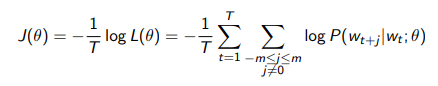

# 7. Vector semantics and embeddings - part II: dense representation

TF_IDF and PPMI vectors are long and sparse. One of the main reasons to want shorter vectors is that this will reduce the number of parameters if we want to use vectors as features in machine learning.

Another reason is that dense vectors may generalize better than storing explicit counts.

In practice, dense embeddings work better.

The idea is to **predict** rather than **count**. We associate each _w_ &in; _V_ with a _word feature vector C(w)_ &in; &reals;_m_ and we use these vectors to express joint probability functions of **sequences**:  
_f(wt,...,wt-n+1) = P'(wt_ |_w_1_t_ - 1_)_

## Word2vec

It is a popular embedding method **very fast to train**. It **use running text as implicitly supervised training data**: instead of counting how often each word _w_ occurs near a certain word _v_, we train a classifier on a binary **prediction** task: _is w likely to show up near v?_  
Then we will take the **learned classifier weights** as the **word embeddings**.

Let's assume all context words are independent, then, for each position _t_ = 1,...,_T_, we predict context words within a window of fixed size _m_, given center word _wt_

The objective function _J(&Theta;)_ is the average negative log likelihood

To calculate _P(wt+j)_ |_wt_ ; _&Theta;)_ we use **two vectors** per word _w_:
 - _uw_ when _w_ is an outside word (_uo_);
 - _vw_ when _w_ is a center word (_vc_).

At the end we average or concatenate them (or keep just one).

Use the softmax is too expensive because of normalization, so we rely on **negative sampling**: for each positive example, we create _K_ negative samples using words probabilities.

## Properties of embeddings

The similarity depends on window size _C_.

Also, there are two kinds of association between words:
 - **first-order co-occurrence**: words that are typically nearby each other;
 - **second-order co-occurrence**: words that have similar neighbors.

## Other dense vector space models

### FastText

It is an extension of word2vec with **subword models** to deal with out-of-vocabulary words and sparsity in languages with rich morphology. Each word is represented as itself + bag of constituent n-grams.

### GloVe

We have seen that there are mainly two families of methods for learning word vectors: **global matrix factorization** methods and **local context window** methods. Both family has its own pros and cons.

The idea behind GloVe is to combine count matrices and neural network predictions, in order to have **components of meaning** as ** linear operations** in the vector space (analogies seem an important feature) and to use **ratios of co-occurrence probabilities** to encode meaning components.
