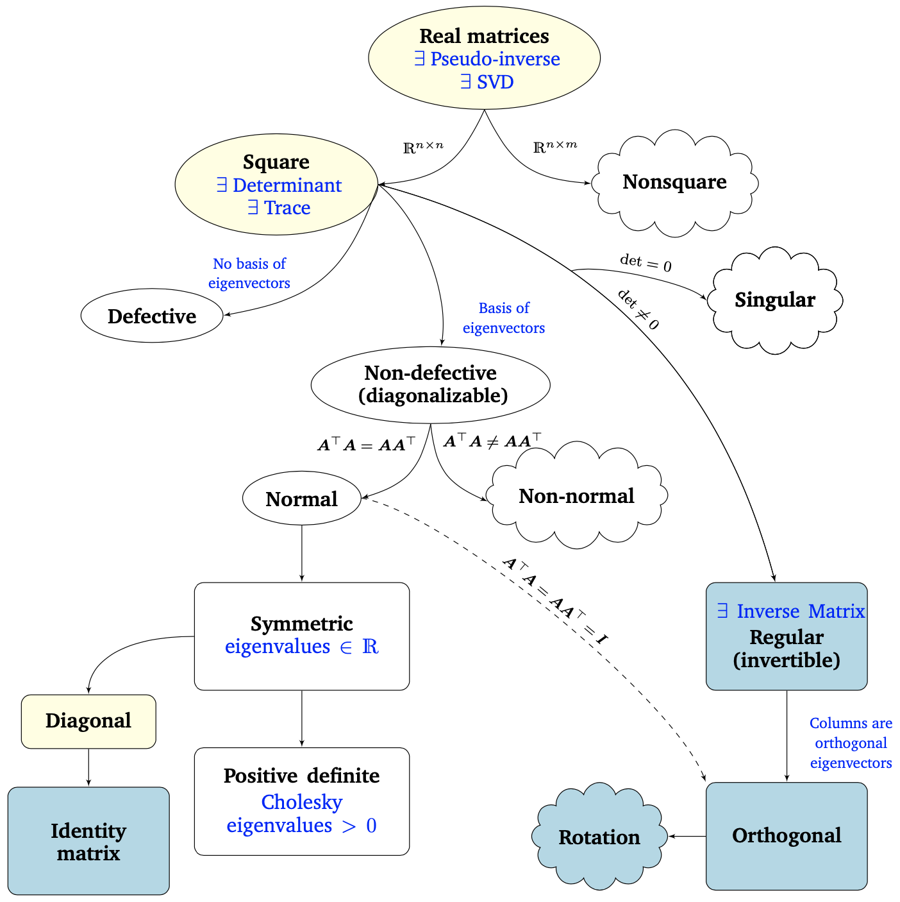

# Numerical computation and finite numbers

## Solving a problem

Usually, to solve a problem, we can enumerate some simple steps:

- Developing a **mathematical model**;
- Developing algorithms to compute the **numerical solution**;
- **Implement** these algorithms;
- Run the software to **simulate** the physical process numerically;
- **Graphically visualize** the results;
- **Interpret** and **validate** the results.

## Sources of approximation

Generally speaking, 4 types of errors can happen during the previously cited process:

- **Measure errors**: caused by the measure instrument;
- **Arithmetic errors**: the rounding errors linked to **each operation** get propagated during the algorithmic process;
- **Truncation errors**: an infinite procedure gets **truncated** to a finite one, causing loss of informations;
- **Inherent errors**: the finite representation of data might lead to loss of informations.

## Measuring error

We can talk about **absolute error** and **relative error**, the latter being the first one divided by the real value:

- **Absolute error**: $E_x = \tilde{x} - x$
- **Relative error**: $R_x = \frac{\tilde{x} - x}{x}$, obviously stating that $x \neq 0$

## Accuracy and precision

**Precision** does not measure error: it simply expresses the number of digits we're using. **Accuracy** does: it is the number of **correct** significant digits. One might ask: **what is a significant digit?** The number $\tilde{x}$ is said to approximate $x$ to $d$ significant digits if $d$ is the **largest non-negative** integer for which $\left|\frac{\tilde{x}-x}{x}\right|<\frac{10^{1-d}}{2}$.

## Data error and computational error

In a computational problem, we can define the **total error** as $\hat{f}(\hat{x}) - f(x)$, where $\hat{f}$ is the approximated function, while $\hat{x}$ is the approximated input: it is pretty obvious that the error depends on both the function approximation and the data one. The error inherent to the function one is called **computational error** $\hat{f}(\hat{x}) - f(\hat{x})$, the one inherent to the data is called **propagated data error** $f(\hat{x}) - f(x)$.

We can further divide the computational error into the **truncation error** and the **rounding error**. The first one states the difference between the true result and the one produced by given algorithm using **exact arithmetic** (due to approximations such as truncating infinite series), the latter states the difference between the result produced by given algorithm using exact arithmetic and result produced by the same algorithm using **limited precision** arithmetic (due to inexact representation of real numbers). 

## Sensivity and conditioning

**Sensitivity** and **conditioning** are concerned with propagated data error. **Conditioning** is just a way to quantitatively measure sensitivity. A problem is **sensitive** (or **ill-conditioned**) if the relative change in the solution can be much larger than the one in the input data. In other words, a problem is sensitive when, if we change the input by a small quantity, the result changes a lot.

The condition number is expressed as $K = \frac{\left|\textrm{relative change in solution}\right|}{\left|\textrm{relative change in input data}\right|}$.

## Representation of a real number in basis $\beta$

Given an integer $\beta > 1$ a real number $x \neq 0$ can be expressed in a unique way as $x = \textrm{sign}(x)(d_1\beta^{-1}+d_2\beta^{-2}+...)\beta^p$, where $(d_1\beta^{-1}+d_2\beta^{-2}+...)$ is called **mantissa** $(\frac{1}{\beta} \le m < 1)$, and $\beta^p$ is the **exponential part**. The **normalized scientific representation** is the one starting with 0: $x = \pm (0.d_1d_2d_3...)\beta^p$, the **mixed representation** has leading zeros.

## Floating point systems

We can therefore define a system of floating point numbers $\mathcal{F}(\beta, t, L,U)$, where the parameters define the **base** $\beta$ , the **precision** $t$, and the exponent range $[L,U]$. The system is **normalized** when it has no leading zeros: $d_1 \neq 0$. Why bother to do so? The representation of each number is **unique**, we don't waste digits and the leading bit doesn't have to be stored (binary-lly speaking).

### Properties of floating point systems

A floating point number system is **finite** and **discrete**. The total number of normalized floating point numbers is given by $2(\beta - 1) \beta^{t-1} (U-L+1)+1$. The **smallest positive normalized** number, aka the **UnderFlow Level** is $UFL=\beta^L$, while the largest number, aka the **OverFlow Level** is $OFL=\beta^{U+1} (1-\beta^{-t})$. Floating point numbers are equally spaced only between successive powers of $\beta$: **not all real numbers are representable**, just the **machine numbers**, i.e. elements of $\mathcal{F}(\beta, t, L,U)$.

## Rounding rules

Since not all real numbers are representable, we have to find a way of approximating them to a floating point number $fl(x) \in \mathcal{F}$. Usually, two strategies are used: **chop**, which truncates the number after the $t$-st digit, and **round to nearest** (aka *round to even*), using the floating point number whose last stored digit is even in case of a tie. **Round to nearest is the most accurate**: to state so, we define the accuracy characterized by *unit roundoff*, denoted by $\epsilon_{mach}$. The first rounding rule has a $\epsilon_{mach} = \beta^{1-t}$, while the second one $\epsilon_{mach} = \frac{1}{2}\beta^{1-t}$. The difference is pretty easily spottable: $\frac{1}{2}$. We even have an alternative definition for $\epsilon_{mach}$, which is the smallest $\epsilon$ such that $fl(1+\epsilon) > 1$.

We know that the maximum relative error in representing a real number x is always lesser or equal to $e_{mach}$: $\left|\frac{fl(x)-x}{x}\right| \le \epsilon_{mach}$.

Remember: **do not confuse $\epsilon_{mach}$ with UFL**, the first one is decided by the precision $t$ of the mantissa, the second one by the minimum exponent $L$. Therefore, $0< UFL < \epsilon_{mach} < OFL$.

### Subnormals and gradual underflow

You can easily imagine how normalization causes a gap around zero: to solve this, we can allow leading zeros just when the exponent is at its minimum value. We have filled in the gap with **additional subnormal/denormalized floating point numbers**. These extend the range of representable magnitudes, without increasing the precision. Augmented systems, therefore, exhibit **gradual underflow**.

IEEE has introduced some exceptional values, like $\texttt{Inf}=\infty$ and $\texttt{NaN}$, which stands for *Not a Number*.

## Floating point arithmetic

Results of floating point arithmetic operations might differ from the real ones: in **addition and subtraction**, the shifting of mantissa to match the exponents might cause loss of digits, in **multiplication** the product might contain up to $2t$ digits, in **division** the quotient might contain more than $t$ digits. Real results may also fail to be representable because the exponent $p$ is beyond available range. Keep in mind that **overflow is worse than underflow**: ultra small numbers can be rounded to 0, ultra big ones are not $\infty$.

Ideally, we want floating point operations to produce correctly rounded results: $x\ fl(op)\ y = fl(x\ op\ y)$. Computers satisfying IEEE standards achieve this ideal, as long as $x\ op\ y$ is within the range of the floating point system.

### Cancellation

**Cancellation** happens when we subtract two $t$-digit numbers having same sign and similar magnitudes, yielding results with fewer than $t$ digits: leading digits of the two numbers cancel (their difference is $0$).

# Linear algebra basics for AI

## Vector spaces

A **vector space** over a field $F$ (which might be, for example, $\mathbb{R}$ or $\mathbb{C}$) is a set closed under **vector addition** and **scalar multiplication**. The elements of $V$ are called **vectors** while the elements of $F$ are called **scalars**. The two operations must satisfy the **commutativity and associativity** of addition, the **existence of the identity element** for addition, the **existence of the additive inverse** ($V-V$), the **existence of the identity element** for scalar multiplication ($1 \in F$), the **compatibility of scalar multiplication with field multiplication**, the **distributivity of scalar multiplication** with respect to field addition, the **distributivity of scalar multiplication** with respect to vector addition.

For example some vector spaces might be $\mathbb{R}^n$ , $\mathbb{C}^n$, $\mathbb{P}_n$ (polynomials with degree $\le n$).

Given a vector space $V$ over the field $F$, the set $W$ is a **subspace** of $V$ if and only if $W \subset V$ (**subset**) and $W$ is a **vector space** over $F$.

## Linear independence

Given a vector space $V$ over $F$, the set $W$ of all finite linear combinations of vectors $\{v_1,...,v_m\}$, with $v_i \in V$ is called the **subspace spanned by** $\{v_1,...,v_m\}, v_i$ and it is written as $W=\textrm{span} \{v_1,...,v_m\} = \left\{\sum_{i=1}^{m} \alpha_i v_i | v_i \in V, \alpha_i \in F \right\}$. The system $\{v_1,...,v_m\}$ is called a **system of generators** for $V$. 

Now, given a vector space $V$ over $F$, a system of vectors $\{v_1,...,v_m\}$ is said **linearly independent** if $\alpha_{1} \mathbf{v}_{1}+\ldots+\alpha_{m} \mathbf{v}_{m}=\mathbf{0} \Longrightarrow \alpha_{1}=\alpha_{2}=\ldots=\alpha_{m}=0$ with $\alpha_1,...,\alpha_m \in F$. Otherwise, the system is called **linearly dependent**. From a geometrical point of view, vectors are linearly dependent if they lie on the same hyperplane.

We call a **basis** for a vector space $V$ any system of linearly independent generators of $V$.

If a vector space $V$ admits a basis of $n$ vectors, any other basis of $V$ will have exactly $n$ elements. $n$ is the **dimension** of $V$, noted by $dim(V)=n$.

## Matrices

Let $m$ and $n$ be two positive integers. We call **matrix** the rectangular array having $m$ rows and $n$ columns of elements in a field F:

$\mathrm{A}=\left[\begin{array}{cccc}
a_{11} & a_{12} & \cdots & a_{1 n} \\
a_{21} & a_{22} & \cdots & a_{2 n} \\
\vdots & \vdots & \ddots & \vdots \\
a_{m 1} & a_{m 2} & \cdots & a_{m n}
\end{array}\right]$

If $F=\mathbb{R}$ we write, for example, $A \in \mathbb{R}^{m\times n}$. If $m=n$ we can say the matrix is **square**. The set of entries where $i=j$ is the **main diagonal**. The maximum number of linearly independent columns (or rows!) is called **rank**. $A$ is said to be **complete** or **full rank** if $rank(A)=min(m,n)$.

A **lower triangular** matrix is a matrix that has elements in the diagonal and under it. An upper triangular matrix has elements in the diagonal and over it.

We can do operations with matrices too! These are the most used: *matrix addition*, *matrix multiplication by a scalar*, *matrix multiplication* (notice that it is defined only when $A \in \mathbb{R}^{m\times p}, B \in \mathbb{R}^{p \times n}, p=p$), *transposition*. 

A **diagonal matrix** is a matrix having elements on the diagonal only, and 0 elsewhere.

The **identity matrix** is a diagonal matrix having 1s on the diagonal. Note that this is the identity element for the multiplication. 

A matrix $A$ is called **invertible** (or **nonsingular**) if there exists a matrix $B$ such that $AB=BA=I$. $B$ is called the **inverse** of $A$ and it is denoted by $A^{-1}$. A non-invertible matrix is said **singular**. The inverse of a matrix is also invertible, and it results in the original matrix. The inverse of a product is the product of the inverses: $(AB)^{-1} = B^{-1}A^{-1}$. If a square matrix is invertible, then $(A^T)^{-1}=(A^{-1})^T = A^{-T}$ .

A **square** matrix is invertible iff its column vectors are linearly independent.

A square matrix is called **symmetric** if the transpose is equal to the original matrix, i.e. $A^T=A$, **antisymmetric** if $A=-A^T$, **orthogonal** if $A^{-1}=A^T$. Note that if it is orthogonal, we have that $AA^T=A^TA=I$.

### Determinant of a matrix

Let $A \in \mathbb{C}^{n \times n}$ be a **square matrix**. We call the **determinant** of $A$ the scalar defined by 

$\operatorname{det}(\mathrm{A})=\left\{\begin{array}{cl}
a_{11} & \text { if } n=1 \\
\sum_{j=1}^{n}(-1)^{i+j} \operatorname{det}\left(\mathrm{A}_{i j}\right) a_{i j}=\sum_{i=1}^{n}(-1)^{i+j} \operatorname{det}\left(\mathrm{A}_{i j}\right) a_{i j} & \text { if } n>1
\end{array}\right.$

which is a fancy way to express that we have to:

- Fix one of the two indices;
- Put a negative sign before the quantities that belong to *indices summing to an odd number*;
- Calculate the determinant of the submatrix obtained by removal of the column and row we are analyzing;
- Multiply this quantity for the actual number at the index;
- Sum all of these.

This procedure is known as **Laplace rule**.

If $A$ is diagonal or triangular, we just have to **multiply the elements on the diagonal**.

The determinant has some interesting properties:

- **Transposing** the matrix **doesn't change** the determinant: $det(A)=det(A^T)$ 
- The **multiplication of determinants** is the **determinant of multiplications** in square matrices having the same size: $det(AB)=det(A)det(B)$
- The determinant of the **inverse** is $\frac{1}{det(A)}$ : $det(A^{-1})=det(A)^{-1}$
- The determinant of a scalar multiplication is the scalar multiplication to the power $n$, with $n$ being the matrix size: $det(\alpha A) = \alpha^n det(A), \forall\alpha \in F$
- Every **orthogonal matrix** is invertible and its determinant is $\pm1$
- The determinant of a $2\times2$ square matrix is computable by subtracting the multiplication of the main diagonal elements to the one of the inverse diagonal: $\operatorname{det}(\mathrm{A})=a_{11} a_{22}-a_{21} a_{12}$
- The determinant of a $3\times3$ matrix is computable with the **Sarrus rule**, which basically is the same principle.

### Calculating the inverse using the determinant

If $A$ is invertible, then its inverse is computable by calculating the **cofactor matrix**, which contains elements defined by $c_{i j}=(-1)^{i+j} \operatorname{det}\left(\mathrm{A}_{i j}\right)$, called **cofactors**.

$A^{-1}=\frac{C^T}{det(A)}$

### Eigenvalues and eigenvectors

Let's consider a **square** matrix $A \in \mathbb{C}^{n\times n}$. The number $\lambda$ is called an **eigenvalue** of $A$ if we have a vector $x\neq 0$, named **eigenvector**, such that $Ax=\lambda x$. The set of eigenvalues is called **spectrum** of $A$ and it is denoted by $\sigma(A)$. 

**How can we find these eigenvalues?** They are the solutions of the characteristic equation: $p_A(\lambda) = det(A-\lambda I)=0$, where $p_A(\lambda)$ is called the **characteristic polynomial**. Thanks to the fundamental theorem of algebra we can say that a matrix with **real or complex** entries has $n$ eigenvalues, counted with their multiplicity. The algebraic multiplicity of an eigenvalue $\lambda_i$ is the number of times the root appears in the characteristic polynomial. Let's make an example: we have a matrix $A=\left(\begin{array}{lll}
0 & 1 & 0 \\
1 & 0 & 0 \\
0 & 0 & 1
\end{array}\right)$, and we'll now calculate $p_A=det(A-\lambda I)$:

$\begin{array}{l}
p_{A}(\lambda)=\operatorname{det}\left(A-\lambda \mathrm{Id}_{3}\right)= \\
=\operatorname{det}\left[\left(\begin{array}{ccc}
0 & 1 & 0 \\
1 & 0 & 0 \\
0 & 0 & 1
\end{array}\right)-\lambda\left(\begin{array}{ccc}
1 & 0 & 0 \\
0 & 1 & 0 \\
0 & 0 & 1
\end{array}\right)\right]= \\
=\operatorname{det}\left[\left(\begin{array}{ccc}
0 & 1 & 0 \\
1 & 0 & 0 \\
0 & 0 & 1
\end{array}\right)-\left(\begin{array}{ccc}
\lambda & 0 & 0 \\
0 & \lambda & 0 \\
0 & 0 & \lambda
\end{array}\right)\right]= \\
=\operatorname{det}\left(\begin{array}{ccc}
-\lambda & 1 & 0 \\
1 & -\lambda & 0 \\
0 & 0 & 1-\lambda
\end{array}\right)= \\
=(1-\lambda)\left(\lambda^{2}-1\right)
\end{array}$

As you can see, we have two roots $1, -1$, but $1$ cancels $p_A$ two times, so it will have multiplicity $2$, while $-1$ will have multiplicity $1$.

Note that the sum of the multiplicities **can never** be higher than the matrix dimension.

The maximum eigenvalue **in module** of a matrix $A \in \mathbb{C}^{n\times n}$ is called the **spectral radius** of $A$ and is denoted by $\rho(A)$: $\rho(\mathrm{A})=\max _{\lambda \in \sigma(\mathrm{A})}|\lambda|$. The set of all the eigenvalues is called the **spectrum** of $A$.

Please note that the **eigenvectors are not unique**: for example, multiplying all of the eigenvectors by a constant $c$ would still make them valid eigenvectors for the same values.

We can **link the eigenvalues to the determinant**! In fact, the determinant of a square matrix is the product of all its eigenvalues: $\operatorname{det}(\mathrm{A})=\prod_{i=1}^{n} \lambda_{i}$.

A matrix is **singular** iff it has at least **one null eigenvalue**.

**Eigenvalues in triangular and diagonal matrices are ultra easy!** In fact, they are the elements of the diagonal. 

A symmetric ($A^T=A$) positive (semi)definite matrix has eigenvalues greater(equal) than(to) zero.

Two matrices **with the same size** are said **similar** if the nonsingular matrix $P$ exists: $B=PAP^{-1}$. This implies that they have the **same eigenvalues** too.

### Scalar product and norms in vector spaces

Let's consider a vector space $V$ over the field $F$. We define a function $||\cdot||:V\rightarrow F$ as a **norm** if it satisfies the following properties:

- It is always **greater or equal to $0$**, and it is $0$ **only when the vector itself is**: 
  $||\mathbf{v}\| \geq 0, \forall \mathbf{v} \in V \text { and }\|\mathbf{v}\|=0 \Longleftrightarrow \mathbf{v}=\mathbf{0}$
- If **multiplied by a constant**, the result is the norm **multiplied by the absolute value** of the constant: $\|\alpha \mathbf{v}\|=|\alpha| \|\mathbf{v}\|, \forall \alpha \in F, \forall \mathbf{v} \in V$
- The **norm of a sum** is **less or equal** than the **sum of the norms**: $\|\mathbf{v}+\mathbf{w}\| \leq\|\mathbf{v}\|+\|\mathbf{w}\|, \forall \mathbf{v}, \mathbf{w} \in V$

If $\alpha \in \mathbb{C}$, its module is called a *normed space*. 

Now, considering a generic vector $v$, its **euclidean norm** is $\|\mathbf{v}\|_{2}=\sqrt{v_{1}^{2}+v_{2}^{2}+v_{3}^{2}}$. Its **one norm** is $\|\mathbf{v}\|_{1}=\sum_{i=1}^{n}\left|v_{i}\right|$. Its **infinity norm** is $\|\mathbf{v}\|_{\infty}=\max _{i=1, \ldots, n}\left|v_{i}\right|$. Some of you may have noted a pattern: we can generalize the concept with the **p-norm** of $v$, which is $\|\mathbf{v}\|_{p}=\left(\sum_{i=1}^{n}\left|v_{i}\right|^{p}\right)^{1 / p}, 1 \leq p<\infty$.

Two norms are said **equivalent** if we can find two positive constants $c_{pq}$ and $C_{pq}$ that we can multiply the norm for to obtain the following inequality: $c_{p q}\|\mathbf{x}\|_{q} \leq\|\mathbf{x}\|_{p} \leq C_{p q}\|\mathbf{x}\|_{q} \forall \mathbf{x} \in V$. This is a fancy concept but it reveals a great thing: **in a vector space all the $p$ norms are equivalent!**

### Matrix norms

A matrix norm is a function satisfying the above-mentioned properties. We can say that a matrix norm $\|A\|$ is **compatible** with a vector norm $\|x\|$ if the norm of the multiplication is lesser or equal than the multiplication of the norms: $|\mathrm{Ax}||\leq\|\mathrm{A}\| \| \mathbf{x}|$.

The **spectral norm** of a matrix is equal to $\|\mathrm{A}\|_2 =\sqrt{\rho\left(\mathrm{A}^{T} A\right)}$. Note that the **spectral norm of the identity matrix** is equal to $1$.

We can say that the ***1-norm*** of a matrix is the maximum between the sums of the **columns** absolute values: $\|\mathrm{A}\|_{1}=\max _{j=1, \ldots, n} \sum_{i=1}^{n}\left|a_{i j}\right|$. Obviously, when dealing with identity matrices this will be equal to $1$.

The ***infinity norm*** is the same concept, but on **rows**: $\|\mathrm{A}\|_{\infty}=\max _{i=1, \ldots, n} \sum_{j=1}^{n}\left|a_{i j}\right|$. Notice that on **symmetric matrices** these two values coincide. Obviously, when dealing with identity matrices this will be equal to $1$.

Lastly, we define the **Frobenius norm** of a matrix $A$ as the square root of the sum of all the squares:

$\|\mathrm{A}\|_{F}=\sqrt{\sum_{i, j=1}^{n}\left|a_{i j}\right|^{2}}$. For identity matrices, this will be equal to $\sqrt{n}$.

# Matrix decompositions

**Matrix factorisations** (aka decompositions) are incredibly useful tools for linear algebra problems. They write a generic matrix $A$ as a product of matrices, that are usually easier to compute (for example, triangulars or diagonals).

Let's start by considering factorizations by **triangular matrices**.

## Gaussian elimination method 

Let's consider a square matrix $A \in \mathbb{R}^{n\times n}$. If $A$ is non-singular (therefore, it is invertible) and all its **principal minors** are non-singular, then we can find two matrices $L$ and $U$ that, multiplied, result in $A$. The cool thing is that $L$ stands for **Lower triangular**, while $U$ stands for **Upper triangular**. Pretty useful, huh?

We call this the **LU factorization**.

The matrices can be computed in $n-1$ steps with the so-called **Gaussian Elimination Method**, which has a computational cost of $\mathcal{O}(n^3/3)$. We can start by computing the matrix $U$ as follows: we define a matrix $M^{(K)}$ of multipliers, with the diagonal elements equal to $1$, the elements under the diagonal **on the column k** $m_{i k}=-\frac{a_{i k}^{(k)}}{a_{k k}^{(k)}}, i=k+1, \ldots, n$, and $0$ otherwise. We then compute $A^{(k+1)} = M^{(k)}A^{(k)}$, then iterate until we obtain $A^{(n)}=U$.

There's just one problem: this algorithm is **unstable**! This means that the **algorithmic error is not limited**, and it happens because the elements $a_{kk}^{(k)}$ can be ultra small (or even zero!), thus leading to errors. We can solve this problem by computing the **pivoting algorithm**, i.e. we swap two rows so that $a_{kk}^{(k)}$ is the element with the maximum absolute value. We then get a **permutation matrix** $P$, i.e. an **identity matrix with the needed rows swapped**.

When we're dealing with **symmetric positive definite** matrices there's a great simplification: it is always possible to compute the LU factorization **without pivoting** and it simply is $A=LL^T$. This factorization is obviously less costly: using the Cholesky algorithm, it has a complexity of $\mathcal{O}(n^3/6)$.

We can therefore use the **Cholesky decomposition**, which is greatly used in ML because we often deal with symmetric positive definite matrices, like the covariance matrix of a multivariate Gaussian. This decomposition can be used to efficiently compute the determinant too: since the obtained matrices are triangular, the determinant will just be the **product of the diagonal**. 

## Decompositions involving diagonal matrices

These ones are about a diagonal matrix, not a triangular one.

There are two main decompositions involving diagonal matrices: the **eigendecomposition** and the **Singular Value Decomposition**. 

### Eigendecomposition

Let's consider a **square matrix** $A$ of size $n\times n$, which can be decomposed as $A=PDP^{-1}$. $P$ is a non-singular (obviously: we have to invert it!) matrix of size $n\times n$ and $D$ is a diagonal matrix with the eigenvalues on the diagonal. Beware: the eigenvectors **have to be linearly independent** and **form a basis** of $\mathbb{R}^n$. This decomposition can **only be applied to square matrices with particular properties on their spectrum**.

### Singular Value Decomposition (SVD)

This one can be applied to **all the matrices**. Pretty cool, huh? First, tho, we need to clarify a few concepts:

- Two vectors $u,v \in \mathbb{R}^n$ are **orthogonal** if their product is equal to 0. This is the vector product, i.e. the product you'd obtain by multiplicating $u\times v^T$;
- A **unit vector** is a vector $u \in \mathbb{R}^n$ which has norm equal to 1: $\|u\|=1$;
- The **normalization** of a vector is the division between the vector and its norm, which always returns a **unit vector**: $\hat{u}=\frac{u}{\|u\|}$;
- A set of vectors $\{u_1,u_2,...,u_p\}, u_i \in \mathbb{R}^n$ is an **orthogonal set** if all of the possible products are equal to $0$, i.e. $\left\langle\mathbf{u}_{i}, \mathbf{u}_{j}\right\rangle=\mathbf{u}_{\mathbf{i}}^{T} \mathbf{u}_{j}=0, \forall i \neq j$;
- If some vectors are **orthogonal**, they are **linearly independent**. Therefore, the set they compose forms an orthogonal basis for $U=span\{u_1,u_2,...,u_p\}$;
- The set $\{u_1,u_2,...,u_p\}, u_i \in \mathbb{R}^n$ is an **orthonormal set** if it is an **orthogonal** set of **unit vectors**. A basis of orthonormal vector is called an **orthonormal basis**;
- Applying these concepts to matrices, we get that $U$ is an **orthogonal matrix** iff $U^TU=I$. If the matrix is **square**, then $U^T=U^{-1}$;
- If a matrix is orthogonal, then:
  - The 2-norm of the **matrix multiplied by a vector** is equal to the **2-norm of the vector only**: $\|\mathrm{Ux}\|_{2}=\|\mathrm{x}\|_{2}, \forall \mathbf{x} \in \mathbb{R}^{n}$
  - The **product between the matrix multiplied by two vectors** is the **product of the two vectors**: $\langle\mathrm{Ux}, \mathrm{Uy}\rangle=\langle\mathbf{x}, \mathbf{y}\rangle, \forall \mathbf{x}, \mathbf{y} \in \mathbb{R}^{n}$
  - Therefore, the above mentioned product is equal to $0$ **only when the product between $x$ and $y$ is**: $\langle\mathrm{Ux}, \mathrm{Uy}\rangle=0 \Longleftrightarrow\langle\mathbf{x}, \mathbf{y}\rangle=0, \forall \mathbf{x}, \mathbf{y} \in \mathbb{R}^{n}$
  - We can then conclude that **transformations by orthogonal matrices preserve both length and angles!**

Now we're ready for the real thing!

Any matrix $A \in \mathbb{R}^{m\times n}$ with $rank(A)=k$, where $k \le n$ can be written as:

$A = U \Sigma V^T$

where $U \in \mathbb{R}^{m\times m}$ is an **orthogonal matrix** with orthogonal vectors $u_i$, $V \in \mathbb{R}^{n\times n}$ is an orthogonal matrix with orthogonal vectors $v_i$, and $\Sigma \in \mathbb{R}^{m\times n}$ is a matrix whose diagonal entries are the **singular values** $\sigma_i$ of $A$ and with extra-diagonal entries equal to $0$. 

The singular values are in **ascending order** in the diagonal, and the first $k$ are non-null while the other $n-k$ are equal to $0$. The singular matrix $\Sigma$ **is unique**, the other two **aren't**.

Observe that the matrix $\Sigma$ is rectangular, this means that it has a diagonal submatrix that contains the singular values and needs additional zero padding. 

From the geometric point of view, the SVD is nothing more than sequential linear transformations performed on the bases. The SVD intuition is similar to the eigendecomposition one: broadly speaking, it performs a basis change via $V^T$, followed by a scaling and augmentation/reduction in dimensionality via the singular value matrix $\Sigma$. Finally, it performs a second basis change via $U$.

Basically: 

- $V$ performs a basis change in the domain $\mathbb{R}^n$ from $\tilde{B}$ to the standard basis $B$. The inverse of $V$ (which, as $V$ is orthogonal, is $V^T=V^{-1}$) performs the inverse change from $B$ to $\tilde{B}$;
- Having changed the coordinate system to $\tilde{{B}}$, we can scale to the new coordinates by the matrix $\Sigma$, i.e. by the singular values $\sigma_i$;
- Finally, $U$ performs a basis change in the codomain $\mathbb{R}^m$ from $\tilde{{C}}$ to the canonical basis of $\mathbb{R}^m$.

Summing things up, SVD performs **two changes of basis**, via the orthogonal matrices $U$ and $V$ and a scaling operation via the matrix $\Sigma$. The columns of $U$ and $V$ are orthonormal basis of $\mathbb{R}^m$ and $\mathbb{R}^n$, respectively. The change of basis is in both the domain and the codomain: this is in contrast with the eigendecomposition, which operates within the same vector space (the basis change is applied but then undone). What makes SVD special is that these two different bases are simultaneously linked by the singular value matrix $\Sigma$.

We can link the singular values of $A$ to the eigenvalues of $A^TA$: 

- Let's first substitute A by its SVD: $A^TA = (U\Sigma V^T)^T (U\Sigma V^T) = V\Sigma^TU^TU\Sigma V^T$, which, since $U$ is orthogonal, simplifies to $V\Sigma^TI\Sigma V^T$;
- We know that $\Sigma^T\Sigma$ simplifies to a diagonal matrix with the singular values (squared) in it: $\boldsymbol{A}^{\top} \boldsymbol{A}=\boldsymbol{V} \boldsymbol{\Sigma}^{\top} \boldsymbol{\Sigma} \boldsymbol{V}^{\top}=\boldsymbol{V}\left[\begin{array}{ccc}
  \sigma_{1}^{2} & 0 & 0 \\
  0 & \ddots & 0 \\
  0 & 0 & \sigma_{n}^{2}
  \end{array}\right] \boldsymbol{V}^{\top}$ 

Hence, we know that $\sigma_i = \sqrt{\lambda_i (A^TA)}, i=\dots,n$. In particular, the **first** one will be $\sigma_1= \sqrt{\lambda_{max}(A^TA)}=\|A\|_2$, and the **last** one will be $\sigma_1= \sqrt{\lambda_{min}(A^TA)}\rightarrow\|A^{-1}\|_2 = \frac{1}{\sigma_n}$, so the 2-norm of the inverse will be the inverse of $\sigma_n$.

Therefore, the left singular vectors of $A$ are the eigenvectors of $A^TA$. The right singular vectors of $A$ are the eigenvectors of $AA^T$. **For symmetric matrices, the eigendecomposition and the SVD are the same thing.**

### Moore-Penrose inverse

The SVD can be used to compute a pseudo-inverse, named **Moore-Penrose inverse** of a matrix $A$:

$A^+=V\Sigma^+U^T$, where $\Sigma^+$ is the pseudoinverse of $\Sigma$, which is computable by taking the reciprocal of every non-zero diagonal element and transposing the matrix:

$\Sigma=\left[\begin{array}{cccc}
\sigma_{1} & 0 & \ldots & 0 \\
0 & \sigma_{2} & \ldots & 0 \\
0 & 0 & \ddots & 0 \\
0 & 0 & 0 & \sigma_{n} \\
0 & 0 & 0 & 0 \\
\vdots & \vdots & \vdots & \vdots \\
0 & 0 & 0 & 0
\end{array}\right], \quad \Sigma^{+}=\left[\begin{array}{ccccc}
\frac{1}{\sigma_{1}} & 0 & \ldots & 0 & \ldots & 0 \\
0 & \frac{1}{\sigma_{2}} & \ldots & 0 & \ldots & 0 \\
0 & 0 & \ddots & 0 & \ldots & 0 \\
0 & 0 & 0 & \frac{1}{\sigma_{n}} & \ldots & 0
\end{array}\right]$

### Matrix approximation using SVD

Given the SVD of a matrix $U\Sigma V^T$, we can use it to represent the matrix $A$ as a **sum of low-rank matrices** $A_i \in \mathbb{R}^{m\times n}$ with $rank(A_i)=1$ such that $A_i=u_i v_i^T$. The matrix $A$ can then be written as the **sum** (to $k$, which is the original rank of $A$) of **these matrices multiplied by the singular values**: $A=\sum_{i=1}^k \sigma_i A_i = \sum_{i=1}^k \sigma_i u_i v_i^T$. To obtain a rank-$p$ approximation of the matrix, we can **truncate the sum** at the index $p$. The error introduced with this approximation can be computed as the **2-norm of the difference**, $\|A-A_p\|_2$, which is equal to the **sum of the matrices from $p$ to $k$:** this quantity, though, is simply the **next singular value** $\sigma_{p+1}$. Great! This means that if $\sigma_{p+1}$ is small we have a good approximation and we can stop.

Now, if we have a rank-$p$ approximation $A_p = \sum_{i=1}^p \sigma_i u_i v_i^T$, for every matrix of the same rank $p$, we get that the 2-norm of the difference will always be greater or equal than the difference from $A$ to $A_p$. This is just a fancy way of saying that $A_p$ is the best way of approximating $A$ with a rank $p$. No other $p$-rank matrix does that better: $\forall \mathrm{B} \in \mathbb{R}^{m \times n}, \operatorname{rank}(\mathrm{B})=p,\left\|\mathrm{A}-\mathrm{A}_{p}\right\|_{2} \leq\|\mathrm{A}-\mathrm{B}\|_{2}$.

Note that this is a lossy compression. 

### Let's sum up things!

We can therefore conclude that we can decompose a matrix in lots of ways:

# Linear systems

A **linear system** can be written as $Ax=b$, where $A$ is a matrix of size $m\times n$ (let's suppose $m\ge n$ for now),  $x$ is a column vector of length $n$ and $b$ is a column vector of length $m$. $x$ represents the unknown solution, while $b$ is given. This form can therefore be expanded as 

$\begin{array}{l}
a_{11} x_{1}+a_{12} x_{2}+\ldots+a_{1 n} x_{n}=b_{1} \\
a_{21} x_{1}+a_{22} x_{2}+\ldots+a_{2 n} x_{n}=b_{2} \\
\vdots \\
a_{m 1} x_{1}+a_{m 2} x_{2}+\ldots+a_{m n} x_{n}=b_{m}
\end{array}$

We are interested in some informations about the system:

- Does a solution **exist**? Is it **unique**?
- What are the **numerical methods** we can exploit to actually find this solution?
- What are the **conditions** of the problem?

Let's separately consider the case of **square** linear systems and **least square** ones.

## Square linear systems

The solution of the system $Ax=b$ where A has size $n\times n$ and $b$ has size $n$ **exists and is unique** if and only if one of the following conditions is true:

- A is **non-singular**;
- The rank of $A$ is $n$: $rank(A)=n$;
- The system only admits the solution $x=0$.

The solution can be algebrically computed by calculation of the inverse of $A$: $Ax=b \rightarrow x=A^{-1}b$. The problem is that computing the inverse can be pretty difficult. We can exploit the **Cramer's rule**, which simply allows us to calculate the $x_i$s by substituting the $i$-th column of $A$ with $b$, obtaining $A_i$, then dividing the determinant of $A_i$ for the determinant of $A$: $x_{i}=\frac{\operatorname{det} A_{i}}{\operatorname{det} A}, i=1, \ldots, n$.

The computation can still be pretty complicated, so we can distinguish between two methodologies:

- **Direct methods** yield the solution in a finite number of steps, which are usually computationally costly;
- **Iterative methods** theoretically require an infinite number of steps: they converge to the solution for $i\rightarrow \infty$. They are less precise but less expensive.

It is also very important to check the errors we obtained, that are usually generated in two ways: the **rounding errors** (aka arithmetic errors), which depend on the algorithm steps, and **inherent errors**, which depend on the data representation and not on the algorithm. When the first ones are limited to a constant, we can define the algorithm **stable**. When the latter are large, we define the problem as **ill-posed**.

### Direct methods

To solve the problem, we can [LU factorize the matrix](#lufact), then solve two triangular systems: $Ly=b, Ux=y$. This can be obtained by: $Ax=b \rightarrow LUx=b \rightarrow Ux = L^{{-1}}b \rightarrow x = U^{-1}(L^{-1}b)$.

If we're using the pivoting algorithm, we have to remind that $PAx=Pb$, therefore $Ly=Pb, Ux=y$.

### Iterative methods

**Iterative methods** allow us to approximate the solution, which ideally would be obtained with an infinite amount of steps. 

The basic idea is to construct a sequence of vectors $x_k$ that converge to the solution: $x^* = lim_{k\rightarrow\infty} x_k$, where $x^*$ is the exact solution and the starting guess $x_0$ is given. 

In general, the sequence $x_k$ is obtained through a function (or a particular set of operations) $g$, that acts on the last $x$: $x_k = g(x_{k-1})$. Different classes of iterative methods are available, with the most common being **stationary iterative methods** and **gradient-like methods**. The first ones take the form $x_{k+1} = Bx_k+f$, where $B$ is called an *iteration matrix* and $f$ is a vector obtained from $b$. The latter take the form of $x_{k+1}=x_k+\alpha_kp_k$, where $\alpha_k \in \mathbb{{R}}$ is a constant called **stepsize** and $p_k$ is a vector called **direction.**

If $A$ is symmetric and positive definite, and the vectors $p_k$ have the conjugacy property (which basically means that $p_i^TAp_k=0, if i\neq k$) the method is called **conjugate gradients**.

All of these methods require a matrix multiplication for every step: therefore, the computational complexity is $\mathcal{O}(n^2)$. Since the steps should be infinite, we have to define stopping criteria, which are usually based on the residual $r_k = b-Ax_k$, in the absolute way ($\|r_k\|\le \epsilon$) or relative ($\frac{\|r_k\|}{\|b\|} \le \epsilon$). We can even just check how much the $x$ changes from one iteration to the other: $\|x_{k+1}-x_k\|\le\tau$.

### Inherent errors in linear systems

Remember that **inherent errors** only depend on the data representation, not on the algorithm.

We should therefore try to consider **what happens to the solution** $x$ when the input data **slightly change**. Let's suppose that $A$ doesn't change, and $b$ changes by a quantity $\Delta b$: $A(x+\Delta x)=b+\Delta b$. We now want to **compare the relative changes** $\left\|\frac{\Delta x}{x}\right\|$ and $\left\|\frac{\Delta b}{b}\right\|$ to see how much the solution changes. Let's subtract $Ax=b$ to the equation we obtained: $A\Delta x = \Delta b$, then extract $\Delta x$: $\Delta x = A^{-1}\Delta b$. We know as a property of norms that the norm of the multiplication is always lesser or equal than the multiplication of the norms: $\|A^{-1}\Delta b\| \le \|A^{-1}\| \|\Delta b\|$.

Getting back to our usual equation, we know that $\|Ax\|=\|b\|$, mirror it, $\|b\|=\|Ax\|$, then observe that, as before, the norm of the multiplication is lesser or equal than the multiplication of the norms: $\|Ax\| \le \|A\| \|x\|$. We can therefore conclude that $\|x\| \ge \left\|\frac{b}{A}\right\|$.

Let's put together all of these things and we get that 

$\left\|\frac{\Delta x}{x}\right\| \le \|A^{-1}\| \cdot \|A\| \cdot \frac{\left\|\Delta b\right\|}{\left\|b\right\|}$. We can give a name to $\|A^{-1}\| \cdot \|A\|$, and we'll call it **condition number** $K(A)$.

In general, $K(A)$ depends on the choice of the norm, indicated by a subscript.
Notice that $K(A) \ge 1$ since $AA^{-1}=1$, therefore has norm equal to 1, but basing on the norm properties we know that the norm of $AA^{-1}$ will always be greater or equal than the single norms multiplied.
If $K(A)$ is large, we know that the matrix $A$ is almost a singular matrix and its column are almost linearly dependent. Regularization techniques can reduce $K(A)$. 

## Linear least squares

Now, let's consider an *overdetermined* system $Ax=b$, where $A$ has dimension $m \times n$ with $m > n$, $x$ has dimension $n$ and $b$ has dimension $m$.

Such a system usually **has no solution**: $b$ does not lie on the subspace spanned by the columns of $A$. Since no solution exists, we'd like to get an **approximation**.

We'll need some tools first.

**Projections** are an important class of linear transformations. When working in ML, we often have high-dimensional data which is pretty hard to visualize. Oftentimes, only a few dimensions are useful: we can therefore compress the data to still get *knowledge* from a reduced set of data, minimizing the loss.

The **projection** $z=\prod_U(x)$ is the closest point to $x$ of the subspace $U$ generated by $b$. With *closest*, we mean that it has the least distance of the 2-norm. The vector $z-x$ is orthogonal to the subspace U, which just means that $\left\langle\mathbf{z}-\mathbf{x}, \mathbf{b}\right\rangle=0$.

The vector $z$ is a vector of the subspace generated by $b$, hence $z=\alpha b, \alpha \in \mathbb{R}$.

We can find $\alpha$ by knowing that $\left\langle x-z,b \right\rangle = 0 \rightarrow \left\langle z-\alpha x,b \right\rangle = 0 \rightarrow \left\langle x,b \right\rangle - \alpha\left\langle b,b \right\rangle = 0$. 

Let's divide and we get $\alpha = \frac{\left\langle x,b \right\rangle}{\left\langle b,b \right\rangle}=\frac{x^Tb}{\|b\|^2}$.

### Best approximation theorem

Let's consider a subspace $W$, with dimension $p$ of $\mathbb{R}^n, y \in \mathbb{R}^n$ and $\hat{y}=proj_W(y)$.

Then, the distance $\|y-\hat{y}\|<\|y-v\|, \forall v \in W, v \neq \hat{y}$. This means that $\hat{y}$ is the **best approximation** of $y$ in the subspace $W$, i.e. no other vector in the subspace is as near as $\hat{y}$.

The idea is to use projections to find the vector in $Col(A)$, the subspace generated by set of all the columns of A, which is closest to $b$. As we have just seen, this vector is nothing more than the orthogonal projection of $b$ onto the subspace $Col(A)$.

### The linear least squares problem

As already said, finding the solution of $Ax=b$ when $m > n$ is impossible. The orthogonal projections allow us to find a vector $x$ that is **near** (i.e. has a low 2-norm distance) the solution. The problem is then formulated as to find a $\hat{x}$ that minimises the distance: $\hat{x}=argmin_x\|Ax-b\|^2_2$.

To analyze the existence and uniqueness of the solution, we can consider two different cases:

- $rank(A)=n$, meaning that every column of $A$ is **linearly independent**. We can say that a unique solution exists for every $b$ in $\mathbb{R}^m$. Let $x^*$ be the approximate solution, we have $Ax^*=proj_{Col(A)}(b)$, which means that $\mathbf{b}-\mathrm{Ax}^{*} \in[\operatorname{Col}(\mathrm{A})]^{\perp} \rightarrow A^T(b-Ax^*)=0$. We then obtain the normal equations $A^TAx^*=A^Tb$ which is a linear system in $n$ equations and $n$ unknowns. $A^TA$ is called *Gramian Matrix* of $A$ and is non-singular, positive definite and symmetric. We can finally get the approximate solution: $x^*=(A^TA)^{-1}A^Tb$;

- $rank(A)=k, k<n$, meaning that there is an **infinite number of solutions**. We can find the least squares solution to the problem by using the **pseudoinverse** obtained via SVD:

  $\mathrm{Ax}=\mathbf{b} \Longrightarrow \mathrm{A}^{+} \mathrm{Ax}^{*}=\mathrm{A}^{+} \mathbf{b} \Longrightarrow \mathbf{x}^{*}=\mathrm{A}^{+} \mathbf{b} \Longrightarrow \mathbf{x}^{*}=\sum_{i=1}^{k} \frac{\mathbf{u}_{\mathrm{i}}^{T} \mathbf{b}}{\sigma_{i}} \mathbf{v}_{i}$

  It is possible to modify the linear least squares problem by introducing a weight matrix with the aim of giving different weights to the components of $x$: $\hat{\mathbf{x}}=\operatorname{argmin}_{x}\|\mathbf{W} A \mathbf{x}-\mathbf{b}\|_{2}^{2}$ where $W$ is an invertible matrix, which gets us to the *weighted normal equations*: $(\mathrm{WA})^{T} \mathrm{WAx}=(\mathrm{WA})^{T} \mathbf{b}$

# Numerical optimization

We've now come at the core of it all: Machine Learning is actually all about **minimization**. In fact, in order to train ML models we need to compute the **best parameters** for the training data set. The thing is: *how do we find what's best?* We can consider *best parameters* as those that minimize (or maximize) the objective function, which is usually called **loss function**. The algorithms that do this are called **optimization algorithms**. Basing on the problem, we can have unconstrained or constrained optimisation: oftentimes the problem imposes some constraints.

Before we talk about **how to find** solutions, we've gotta find out whether **they exist** and are **unique**.

The minimization of a function in several variables can be formulated, with $f:\mathbb{R}^n \rightarrow \mathbb{R}$ called **objective function** as minimize $f(x)$ in $\mathbb{R}^n$: this is called an **unconstrained optimization problem**. 

Typically, we want to determine the optimal values of several variables that have constraints, like equality or inequality ones or maybe being lying on a subset of $\mathbb{R}^n$. This kind of optimization is said **constrained** (still pretty obvious) and can be formulated as minimize $f(x)$ in $\Omega \subset \mathbb{R}^n$. 

Before we actually dive into the topic, let's consider a bit of *context*.

## Preliminaries on multivariate functions

### Partial derivatives and gradients

Let's consider a function $f:\mathbb{R}^n\rightarrow\mathbb{R}$. We say that $f$ is **differentiable with respect to $x_i$** if the limit $lim_{h\rightarrow0} \frac{f(x_1,\dots,x_i+h,\dots,x_n) - f(x_1,\dots,x_n)}{h} = \frac{\partial f}{\partial x_{i}}(\mathbf{x})$ exists. A function is said **differentiable at a point $x_0$** if and only if **all the partial derivatives** exist in $x_0$.

Given a function $f:\mathbb{R}^n\rightarrow \mathbb{R}$, the vector containing all of the partial derivatives is called **gradient of $f$**: $\nabla f(x)=\left(\frac{\partial f}{\partial x_{1}}(\mathbf{x}), \dots, \frac{\partial f}{\partial x_{n}}(\mathbf{x})\right)$.

Given a function $f:\mathbb{R}^n\rightarrow \mathbb{R}$, **differentiable to the second order**, its **Hessian** matrix $\nabla^2 f(x)$ is defined as follows:

$\mathrm{H}_{f}(\mathbf{x})=\nabla^{2} f(\mathbf{x})=\left[\begin{array}{cccc}
\frac{\partial^{2} f}{\partial x_{1}^{2}} & \frac{\partial^{2} f}{\partial x_{1} \partial x_{2}} & \cdots & \frac{\partial^{2} f}{\partial x_{1} \partial x_{n}} \\
\frac{\partial^{2} f}{\partial x_{2} \partial x_{1}} & \frac{\partial^{2} f}{\partial x_{2}^{2}} & \cdots & \frac{\partial^{2} f}{\partial x_{2} \partial x_{n}} \\
\vdots & \vdots & \ddots & \vdots \\
\frac{\partial^{2} f}{\partial x_{n} \partial x_{1}} & \frac{\partial^{2} f}{\partial x_{n} \partial x_{2}} & \cdots & \frac{\partial^{2} f}{\partial x_{n}^{2}}
\end{array}\right]$

Given a function $f: \mathbb{R}^n \rightarrow \mathbb{R}^m$ (note that this time **the output of the function is a vector and not a scalar**), and knowing that all its partial derivatives exist, we call **Jacobian** the following matrix:

$\mathrm{J}_{f}(\mathbf{x})=\frac{\partial \mathbf{f}}{\partial \mathbf{x}}(\mathbf{x})=\left[\begin{array}{c}
\nabla f_{1}(\mathbf{x}) \\
\nabla f_{2}(\mathbf{x}) \\
\vdots \\
\nabla f_{m}(\mathbf{x})
\end{array}\right]=\left[\begin{array}{cccc}
\frac{\partial f_{1}}{\partial x_{1}} & \frac{\partial f_{1}}{\partial x_{2}} & \cdots & \frac{\partial f_{1}}{\partial x_{n}} \\
\frac{\partial f_{2}}{\partial x_{1}} & \frac{\partial f_{2}}{\partial x_{2}} & \cdots & \frac{\partial f_{2}}{\partial x_{n}} \\
\vdots & \vdots & \ddots & \vdots \\
\frac{\partial f_{m}}{\partial x_{1}} & \frac{\partial f_{m}}{\partial x_{2}} & \cdots & \frac{\partial f_{m}}{\partial x_{n}}
\end{array}\right]$

If we have two functions $f: \mathbb{R}^n \rightarrow \mathbb{R}^m$ and $g:\mathbb{R}^m \rightarrow \mathbb{R}^p$ and we **compose** them $\mathbf{g} \circ \mathbf{f}: \mathbb{R}^{n} \rightarrow \mathbb{R}^{r}$, the Jacobian is given by $J_{g\circ f}(x)=J_g(f(x)) \cdot J_f(x)$.

### Minimum points

A point $x^* \in \mathbb{R}^n$ is called a (strict) **local minimum point** if the function is at its lowest value in a range $\epsilon$: $f\left(\mathbf{x}^{*}\right) \leq f(\mathbf{x})\left(\text { resp. } f\left(\mathbf{x}^{*}\right)<f(\mathbf{x})\right), \quad \forall \mathbf{x} \in \mathbb{R}^{n}, \mathbf{x} \neq \mathbf{x}^{*}$.

The same point is called **global minimum** if the *range* is $\mathbb{R}^n$: $f\left(\mathrm{x}^{*}\right) \leq f(\mathrm{x})\left(\text { resp. } f\left(\mathrm{x}^{*}\right)<f(\mathrm{x})\right), \quad \forall \mathrm{x} \in \mathbb{R}^{n}, \mathrm{x} \neq \mathrm{x}^{*}$.

The **first order optimality condition**, also known as **Fermat's theorem for stationary points**, states that if $x^*$ is a local **optimum** point and $f$ is differentiable in $x^*$, then the gradient is equal to zero: $\nabla f(x^*) = 0$.

The **second order optimality condition** states that if $x^*$ is a local **minimum** point for $f$, and $f$ is twice differentiable around $x^*$, the $\nabla f(x^*)$ will be 0 and the $\nabla^2 f(x^*)$ is **positive semidefinite**.

Therefore, we can state the final condition for the local minimum points: if $f: \mathbb{R}^n \rightarrow \mathbb{R}$ is twice differentiable with **continuity** around $x^* \in \mathbb{R}^n$ and $\nabla f(x^*)=0$, with $\nabla^2 f(x^*)$ **positive definite**, then $x^*$ **is a strict local minimum point**.

### Convexity

Let's consider a set $\mathbb{C} \subset \mathbb{R}^n$: we can say it is a **convex set** if, for every $x,y$ in the set and a scalar $\theta \in[0,1]$ we have that $\theta x + (1-\theta)y \in \mathbb{C}$.

Now, having a function $f: \mathbb{D} \rightarrow \mathbb{R}$, where $\mathbb{D} \subset \mathbb{R}^n$ is a **convex set**, $f$ is a **convex function** if, for all the $x,y \in \mathbb{D}$ and $\theta \in[0,1]$, we have that $f(\theta x + (1-\theta)y) \le \theta f(x) + (1-\theta)f(y)$.

Finally, we state some properties:

- If $f$ is **twice differentiable** in $x$ and (strictly) **convex**, then $\nabla^2 f(x)$ is **positive semidefinite** (definite);
- If $f$ is a **convex** function, then **each point of local minimum is a global minimum**;
- If $f$ is **strictly convex**, then **a unique point of global minimum exists**.

## Iterative methods

So, what are iterative methods? An iterative method, given an initial vector $x_0 \in \mathbb{R}^n$, computes $x_{k+1}=g(x_k)$ for $k\ge0$ , **until convergence**. $g(x)$ is an arbitrary function. What do we mean by convergence? Basically, we have that $x_k \rightarrow x^*$ for $k\rightarrow \infty$, where $x^*$ is a stationary point, i.e. a local minimum. 

As we're working in the real world, it's pretty obvious that we can't compute an infinite amount of steps 😔. What we can do, though, is computing $x_k$ until we reach a **stopping criterion**, which might be, for example,  an **absolute** one like the norm of the gradient $\|\nabla f(x_k)\| < \tau_a$ or a **relative** one like the same quantity divided by the norm of the function $\frac{\|\nabla f(x_k)\|}{\|f\| (x_0)}<\tau_R$. We might even check the succeding values, in absolute $\|x_{k+1}-x_k\|<\tau_{AP}$ and relative $\frac{\|x_{k+1}-x_k}{x_k}<\tau_{RP}$ ways.

In order to evaluate how fast the algorithm will approximate the solution, we define the **convergence speed** as, considering $Px_k$ as a sequence converging to $x^*$:

- **Q-linear** if the distance from the solution reduces by a constant factor $r \in (0,1)$ at $k\rightarrow \infty$: $lim_{k\rightarrow\infty} \frac{\|x_{k+1}-x^*\|}{\|x_k-x^*\|}\le r, \forall k > k^*$
- **Q-superlinear** if the same limit converges to $0$: $lim_{k\rightarrow\infty} \frac{\|x_{k+1}-x^*\|}{\|x_k-x^*\|}=0$
- **Q-quadratic** if it is even faster, in fact $\frac{\|x_{k+1}-x^*\|}{\|x_k-x^*\|^2} \le M, \forall k > k^*$

The Q stands for **Q**uotient because, well, they're quotients 🤷

Remember that these methods converge to a **stationary point**, but that **doesn't always mean** it is a global minimum too.

## Descent methods

The most useful subset of iterative methods is the one containing **descent methods**. These, given an initial vector $x_0 \in \mathbb{R}^n$, compute $x_{k+1}=x_k +\alpha_k p_k$ for $k\ge0$ until convergence. Here, $\alpha_k$ is called **stepsize** and $p_k$ is the **descent direction**. It is effectively called *descent direction* if, for a given $a_k>0$, we have $f(x_k+\alpha_kp_k)<f(x_k)$

Provided that $f$ is continuously differentiable around $x_k$, we have that $p_k^T \nabla f(x_k) < 0$ when $\nabla f(x_k)\neq 0$ and $p_k=0$ when $\nabla f(x_k)= 0$. This basically means that the direction *goes towards* the stationary points.

Note that **the choice of the stepsize is crucial**: a small stepsize could make the descent too slow, while a large stepsize can make the convergence impossible. 

The stepsize is therefore chosen by a *line search* algorithm, implemented with a backtracking algorithm, where an iterative procedure decreases the value of the step size $\alpha$ until suitable conditions for the convergence of the method are satisfied. Why *line search*? Because the new iterate $x_{k+1}$ is searched along the line $p_k$.

We can distinguish between **exact line search**, where $\alpha_k$ is chosen as the minimum of the function $\Phi(\alpha)=f\left(\mathbf{x}_{k}+\alpha \mathbf{p}\right), \quad \alpha \geq 0$ (which is pretty slow) and **inexact line search**, where $\alpha_k$ is chosen to belong to intervals where the convergence is guaranteed. The most common conditions that guarantee this are the **Wolfe** conditions. 

The first one, named **Armijo condition** is the following: $f(x_k + \alpha_kp_k) \le f(x_k)+c_1\alpha \nabla f(x_k)^T p_k$. This ensures that $\alpha_k$ is not too large, but it allows it to be really small. Another way of describing this condition is to say that the decrease in the objective function should be proportional to both the step length and the directional derivative of the function and step direction. In general, $c_1$ is a very small value, $~10^{-4}$.

Since this first condition allows $a_k$ to be very small, we should limit this. The second condition, also known as the **curvature condition**, does exactly so: $\nabla f(x_k + \alpha_k p_k)^T p_k \ge c_2 \nabla f(x_k)^T p_k$. Since this condition is computationally expensive, we can just apply a backtracking algorithm that progressively reduces a starting value of $\alpha$ until the Armijo condition is satisfied. The algorithm should check if $\alpha$ becomes to small: in that case, it just stops.

### Gradient descent method

The **gradient descent method** is basically what we're here for. It is a first order optimization where the descent direction is set as $p_k=-\nabla f(x_k)$. This means that we get $x_{k+1}$ as $x_k-\alpha\nabla f(x_k)$.

The convergence speed is **linear**. To speed things up a bit, we introduce what we call **momentum**. This means that a *memory* part is added to the equation, so that the formula to update $x_k$ becomes: $x_{k+1} = x_k - \gamma_i ((\nabla f)(x_i))^T + \alpha \Delta x_i$, where $\Delta x_i$ is just the distance between the last $x_i$ and the preceding one: $x_i-x_{i-1}=\alpha\Delta x_{i-1} - \gamma_{i-1}((\nabla f)(x_{i-1}))^T$.

### Newton method

The **Newton method** uses second order information of $f$, the **Hessian**.

The direction is set as $p_k=-H_f^{-1} (x_k)\nabla f(x_k)$, provided that $H_f$ is positive definite, within a sufficiently large range of $x^*$. At each iteration we compute $p_k$ as a solution of the linear system $H_f 
(x_k)p_k = \nabla f(x_k)$. 

We know that $p_k$ is a descent direction only if the Hessian $H_f$ is positive definite, and the **convergence properties** are strictly related to it. In fact, if $f \in C^2(\Omega)$, $H_f$ is a Liptschiz function around $x^*$ (which means that $|f(x)-f(y)| \le K\|x-y\|$) and $H_f$ is positive definite we can say that if $x_0$ is near a stationary point $x^*$, the sequence **converges quadratically**. Which is fast.

To speed things up furthermore, we could approximate $H_f$ with a positive definite matrix $B_f(x_k)$, and solve the linear system to compute the direction $p_k$ with **iterative methods** instead of the direct ones.

### Just one more thing

Remember that the starting guess $x_0$ has a crucial role: the algorithm converges to a local minimum, so $x_0$ determines the local minimum it will descend to. Obviously, we don't know where the global is, but if we have an estimation of where it might be we can choose $x_0$ as near as possible. In any case, there's no guarantee that we'll fall into the right minimum 😔

## Convex optimization

Convex quadratic functions take the following form: $q(x)=\frac{1}{2} x^T Qx + c^Tx(+w)$, where $x,c \in \mathbb{R}^n$ and $Q \in \mathbb{R}^{n\times n}$ is symmetric positive definite. A typical quadratic optimization problem is the **least square problem**: *min*$\|Ax-b\|^2$. The objective is to **minimize** $\frac{1}{2} \|Ax-b\|^2=\frac{1}{2}(Ax-b)^T (Ax-b)=\frac{1}{2}x^TA^TAx-b^TAx+\frac{1}{2}b^Tb$, which can be **rewritten in quadratic form** by setting $Q=A^TA$ and $c^T=-b^TQ$. 

We know that the **gradient** $\nabla f(x)$ is $Q^TQx-A^Tb$, therefore when we set $\nabla f(x)=0$ we obtain the normal equation $(Q^TQ)x=Q^Tb$.

A strictly convex function that is frequently encountered in applications is the **quadratic function** $f(x)=\frac{1}{2} x^TQx + b^Tx$, where $Q$ is a **square matrix** of size $n\times n$, symmetric and positive definite, and $b \in \mathbb{R}^n$. In this particular case we have that the gradient $\nabla f(x)$ is $Qx-b$, and the second order gradient $\nabla^2 f(x)$ is simply $A$.

This leads us to the fact that the unique minimizer of $f$ is the solution of the linear system representing $\nabla f(x)=0$, which is $Qx=b$.

### Steepest descent method

The **steepest descent method** is the gradient method applied to a quadratic convex function with **exact line search**. The step length $\alpha_k$ is computed as the global minimum of the variable $\alpha$ (in this case the function is convex) $0=\left.\frac{d}{d\alpha} \phi(\alpha)\right|_{{\alpha=\alpha_k}}$, which leads us to $\alpha_{k}=\frac{\left(\nabla f\left(x_{k}\right)\right)^{T} \nabla f\left(x_{k}\right)}{\left(\nabla f\left(x_{k}\right)\right)^{T} Q \nabla f\left(x_{k}\right)}>0$.

Finally, the algorithm will be something like:

1. $g_k = Q_{x_k} -b$
2. $\alpha_k = \frac{g_k^T g_k}{g_k^T Qg_k}$ 
3. $x_{k+1} = x_k - \alpha_k g_k, k = k+1$

The gradient can be modified by considering Q-conjugate directions $p_i$: $p_i^T Qp_j = 0, \textrm{ for }i\neq j$.

We even cite the **Conjugate Gradient** algorithm, a very fast iterative algorithm for the minimization of a quadratic function (i.e. it solves a linear system $Qx=b$ with $Q$ symmetric and positive definite).

$\begin{array}{l}
\alpha_{k}=-\frac{g_{k}^{T} p_{k}}{p_{k}^{T} A p_{k}} \\
x_{k+1}=x_{k}+\alpha_{k} p_{k} \\
g_{k+1}=A x_{k+1}-b ; \textrm { if } g_{k+1}=0, \textrm { stop } \\
\beta_{k}=\frac{g_{k+1}^{T} A p_{k}}{p_{k}^{T} A p_{k}} \\
p_{k+1}=-g_{k+1}+\beta_{k} p_{k} \\
k=k+1
\end{array}$

If A is symmetric and positive definite, with at most $s$ distinct eigenvalues, then the CG method **converges** in at most **$s$ iterations**!

For any symmetric and positive definite matrix $Q$, we define the *energy norm* $\|x\|_Q=\sqrt{x^TQx}$. Concerning the convergence speed of gradient descent and conjugate gradient algorithms when they're applied to a quadratic function, we can say that the CG method is quite faster than the gradient descent: the steepest gradient descent holds $\left\|\mathbf{x}_{k}-\mathbf{x}^{*}\right\|_{Q}^{2} \leq\left(\frac{K(Q)-1}{K(Q)+1}\right)^{2}\left\|\mathbf{x}_{k-1}-\mathbf{x}^{*}\right\|_{Q}^{2}$, while the CG method holds $\left\|\mathbf{x}_{k}-\mathbf{x}^{*}\right\|_{Q}^{2} \leq\left(\frac{K(Q)-1}{K(Q)+1}\right)\left\|\mathbf{x}_{k-1}-\mathbf{x}^{*}\right\|_{Q}^{2}$, where $k$ is the iteration number and $K(Q)$ is the condition number of $Q$.

## Stochastic optimization

The objective function in ML problems is sometimes related to **probabilistic events**, and it can take the following form $G(x)=\sum_{i=1}^n G_i(x)$, where $G: \mathbb{R}^n\rightarrow \mathbb{R}$ is the loss function computed at the $i\textrm{-th}$ observation of the dataset.

For example, in a **supervised classification problem** we'll want to minimize the **empirical risk function**, i.e. the sum of loss functions for all the examples $x_i$: $R_n(w) = \frac{1}{n}\sum_{i=1}^n l(h(x_i,w))$, where the loss function $l$ is related to the probability distribution of the examples $x_i$.

In the case of a **standard gradient descent**, the iteration is $x_{k+1}=x{k}+\alpha_k \nabla G(x_k)$, which means that we have to calculate the gradient for every sample: $x_k-\alpha_k \sum_{i=1}^n \nabla G_i(x_k)$.

As everyone can imagine, if we have millions of samples in the batch this is crazily difficult to compute🥴

In **stochastic gradient descent**, the true gradient is approximated at each iteration by the gradient at a **single observation**, randomly picked. The iteration step becomes $x_{k+1}=x_k-\alpha_k \nabla G_i(x_k)$.

A compromise between the SGD and the *standard* gradient descent is using a **mini-batch** of randomly picked samples. The step size $\alpha_k$ can be fixed or even computed with a line search procedure. Each iteration is now **very cheap**, and $x_1,\dots,x_k$ is a stochastic process, with a behaviour defined by the random sequence of $i$s. Even if the direction might not be a real descent direction, it is a descent direction in **expectation**, which is proved to converge *in expectation* to a local minimum. The convergence of SGD has been analyzed using the theories behind convex minimization and stochastic approximation; since ML doesn't require a super precise localization of the minimum, SGD is a tremendously good compromise between accuracy and speed.

## Non-linear least squares problem

In non-linear least squares problem we get residuals defined as a **non-linear function** $r: \mathbb{R}^n \rightarrow \mathbb{R}^m$, where $n$ is the dimension of the space of the data and $m$ is the dimension of the space of the unknowns. The minimization of these residuals can be written as $\text{min}\|r(x)\|^2 = \text{min}\sum_{i=1}^m r_i^2 (x)$. We can therefore write the **gradient** of the function $f$ representing the residuals $f: \mathbb{R}^m \rightarrow \mathbb{R}, f=\frac{1}{2}\sum_{i=1}^m r_i^2 (x)$, which is $\nabla f(x)=\sum_{i=1}^m r_i(x)\nabla r_i(x) = J_r^T (x)\cdot r(x)$. 

We can even compute the **Hessian** of $f$ as $\begin{aligned}
\mathrm{H}_{f}(\mathbf{x}) &=\sum_{i=1}^{m}\left(\nabla r_{i}(\mathbf{x}) \cdot \nabla^{T} r_{i}(\mathbf{x})+\nabla r_{i}(\mathbf{x}) \cdot \mathrm{H}_{r_{i}}^{T}(\mathbf{x})\right)=\\
&=\mathrm{J}_{r}^{T}(\mathbf{x}) \cdot \mathrm{J}_{r}(\mathbf{x})+\sum_{i=1}^{m} \nabla r_{i}(\mathbf{x}) \cdot \mathrm{H}_{r_{i}}^{T}(\mathbf{x})
\end{aligned}$

As you can imagine, these formula can be pretty harsh to compute. The methods we can use to solve these problems are the *gradient methods, Newton-like methods, the Gauss-Newton method* (where $p_k$ is computed as $\left(\mathrm{J}_{r}^{T} \cdot \mathrm{J}_{r}\right)\left(\mathbf{x}_{k}\right) \cdot \mathbf{p}_{k}=-\mathrm{J}_{r}^{T}\left(\mathbf{x}_{k}\right) \cdot \mathbf{r}\left(\mathbf{x}_{k}\right)$), or *the Levenberh-Marquardt method*, which adds regularization because the product of the two Jacobians can be ill-conditioned ($p_k$ is computed as $\left(\mathrm{J}_{r}^{T}\left(\mathbf{x}_{k}\right) \cdot \mathrm{J}_{r}\left(\mathbf{x}_{k}\right)+\lambda \mathrm{I}\right) \cdot \mathbf{p}_{k}=-\mathrm{J}_{r}^{T}\left(\mathbf{x}_{k}\right) \cdot \mathbf{r}\left(\mathbf{x}_{k}\right)$).

## Constrained optimization, Lagrange multipliers

We finally consider the problem $\text{min}_xG(x)$, with $h_i(x) \le 0, i-1,\dots,m$.

A possible way of solving this is the introduction of *Lagrange multipliers* $\lambda_i \ge 0$. The *Lagrangian function* associated to the problem is $L(x,\lambda) = G(x)+\sum_{i=1}^m \lambda_i h_i (x)$.

Many numerical methods also use the concept of duality. The minimization in a set of variables, let's say $x$, is transformed into the minimization of another set of variables, like $\lambda$. 

We can associate the **Lagrangian dual problem** to the *primal problem*, in the form of $\text{max}_{\lambda \in R^m} D(\lambda)$ such that $\lambda\ge0$, where $D(\lambda) = \text{min}_{x\in R^n} L(x,\lambda)$ and $\lambda$ are the **dual variables**.

The first one ($D$) is the **minimax problem**; if the solution can be easily performed, then the problem is easy to solve. In fact, the maximization problem of $D(\lambda)$ is a **concave problem**, which has an easy to find maximum, even if $G$ and $h_i$ are not convex.

A particular case is when the functions $G$ and $h_i$ are linear: this is called the **linear programming problem**.

# Probability and statistics

The objective of probability is to **quantify the uncertainty**. We want to first introduce the concepts of random variables and probability distributions. Cool shit. When working in ML, probability is often used to formalize the design of automated reasoning systems. We are also interested in the errors an algorithm produces. We can distinguish between two interpretations of probability: the **Bayesian** interpretation and the **frequentist** interpretation. The first one is also called *subjective probability* because it is used to quantify the degree of uncertainty the user has about an event. The second one considers the frequency of events related to the total number of them. 

## Basics

Here we are, back to basics. Let's define a **random experiment** as an experiment which has an outcome *determined by chance*. The **sample space** is simply the set of all possible outcomes of the experiment. An **event** is a collection of results, i.e. a **subset** of the sample space. The **space of the events** $S(A)$ is the set of all possible events. The **probability of an event $A$** is a function $P: S(A) \rightarrow [0,1] \in \mathbb{R}$ that associates each event $A$ to a number, called **probability** of $A$.

Each **probability function** satisfies 3 properties:

- $P(A)\ge0$, which means that a probability can't be negative;
- $P(S)=1$ , which means that the probability of one of **all the possible outcomes** is 100%
- Given $A_1,\dots,A_n$ disjoint events, the probability of any of them happening is the sum of all the probabilities: $P\left(A_{1} \cup A_{2} \cup \ldots \cup A_{n}\right)=\sum_{i=1}^{n} P\left(A_{i}\right)$

The **conditional probability** of an event $B$ given the event $A$ is $P(B|A)=\frac{P(A \cup B)}{P(A)}$.

For any fixed $A$ having $P(A)>0$, we know that $P(B|A)\ge0$ for every $B$ in the sample space. We know that $P(S|A)=1$, and given $B_1,\dots,B_n$ disjoint events, we know that the probability of one of them happening given $A$ is the sum of all the probabilities given A: $P\left(\bigcup_{i=1}^{n} B_{i} \mid A\right)=\sum_{i=1}^{n} P\left(B_{i} \mid A\right)$. We even know that $\forall A_1,\dots,A_n$ events, $P\left(A_{1} \cap \ldots \cap A_{n}\right)=P(A) \cdot P\left(A_{2} \mid A_{1}\right) \cdot \ldots \cdot P\left(A_{n} \mid A_{1} \cap \ldots \cap A_{n-1}\right)$, which means that the probability of them happening all at the same time is the multiplication of all the conditional probabilities.

Two events $A$ and $B$ are **independent** if and only if the probability of them happening at the same time is the multiplication of the single probabilities: $P(A \cap B ) = P(A)\cdot P(B)$.

Given two disjoint events $A,B$, with the union of them being the sample space, we have that $P(B|A) = \frac{P(A|B)P(B)}{P(A)}$. This theorem, known as the **Bayes' theorem**, can be extended to multiple events, pairwise disjoint and exhaustive: $P\left(B_{i} \mid A\right)=\frac{P\left(A \mid B_{i}\right) P\left(B_{i}\right)}{\sum_{i=j}^{n} P\left(A \mid B_{j}\right) P\left(B_{j}\right)}$.

## Random variables

A **random variable** associates events to numbers. This helps us in the mathematical description of the probabilities. Mathematically speaking, a **random variable** is a function $X: S \rightarrow \mathbb{R}$ that associates each outcome $w\in S$ to a number $x\in\mathbb{R}$: $X(w)=x$. The set of all the possible values of the random variable is called **target space** (aka **support**) of $X, S_X$.

If the target space is a countable set, the random variable is said **discrete**. If it is not countable, we're working with a **continuous RV**.

We can associate to the RV probability functions, that describe how the probabilities are distributed. We'll talk about **univariate** distributions when there's a single RV involved, and **multivariate** when there's more.

### Probability Mass Function

Each **discrete** RV has a function associated to itself, called **Probability Mass Function** (PMF), which describes the mapping between the event and the outcome: $p_X: S_X \rightarrow [0,1] \in \mathbb{R}$, such that the function takes a value as input and outputs the probability that the RV has that value: $p_X(x)=P(X=x), x \in S_X$. Obviously, the sum of all the possible outputs will be equal to $1$.

The **expectation** of a discrete RV is defined as $\mu = \mathbb{E}[X]=\sum_{x\in S_X} xf_X(x)$.

We can extend the concept **to functions**, so that $\mathbb{E}[g(X)]=\sum_{x\in S_X} g(x)p_X(x)$.

The **variance** of a discrete RV is defined as $\sigma^2=\mathbb{E}[(X-\mu)^2]$, or simply $\mathbb{E}[X^2]-\mathbb{E}^2[X]$.

Some examples of PMF might be the *discrete uniform distribution* $\frac{1}{n}$, or the Poisson $p_X(x)=e^{-\lambda}\frac{\lambda^x}{x!}$, where $\mu=\lambda$ and $\sigma^2=\lambda$.

### Multivariate discrete distributions

While in the univariate case, the target space of a RV is a vector, now it's the cartesian product of the single target spaces: a **multidimensional array**. For example, in bivariate RVs it's a matrix.

The **joint probability mass function** of $X$ and $Y$ is defined as $p_{XY}=P(X=x_i, Y=y_j)=\frac{a_{ij}}{N}$, with $(x,y) \in S_{XY}$, where $a_{ij}$ is the elemeent of the matrix storing all the possible $X$ and $Y$s, and $N$ is the total number of matrix elements. We can also write $f_{XY}$ as $p(x,y)$.

Given the $p_{XY}$ joint probability mass function, we define the **marginal probability distribution** of $X$ as $p_X(x)=\sum_{y \in S_Y} P(X=x, Y=y)$ and the one of $Y$ as $p_Y(y)=\sum_{x \in S_X} P(X=x, Y=y)$. Note that this is basically just the consideration of the probabilities of a single variable.

### Continuous random variables

Obviously, we can't have PMFs with continuous RVs. What we have, though, are **Probability Density Functions** (PDF), which are basically the continuous version of PMFs: $P(a\le X\le b) = \int_a^b p_X(x)dx, \forall[a,b] \in S_X$. Obviously, when considering the whole target space we'll get $1$ as always: $\int_a^b p(x)dx=1$.

Some examples of PDFs are the *normal distribution* $p_X(x)=\frac{1}{\sigma\sqrt{2\pi}} \text{exp}\left(-\frac{(x-\mu)^2}{2\sigma^2}\right)$, where $\mu$ is the expectation and $\sigma$ the standard deviation, and the *exponential distribution* $p_X(x)=\lambda e^{-\lambda x}$ which ahs mean $\mu=\frac{1}{\lambda}$ and standard deviation $\sigma=\frac{1}{\lambda}$.

## Bayes' theorem

Given two RVs $X$ and $Y$, let's consider the instances in which $X=x$. We can define ***conditional probability*** of $y$ given $x$  $p(y|x)$ the fraction of instances for which $Y=y$.

Note that the following calculations are made in the *discrete* case: for continuous RVs, substitute sums with integrals.

### Sum rule

Let's consider two discrete RVs $x$ and $y$, we know that $p(x)=\sum_{y\in Y} p(x,y)$, i.e. the probability of $x$ happening is the sum of all the probabilities in which $x$ happens together with every $y$: the **marginal distribution** of one rv is the sum on the events of the other rv. If we have more RVs, we can just sum them:  $p\left(x_{i}\right)=\sum_{y \in\left(x 1, \ldots x_{i-1}, x i+1, \ldots x_{n}\right)} p\left(x_{1}, \ldots x_{n}\right)$.

### Product rule

Now, with $x$ and $y$, we can state that $p(x,y)=p(y|x)p(x)$, i.e. the probability of $x$ and $y$ happening is the probability of $y$ happening when $x$ has happened, multiplied by the probability of $x$ happening. Still pretty obvious.

Let's suppose we have prior on an unobserved variable $x$, and we know the relationship between $x$ and another RV, $y$, which is observed. We can say that 

$p(x|y)=\frac{p(y|x)p(x)}{p(y)}$, where:

- $p(x|y)$ is called **posterior**, and it is the information we're seeking;
- $p(y|x)$ is the **likelihood**, which is the probability of the observed rv, $y$, given $x$. Basically the inverse of what we're seeking;
- $p(x)$ is the **prior**, i.e. knowledge about the discrete probability distribution of $x$, the unobserved RV;
- $p(y)$ is the **evidence**, i.e. the known probability of the observed $y$.

Sometimes, calculating the exact posterior can be difficult, maybe because we only got some informations like the mean or the maximum. Some ML algorithms aim exactly at finding the posterior.

# Statistics

We call **statistic** and index related to a RV. Let's first introduce the **expected value** of a function $g(x)$ of a univariate RV $X$ with PDF $p(x)$ as $\mathbb{E}[g(x)]=\sum_{x \in S_X} g(x) p(x)dx$.

If we consider multivariate RVs, we can just put the results in a vector.

The **mean** of a univariate RV with states $\{x_1,...,x_n\}$ is an average defined as $\mathbb{E}_X[x]=\sum_{x_i \in S_X} x_i p(x_d=x_i)$, with extension for multivariate as before.

We can also define the **median** as the measure of the center of the distribution.

For two univariate RVs $X$ and $Y$ we can define the **covariance**, which measures how independent they are: $\operatorname{Cov}[x,y]=\mathbb{E}[(x-\mu_x)(y-\mu_y)]=\mathbb{E}[xy]-\mathbb{E}[x]\mathbb{E}[y]$.

Obviously, $\operatorname{Cov}(x,x)$ is the variance of $X, \mathbb{V}_X[x]$, and the square root of the variance is the **standard deviation**. For multivariate RVs we can define the covariance as $\operatorname{Cov}(x,y)=\mathbb{E}[xy^T]-\mathbb{E}[x]\mathbb{E}[y^T]$.

The **correlation** between two RVs $X$ and $Y$ is defined as $\operatorname{Corr}(x,y)=\frac{\operatorname{Cov}(x,y)}{\sigma(x)\sigma(y)} \in [-1,1]$

## Inferential statistics

**Inferential statistics** try to deduce underlying properties of a distribution just by looking at some samples. 

Suppose we have identical distributed univariate RVs $X_1,\dots,X_n$, with realizations $x_1,\dots,x_n$. The **empirical mean** is defined as $\overline{x}=\frac{1}{N}\sum_{i=1}^N x_i$, while the **empirical variance** is defined as $\Sigma=\frac{1}{N}\sum_{i=1}^N (x_i-\overline{x})^2$.

In the case of multivariate RVs $X_1,\dots,X_n$, the mean is a $D$ vector of mean and the covariance is a $D \times D$ matrix defined by $\Sigma=\frac{1}{N} \sum_{i=1}^N (x_i-\overline{x})(x_i-\overline{x})^T$.

Two RVs $X$ and $Y$ are **independent** if $p(x,y)=p(x)p(y)$.

## Gaussian distribution

The **Gaussian distribution** is super famous. The PDF is $p(x|\mu, \sigma^2) = \frac{1}{\sqrt{2\pi \sigma^2}} \operatorname{exp}\left(-\frac{(x-\mu)^2}{2\sigma^2}\right)$. In the case of $\mu=0, \sigma=1$, the distribution is called **normal distribution**.

The conditional and marginal distributions of the Gaussian have a closed form. If we consider the probability $p(\boldsymbol{x}, \boldsymbol{y})=\mathcal{N}\left(\left[\begin{array}{l}
\boldsymbol{\mu}_{x} \\
\boldsymbol{\mu}_{y}
\end{array}\right],\left[\begin{array}{ll}
\boldsymbol{\Sigma}_{x x} & \boldsymbol{\Sigma}_{x y} \\
\boldsymbol{\Sigma}_{y x} & \boldsymbol{\Sigma}_{y y}
\end{array}\right]\right)$ with $\Sigma_{xx} = \operatorname{Cov}[x,x]$ and $\Sigma_{yy}=\operatorname{Cov}[y,y]$, the **marginal covariance matrices** then $\begin{aligned}
p(\boldsymbol{x} \mid \boldsymbol{y}) &=\mathcal{N}\left(\boldsymbol{\mu}_{x \mid y}, \boldsymbol{\Sigma}_{x \mid y}\right) \\
\boldsymbol{\mu}_{x \mid y} &=\boldsymbol{\mu}_{x}+\boldsymbol{\Sigma}_{x y} \boldsymbol{\Sigma}_{y y}^{-1}\left(\boldsymbol{y}-\boldsymbol{\mu}_{y}\right) \\
\boldsymbol{\Sigma}_{x \mid y} &=\boldsymbol{\Sigma}_{x x}-\boldsymbol{\Sigma}_{x y} \boldsymbol{\Sigma}_{y y}^{-1} \boldsymbol{\Sigma}_{y x}
\end{aligned}$ and the marginal distribution is $p(x)=\int p(x,y)dy = \mathcal{N}(x|\mu_x, \Sigma_{xx})$.

# Predictive function models

Machine Learning aims at constructing functions to predict the behaviour of new data from the behaviour of training data.

These functions are called **predictors**, and they can be a **deterministic function** or a **probabilistic model**.

## Model as a function

We must now determine a function $f: \mathbb{R}^D \rightarrow \mathbb{R}$, i.e. the **best predictor** basing on a measure of quality.

This is called **empirical risk minimization**, with the empirical risk defined as the loss.

Suppose we have $N$ examples $x_i$ and the corresponding labels $y_i$. We'll estimate a predictor $f(x_i, \theta)$ which approximates the labels as well as possible. The empirical risk is defined as

$R_{emp}=\frac{1}{N}\sum_{i=1}^N l(y_i-f(x_i,\theta))$, where the loss function is decided by the programmer. A good loss function might be the quadratic function, from which we get:

$\operatorname{min}_{\theta \in \mathbb{R}^D} \frac{1}{N} \sum_{i=1}^N (y_i-f(x_i,\theta))^2$

The empirical risk minimization can lead to **overfitting**, which means that the predictor perfectly fits the training data but can't generalize to new data. We can introduce a penalty term for overly complicated models, choosing a regularization parameter $\lambda$ so that the problem now becomes $\operatorname{min}_\theta \frac{1}{N}\|y-X\theta\|^2 + \lambda \|\theta\|^2$.

## Model as probability

### Maximum Likelihood Estimation

Now, we can consider a probability model and use the **Maximum Likelihood Estimation** procedure to define a function of the parameters to find a good model fitting the data. The Maximum Likelihood is in fact a function of the parameters of the probability function.  

Now, given a sample $x_1,\dots,x_n$ and a probability function $p(x|\theta)$, the Likelihood is defined as $L(\theta)=\prod_{i=1}^N p(x_i|\theta)$, and we'll consider the negative log likelihood. 

For example, if we supposed that the conditional distribution of the labels given the examples is a Gaussian with zero mean $N(0, \sigma^2)$, we get $p(y_i|x_i, \theta) = N(y_i|x_i^T \theta,\sigma^2)$, hence the negative log likelihood is $L(\theta)=-\log \prod_{i=1}^{N} p\left(y_{i} \mid x_{i}, \theta\right)=-\sum_{i=1}^{N} \log \left(p\left(y_{i} \mid x_{i}, \theta\right)\right)$.

### Maximum A Posteriori Estimation

We can use the **Maximum A Posteriori** estimate when we have **prior knowledge** about the distribution of the parameters $\theta$ through a term $p(\theta)$. We can therefore use the **Bayes' theorem** to infer about the a posteriori distribution: $p(\theta|x)=\frac{p(x|\theta)p(\theta)}{p((x))}$, which we want to maximize by minimizing its negative log likelihood.